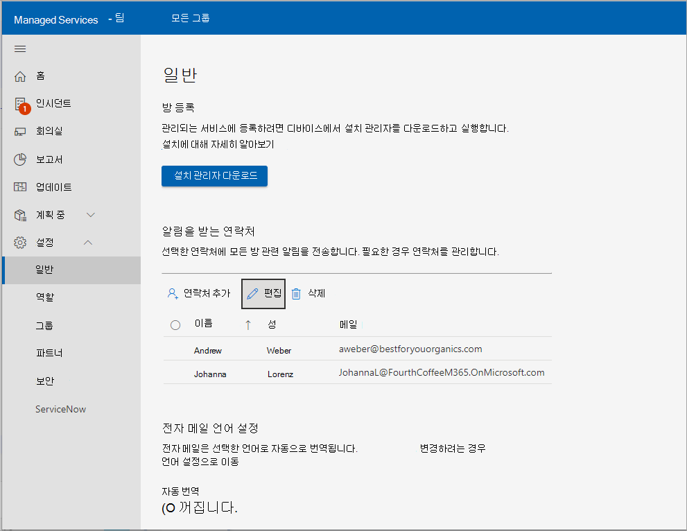

# <a name="enroll-device-into-managed-service"></a>관리되는 서비스에 디바이스 등록

배포하려면 Microsoft Teams 룸 관리되는 서비스에 Microsoft Teams 룸 디바이스를 온보딩해야 합니다. 모니터링 서비스 에이전트는 MTR(인증된 Microsoft Teams Room) 시스템 및 주변 장치에서 사용하기 위한 것입니다.

## <a name="prerequisites"></a>필수 구성 요소

등록 프로세스를 시도하기 전에 다음 절차에 따라 하드웨어를 설정합니다.

### <a name="adding-proxy-settings-optional"></a>프록시 설정 추가(선택 사항)

1. [MTR 디바이스의 관리 사용자로 작업을 수행하여 관리자 권한으로 로그인합니다](#performing-operations-as-the-admin-user-of-the-mtr-device).
1. Windows ***Search** _ 필드(화면의 왼쪽 아래 섹션)에 _ *cmd**를 입력합니다(길게 누르거나 오른쪽을 선택하고 **_관리자 권한으로 실행_** 선택).
1. 다음 명령을 실행합니다(명령 끝에 큰따옴표가 중요).

   - 단일 ***프록시 서버를*** 사용하는 경우: `bitsadmin /Util /SetIEProxy LOCALSYSTEM MANUAL_PROXY <proxyserver>:<port> ""`

     *예제:*

     ```DOS
     bitsadmin /Util /SetIEProxy LOCALSYSTEM MANUAL_PROXY contosoproxy.corp.net:8080 ""
     ```

   - ***pac*** 파일을 사용하는 경우:`bitsadmin /Util /SetIEProxy LOCALSYSTEM AUTOSCRIPT <pac file url>`

     *예제:*

     ```DOS
     bitsadmin /Util /SetIEProxy LOCALSYSTEM AUTOSCRIPT `http://contosoproxy.corp.net/proxy.pac`
     ```

### <a name="enabling-tpm-settings"></a>TPM 설정 사용

> [!NOTE]
> 관리되는 서비스에 등록하려면 TPM을 사용하도록 설정해야 합니다.

Intel NUC 디바이스의 TPM을 사용하지 않도록 설정한 경우 다음과 같이 이러한 디바이스에서 TPM을 사용하도록 설정합니다.

1. NUC 디바이스에 키보드를 연결합니다.
1. 디바이스를 다시 시작합니다.
1. BIOS 화면을 표시하려면 **F2** 키를 빠르게 누릅니다.
1. **고급을** 선택합니다.
1. **보안을** 선택합니다.
1. 보안 기능 아래 오른쪽에서 **Intel Platform Trust Technology** 를 사용하도록 설정합니다.
1. 설정을 저장하려면 **F10** 키를 누릅니다.
1. 확인 상자에서 **예를** 선택합니다.

## <a name="performing-operations-as-the-admin-user-of-the-mtr-device"></a>MTR 디바이스의 관리 사용자로 작업 수행

일부 구성/설치 절차를 수행하려면 디바이스에 관리자 권한으로 로그인해야 합니다.

관리자(로컬 관리자)로 디바이스에 로그인하려면:

1. 진행 중인 전화를 끊고 홈 화면으로 돌아가야 합니다.
1. Microsoft Teams 룸 사용자 인터페이스에서 **자세히** 를 선택한 다음 **설정** 선택합니다. 여기서 디바이스에서 로컬 관리자 암호를 묻는 메시지가 표시됩니다(기본 암호는 **_sfb_** 임).
1. **설정** 선택한 다음 **Windows 설정** 선택하여 로컬 관리자 권한으로 Windows 액세스합니다.

1. Windows 로그인 화면에 표시된 사용자 목록에서 **관리자**(또는 디바이스의 해당 로컬 관리자)를 선택합니다.

> [!NOTE]
> 컴퓨터가 *도메인에 가입된* 경우 **다른 사용자를** 선택한 다음 , **\admin** 또는 디바이스에 구성된 로컬 관리자의 사용자 이름을 사용자 이름으로 사용합니다.

필요한 관리 작업을 수행한 후 Microsoft Teams 룸 앱으로 돌아가려면 다음을 수행합니다.

1. Windows ***시작 메뉴*** 관리 계정에서 로그아웃합니다.
1. 화면의 맨 왼쪽에 있는 사용자 계정 아이콘을 선택한 다음 **Skype 선택하여 Microsoft Teams 룸** 돌아갑니다.

> [!NOTE]
> Skype 사용자가 목록에 없는 경우 다른 사용자를 선택하고 ***.\skype*** 를 사용자 이름으로 입력하고 로그인합니다.

## <a name="urls-required-for-communication"></a>통신에 필요한 URL

 > [!NOTE]
 > MTR 디바이스 에이전트와 Microsoft Teams 룸 간의 모든 네트워크 트래픽 – Managed Services 서비스 포털은 포트 443을 통해 SSL입니다 *.*  [Office 365 URL 및 IP 주소 범위 참조 - Microsoft 365 Enterprise | Microsoft Docs](/microsoft-365/enterprise/urls-and-ip-address-ranges?view=o365-worldwide&preserve-view=true).

엔터프라이즈 환경 내에서 **트래픽 허용 목록을** 사용하도록 설정한 경우 다음 호스트를 허용해야 합니다.

agent.rooms.microsoft.com<br>
global.azure-devices-provisioning.net<br>
gj3ftstorage.blob.core.windows.net<br>
mmrstgnoamiot.azure-devices.net<br>
mmrstgnoamstor.blob.core.windows.net<br>
mmrprodapaciot.azure-devices.net<br>
mmrprodapacstor.blob.core.windows.net<br>
mmrprodemeaiot.azure-devices.net<br>
mmrprodemeastor.blob.core.windows.net<br>
mmrprodnoamiot.azure-devices.net<br>
mmrprodnoamstor.blob.core.windows.net

## <a name="enrollment-process"></a>등록 프로세스

등록 프로세스에는 다음 단계가 포함됩니다.

1. Microsoft Teams 룸 – Managed Services 포털 [http://portal.rooms.microsoft.com](https://portal.rooms.microsoft.com/)의 왼쪽 탐색 모음에서 **설정** 확장하고 **일반** 을 선택합니다.
1. *회의실 등록* 에서 **설치 관리자 다운로드** 를 선택하여 모니터링 에이전트 소프트웨어를 다운로드합니다.
1. **선택적:** 에이전트에 대한 프록시 설정을 지정합니다. [프록시 설정 추가(선택 사항)](#adding-proxy-settings-optional)를 참조하세요.
1. MTR 디바이스에서 로컬로 MSI를 실행하거나 환경 내의 디바이스에 MSI 애플리케이션을 한꺼번에 게시하는 일반적인 방법을 통해 MTR 단위에 에이전트 설치 관리자(2단계에서 다운로드됨)를 설치합니다(그룹 정책 등).
1. 회의실은 포털에서 5~10분 내에 표시됩니다. 그렇지 않으면 managedroomsupport@microsoft.com 문의하세요.

   

> [!NOTE]
> Teams 로그인할 수 있는 MTR의 Teams 앱 없이 에이전트를 설치해야 하는 경우 등록 키를 선택적 프로세스로 사용할 수 있습니다. '?'  (도움말) 포털의 오른쪽 위 모서리에서 '키 다운로드(선택 사항)'를 선택합니다. 에이전트를 설치할 때 디바이스의 **C:\Rigel** 디렉터리에 '자체 등록 키'(이전에 포털에서 다운로드)를 배치합니다.

## <a name="installation"></a>설치

Microsoft에서 설치 관리자를 다운로드한 후(포털에서 또는 위에 제공된 AKA.ms URL을 사용하여) 콘텐츠 압축을 풀고 **파일ManagedRoomsInstaller.msi** 액세스합니다.

두 가지 설치 모드: 1) 개별 로컬 컴퓨터 설치 및 2) 대량 배포 모드(일반적으로 유사한 방법의 그룹 정책을 통해). 도메인에 가입되지 않은 컴퓨터 또는 MSI 설치 관리자를 원격으로 실행할 방법이 없는 컴퓨터에 대해 개별적으로 설치하는 것이 좋습니다.

고객이 대량 배포 모드에서 MSI 애플리케이션을 실행할 수 있는 다양한 방법으로 인해 이 문서에서는 개별 모드로만 설치하는 방법을 안내합니다.

## <a name="individual-devicemdashdomain-joined-walkthrough"></a>개별 디바이스&mdash;도메인 가입 연습

1. 관리자 권한으로 디바이스에 로그인합니다. 디바이스 단계의 *관리 사용자로 수행 작업을* 수행해야 합니다.

1. MTR 디바이스에 **파일ManagedRoomsInstaller.msi** 복사합니다.

   ***ManagedRoomsInstaller.msi*** 실행하면 사용권 계약 화면이 표시됩니다.

1. 규약을 읽은 후 ***사용권 계약에 동의함** _을 선택하고 _*Install**을 누릅니다.

    그러면 Microsoft Teams 룸 - Managed Services 모니터링 소프트웨어 설치가 시작됩니다. 권한 상승(관리자 권한으로 실행)에 대한 프롬프트가 표시됩니다.

1. **예를** 선택합니다.

    설치가 계속됩니다. 설치 절차 중에 콘솔 창이 열리고 Microsoft Teams 룸 – Managed Services 모니터링 소프트웨어 설치의 마지막 단계가 시작됩니다.

    > [!NOTE]
    > 창을 닫지 마세요. 설치가 완료되면 마법사에 "마침" 단추가 표시됩니다.

## <a name="completing-enrollment"></a>등록 완료

설치가 완료되면 5-10분 정도 기다렸다가 포털을 새로 고치면 디바이스가 나열되고 *온보딩* 상태로 보고됩니다.

*온보딩* 상태에서는 회의실 상태가 표시되고 업데이트되지만 경고를 발생하거나 조사 티켓을 만들지는 않습니다.

회의실을 선택하고 **등록**  을 선택하여 인시던트 경고, 조사 티켓을 가져오거나 인시던트를 보고합니다.

질문이나 문제는 포털에서 고객이 보고한 인시던트 열기 또는 managedroomsupport@microsoft.com 문의하세요.

### <a name="unenrolling-and-uninstalling-monitoring-software"></a>모니터링 소프트웨어 등록 취소 및 제거

디바이스 등록을 취소하려면 다음과 같이 MTR 디바이스에서 모니터링 에이전트를 제거합니다.

1. 모니터링 중인 디바이스에서 관리자 권한으로 디바이스에 로그인합니다. *디바이스의 관리 사용자로서 작업 수행의* 단계를 따라야 합니다.
1. [aka.ms/MTRPDeviceOffBoarding](https://aka.ms/MTRPDeviceOffBoarding) 다시 설정 스크립트를 다운로드합니다.
1. 디바이스의 어딘가에서 스크립트를 추출하고 경로를 복사합니다.
1. 관리자 권한으로 PowerShell 열기: Windows ***Search** _ 필드(화면의 왼쪽 아래 섹션)에서 'Powershell'을 입력하고 _*_Windows PowerShell_**을 마우스 오른쪽 단추로 클릭합니다.
1. *"관리자 권한으로 실행"을* 선택하고 UAC 프롬프트를 수락합니다.
1. *Set-ExecutionPolicy –ExecutionPolicy RemoteSigned* 를 입력한 다음, 다음 프롬프트에서 **Y** 키를 누릅니다.
1. 압축을 푼 오프보딩 스크립트의 전체 경로를 PowerShell 창에 붙여넣거나 입력하고 Enter 키를 누릅니 **다**.

   예제:

   ```powershell
   C:\Users\admin\Downloads\MTRP\_Device\_Offboarding\MTRP\_Device\_Offboarding.ps1
   ```

   이 명령은 디바이스를 사용자 표준 MTR 업데이트로 다시 설정하고 MTRP 모니터링 에이전트 및 파일을 제거합니다.

1. Microsoft Teams 룸 – Managed Services 포털의 왼쪽 메뉴에서 **회의실** 을 선택합니다.
1. 제공된 회의실 목록에서 등록 취소할 회의실을 선택하고 등록 **취소** 를 선택하여 인시던트 경고 또는 조사 티켓 가져오기를 중지하거나 회의실에 대한 인시던트를 보고합니다.

## <a name="troubleshooting-table"></a>문제 해결 테이블

> [!NOTE]
> 모든 Microsoft Teams 룸 – Managed Services 모니터링 오류는 **Microsoft Managed Rooms** 라는 특정 이벤트 로그 파일에 기록됩니다.

***애플리케이션 런타임 로그 파일 위치*** =

C:\Windows\ServiceProfiles\LocalService\AppData\Local\ServicePortalAgent\ app-x.x.x\ServicePortalAgent\ServicePortal\_Verbose\_LogFile.log, 여기서 **x.x.x** 는 앱 버전 번호입니다.

|증상|권장 프로시저|
|---|---|
|다음과 같은 오류 메시지가 표시됩니다. </p><p> ***오류: 다음을 사용하여 이 애플리케이션을 실행하세요.** <br> _ *_상승된 권한_**|에스컬레이션된 권한으로 애플리케이션을 실행하고 다시 시도합니다.|
|||
|다음과 같은 오류 메시지가 표시됩니다. </p><p> ***TPM 데이터를 찾을 수 없음***|디바이스의 BIOS에서 TPM(신뢰할 수 있는 플랫폼 모듈)이 켜져 있는지 확인합니다. 일반적으로 디바이스 BIOS의 보안 설정에서 찾을 수 있습니다.|
|||
|다음과 같은 오류 메시지가 표시됩니다. </p><p> ***오류: '관리' 또는 'Skype'라는 로컬 사용자 계정을 찾을 수 없습니다.***|인증된 Microsoft Teams Room 시스템 디바이스에 사용자 계정이 있는지 확인합니다.|
|||
|위에서 다루지 않은 오류 상태 메시지가 표시됩니다.|Microsoft Teams 시스템 지원 에이전트에 설치 로그의 복사본을 제공하세요.|
