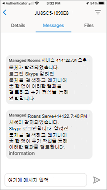
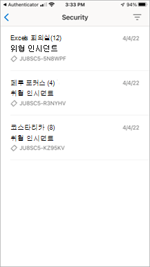

# 모바일 클라이언트 애플리케이션 기능 Teams 룸

모바일 디바이스에서 MTMS(Teams 룸 관리 서비스)를 관리해야 하는 경우가 있을 수 있습니다. 모바일 앱에는 모바일 또는 태블릿 장치에서 관리할 수 있는 많은 기능이 있습니다.
## 시작하기 전에

Teams 룸 모바일 앱을 사용하려면 Microsoft 365 조직의 관리자여야 합니다.
Apple App Store 또는 [Google Play 스토어 Teams 룸](https://apps.apple.com/app/apple-store/id761397963?pt=80423&ct=docsaboutadminapp&mt=8) 모바일 앱을 다운로드[합니다.](https://play.google.com/store/search?q=Microsoft%20Teams%20Rooms&c=apps)

**MTMS 모바일 앱을 다운로드하려면**

1. 디바이스에 대한 앱 스토어에서 Teams 룸 Managed Services를 검색하고 설치합니다.
2. 전역 관리자 전자 메일 주소로 로그인하고 대시보드를 확인하여 서비스 상태를 확인하고, 사용자 라이선스를 모니터링하고, 메시지 및 서비스 요청을 확인합니다.
## 인시던트 관리

다음은 인시던트 관리를 위해 모바일 앱에 있는 몇 가지 기능입니다.

- 새 인시던트에 대한 푸시 알림을 받습니다.
- 알림을 탭하여 인시던트 세부 정보를 열고 즉시 봅니다.
- 메시지의 읽기 및 읽지 않음 상태를 포함하여 모든 활성 및 해결된 인시던트가 나열됩니다.
- 메시지를 포함하여 티켓 정보를 사용하여 기본 인시던트 세부 정보를 봅니다.
- 티켓 첨부 파일 및 파일을 봅니다.
- 사용자 패널에서 로그아웃합니다(로그아웃된 경우 알림/메시지를 사용할 수 없음).

### 인시던트 페이지

인시던트 페이지에는 열린 인시던트 유형이 표시됩니다.

## 티켓 관리
다음은 티켓을 관리하기 위해 모바일 앱에 있는 몇 가지 기능입니다.

- 인시던트 승인(읽은 것으로 표시).
- 티켓의 메시지를 읽고, 게시하고, 회신합니다.
- 어둡게 모드로 전환합니다.
- 첨부 파일을 추가합니다(사진 찍기 및 업로드).
- 인시던트에 대해 보고합니다(티켓 만들기).

### 티켓 메시지

### 티켓 세부 정보

### 인시던트 보고

### 범주별 인시던트 보기

<!-- Author.>당Microsoft 승인 이미지
### Microsoft Defender를 사용하여 관리되는 보안

### 전문가와의 통신

### 로그아웃

<!-- Author.>당Microsoft 승인 이미지
## 자주 묻는 질문

다음은 자주 묻는 질문에 대한 답변입니다.

**앱을 사용하려면 어떻게 해야 하나요?**

앱을 사용하려면 관리자 권한과 유효한 Microsoft 365 구독이 있어야 합니다.

**앱에서 지원되는 언어는 무엇인가요?**

**인시던트 및 메시지를 조직의 나머지 부분과 공유하려면 어떻게 해야 하나요?**

**여러 계정 또는 테넌트에서 이 앱을 사용할 수 있나요?**

**로그인할 수 없거나 앱이 재미있는 행동을 하고 있습니다. 문제를 해결하거나 해결하려면 어떻게 해야 하나요?**

몇 가지 일반적인 모바일 앱 문제 해결 단계를 시도할 수 있습니다.
- 앱을 닫고 다시 엽니다.
- 앱을 제거하고 다시 설치합니다. 최신 버전의 앱에 있는지 확인합니다.
- 디바이스에 Microsoft Authenticator 또는 회사 포털 앱이 설치된 경우 다시 설치하거나 최신 버전으로 업데이트해 보세요. 이것이 작동하지 않으면 feedback365@microsoft.com 이메일을 보내 알려줄 수 있습니다.

**질문에 답변하지 않으면 어떻게 해야 하나요?**

## 다음 단계

모바일 클라이언트는 티켓을 만들고 조직 내에서 인시던트 기능을 관리합니다.

**Teams 룸 모바일 앱을 사용하려면**

1. [Apple App Store]() 또는 [Google Play 스토어]() 중 하나에서 앱을 다운로드합니다.
1. 유효한 Microsoft 365 구독이 있는지 확인합니다.
1. Teams 룸 데스크톱 앱에 액세스하는 데 사용하는 회사 자격 증명을 사용합니다.
