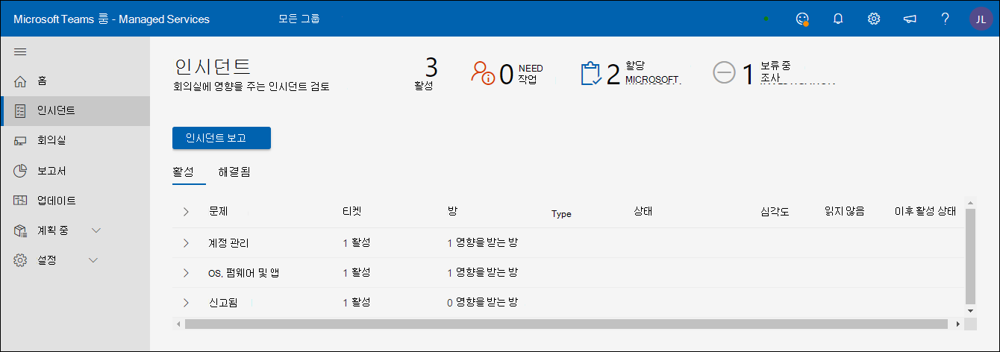
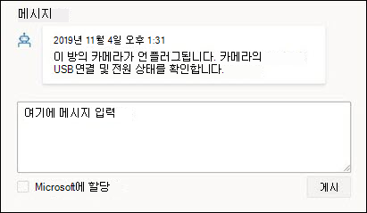
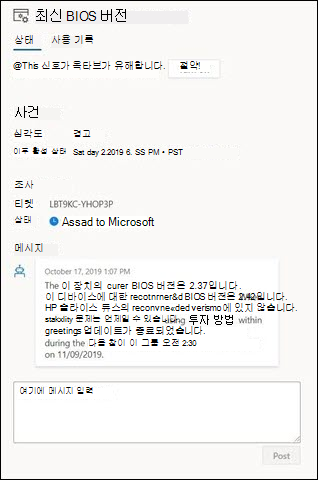
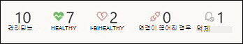
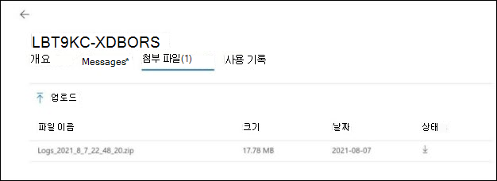
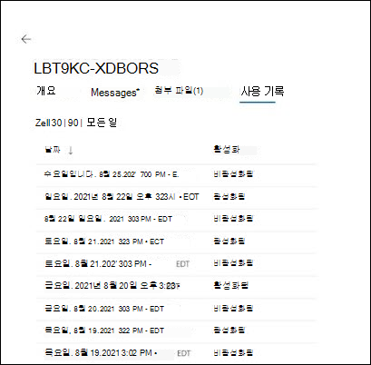

# Microsoft 관리 회의실 포털

## 개요

관리되는 회의실 포털("회의실 포털")은 회의실의 상태 보기를 제공합니다. 이 포털의 고객 보기는 가시성 및 피드백을 위한 것이고 기존 모니터링 도구/사례를 용이하게 하기 위한 것입니다.

모니터링 범위는

- 인시던트 보기
  - 회의실에 영향을 주는 가장 큰 문제
  - 회의실을 정상 상태로 복원하는 데 필요한 작업
  - Microsoft에서 조사 중인 문제
- 룸 Microsoft Teams 보기
  - MTR(디바이스 Microsoft Teams 룸 상태 스냅숏)
  - 모든 디바이스에 대한 기본 기록 및 세부 정보

**룸 Microsoft Teams 보기**

- MTR(디바이스 Microsoft Teams 룸 상태 스냅숏)
- 모든 디바이스에 대한 기본 기록 및 세부 정보

> [!Important]
> 관리 [**서비스**](enrolling-mtrp-managed-service.md#assign-users-to-the-managed-service-administrator-role) 관리자 역할에 사용자 할당을 검토하고 비즈니스 요구에 따라 포털에 대한 액세스가 제한되어 있는지 확인합니다.

## 용어

포털에서 자주 사용되는 용어는 다음과 같습니다.

|용어 |의미 |
| :- | :- |
|**모니터링 소프트웨어** |각 룸 디바이스에 배포되는 Microsoft Teams 에이전트입니다. |
|**앱** |Microsoft Teams 시스템 앱(공동 작업 서비스로 비즈니스용 Skype Microsoft Teams 여부에 관계 없이). |
|**룸/디바이스** |인증된 Microsoft Teams 룸 시스템 디바이스입니다. |
|**monitored되지 않습니다.** | 관리 서비스의 일부로 배포된 Microsoft 모니터링 소프트웨어는 클라우드 서비스에 연결할 수 없습니다. 디바이스에 대한 원격 분석이 수신되지 않습니다. |
|
**정상/** 

**Unhealthy** 
|디바이스/주변 장치의 이상. |
|**억제** |디바이스가 유지 관리 중인 것으로 알려져 있으며 해당 경고를 무시해야 하는 경우 디바이스를 고의적으로 억제할 수 있습니다. |
|**온보드** |설정이 추가되는 동안 룸 디바이스의 상태가 추가되지만 정기적으로 지원되는 방으로 준비되지는 않습니다. |
|**인시던트** |작업이 필요한 최종 사용자의 모임 경험에 영향을 주는 문제입니다. |
|**잘못 구성된** |검색된 구성이 올바른/일반적으로 사용되지 않습니다. |
|**지원 티켓** |인시던트와 관련한 모든 통신/작업을 추적하는 내부 Microsoft 추적 식별자입니다. |

## 인시던트 보기

이 보기는 Managed Rooms Portal의 인시던트 탭에 대한 개요입니다. 이 페이지는 포털의 기본 홈 페이지입니다.

### 최상위 요약 
최상위 요약은 회의실에 영향을 미치는 문제, 해야 할 일 및 Microsoft가 해당 문제에 대해 무엇을 하고 있는지 한 눈에 보여줍니다.

|# |설명 |
| :- | :- |
|1 |회의실에 영향을 주는 인시던트 유형 |
|2 |**NEED ACTION**: 해결을 위해 개입이 필요한 항목입니다. |
|3 |**MICROSOFT에 할당:** 현재 Microsoft 직원이 조사한 항목입니다. |
|4 |**보류 중인 조사**: Microsoft 직원이 조사할 큐의 항목입니다. |

인시던트는 세 가지 상태 중 하나에 있을 것으로 예상됩니다.

- **작업 필요**: 사용자에게 할당된 작업
- **Microsoft에 할당된**: 다음 작업을 위해 Microsoft에 할당
- **보류 중인 조사**: 다음 단계에 대한 조사 중입니다.

### 인시던트 검토

다음 이미지에는 현재 회의실에서 활성 상태인 모든 인시던트가 나열됩니다. 사용자에게 할당된 는 맨 위에 *있습니다.* 다음 단계를 살펴봐야 합니다. 또한 Microsoft 또는 보류 중인 조사에 할당된 정보에는 개입하는 데 사용할 수 있는 세부 정보가 있습니다.

상태 "필요 작업"이있는 항목을 클릭하면 인시던트에 대한 추가 세부 정보가 표시됩니다.

## 인시던트 유형

인시던트는 두 가지 광범위한 심각도 유형으로 분류됩니다.

- **중요**: 모임에서 문제가 발생할 가능성이 높고 우선 순위를 지정해야 하는 인시던트입니다.
- **경고** – 유지 관리 작업을 계획하는 알림인 인시던트입니다. 이러한 문제가 해결되지 않은 경우 시간이 지날수록 방이 문제가 될 수 있습니다. 경고는 지원을 계획하고 오케스트레이션할 시간을 주기 위한 것입니다.

경고가 한 동안 참석하지 않은 경우 **"중요"로** 전환될 수 있습니다.

## 디바이스 및 인시던트의 상태

심각도에서 **"중요"로** 분류되는 인시던트는 디바이스의 상태 상태에 영향을 미치게 됩니다. 디바이스와 연결된 **심각도 = "중요"** 인시던트가 하나 이상 있는 경우 해당 인시던트는 이상한 디바이스로 **_분류됩니다._**

**"경고"** 심각도로 분류된 인시던트는 디바이스에 보고된 상태 상태에 영향을 주지 않습니다. 그러나 디바이스에 연결된 경고 수준 인시던트가 있는 경우 다음과 같이 장치의 상태와 함께 표시됩니다.

다음은 볼 수 있는 인시던트 유형과 각 형식에 대한 설명입니다. 각 형식에 대해 인시던트와 연결된 작업은 문제에 따라 좀 더 구체적입니다.

**표 1: "중요" 심각도인 인시던트**

|유형 |설명 |
| :- | :- |
|**디스플레이** |디바이스에 연결된 디스플레이가 정상으로 표시되지 않습니다.|
|**컨퍼런스 마이크, 컨퍼런스 발표자** |오디오 디바이스(마이크/스피커)가 잘못 구성된 것 같다. |
|**카메라** |디바이스에 연결된 카메라가 정상으로 나타나지 않습니다. |
|**HDMI 인제스트** |HDMI 인제스트가 정상이 아 않습니다. |
|**로그인(Exchange)** |Microsoft Teams 룸 앱에서 일정 정보에 액세스하는 Exchange 로그인 성공에 대한 모든 문제는 로그인 인시던트와 함께 보고됩니다. |
|**로그인(Teams)** |Microsoft Teams Room 앱이 디바이스에 로그인하고 로그인하지 못하면 이 인시던트와 함께 보고됩니다(고객이 해당 앱을 사용하는 경우) Teams. |
|**로그인(비즈니스용 Skype)** |Microsoft Teams Room 앱이 디바이스에 로그인하고 로그인하지 못하면 이 인시던트가 보고됩니다(고객이 이 앱을 사용하는 경우) 비즈니스용 Skype |
|**근접 센서** |Microsoft Teams 앱이 참석자들에게 근접한 경우 모임에 참가할 수 있습니다. 이 기능의 오류는 이 인시던트에서 보고됩니다. |

**표 2: "경고" 심각도인 인시던트**

|유형 |설명 |
| :- | :- |
|**앱 버전** |디바이스에서 실행되는 Microsoft Teams Room App의 버전이 최신이 아니기 때문에 부실 버전은 사용자가 경험하는 문제에 대한 알려진 원인입니다. |
|**OS 버전** |회의실에서 Windows 운영 체제의 버전은 더 이상 권장되지 않습니다. |
|**네트워크** |평가 후 필요한 추가 작업으로 인해 단기적으로 경고의 유형으로 제거됩니다. |

## 인시던트에 응답

인시던트는 작업 필요, 조사 보류 중 또는 Microsoft에 할당된 세 가지 범주로 분류됩니다.

### "필요한 작업" 인시던트

**상태가 "요구 작업"으로** 설정된 인시던트는 수정 작업을 수행하기 위해 사용자에게 할당됩니다.

이러한 각 인시던트에는 다음과 같이 Microsoft에서 권장하는 작업이 있는 작업 필드가 있습니다.

- 작업을 수행한 경우 응답 상자에서 노트를 사용하여 인시던트에 응답한 다음 게시하기 전에 "Microsoft에 할당"을 선택할 수 있습니다.
- 또한 검토에 따라 알림이 올바르지 않은 것일 수도 있습니다. 이 경우 해당 피드백을 제공하고 Microsoft에 다시 할당해 주세요.
- 마지막으로 사용자 팀 또는 Microsoft 팀에 대한 추가 컨텍스트를 제공하기 위해 주석을 추가하려는 경우 "Microsoft에 할당"을 켜지 않고 메시지를 게시합니다.

>[!NOTE]
>수정 작업은 문제를 해결할 수 있으며 Managed Rooms 모니터링이 해당 인시던트가 목록에서 지워지기 수 있습니다. 위의 상황에서는 문제를 해결하고 Microsoft에 다시 할당할 기회를 얻지 못하게 될 수 있습니다. 이 문제는 향후 릴리스에서 해결될 예정입니다.

### "조사 보류 중" 인시던트

조사 중 인시던트의 경우 설명 필드에는 인시던트, 일반적인 원인 및 특정 문제를 해결하는 데 유용할 수 있는 해결에 대한 정보가 들어 있으므로 지체 없이 작업할 수 있습니다.

### "Microsoft에 할당" 인시던트

Microsoft에 할당된 인시던트의 경우 "작업" 필드에는 계획되거나 진행된 수정 단계에 대한 간략한 세부 정보가 포함되어 있습니다. 이러한 단계는 팀과 공동 작업해야 할 수 있으며, 필요한 경우 전자 메일/통화를 통해 확장된 공동 작업을 수행합니다. 이러한 문제가 해결되면 포털에서 사라지고 향후 이러한 인시던트 및 해결 방법을 추적할 기록이 있습니다.

## 방 보기

각 디바이스는 룸 및 연결된 주변 장치에 대한 프록시입니다. 정상 디바이스는 정상 방을 나타내며, 건강하지 않은 디바이스는 모임 중에 문제가 발생할 수 있는 방을 나타내는 것입니다. 인시던트 보기 외에도 Managed Rooms Portal은 회의실 상태 개요를 제공하며, 디바이스 세부 정보를 문제 해결하고 인시던트 기록을 사용하여 반복되는 실패를 이해하는 데 도움이 됩니다.

**정상, 건강하지 않은, 연결 끊기** 회의실 보기의 위쪽 패널에서는 양호한 상태의 디바이스 수("정상"), 문제의 영향을 받는 수("건강하지 않은"), 원격 분석("연결 해제")을 제공하지 않는 장치 수, 경고에서 표시되지 않는 디바이스 수(재지정)의 빠른 스냅숏을 제공합니다. 회의실은 진화하는 조건 및 heuristics를 사용하여 상태 모니터링됩니다. 목표는 가능한 한 정확하게 방에서 사용자 경험의 현실을 반영하고 실행 가능하도록 하는 것입니다.

**정상/건강하지 않은 방:**

심각도 "중요"의 인시던트가 없는 디바이스/주변 장치는 현재 상태 기준을 충족하는 상태로 표시됩니다. 그러나 포털의 모든 유해한 디바이스에 대해 룸이 작동이 확정된 것은 아니기만 합니다. 인시던트의 설명 및 작업 부분에는 사용자 환경에 대한 문제 및 잠재적 영향에 대한 자세한 세부 정보가 포함되어 있습니다.

**연결 끊어진 디바이스:**

Managed Room 파일럿의 일부로 배포된 Microsoft 모니터링 에이전트가 Managed Room 클라우드 서비스에서 연결이 끊어집니다. 방에 대한 원격 분석이 수신되지 않습니다. 최신 상태는 없습니다. 네트워크 문제, 방화벽 정책 변경 또는 디바이스 이미지에 변경 사항이 있는 경우 이 문제가 있을 수 있습니다.

## 방 세부 정보: 상태 및 변경 내용

**방 세부 정보: 상태** 디바이스 *상태* 탭은 디바이스의 상태, 디바이스에 대해 활성 상태, 해결에 필요한 작업 또는 진행 중인 작업의 통합 보기를 제공합니다. 상태 탭에는 인시던트 탭에서 디바이스에 대한 상태의 여러 구성 요소의 *분석도 포함됩니다.* 디바이스의 연결이 끊어진 경우 상태 세부 정보를 사용할 수 없습니다.

**모든 신호를 표시합니다.** 신호 범주 내에 포함된 모든 신호를 표시하려면 모든 신호 토글 표시 단추를 사용하도록 설정합니다. 확장 화살표는 아코디언 보기를 확장하기 위해 클릭할 수 있는 범주 제목 옆에 표시됩니다.

티켓 표시 안 **/압축을 언스프레스** 방이 등록된 경우 방 원격 분석의 변경에 대한 알림을 수신하려는 것을 나타내는 것입니다. 특정 디바이스 또는 주변 장치가 티켓 또는 알림 생성을 원하지 않는 알려진 상태인 경우도 있습니다. 티켓 억제 기능을 사용하여 해당 특정 신호에 대한 알림을 침묵합니다. 서비스가 해당 신호를 모니터링하고 알릴 준비가 된 경우 개별 신호의 압축을 압제하기만하면 됩니다.

**활성 티켓 범주 확장** 각 티켓 범주에서 활성 또는 최신 확인된 티켓은 심각도 및 티켓이 마지막으로 업데이트된 경우와 함께 표시됩니다. 확장 화살표를 클릭하면 모든 티켓이 티켓 정보에 대한 활성 링크와 함께 표시됩니다.

활성 티켓 범주 확장: 각 티켓 범주에서 활성 또는 최신 확인된 티켓은 심각도 및 티켓이 마지막으로 업데이트된 경우와 함께 표시됩니다. 확장 화살표를 클릭하면 모든 티켓이 티켓 정보에 대한 활성 링크와 함께 표시됩니다.

## 활성 티켓: 개요

생성된 각 인시던트는 검색된 문제 및 룸을 정상 상태로 복원하기 위해 수행해야 하는 수정 작업을 식별합니다. 생성된 티켓은 문제를 조사하는 Microsoft 서비스 엔지니어링 팀뿐만 아니라 관리되는 서비스 AI에서 생성된 모든 메시지와 인시던트 개요를 전달합니다. 인시던트 문제 해결을 위해 수집된 모든 첨부 파일이 나열됩니다. 기록 탭은 문제가 식별된 날짜를 제공합니다.

활성 티켓: 메시지 UI는 식별된 문제를 수정하기 위해 작업하는 Microsoft 서비스 엔지니어와 상호 작용하는 기본 통신 도구입니다. 최상의 서비스를 제공하기 위해 Microsoft의 통신을 인정하는 것이 중요합니다. 권장되는 작업을 수행한 경우 응답 상자의 노트로 이 인시던트에 응답하고 게시하기 전에 "Microsoft에 할당"을 클릭하여 Microsoft에 다시 할당합니다.
또한 검토에 따라 알림이 올바르지 않은 것일 수도 있습니다. 이 경우 해당 피드백을 제공하고 Microsoft에 다시 할당해 주세요.
마지막으로, 사용자 팀 또는 Microsoft 팀에 대한 추가 컨텍스트를 제공하기 위해 주석을 추가하려는 경우 "Microsoft에 할당"을 켜지 않고 메시지를 게시하기만 합니다.

활성 티켓: 첨부 파일에서 Microsoft 서비스 엔지니어가 문제 조사를 보강하기 위해 추가 정보가 필요한 경우도 있습니다. 첨부 파일 탭은 요청된 그림, 비디오 또는 로그를 업로드할 수 있는 기능을 제공합니다.

활성 티켓: 기록 각 방 신호에는 의도적으로 할당된 티켓 번호가 하나만 있습니다. 방 디바이스 또는 주변 장치가 방에 유지되고 시간이 지날 때 문제가 있을 수 있습니다. 특정 고유 티켓 ID로 이 정보를 유지 관리하면 모든 기록 정보가 유지 관리될 수 있으며 동작 패턴을 분석할 수 있습니다. 기록 UI는 이 신호에 대해 생성 및 확인된 모든 티켓 작업을 볼 수 있습니다.

FAQ 동적 티켓은 내 방의 작업에 어떤 영향을 미치나요?  
고객은 이진 신호 티켓을 넘어 확장하는 더 스마트한 티켓 및 수정을 볼 수 있습니다. 예를 들어 MTR 터치 패널 디스플레이에 3개의 디스플레이가 미팅룸 수 있습니다(디스플레이 1, 디스플레이 2 & 수 있습니다. 그러나 정상 또는 정상 상태인 표시 신호는 1개(하나)에 불과합니다. 이제 새 동적 티켓을 사용하여 각 표시 신호에 고유한 티켓을 생성할 수 있습니다.
