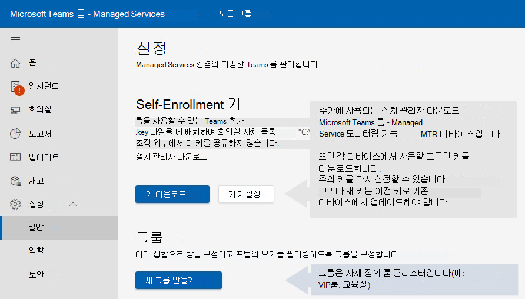

# 디바이스 소프트웨어 설치 모니터링

배포에는 관리되는 Microsoft Teams 룸 디바이스에 Microsoft Teams 룸 필요합니다. 모니터링 서비스 에이전트는 MTR(Microsoft Teams) 시스템 및 주변 장치와 함께 사용하기 위한 것입니다.

## MTR 디바이스의 관리자 사용자로 작업 수행

일부 구성/설치 절차에서는 관리자 권한으로 디바이스에 로그인해야 합니다.

관리자(로컬 관리자)로 디바이스에 로그인하려면 다음을 사용합니다.

1. 지속적인 통화를 중단하고 홈 화면으로 돌아가야 합니다.
1. Microsoft Teams 룸 사용자 인터페이스에서 추가 , 설정 **를** 선택한 다음 디바이스의 로컬 관리자 암호에 대한 메시지가 표시됩니다(기본 **_암호는 sfb입니다)._**
1. 를 **설정** 를 선택한 다음 Windows 설정 **로컬** 관리자로 Windows 액세스합니다.  

1. 로그인 화면에 표시된 사용자 목록에서 Windows 관리자(또는 디바이스의 해당 로컬 관리자)를 선택합니다. 

> [!NOTE]
> 컴퓨터가 도메인에 가입된 경우 *다른* 사용자 **,** **.\admin** 또는 디바이스에 구성된 로컬 관리자의 사용자 이름을 사용자 이름으로 사용합니다.  

필요한 관리 Microsoft Teams 수행한 후 룸 앱으로 돌아가기 위해 다음을 수행합니다.

1. 에서 Windows ***시작 메뉴*** 계정에서 로그인합니다.
1. 화면의 Microsoft Teams 왼쪽에 있는 사용자 계정 아이콘을 선택한 다음 을 선택하여 **Skype.**

> [!NOTE]
> 사용자 Skype 나열되지 않은 경우 다른 사용자를 선택하고 ***.\skype를*** 사용자 이름으로 입력하고 로그인합니다.

## 필수 구성 요소

등록 프로세스를 시도하기 전에 다음 절차에 따라 하드웨어를 설정합니다.

### 프록시 설정 추가(선택 사항)

1. MTR 디바이스의 관리자 사용자로 작업 수행에 따라 [관리자로 로그인합니다.](#performing-operations-as-the-admin-user-of-the-mtr-device)
1. Windows ***Search** _ field(화면의 왼쪽 아래 섹션)에서 _ *cmd**를 입력합니다(화면을 길게 누르거나 오른쪽으로 선택하고 관리자 권한으로 실행을 **_선택합니다)._**  
1. 다음 명령을 실행합니다(명령 끝에 두 번 따옴표가 중요합니다).
   - 단일 프록시 서버를 사용하는 ***경우***: bitsadmin /Util /SetIEProxy LOCALSYSTEM MANUAL \_ PROXY : <proxyserver> <port> ""

      *예:* bitsadmin /Util /SetIEProxy LOCALSYSTEM MANUAL PROXY contosoproxy.corp.net:8080 \_ ""
      

   - pac ***파일을*** 사용하는 경우: bitsadmin /Util /SetIEProxy LOCALSYSTEM AUTOSCRIPT <pac file url> ""

      
      *예:* bitsadmin /Util /SetIEProxy LOCALSYSTEM AUTOSCRIPT `http://contosoproxy.corp.net/proxy.pac` ""
      

### TPM 설정 사용

Intel NUC 디바이스의 TPM을 사용하지 않도록 설정한 경우 다음과 같이 이러한 장치에서 TPM을 사용하도록 설정합니다.  

1. 키보드를 NUC 디바이스에 연결합니다.  
1. 디바이스를 다시 시작합니다.  
1. BIOS 화면을 표시하기 위해 F2 를 **빠르게 누를 수 있습니다.**  
1. 고급 **을 선택합니다.**  
1. 보안 **을 선택합니다.**  
1. 보안 기능 아래 오른쪽에서 **Intel 플랫폼 트러스트 기술을 사용하도록 설정합니다.**  
1. 설정을 저장하려면 **F10 을 누르고 있습니다.**  
1. 확인 상자에서 예 **를 선택합니다.**  

## 통신에 필요한 URL

 > [!NOTE]
 > MTR 디바이스 에이전트와 Microsoft Teams 룸 - Managed Services 서비스 포털 간의 모든 네트워크 트래픽은 포트 443을 통해 SSL입니다.  URL Office 365 및 IP 주소 범위 - Microsoft 365 Enterprise | [ Microsoft Docs](/microsoft-365/enterprise/urls-and-ip-address-ranges?view=o365-worldwide&preserve-view=true).

엔터프라이즈 환경 내에서 트래픽 허용 목록이 설정된 경우 다음 호스트를 허용해야 합니다. 

agent.rooms.microsoft.com 
global.azure-devices-provisioning.net 
gj3ftstorage.blob.core.windows.net 
iothubsgagwt5wgvwg6.azure-devices.net 
blobssgagwt5wgvwg6.blob.core.windows.net 
mmrstgnoamiot.azure-devices.net 
mmrstgnoamstor.blob.core.windows.net 
mmrprodapaciot.azure-devices.net 
mmrprodapacstor.blob.core.windows.net 
mmrprodemeaiot.azure-devices.net 
mmrprodemeastor.blob.core.windows.net 
mmrprodnoamiot.azure-devices.net 
mmrprodnoamstor.blob.core.windows.net

## 프로세스

등록 프로세스에는 몇 가지 단계가 필요합니다.  

1. Managed Services 포털인 Microsoft Teams 룸 탐색 모음에서 설정 일반을 [http://portal.rooms.microsoft.com](https://portal.rooms.microsoft.com/) **선택합니다.**   
1. 자체 *등록 키에서* 설치  관리자 하이퍼링크 다운로드를 선택하여 모니터링 에이전트 https://aka.ms/serviceportalagentmsi 소프트웨어를 다운로드합니다.
1. 키 **다운로드를 선택합니다.** 등록하는 각 디바이스에 **C:\Rigel** 폴더 아래에 키 파일을 배치합니다.  
1. **선택 사항:** 에이전트에 대한 프록시 설정을 설정합니다. 프록시 [설정 추가(선택 사항)를 참조하세요.](#adding-proxy-settings-optional)
1. MTR 장치에서 MSI를 로컬로 실행하거나 환경 내의 디바이스에 MSI 애플리케이션을 게시하는 일반적인 방법을 통해 에이전트 설치 관리자(2단계에서 다운로드)를 설치합니다(그룹 정책 등).  
1. 5-10분 이내에 포털에 방이 나타납니다. 그렇지 않은 경우 해당 managedroomsupport@microsoft.com.  

## 설치

Microsoft에서 설치 관리자를 다운로드한 후(포털에서 또는 위에서 제공한 AKA.ms URL을 사용하여) 해당 콘텐츠를 의 파일로 **ManagedRoomsInstaller.msi.**

설치에는 개별 로컬 컴퓨터 설치 및 대량 배포 모드(일반적으로 유사한 방법의 그룹 정책을 통해)의 두 가지 설치 모드가 있습니다. 도메인이 아닌 조인된 컴퓨터 또는 MSI 설치 관리자를 원격으로 실행하는 방법이 없는 컴퓨터에 대해 개별 설치하는 것이 좋습니다.  

고객이 대량 배포 모드에서 MSI 애플리케이션을 실행할 수 있는 다양한 방법으로 인해 이 문서는 개별 모드에서만 설치를 진행합니다.  

 > [!NOTE]
 > 설치 관리자 프로그램 흐름은 실행되는 모드에 상관없이 동일합니다. 유일한 차이점은 설치가 사용자에게 다음 단추를 누르고 닫기 단추를 대량 배포 모드에서 요청하지 않는다는 것입니다.  

## 개별 디바이스 도메인에 조인된 &mdash; 개별 워크스루

1. 관리자로 디바이스에 로그인 -  디바이스 단계의 관리자 사용자가 수행되는 작업 수행을 확인합니다.

1. MTR 디바이스에 다음 파일을 복사합니다.

   - 디바이스의 **C:\Rigel** 디렉터리에 '셀프 등록 키'(이전에 포털에서 다운로드)를 설치합니다.
   - 디바이스에 ManagedRoomsInstaller.msi(이전에 포털에서 또는 AKA.MS)를 복사합니다.

1. *ManagedRoomsInstaller.msi **_를** 실행하면 라이선스 계약 화면이 표시됩니다. 계약을 읽은 후 사용권 _*_계약의_*_ 약관에 동의하는지 확인하고 _ 설치 **단추를* 누릅니다.  

    그러면 Managed Services Microsoft Teams 룸 소프트웨어 설치가 시작됩니다. 고도에 대한 프롬프트(관리자 권한으로 실행)가 표시됩니다.
 1. 예 ***를 선택합니다.***

    설치가 계속됩니다. 설치 절차 중에 콘솔 창이 열리며 Managed Services 모니터링 소프트웨어 Microsoft Teams 룸 최종 단계가 시작됩니다.  

    > [!NOTE]
    > 창을 닫지 않습니다. 설치가 완료되면 마법사에 "완료" 단추가 표시됩니다.

## 등록 완료

설치가 완료되면 5-10분 정도 기다렸다가 포털을 새로 고치고 디바이스가 나열되어 온보더링 상태로 *보고됩니다.*

*온보링* 상태의 방 상태가 표시되고 업데이트되지만 경고가 발생하거나 조사 티켓을 만들지 않습니다.

방을 선택하고  등록을 선택하여 인시던트 경고, 조사 티켓을 시작하거나 인시던트 보고를 시작합니다.

질문이나 문제의 경우 포털에서 고객이 보고한 인시던트를 열거나 고객사에 managedroomsupport@microsoft.com.

### 모니터링 소프트웨어의 인가 및 인스탈링을 실행하지 않습니다.

디바이스의 인가를 제거하려면 다음과 같이 MTR 디바이스에서 모니터링 에이전트를 제거합니다.

1. 모니터링되는 디바이스에서 관리자로 디바이스에 로그인합니다. 디바이스의 관리자 사용자로 작업 수행의 *단계를 따라야 합니다.*
1. 에서 재설정 [스크립트를 aka.ms/MTRPDeviceOffBoarding.](https://aka.ms/MTRPDeviceOffBoarding)
1. 디바이스의 어딘가에 스크립트를 추출하고 경로를 복사합니다.
1. 관리자 권한으로 PowerShell 열기: Windows ***Search** _ field(화면의 왼쪽 아래 섹션)에서 'Powershell'을 입력하고 _* Windows PowerShell _**를 마우스 오른쪽 단추로 클릭합니다._
1. *"관리자 권한으로 실행"을 선택하고* UAC 프롬프트를 수락합니다.
1. *Set-ExecutionPolicy -ExecutionPolicy RemoteSigned를* 입력한 다음 다음 프롬프트에서 **Y를** 누르습니다.  
1. PowerShell 창에 매핑되지 않은 오프보딩 스크립트에 전체 경로를 붙여넣거나 입력하고 Enter 를 **클릭합니다.**

   예를 들면 다음과 같습니다.

   *C:\Users\admin\Downloads\MTRP \_ Device \_ Offboarding\MTRP \_ DeviceOffboarding.ps1\_*  

   이렇게 하여 디바이스를 사용자 표준 MTR 업데이트로 다시 설정하고 MTRP 모니터링 에이전트 및 파일을 제거합니다.

1. Managed Services 포털의 왼쪽 메뉴에서 Microsoft Teams 룸 를 **선택합니다.**  
1. 제공된 회의실 목록에서 인시던트 경고 또는 조사  티켓을 중지하거나 방에 대한 인시던트 보고를 위해 인시던트 해지 및 인시던트 선택을 선택하세요.

## 문제 해결 테이블

> [!NOTE]
> 모든 Microsoft Teams 룸 – Managed Services 모니터링 오류는 **Microsoft Managed Rooms라는** 특정 이벤트 로그 파일에 기록됩니다. 

### ***애플리케이션 런타임 로그 파일 위치*** =  

C:\Windows\ServiceProfiles\LocalService\AppData\Local\ServicePortalAgent\ app-x.x.x\ServicePortalAgent\ServicePortal \_ \_ Verbose LogFile.log, 여기서 **x.x.x는** 앱 버전 번호입니다.

|**증상**  |**권장 절차**  |
| :- | :- |
|
오류 메시지가 표시됩니다.   

***오류: _와 함께 이 애플리케이션을 실행해 주세요.** 

_ *_권한 상승_**  
|에스컬레이터된 권한으로 애플리케이션을 실행하고 다시 시도하세요.  |
|  |  |
|
오류 메시지가 표시됩니다.   

***TPM 데이터를 찾을 수 없습니다.***  
|디바이스에 해당 BIOS에 TPM(신뢰할 수 있는 플랫폼 모듈)이 켜져 있는지 확인합니다. 일반적으로 디바이스 BIOS의 보안 설정에서 찾을 수 있습니다.  |
|  |  |
|
오류 메시지가 표시됩니다.  

` `***오류: 'Admin' 또는 'Skype'라는 로컬 사용자 계정을 찾을 수 없습니다.***  
|사용자 계정이 인증된 룸 시스템 디바이스에 Microsoft Teams 확인합니다.  |
|  |  |
|위에 설명되지 않은 오류 상태 메시지가 수신됩니다.  |시스템 지원 에이전트에 설치 로그의 복사본을 Microsoft Teams 주세요. |
