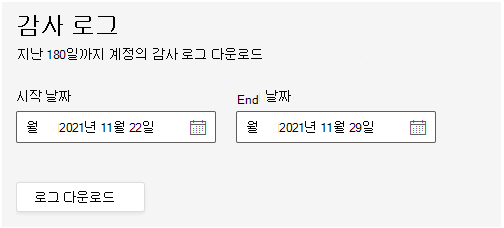

# 관리되는 Teams 룸 감사 로깅

TRM(Teams 룸) 서비스에서 감사를 사용하면 사용자 및 관리자가 포털에서 수행한 활동에 대한 감사 레코드를 검색할 수 있습니다. 이 기능은 기본적으로 사용하도록 설정되어 있습니다. 관리 서비스 관리자만 로그를 내보낼 수 있는 권한이 있습니다.

> [!NOTE]
> TRM 서비스에서 수행된 작업은 감사에 Microsoft 365 Office 365 없습니다. 

## 로그 내보내기

감사 로그 검색에 대한 모든 결과를 내보낼 때 통합 감사 로그의 원시 데이터는 로컬 컴퓨터에 다운로드되는 CSV(콤마로 구분된 값) 파일에 복사됩니다. 

**로그를 다운로드하려면** 

1. 일반 **설정 > 로그로 > 로 이동합니다.**
1. 관심 로그에 대한 날짜 범위를 정의하려면  시작 날짜 및 종료 **날짜를 입력합니다.**

   > [!NOTE]
   > 로그는 최대 180일 동안만 사용할 수 있습니다.

1. 로그 **다운로드를 선택합니다.**

   

   창 아래쪽에 표시되는 메시지는 CSV 파일을 열거나 저장하라는 메시지를 표시합니다. 

1. 으로   >  **저장을** 선택하고 CSV 파일을 로컬 컴퓨터에 저장합니다. 

1. 모든 활동을 검색하거나 광범위한 날짜 범위에서 검색할 때 많은 검색 결과를 다운로드하는 데 시간이 오래 걸리게 됩니다. CSV 파일이 다운로드를 완료하면 창 아래쪽에 메시지가 표시됩니다.

## 감사 로그의 자세한 속성

다음 표에서는 CSV에 포함된 속성을 설명합니다.

|속성|설명|
| - | - |
|activity.category|
작업이 수행된 개체의 범주입니다. 가능한 값:

**사용자, 할당, 파트너Invitation, 역할**
|
|activity.objectName|수정된 개체의 이름입니다.|
|activity.operation|수행된 작업 유형입니다. 가능한 값은 **만들기, 업데이트, 삭제입니다.** |
|activity.resultStatus|
**작업(activity.operation** 속성에 지정된)이 성공 여부를 나타냅니다.

값은 성공 또는 **실패** **중 하나입니다.**
|
|activity.tenantId|작업이 수행된 테넌트의 GUID|
|creationTime|사용자가 작업을 수행한 ISO 형식의 UTC(조정된 유니버설 시간)의 날짜 및 시간입니다.|
|user.userId|레코드가 기록되는 작업을 수행한 사용자입니다.|
|user.userTenantId|작업을 수행한 사용자의 테넌트의 GUID|

