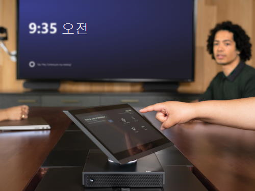

# 계획 Microsoft Teams 룸

이 문서에서는 전체 회의 및 회의실 전략의 일환으로 Microsoft Teams 룸 계획, 제공 및 운영에 대한 엔드투엔드 접근 방식을 소개합니다.

아래에서 기술 정보 지원 링크와 함께 권장되는 접근 방식 및 주요 결정을 다루는 계획 정보를 확인할 수 있습니다. 이미 완전히 배포된 경우에도 계획, 배포 및 관리 섹션을 검토하는 것이 좋습니다.

## Microsoft Teams 룸 개요

Microsoft Teams 룸 작은 허들 공간에서 대형 회의실에 이르기까지 모든 규모의 모임에 HD 비디오, 오디오 및 콘텐츠 공유를 제공하는 완전한 모임 환경을 제공합니다.

 [Microsoft Teams 룸 도움말](https://support.office.com/article/Skype-Room-Systems-version-2-help-e667f40e-5aab-40c1-bd68-611fe0002ba2)은 Microsoft Teams 룸 및 배포의 일부로 가치를 추가할 수 있는 방법에 대해 자세히 알아볼 수 있는 유용한 리소스입니다.

## Microsoft Teams 룸 구성 요소

Microsoft Teams 룸 훌륭한 사용자 환경을 제공하기 위한 다음과 같은 주요 구성 요소가 포함되어 있습니다.

- 터치 스크린 콘솔
- 컴퓨팅 모듈
- Microsoft Teams 룸 애플리케이션
- 주변 장치(카메라, 마이크, 스피커)
- 외부 화면(최대 2개)
- HDMI 입력

이러한 구성 요소를 여러 공급업체에서 미리 설치된 번들로 조달하거나 [이 문서에 설명된 요구 사항에](requirements.md) 따라 지원되는 구성 요소를 개별적으로 구매할 수 있습니다.

Microsoft Teams 또는 비즈니스용 Skype 온-프레미스 배포를 사용하여 Microsoft Teams 룸 배포할 수 있습니다.  필요한 라이선스에 대한 자세한 내용은 [Teams 미팅룸 라이선스 업데이트를](rooms-licensing.md) 참조하세요.

| &nbsp;   |  &nbsp;   |
|-----------|------------|
|  의사 결정 지점|<ul><li>조직에 Microsoft Teams 룸 배포하시겠습니까? </li><li>Microsoft Teams 룸 시스템을 어떻게 조달하나요?</li></ul> |
|  다음 단계 | <ul><li>배포 전체에서 주요 활동을 수행할 사용자를 식별합니다.</li><li>Microsoft Teams 룸 배포하려는 위치와 회의실 크기에 적합한 주변 장치를 이해하려면 보유하고 있는 회의실(및 설정 계획)을 검토합니다.</li></ul> |
| | |

## 배포 전체에서 주요 활동을 수행할 사용자 식별

아래 설명된 방법을 사용하여 배포를 안내하고 조직에 필요한 대로 제공되는 샘플 출력을 사용자 지정합니다.

어떤 회의실이 있는지 이해하고 미래에 가장 적합한 것을 구상한 다음, 필요한 장비 선택 및 조달, 사이트 준비, 서비스 구성 및 배포, 변경 및 사용자 채택 관리, 운영 및 유지 관리 절차 개발 등을 진행합니다.

여러 팀에서 이러한 활동을 조정해야 할 수도 있습니다. 사용자가 처리해야 하는 주요 활동에 대한 개략적인 보기와 일반적으로 회의실 시스템 배포 및 관리에 참여하는 팀에 대한 제안을 제공하여 작업해야 할 사용자를 결정하는 데 도움을 줍니다.

| 작업                        | Who 작업을 수행할 수 있습니다.           | 할당 대상 | 이 콘텐츠에 대한 링크 |
|----------------------------|----------------------------------------|-------------|-----------------------|
| 인벤토리 룸            | 시설 / AV 팀 / IT Project 팀 |             | [회의실 인벤토리 및 기능 계획](#room-inventory-and-capability-planning) |
| 계획 기능          | IT Project 팀                        |             | [회의실 인벤토리 및 기능 계획](#room-inventory-and-capability-planning) |
| 디바이스 선택           | IT Project 팀/AV 팀              |             | [디바이스 선택](#device-selection) |
| 조달                | IT Project 팀/AV 팀              |             | [조달](#procurement) |
| 사이트 준비 상태             | 시설 / AV 팀 / IT Project 팀 |             | [사이트 준비 상태](rooms-deploy.md#site-readiness) |
| 서비스 준비          | IT Project 팀                        |             | [서비스 준비](rooms-deploy.md#service-readiness) |
| 구성              | IT Project 팀                        |             | [구성 및 배포](rooms-deploy.md#configuration-and-deployment) |
| Deployment                 | 시설 / AV 팀 / IT Project 팀 |             | [배포 검사 목록](console.md#microsoft-teams-rooms-deployment-checklist) |
| 채택                   | 시설 / AV 팀 / IT Project 팀 |             | [채택](#plan-for-adoption-and-change-management) |
| 유지 관리 및 운영 | AV 팀 /IT Project 팀              |             | [관리 개요](rooms-manage.md) |

## 회의실 인벤토리 및 기능 계획

첫 번째 단계는 조직의 기존 모임 공간 및 회의실을 인벤토리로 작성하여 환경, 회의실 크기, 레이아웃 및 용도를 이해하는 것입니다. 그런 다음 인텔리전트 카메라, 화이트보드, 콘텐츠 카메라 등 각 방에 포함할 기능을 식별할 수 있습니다.

각 기존 회의실에서 장비 및 기능의 인벤토리를 만든 후 해당 회의실에 대한 요구 사항은 다양한 회의 솔루션을 만들기 위한 디바이스 선택 계획에 공급됩니다. 각 회의실에 필요한 형식(오디오, 비디오)은 객실 크기와 목적 외에도 각 방에 가장 적합한 솔루션을 결정하는 데 중요한 역할을 합니다.

검색의 일환으로 회의실 음향 및 레이아웃을 고려하는 것이 핵심입니다. 예를 들어 회의실의 의자가 카메라 보기를 차단하지 않는지 확인합니다. 방에 과도한 에코 또는 시끄러운 에어컨이 없고 화면 및 Microsoft Teams 룸 충분한 전원이 있는지 확인합니다. AV(오디오 시각적 개체) 팀 또는 파트너가 조언할 수 있다는 점을 고려해야 하는 여러 가지 요인이 있습니다.

| &nbsp;   | &nbsp;    |
|-----------|------------|
|  다음 단계|<ul><li>범위 내의 회의실을 검토하고 Microsoft Teams 룸 구성을 정의합니다.</li></ul>|

_샘플 모임/회의실 인벤토리_

| 사이트      | 방 이름 | 회의실 유형 | 사용자 수 | 범위에서? | 현재 회의실 기능           | 향후 회의실 기능 |
|-----------|-----------|-----------|------------------|-----------|-------------------------------------|--------------------------|
| 런던 본사 | 퀴리     | 중형    | 6&ndash;12       | 예       | 스피커폰                        | 화면 1개, 오디오 및 비디오 및 프레젠테이션 PSTN 액세스 |
| 시드니 본사 | 힐      | 대형     | 12&ndash;16      | 예       | 레거시 AV 단위, 화면 1개 및 카메라 | 2 화면, 오디오 및 비디오 플러스 프레젠테이션 PSTN 액세스 |

## 디바이스 선택

회의실에 원하는 향후 기능에 따라 각 회의실에 가장 적합한 Microsoft Teams 룸 솔루션을 평가합니다. 실내 크기와 레이아웃에 따라 가장 적합한 AV 주변 장치를 결정합니다.

회의실 유형 및 크기별 시스템 및 주변 장치 유형에 대한 지침은 [Microsoft Teams 룸 요구 사항](requirements.md) 문서를 참조하세요.

원하는 공급업체에 따라 요구 사항 문서에 제공된 정보를 사용하여 객실 유형별로 Microsoft Teams 룸 지원되는 주변 장치 구성을 정의하고 이를 배포를 위한 템플릿으로 사용합니다.

**Pro 팁** – 일부 회의실 유형은 배포에 적용되지 않을 수 있습니다.

| &nbsp; | &nbsp; |
|---|---|
|   의사 결정 지점 | <ul><li>인벤토리에서 배포 범위에 포함되는 회의실 유형은 무엇인가요?</li><li>각 회의실 유형에 대해 어떤 시스템을 배포하나요?</li></ul> |
|  다음 단계 | <ul><li>선택한 시스템의 주요 운영 자료를 수집하고 조달 팀을 참여시키기 시작합니다.</li></ul> |

_조직에 대한 샘플 Microsoft Teams 룸 배포 템플릿_

| 객실 유형/크기     | 사용자 수 | Microsoft Teams 룸 시스템 | 주변 장치 | 디스플레이(들)      |
|--------------------|------------------|------------------------------|--------------------|-----------------|
| 포커스 10' by 9'    | 2&ndash;4        |                              |                    |                 |
| 작은 16' by 16'   | 4&ndash;6        |                              |                    |                 |
| 중간 18' by 20'  | 6&ndash;12       |                              |                    |                 |
| 대형 15' by 32'   | 12&ndash;16      |                              |                    |                 |

**Pro 팁 –** 이제 선택한 Microsoft Teams 룸 솔루션에 대한 정보 수집을 시작할 수 있습니다.

## 조달

디바이스 파트너를 통해 선택한 시스템을 번들 또는 통합 솔루션으로 조달할 수 있습니다.

[요구 사항 문서에](requirements.md) 나열된 여러 파트너로부터 Microsoft Teams 룸 얻을 수 있습니다. 이러한 솔루션 및 조달 옵션에 대해 자세히 알아보려면 파트너의 웹 사이트를 방문하세요.

배포 규모 및 접근 방식에 따라 초기 구성 및 할당을 위해 Microsoft Teams 룸 지원되는 주변 장치 디바이스를 중앙 위치로 배송하도록 결정할 수 있습니다. 이는 여러 사이트에서 단계적 롤아웃을 위한 좋은 방법일 수 있습니다. 또는 번들을 사이트에 직접 배송하도록 선택할 수 있습니다.

| &nbsp; | &nbsp; |
|---|---|
|   의사 결정 지점|<ul><li>구성 요소를 사이트 또는 스테이징 시설로 직접 배송하시겠습니까?</li><li>Who 스테이징 기능을 관리합니다(사용하려는 경우)?</li></ul> |
|  다음 단계|<ul><li>작업을 계획합니다.</li><li>채택 및 변경 관리를 계획합니다.</li></ul> |

## 작업 계획

조직은 지속적으로 모니터링, 관리 및 관리 작업을 실행해야 하며, 배포 초기에 이러한 작업을 수행할 사용자를 합의하는 것이 핵심입니다.

많은 조직에는 회의실 및 장치를 관리하는 AV 팀 또는 파트너가 있습니다. 또는 microsoft에서 Microsoft Teams 룸 프리미엄 활용하여 Teams 룸 관리할 수 있도록 할 수 있습니다. 성능을 모니터링하고 소프트웨어 업데이트 및 핫픽스를 배포하기 위해 앞으로 Microsoft Teams 룸 디바이스를 관리할 사용자를 결정합니다.

Microsoft Teams 룸 관련 호출을 라우팅할 기술 지원팀 큐를 고려하고 기술 지원팀에 FAQ를 제공하여 Microsoft Teams 룸 사용하는 방법과 수행할 수 있는 주요 문제 해결 단계를 더 잘 이해할 수 있습니다. 이 FAQ의 좋은 시작점은 [사용자 도움말](https://support.microsoft.com/office/microsoft-teams-rooms-help-e667f40e-5aab-40c1-bd68-611fe0002ba2) 및 [알려진 문제](known-issues.md)입니다.

| &nbsp; | &nbsp; |
|---|---|
|   의사 결정 지점|<ul><li>Microsoft Teams 룸 관리할 사용자를 결정합니다.</li><li>Microsoft Teams 룸 관련 호출을 라우팅할 기술 지원팀 큐를 결정합니다.</li></ul> |
|  다음 단계 |<ul><li>계정을 호스트할 준비를 합니다.</li></ul> |

## 채택 및 변경 관리 계획

Microsoft Teams 룸 시스템은 사용자에게 새로운 기능을 도입합니다. 이는 사용자에게 변경이 될 것임을 인식하는 것이 중요하며, 내부 마케팅 캠페인이 새 시스템이 사용자에게 미칠 혜택과 주요 대화 포인트 리드가 팀과 토론하는 데 사용할 수 있는 이점을 식별해야 합니다.

사용자에게 새로운 기능을 알리기 위해 각 사이트에서 쇼 앤 텔 이벤트 및 포스터 드롭을 예약하는 것이 좋습니다. 회의실 내 "빠른 시작 가이드"를 만들 수도 있습니다. 각 사이트에서 다른 사용자가 속도를 향상시키고 장치 사용을 시작하는 데 도움을 줄 수 있는 모임 챔피언을 찾는 것이 좋습니다.
