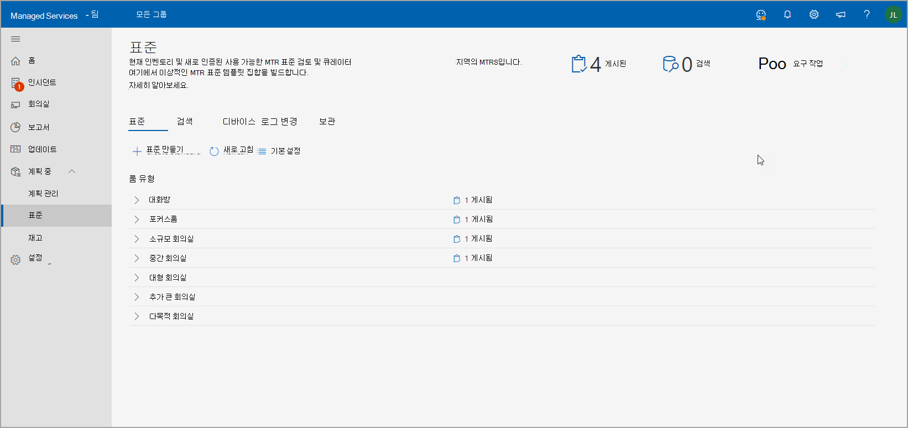
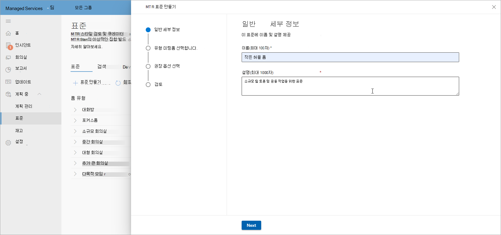
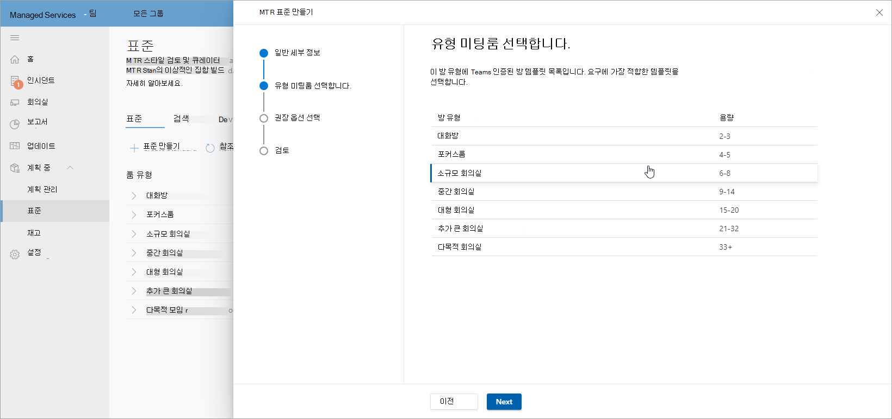
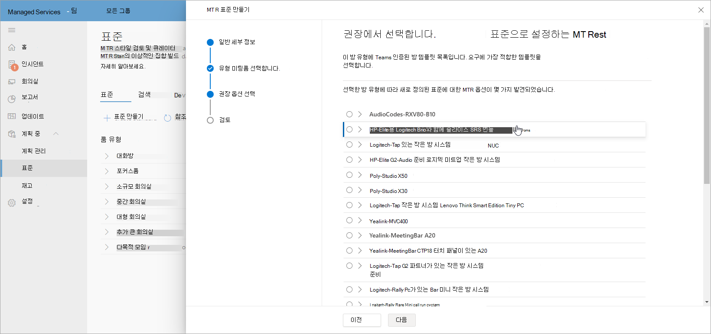
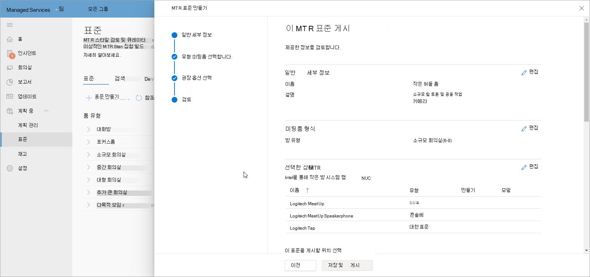
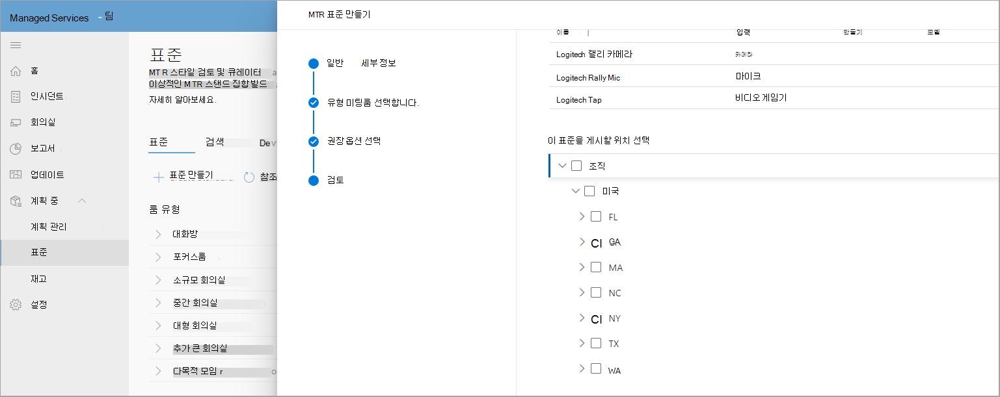
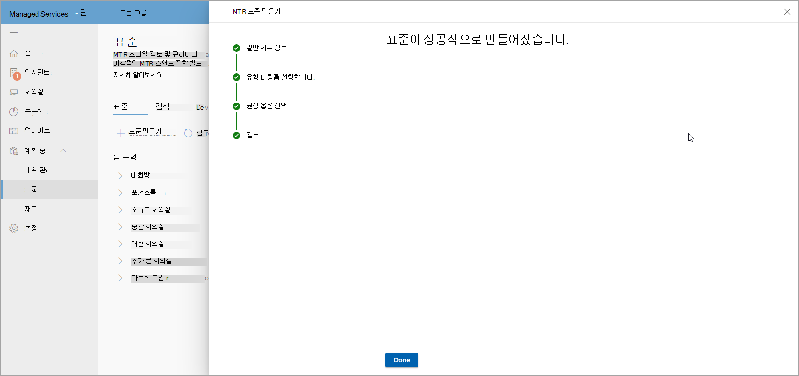
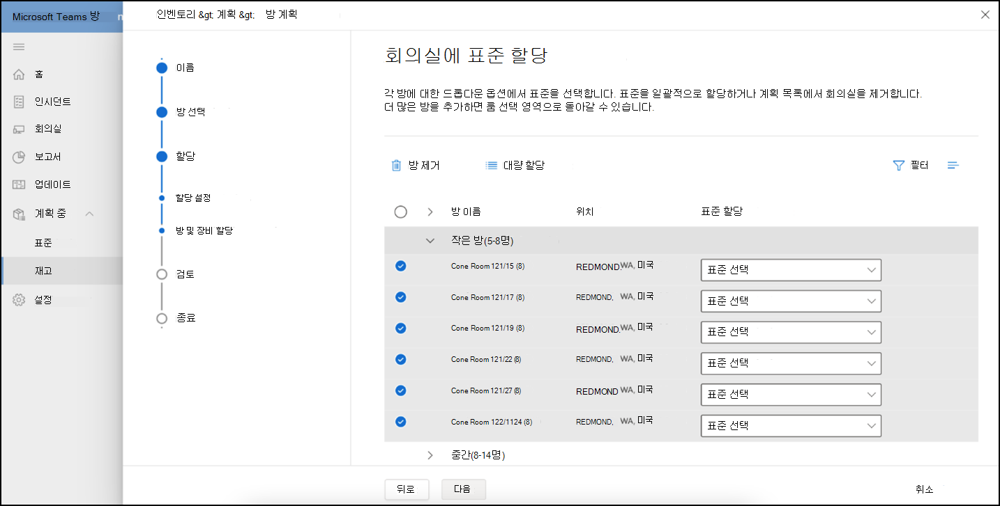
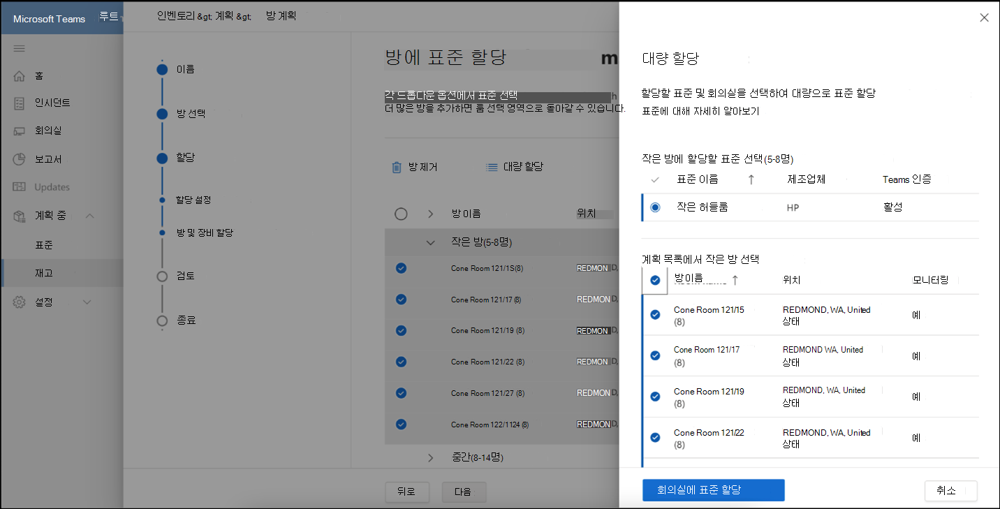
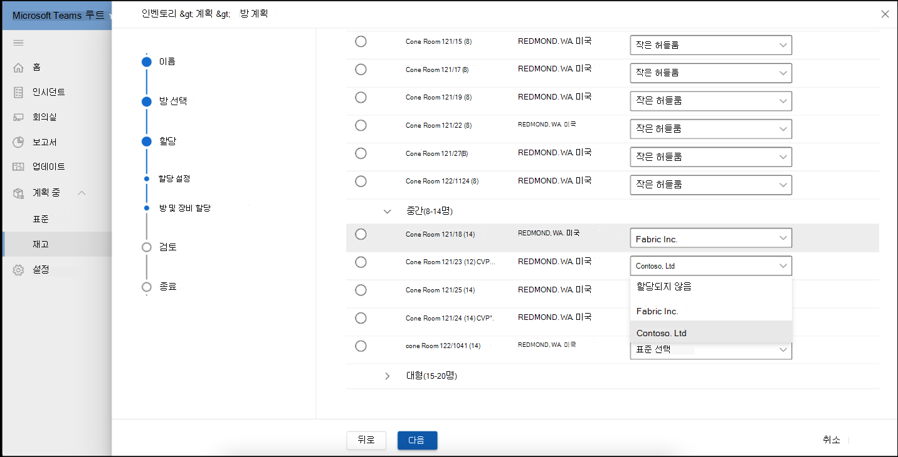

# 표준 및 방 플래너

환경의 스마트 권장 사항을 사용하여 표준을 빌드하고 큐레이터할 수 있습니다. 그런 다음 지역, 사이트, 건물 또는 특정 회의실에 표준을 게시하여 계획된 회의실을 파트너와 공유하여 회의실 배포를 추적할 수 있습니다.

## 회의실 유형 보기

이 페이지에서 조직 내에서 회의실 또는 모임 공간 유형을 볼 수 있습니다. 회의실에 대한 표준 수, 검색된 새 디바이스 수 및 조치를 취해야 하는 디바이스 수를 빠르게 나타 내보입니다.

이 페이지에는 표준 워크플로 만들기를 시작하거나 검색된 디바이스,  로그 변경 및 보관으로 이동할 수 있는 명령줄도 있습니다.

### 표준 만들기

표준 만들기 **워크플로를 사용하여** 표준을 만들 수 있습니다.

**워크플로를 시작**

1. **MTR 표준 만들기를 선택한** 다음 표준에 대한 이름 및 설명과 같은 일반적인 세부 정보를 제공합니다.

   

1. 이 표준에 대한 회의실 유형을 선택합니다.

   

1. 하드웨어 인벤토리에서 권장되는 인증된 Teams 회의실 디바이스를 선택합니다.

   

1. MTR 표준 정보를 검토합니다.

   

1. 지역, 사이트, 건물 또는 특정 회의실에 표준을 게시합니다.

   

워크플로를 완료하면 표준이 성공적으로 만들어지며 사이트, 지역, 건물 또는 회의실에 게시됩니다. 이제 이러한 표준은 계획 목적으로 사용됩니다.

### 검색된 디바이스

표준 내에서 **검색** 된 디바이스를 선택하여 조직 내에서 검색되지 않은 모든 디바이스를 볼 수 있습니다.

인벤토리에서 검색된 디바이스에서 표준을 검토하고 만들 수 있습니다.

## 방 계획

회의실 플래너 마법사를 사용하여 모임 확장에 대한 표준을 사용하여 **회의실을 계획** 합니다.

가이드 환경을 통해 룸 플래너를 시작하세요.

1. 왼쪽 탐색에서 인벤토리를 선택한 다음 계획 회의실 **을 선택합니다**.

   

1. 위치 디렉터리에서 플래너에 방을 추가합니다.

   

1. 다음과 같이 표준 할당 기본 설정을 설정합니다.

   - 레코드에 계획 파트너가 있는 경우 내 파트너가 이러한 모든 방에 가장 적합한 솔루션을 할당할 **지 선택할 수 있습니다**. 이 옵션을 사용하면 파트너가 고객에게 가장 적합한 로컬에서 찾을 수 있는 솔루션을 선택할 수 있습니다.

   - 모임 확장을 사장에서 계획하는 경우 조직 관리자가 조직 표준을 사용하여 모든 회의실에 가장 적합한 솔루션을 **할당합니다**. 표준은 표준 보기에서 조직에서 승인하고 게시한 작업에서 자동으로 할당됩니다.

1. 조직 **관리자가 최상의 솔루션을 할당합니다.**

   

여러 방에 표준을 대량으로 할당할 수 있습니다.

1. 룸 이름 아래에 있는 여러 방 **을 검사합니다**.

   

   

위치, 지역 또는 사이트에 대해 사용할 수 있는 표준이 두 개 이상 있는 경우 표준 과제 목록에서 표준  을 선택하여 회의실 이름 아래에 표시된 회의실에 **할당합니다**.

표준 과제를 검토하고 계획을 완료합니다. 파트너와 공유할 계획을 PDF로 인쇄할 수 있습니다.

## 액세스 제어

룸 플래너 마법사는 기본적으로 관리 서비스 관리자 역할에 사용하도록 설정되어 있습니다. 고객 및 기타 기본 제공 역할의 경우 사용 권한 탭에서 인벤토리 관리에 대한 사용 **권한을 설정** 합니다.

