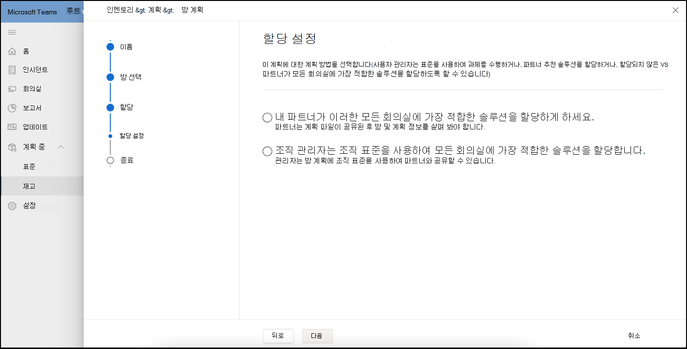

# Standards 및 Room Planner

사용자 환경의 스마트 권장 사항을 사용하여 표준을 빌드하고 큐레이팅할 수 있습니다. 그런 다음 지역, 사이트, 건물 또는 특정 회의실에 표준을 게시하여 계획된 회의실을 파트너와 공유하여 회의실 배포를 추적할 수 있습니다.

## 회의실 유형 보기

이 페이지에서 조직 내에서 회의실 또는 모임 공간 유형을 볼 수 있습니다. 회의실에 대한 표준 수, 검색된 새 디바이스 수 및 조치를 취해야 하는 디바이스 수에 대한 빠른 분석입니다.

이 페이지에는  **표준 워크플로 만들기** 를 시작하거나 검색된 디바이스, 변경 로그 및 보관으로 이동할 수 있는 명령 모음도 있습니다.

### 표준 만들기

**표준 만들기** 워크플로를 사용하여 표준을 만듭니다.

**워크플로를 시작하려면**

1. **MTR 표준 만들기를** 선택한 다음 표준의 이름 및 설명과 같은 일반 세부 정보를 제공합니다.

   

1. 이 표준에 대한 회의실 유형을 선택합니다.

   

1. 하드웨어 인벤토리의 권장 Teams 인증 객실 템플릿 중에서 선택합니다. 목록은 이전 단계에서 선택한 방 유형에 따라 달라집니다.

   

1. MTR 표준 정보를 검토합니다.

   

1. 지역, 사이트, 건물 또는 특정 회의실에 표준을 게시합니다.

   

일단 게시되면 표준이 계획 목적으로 사용됩니다.

### 검색된 디바이스

표준 내에서 **검색된 디바이스를** 선택하여 조직 내에서 비표준 검색된 모든 디바이스를 봅니다.

인벤토리에서 검색된 디바이스에서 표준을 검토하고 만드는 작업을 수행할 수 있습니다.

## 회의실 계획

**Room Planner** 마법사를 사용하여 모임 확장에 대한 표준이 있는 회의실을 계획합니다.

단계별 환경으로 룸 플래너를 시작하려면 다음을 수행합니다.

1. 왼쪽 탐색 영역에서 인벤토리를 선택한 다음 회의실 **계획을** 선택합니다.

   

1. 위치 디렉터리에서 플래너에 회의실을 추가합니다.

   

1. 다음과 같이 표준 할당 기본 설정을 지정합니다.

   - 레코드에 계획 파트너가 있는 경우 내 **파트너가 이러한 모든 회의실에 가장 적합한 솔루션을 할당** 하게 하려면 선택할 수 있습니다. 이 옵션을 사용하면 파트너가 고객에게 가장 적합한 로컬 솔루션을 선택할 수 있습니다.

   - 사내 모임 확장을 계획하는 경우 조직 관리자를 선택하면 **조직 표준을 사용하여 모든 회의실에 가장 적합한 솔루션을 할당합니다**. 표준은 표준 보기에서 조직에서 승인 및 게시한 항목에서 자동으로 할당됩니다.

1. **조직 관리자를 선택하면 최상의 솔루션이 할당됩니다...**

   

여러 방에 표준을 대량으로 할당할 수 있습니다.

1. **회의실 이름** 아래에 있는 여러 회의실을 확인합니다.

   

   

위치, 지역 또는 사이트에 둘 이상의 표준을 사용할 수 있는 경우 **표준 할당** 목록에서 표준을 선택하여 **회의실 이름** 아래에 표시된 회의실에 할당합니다.

표준 할당을 검토하고 계획을 완료합니다. 계획을 PDF로 인쇄하여 파트너와 공유할 수 있습니다.

## 액세스 제어

룸 플래너 마법사는 기본적으로 관리 서비스 관리자 역할에 대해 사용하도록 설정됩니다. 고객 및 기타 모든 기본 제공 역할의 경우 사용 권한 탭에서 인벤토리 관리에 대한 **권한을** 설정합니다.

