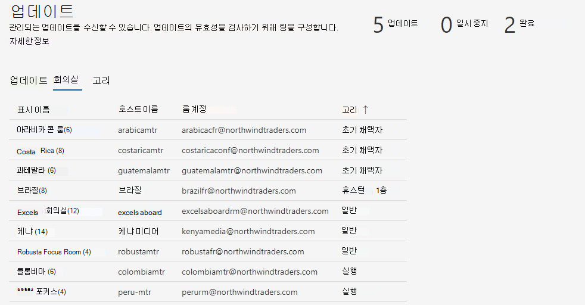
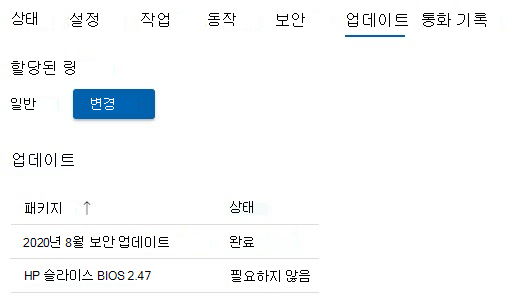

# 업데이트 관리 
현대적인 회의실에는 Microsoft Teams 룸 장치와 카메라, 마이크 또는 스피커와 같은 기타 주변 장치와 포용적이고 효과적인 모임 환경을 만들 수 있는 더 많은 장치가 마련되어 있습니다. 다양한 종류의 OEM 장비는 원하는 정확한 조직 환경을 제공합니다. 그러나 소프트웨어 및 펌웨어를 지속적으로 유지 관리해야 합니다.  

Microsoft Teams 룸 Pro Management는 조직의 각 회의실이 항상 준비되고 제대로 작동하는 공간을 제공하기 위해 권장 수준에서 유지 관리된다는 보증을 제공합니다. Microsoft의 목표는 인텔리전스 및 자동화를 통해 운영 직원의 복잡성과 레그워크를 줄이는 것입니다. 문제 해결 또는 진단은 가능한 한 빨리 수행됩니다. 

## 디바이스를 Pro Management로 전환 
Pro Management에 온보딩하는 회의실 디바이스에는 일반적으로 지침과 다른 변경 관리 기록 및 관행이 있습니다.  

- Pro Management의 이점을 활용하려면 Pro Management 포트폴리오의 모든 업데이트에 대한 변경 관리를 전환해야 합니다.
- 변경 관리의 여러 원본은 인시던트 SLA에 영향을 줍니다. 이 검색 및 수정은 회의실에서 인시던트가 발생하면 다시 시작됩니다.
- Microsoft는 조직마다 다를 수 있는 정책과 예외적인 상황에 개입할 수 있는 정책을 구현하기 위한 제어 및 검사를 구현했습니다.
- 결국 회의실 디바이스는 특정 하드웨어 설치 문제로 인한 예외를 제외하고 일반적인 표준으로 업데이트됩니다.  

## 디바이스 전환: 기본 준비 검사 
대부분의 예기치 않은 오류는 변경 관리 기록이 불확실한 기본 이미지의 변경으로 인해 발생합니다. 

다음과 같은 간단한 준비 검사를 수행하는 것이 좋습니다.  

- **기본 이미지**: 기본 이미지는 특정 OEM에서 온 것이어야 합니다. 디바이스가 과거에 다시 빌드되었으며 일반적인 작업에 대한 예기치 않은 오류 또는 동작이 표시되는 경우 기본 이미지를 복원해야 합니다. 지원을 제공할 수 있지만 회의실 장치를 원격으로 다시 빌드할 수 없으므로 로컬 사이트 기술자가 필요합니다.  
- **기본 OS, 버전:** 기본 OS 및 버전은 Microsoft Teams 룸 디바이스의 요구 사항과 일치해야 합니다. 그렇지 않은 경우 온보딩의 일부로 수정해야 합니다. Microsoft Teams 룸 Semi-Annual 채널 서비스 옵션에서 Windows 10 IoT Enterprise 또는 Windows 10 Enterprise SKU가 필요합니다. 자세한 내용은 공식 [MTR 지침을](rooms-lifecycle-support.md#windows-10-release-support) 참조하세요.

## 준비 검사

Pro Management 서비스를 통해 업데이트를 받기 위한 몇 가지 필수 구성 요소가 있습니다. 

|소프트웨어 |지침 |
|:- |:- |
|Logitech Sync Services  |Logitech 회의실 디바이스에 설치하고 실행해야 합니다. 필수 동기화 서비스는 차단되지 않는 한 Windows 업데이트 자동으로 설치됩니다. 전체 동기화 패키지를 설치할 수도 있습니다. |
|Windows OS 업데이트 |WSUS로 리디렉션되거나 네트워킹 관점에서 차단되지 않도록 설정해야 합니다. GPO 또는 MDM 정책은 OS 업데이트를 관리하는 데 사용해서는 안 됩니다. |
|Microsoft Store 업데이트   |해제해야 합니다. Managed Services가 있는 경우 스토어 업데이트를 해제합니다. |
|바이러스 백신 소프트웨어 |이러한 장치에서 AV 소프트웨어를 실행하는 경우 AV에 Teams 및 Skype dll에 대한 제외가 있는지 확인해야 합니다. 자세한 내용은 여기를 참조하세요. |
|추가 소프트웨어 |타사 원격 데스크톱 보기 등과 같은 추가 소프트웨어는 부작용을 배제하기 위해 Managed Services에서 검토해야 합니다. |
|추가 변경 관리|적용된 업데이트를 방해할 수 있으며' 도입해서는 안 됩니다. |

## 관리형 업데이트 – 작동 방식 
업데이트를 관리하는 방법에는 두 가지 기본 방법이 있습니다.  

- **자동으로 관리**: 업데이트 Pro Management 평가에 따라 회의실 디바이스에 설치됩니다. 포트폴리오에서 관리되는 업데이트에는 개입이 필요하지 않습니다.
- **링 유효성 검사**: 연결된 다리 작업 없이 모니터링할 수 있도록 특정 디바이스에서 업데이트를 미리 볼 수 있도록 링 시스템을 설정합니다. 링 설정은 광범위한 출시 전에 추가 실사 계층을 제공합니다.  

### 자동으로 관리

자동으로 관리되도록 선택하는 경우 해당 부분의 업데이트에 대한 작업이 필요하지 않습니다. 그러나 Pro Management 서비스에서 지원하는 업데이트의 현재 포트폴리오를 검토해야 합니다. 포트폴리오는 지속적으로 새로운 추가를 얻고 있으며, 객실 안정성을 보장하기 위해 가장 빈약하고 영향력 있는 업데이트를 다루는 것이 우리의 우선 순위입니다. 현재 목록(이 문서의 "업데이트 관리" 섹션 아래)을 확인하여 조직에 필요한 추가 변경 관리를 계획합니다.  

**추천:** Pro Management 서비스에서 다루는 업데이트를 관리되는 디바이스에 직접 설치하지 마세요. 

### 링 유효성 검사

링 유효성 검사를 선택할 때 Pro Management 포털에서 링이 작동하는 방식 및 조직에 맞게 사용자 지정하는 데 사용할 수 있는 옵션에 대해 다음 섹션을 검토합니다. 링 유효성 검사를 수행하더라도 권장 업데이트로 인해 객실이 지나지 않도록 합니다. 상황에 따라 회의실에서 Microsoft 권장 사항을 준수하는지 확인하기 위해 "따라잡기" 업데이트를 받을 수 있습니다.  

 포트폴리오에서 새로운 유형의 소프트웨어 및 펌웨어를 사용할 수 있게 됨에 따라 포털 홈페이지 및 Pro Management 설명서 내에서 공지 사항을 확인합니다. 

### 일정 
업데이트 회의실의 장비 및 해당 소프트웨어 및 펌웨어에 대한 권장 표준을 충족하지 않는 경우 객실로 예약됩니다. 

- 고객이 변경 관리 요구 사항을 충족할 수 있도록 준비 링에서 수요일에 업데이트 배포를 시작 **합니다** . 중요한 업데이트가 필요한 경우 이 일정은 무시되고 업데이트가 사용 가능한 즉시 릴리스됩니다. 
- 업데이트 특정 회의실의 필요에 따라 순서가 지정됩니다. 
- 업데이트의 유효성을 검사하는 설치 링이 있는 경우 업데이트가 링 순서를 통해 진행됩니다. 
- 새 업데이트는 상황에 따라 실내 안정성이 향상될 것으로 판단되면 대기 중인 업데이트를 대체할 수 있습니다.  
- 업데이트 일반적으로 야간 유지 관리 기간 동안 적용됩니다. 이는 모든 종류의 중단을 방지하기 위해 현지 시간 **오전 12:00 ~ 오전 5:00** 입니다. 

## Microsoft Teams 룸 앱 업데이트 수명 주기 정책 
MTR 엔지니어링 팀의 지원 정책에 따르면 버전에 대한 12개월 수명 주기가 만료되거나 이후 두 개 이상의 업데이트가 릴리스된 경우 모든 지원이 종료됩니다. 그런 다음, 고객은 지원되는 버전으로 업데이트해야 합니다. [Microsoft Teams 룸 앱 버전 지원을 참조하세요. Microsoft Teams | 자세한](rooms-lifecycle-support.md) 서비스 설명을 Microsoft Docs. 

## 업데이트 관리 환경 연습  
업데이트를 보려면 Pro 관리 포털에 로그인하고 업데이트 페이지로 이동합니다.

업데이트 창에는 다음 탭을 사용하여 회의실에 대한 업데이트 관리에 대한 개략적인 개요가 표시됩니다.

- **업데이트**: 조직에 적용되는 소프트웨어 또는 펌웨어 업데이트입니다.  
- **룸**: 룸 탭은 각 방이 속한 방과 반지의 전망을 제공합니다.
- **링**: 링 탭에는 조직의 회의실 링이 표시됩니다.

### 업데이트  

이 보기는 테넌트와 해당 상태에 대한 관련 업데이트를 보여 줍니다. 더 이상 활성화되지 않은 이전 업데이트를 보려면 **이전 업데이트 포함** 토글을 ON으로 선택합니다.  

모든 업데이트는 다음 상태 중 하나일 수 있습니다.

| 상태 | 설명 |
|:- |:- |
| 예약 | 지정된 링의 회의실에 대한 업데이트가 예약됩니다. 진행이 방이 있는 링에 도달한 후에만 업데이트가 예약됨으로 표시됩니다. 예를 들어 새 업데이트가 스테이징 링에 있는 경우 스테이징 링에 예약된 회의실만 표시됩니다.  
 업데이트가 해당 링으로 진행될 때까지 다른 링의 상태는 "필요하지 않음" 상태가 됩니다.
 |
| 진행 중 | 업데이트가 진행 중이며 개별 링에 상태가 표시됩니다. 이 상태는 전체 링 상태를 표시하므로 테넌트에서 스테이징 링의 단일 방에 업데이트가 적용되는 경우 이그제큐티브 링에 도달할 때까지 업데이트가 "진행 중" 상태가 됩니다. |
| 실패로 완료됨 | 업데이트가 구성된 모든 링을 통해 진행을 완료했으며 하나 이상의 방에서 실패했습니다. |
| 완료 | 업데이트가 구성된 모든 링을 통해 진행을 완료하고 적용 가능한 모든 회의실에 성공적으로 설치되었습니다.|
| 되지 않는 | 업데이트가 비활성화되었습니다. 추가 배포가 중단됩니다. 이는 업데이트가 새 버전으로 대체되었기 때문에 일반적입니다. |
| 일시 중지 | 업데이트가 일시 중지된 상태입니다. |
| 필요하지 않음 | 이 업데이트는 아직 회의실에 대해 평가되지 않았거나 회의실에 적용되지 않습니다. |

### 객실  

회의실 탭에는 테넌트에 있는 모든 회의실과 해당 회의실이 속한 링이 표시됩니다.  

회의실이 속해야 하는 링을 구성하려면 다음을 수행합니다.  

1. 회의실을 클릭하여 자세한 보기를 표시합니다.  
1. **링** 아래에서 **[변경**]을 클릭합니다.  
1. 회의실이 속할 링을 선택합니다.  
1. **할당** 을 클릭합니다.  

자세한 회의실 보기는 **업데이트 노드 아래에** 관련 업데이트 및 해당 상태를 표시합니다.  

### 반지  

링은 기능 업데이트 배포에서 파생된 문제의 위험을 줄이는 데 사용됩니다. 이 작업은 전체 사이트에 업데이트를 점진적으로 배포하여 수행됩니다. 각 링에는 Microsoft Teams 룸의 목록과 해당 출시 일정이 있어야 합니다. 링 정의는 일반적으로 일회성 이벤트(또는 최소한 드물게 발생)이지만 IT는 순서가 여전히 올바른지 확인하기 위해 이러한 그룹을 수시로 다시 방문해야 합니다.  

**링** 탭에는 테넌트에 있는 모든 링이 나열됩니다. 미리 구성된 세 개의 링이 있습니다.  

- **스테이징**: 테스트베드인 스테이징 링에 회의실을 할당합니다. 모든 새 업데이트가 먼저 여기에 배포됩니다. 일반적으로 스테이징 링이 사용자 환경에서 다양한 디바이스 유형의 회의실을 나타내는지 확인해야 합니다. 일반적이지 않은 구성 또는 문제가 발생한 기록이 있는 특정 유형의 회의실이 있는 경우 스테이징에서 이를 나타내는 것이 좋습니다.

- **일반**: 기본적으로 모든 객실은 이 링에 배치됩니다. 엔터프라이즈에서 사용되는 대부분의 회의실 디바이스는 이 범주에 속합니다. 

- **임원**: 이 그룹에는 중단을 사전에 최소화하려는 가장 유명한 회의실이 포함되어야 합니다. 좋은 예는 임원 회의 또는 대규모 팀 모임에 사용되는 대형 회의실입니다. 

### 출시 타임라인 지정

업데이트 모든 링에서 완료하는 데 60일을 초과할 수 없습니다.  

|매개 변수 |설명 |
|:- |:- |
|연기 기간|업데이트가 첫 번째 링으로 시작되면 지연 기간은 이 링에서 업데이트가 시작되기 며칠 전의 지연입니다.|
|롤아웃 기간|
이 링에서 업데이트가 시작되면 이 링에 배포할 시간입니다. 예를 들어 기간이 5일인 경우 이 링에서 업데이트가 시작되면 이 링의 회의실에 5일 이상 배포됩니다.|
|테스트 기간|링에 적용된 후 링에서 업데이트를 테스트/유효성을 검사할 일 수입니다. 테스트 기간은 출시가 완료된 후 시작되며, 완료되면 업데이트가 다음 링으로 이동합니다.|
|완료 시간|"완료 시간" 열은 이 링이 완료될 총 일 수(롤아웃 기간 + 테스트 기간)를 나타냅니다.|
|총 시간|맨 아래에는 첫 번째 링에서 마지막 링까지 업데이트가 완료되는 데 걸리는 시간을 나타내는 "Total" 행이 있습니다.|

### 사용자 지정 링 만들기

1. **링** 탭으로 이동합니다.  
1. **링 추가** 를 클릭합니다.  
1. 이 링이 업데이트를 받을 순서를 지정합니다. 여기서 1은 첫 번째이고 9는 마지막입니다.  
1. 이 링에 이름을 지정합니다.  
1. 원하는 경우 설명을 입력합니다.  
1. 이 링에서 업데이트가 롤아웃되는 일 수를 지정합니다.  
1. 테스트 기간을 지정합니다.  
1. **제출** 을 클릭합니다.  

> [!NOTE]
> "다른 링으로 설정된 일"은 업데이트가 모든 링에서 완료되는 데 걸리는 총 일수입니다. "남은 일"은 *이* 링이 완료할 최대 일 수를 나타냅니다. "롤아웃 기간(일)" 및 "테스트 기간(일)"의 합계는 이 금액을 초과할 수 없습니다.  

**링 편집**

1. **링** 탭으로 이동합니다.
1. 삭제할 링을 클릭합니다.  
1. **링 편집** 을 클릭합니다.  
1. 필요에 따라 롤아웃 및 테스트 일수를 편집합니다.

**링 삭제**

1. **링** 탭으로 이동합니다.  
1. 삭제할 링을 클릭합니다.  
1. **링 삭제** 를 클릭합니다.  

> [!NOTE]
> 기본 링은 삭제할 수 없습니다.  

**회의실 이동**

두 가지 방법으로 한 링에서 다른 링으로 회의실을 이동할 수 있습니다.

1. **링** 탭으로 이동합니다.  
1. 회의실을 이동할 링을 클릭합니다.  
1. **회의실 이동을** 클릭합니다.  
1. 회의실 **목록에서 이동할 회의실** 을 선택합니다.  
1. 선택한 회의실이 드롭다운에서 이동할 대상 링을 선택합니다.  
1. **회의실 이동을** 클릭합니다.  

**또는**

1. 이동하려는 회의실의 회의실 세부 정보를 엽니다(인시던트, 룸 또는 업데이트 -> 룸을 통해).
1. **업데이트** 탭을 클릭합니다.  
1. **할당된 링** 아래에서 **[변경**]을 클릭합니다.
1. 드롭다운에서 새 링을 선택합니다.  
1. **할당** 을 클릭합니다.

## 자동화된 업데이트: 표시 유형 및 제어

Pro Management의 자동화된 업데이트는 조직 전체에서 업데이트를 오케스트레이션합니다. 그러나 필요한 경우 개입할 가시성과 제어가 있습니다. 방법은 다음과 같습니다. 

- 업데이트 실패 시 추적을 위해 티켓이 자동으로 생성됩니다. 
- 문제를 일으키는 업데이트가 표시되면 **일시 중지** 단추를 사용하여 업데이트를 일시 중지할 수 있습니다. 일시 중지 단추를 누르면 팀에서 조사할 문제 티켓을 기록하라는 메시지가 표시됩니다.
- 회의실에서 업데이트가 실패하고 네트워크 연결 끊김과 같은 그럴듯한 이유를 수정한 경우 **실패한 모든 단추를 다시 시도** 하여 업데이트를 다시 시도할 수 있습니다.  
- 업데이트를 더 일찍 사용할 수 있도록 결정할 수 있는 긴급한 상황이 있을 수 있습니다. 이 경우 **업데이트 강제** 적용 단추를 사용할 수 있습니다. 업데이트 강제 옵션을 사용하는 경우 즉시 또는 다음에 회의실을 사용할 수 있을 때 강제로 업데이트를 적용할 수 있습니다.  

> [!NOTE]
> 이러한 업데이트와 관련된 알려진 문제가 발생할 수 있으므로 일반적인 업데이트 관리 전략으로 **"업데이트 강제 적용"은 권장하지 않습니다**.

- 또한 적절한 변경 관리 사례를 보장하기 위해 서비스에서 내부적으로 모든 강제 업데이트를 기록합니다. 앞으로도 이러한 사항을 사용자에게 표시할 수 있을 것으로 기대합니다.
