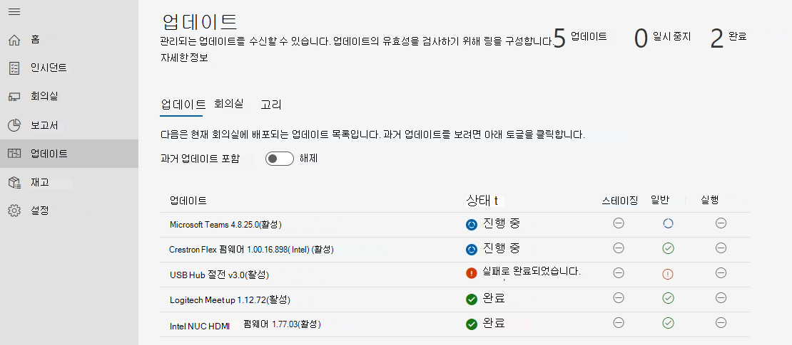

# 업데이트 관리 
최신 회의실에는 카메라, 마이크 또는 Microsoft Teams 룸 같은 기타 주변 장치 및 포괄적이고 효과적인 모임 환경을 만들 수 있는 더 많은 디바이스가 있습니다. 다양한 종류의 OEM의 장비는 원하는 정확한 조직 환경을 제공합니다. 그러나 지속적인 소프트웨어 및 펌웨어를 사용하여 유지 관리해야 합니다.  

Managed Services for Microsoft Teams 룸 조직의 각 방이 항상 준비되고 제대로 작동하는 방을 제공하기 위해 권장 수준에서 유지 관리됩니다. Microsoft의 목표는 인텔리전스 및 자동화를 통해 운영 직원의 복잡성과 레그워크를 줄이는 것입니다. 문제 해결 또는 진단은 가능한 한 빨리 수행됩니다. 

## 디바이스를 Managed Services로 전환 
Managed Services에 온보드되는 룸 디바이스에는 일반적으로 지침과 다른 변경 관리 기록 및 연습이 있습니다.  

- Managed Services의 이점을 이용하려면 Managed Services 포트폴리오에서 모든 업데이트에 대한 변경 관리를 전환해야 합니다.
- 방에서 인시던트가 발생하면 다시 시작될 검색 및 수정이 있을 때 변경 관리 인시던트 SLA에 영향을 미치는 여러 원본이 있습니다.
- Microsoft는 한 조직에서 다른 조직과 다를 수 있는 정책을 구현하고 예외적인 상황에 개입할 수 있는 기능을 구현하기 위해 제어 및 검사를 구현했습니다.
- 결국, 룸 디바이스는 특정 하드웨어 설치 문제로 인한 예외를 제외하고 일반적인 표준으로 업데이트됩니다.  

## 전환 디바이스: 기본 준비 검사 
대부분의 예기치 않은 오류는 변경 관리의 불확실한 기록이 있는 기본 이미지의 변경에서 발생합니다. 

간단한 준비 검사는 다음을 권장합니다.  

- **기본 이미지:** 기본 이미지는 특정 OEM에서 제공되어야 합니다. 디바이스가 과거에 다시빌드되어 일반적인 작업에 예기치 않은 오류 또는 동작이 표시되면 기본 이미지를 복원해야 합니다. 지원을 제공할 수 있지만 원격으로 룸 디바이스를 다시빌 수 없습니다. 따라서 로컬 사이트 기술자가 필요합니다.  
- **기본 OS, 버전:** 기본 OS 및 버전은 디바이스의 Microsoft Teams 룸 일치해야 합니다. 그렇지 않은 경우 온보링의 일부로 수정해야 합니다. Microsoft Teams 룸 채널 서비스 옵션에서 Windows 10 IoT Enterprise Windows 10 Enterprise SKUS를 Semi-Annual 필요합니다. 자세한 내용은 [공식 MTR 지침을](rooms-lifecycle-support.md#windows-10-release-support) 참조하십시오.

## 준비 검사   
관리되는 서비스 업데이트를 수신하기 위한 몇 가지 전제요소가 있습니다. 

|소프트웨어 |지침 |
| :- | :- |
|Logitech Sync Services  |Logitech 회의실 디바이스에서 설치 및 실행해야 합니다. 필수 동기화 서비스는 차단되지 않는 Windows 업데이트에서 자동으로 설치됩니다. 전체 동기화 패키지를 설치할 수도 있습니다. |
|Windows OS 업데이트 |사용하도록 설정되어 있으며 WSUS로 리디렉션되지 않고 네트워킹 관점에서 차단하지 말아야 합니다. OS 업데이트를 관리하는 데 GPO 또는 MDM 정책을 사용할 수 없습니다. |
|Microsoft Store 업데이트   |꺼져야 합니다. Managed Services에서 찾은 경우 스토어 업데이트를 해제합니다. |
|바이러스 백신 소프트웨어 |이러한 장치에서 AV 소프트웨어를 실행하는 경우 AV에 dll 및 dll에 대한 제외가 Teams Skype 합니다. 자세한 내용은 여기를 참조하세요. |
|추가 소프트웨어 |타사 원격 데스크톱 보기와 같은 추가 소프트웨어는 Managed Services에서 검토하여 부작용을 금지해야 합니다. |
|추가 변경 관리|적용된 업데이트를 방해할 수 있으며'를 도입해서는 안 됩니다. |

## 관리되는 업데이트 - 작동 방식 
업데이트가 관리되는 방법은 두 가지가 있습니다.  

- **자동으로 관리되는**: 업데이트는 Managed Services 평가에 따라 룸 디바이스에 설치됩니다. 포트폴리오에서 관리되는 업데이트에 개입할 필요는 없습니다.
- **링 유효성 검사**: 관련 다리 작업 없이 모니터링할 수 있도록 특정 디바이스에서 업데이트를 미리 보기 위해 링 시스템을 설정합니다. 링 설정은 광범위한 롤아웃 전에 추가적인 실사 계층을 제공합니다.  

### 자동으로 관리

자동으로 관리하기로 선택한 경우 해당 부분의 업데이트에 대해 아무 작업도 필요하지 않습니다. 그러나 Managed Services에서 지원하는 현재 업데이트 포트폴리오를 검토해야 합니다. 포트폴리오는 지속적으로 새로운 추가를 진행하고 있으며, 가장 빈번하고 영향력 있는 업데이트를 적용하여 객실 안정성을 보장하는 것이 우선 순위입니다. 현재 목록(이 doc의 "업데이트 관리" 섹션에서)을 확인하여 조직에 필요한 추가 변경 관리를 계획합니다.  

**권장 사항:** 관리되는 디바이스에 Managed Services에서 다루는 업데이트를 자체적으로 설치하지 않습니다. 문제가 발생하면 포털에서 인시던트 신고를 하시기 바랍니다.

### 링 유효성 검사

링 유효성 검사를 선택할 때 Managed Services에서 링이 작동하는 방법 및 조직에 맞게 사용자 지정하는 데 사용할 수 있는 옵션에 대한 다음 섹션을 검토합니다. 링 유효성 검사에서도 Managed Services는 권장되는 업데이트로 인해 회의실이 과거가 되지 않도록 시도합니다. 상황에 따라 방이 관리되는 서비스 권장 사항을 준수하도록 "catch up" 업데이트를 받을 수 있습니다.  

 포트폴리오에서 새로운 유형의 소프트웨어 및 펌웨어를 사용할 수 있도록 하여 포털 홈페이지 및 Managed Services 설명서에서 공지 사항을 확인하십시오. Managed Services 전문가는 디바이스 포트폴리오 전반에 걸쳐 매일 업데이트 버전을 검토하기 때문에 요구에 따라 특정 문제 및 대상 업데이트를 해결합니다.  

### 일정 
관리되는 업데이트는 회의실의 장비를 기반으로 예약되고 해당 소프트웨어 및 펌웨어에 대한 Managed Services 표준을 충족하지 않는 경우 예약됩니다.  

- 고객이 변경 관리 요구 사항을 충족할 수 있도록 스테이징 링에서 **수요일에** 배포 시작을 업데이트합니다. 중요한 업데이트가 필요한 경우 이 일정을 무시하고 사용할 수 있는 즉시 업데이트를 릴리스합니다. 

- 업데이트는 특정 방의 필요에 따라 순서가 정렬됩니다. 
- 업데이트의 유효성을 검사하기 위한 설정 링이 있는 경우 업데이트는 링 순서를 통해 진행됩니다. 
- 상황에 따라 룸 안정성이 개선된 것으로 판단되는 경우 새 업데이트가 대기 중인 업데이트를 중과할 수 있습니다.  
- 업데이트는 일반적으로 야간 유지 관리 기간 동안 적용됩니다. 이는 중단을 방지하기 위해 현지 시간 **12:00am - 오전 5:00입니다.** 

## Microsoft Teams Room 앱 업데이트 수명 주기 정책 
MTR 엔지니어링 팀의 지원 정책에 따라 버전에 대한 12개월 수명 주기가 만료되거나 이후 두 개 이상의 업데이트가 릴리스된 경우 모든 지원이 종료됩니다. 그런 다음 고객은 지원되는 버전으로 업데이트해야 합니다. 앱 [Microsoft Teams 룸 지원 - Microsoft Teams | 자세한 서비스 ](rooms-lifecycle-support.md)설명은 Microsoft Docs입니다. 

모든 관리되는 회의실에서 균일한 표준을 유지하고 추세 문제를 효율적으로 식별할 수 있도록 지원 및 구독 서비스 약관에 따라 MTR App 소프트웨어의 최신 주 또는 부 릴리스(N, N-1)를 지원하고 배포합니다. 필요한 경우 업데이트 링을 우회하여 비준수 회의실을 최신으로 자동으로 제공합니다. 

N-1 정책은 타사 소프트웨어에도 적용됩니다.  

## 업데이트 관리 환경 워크스루  
업데이트를 보시고 Managed Services 포털에 로그인하고 업데이트 페이지로 이동합니다. 

 

업데이트 창에는 다음 탭이 있는 회의실에 대한 업데이트 관리에 대한 고급 개요가 표시됩니다. 

- **업데이트**: Managed Services가 조직을 통해 오케스트레이션하는 소프트웨어 또는 펌웨어 업데이트입니다.  
- **방**: 방 탭은 각 방이 속한 방과 반지를 볼 수 있습니다. 
- **링**: 반지 탭에 조직의 회의실의 링이 표시됩니다. 

### 업데이트  

이 보기는 테넌트 및 해당 상태에 대한 관련 업데이트를 보여줍니다. 더 이상 활성 상태인 과거 업데이트를  확인하려면 지난 업데이트 포함 토글을 ON으로 선택합니다.  

모든 업데이트는 다음 상태 중 하나에 있을 수 있습니다. 

|상태 |설명 |
| :- | :- |
|예약된 |업데이트는 주어진 링의 회의실에 대해 예약됩니다. 업데이트는 진행이 방에 있는 링에 적중한 후에만 예약된 것으로 표시됩니다. 예를 들어 새 업데이트가 스테이징 링에 있는 경우 스테이징 링의 룸 예약만 표시됩니다. 다른 링은 업데이트가 이 링으로 진행될 때까지 "필수 없음" 상태가 됩니다.    |
|진행 중 |업데이트가 진행 중이면 개별 링에 상태가 표시됩니다. 이 상태는 전체 링 상태를 표시하므로 테넌트의 스테이징 링의 단일 룸에 업데이트가 적용되는 경우 이그제큐티브 링에 도달할 때까지 업데이트가 "진행 중" 상태가 됩니다.    |
|실패로 완료되었습니다. |업데이트가 구성된 모든 링을 통해 진행을 완료하고 하나 이상의 방에서 실패했습니다. |
|완료되었습니다. |업데이트가 구성된 모든 링을 통해 진행을 완료하고 모든 해당 회의실에 성공적으로 설치되었습니다. |
|사용 안 하다 |업데이트가 비활성화되었습니다. 추가 배포가 중단됩니다. 업데이트가 새 버전으로 변경된 것이 일반적입니다.  |
|일시 중지 |업데이트가 일시 중지된 상태입니다.  |
|필수 없음 |업데이트는 아직 룸에 대해 평가되지 않았거나 방에 적용되지 않습니다.  |

### 방  

회의실 탭에는 테넌트의 모든 방과 이들이 속한 링이 표시됩니다.  

 

룸이 속해야 하는 링을 구성하기 위해 다음을 실행합니다.  

1. 자세한 보기를 가져오려면 방을 클릭합니다.  
1. "링"에서 "변경" 단추를 클릭합니다.  
1. 방에 속해야 하는 링을 선택합니다.  
1. 할당을 클릭합니다.  

자세한 룸 보기에는 관련 업데이트 및 해당 상태가 "업데이트" 노드 아래에 표시됩니다.  

 

### 링  

링은 기능 업데이트 배포에서 파생된 문제의 위험을 줄이는 데 사용됩니다. 이는 전체 사이트에 업데이트를 점진적으로 배포하여 수행됩니다. 각 링에는 룸 룸의 Microsoft Teams 및 해당 롤아웃 일정이 있습니다. 일반적으로 링 정의는 일회성 이벤트입니다. 

(또는 적어도 희소하지 않습니다)하지만 IT는 이러한 그룹을 수시로 다시 확인하여 시큐어링이 여전히 올바른지 확인해야 합니다.  

"링" 탭에는 테넌트의 모든 링이 나열됩니다. 미리 구성된 세 개의 링이 있습니다.  

**스테이징**  

테스트bed인 스테이징 링에 룸을 할당합니다. 모든 새 업데이트가 먼저 여기에 출시됩니다. 일반적으로 스테이징 링이 환경의 다양한 디바이스 유형이 있는 방을 나타내야 합니다. 확연한 구성이나 문제를 본 기록이 있는 특정 유형의 회의실이 있는 경우 스테이징에서 해당 룸을 나타내는 것이 좋습니다.

**일반**  

기본적으로 모든 방은 이 링에 배치됩니다. 엔터프라이즈 전체에서 사용되는 대부분의 룸 디바이스는 이 범주에 속합니다. 

**Executive**  

이 그룹에는 중단을 사전 예방적으로 최소화하려는 가장 높은 프로필의 회의실이 포함되어야 합니다. 좋은 예는 임원 모임 또는 대규모 팀 모임에 사용되는 대규모 회의실입니다. 

### 롤아웃 타임라인 지정 

업데이트는 모든 링에서 완료하는 데 60일을 초과할 수 없습니다.  

|**매개 변수** |**설명** |
| :- | :- |
|
 

연기 기간 
|
업데이트가 첫 번째 링으로 시작되면 이 링에서 업데이트가 시작되기 며칠 후 지연됩니다.  

 
|
|
 

롤아웃 기간  

 
|
이 링에서 업데이트가 진행되면 이 링에 배포할 시간입니다. 예를 들어 기간이 5일이면 이 링에서 업데이트가 시작되면 이 링의 방에 5일 이상 배포됩니다. 

 
|
|
 

테스트 기간 
|

링에 적용된 링에서 업데이트를 테스트/유효성을 검사하는 일 수입니다. 테스트 기간은 롤아웃이 완료된 후에 시작하고, 완료되면 업데이트가 다음 링으로 이동됩니다. 

 
|
|
 

완료 시간 
|
 

"완료 시간" 열은 이 링이 완료될 총 일 수(롤아웃 기간 + 테스트 기간)를 나타냅니다.  

 
|
|
 

총 시간 
|
 

아래쪽에는 "총" 행이 있습니다. 이는 첫 번째 링에서 마지막 링으로 업데이트가 완료되는 데 얼마나 오래 걸릴지 나타냅니다. 

 

 
|

### 사용자 지정 링 만들기 

1. "링" 탭으로 이동합니다.  
1. "링 추가"를 클릭합니다.  
1. 이 링이 업데이트를 받을 순서를 지정합니다. 여기서는 1이 먼저, 9는 마지막입니다.  
1. 이 링에 이름을 지정합니다.  
1. 원하는 경우 설명을 입력합니다.  
1. 이 링에서 업데이트가 롤아웃되는 일 수를 지정합니다.  
1. 테스트 기간을 지정합니다.  
1. 제출을 클릭합니다.  

> [!NOTE]
> "다른 링으로 설정된 날짜"는 업데이트가 모든 링에서 완료하는 데 걸릴 총 일 수입니다. "남은 일"은 이 링이 완료될 *최대 일* 수를 나타냅니다. "일의 롤아웃 기간" 및 "일의 테스트 기간"의 합계는 이 금액을 초과할 수 없습니다.  

**링 편집** 

1. "링" 탭으로 이동합니다.  
1. 편집할 링을 클릭합니다.  
1. "편집 링"을 클릭합니다.  
1. 필요한 경우 롤아웃 및 테스트 일 수를 편집합니다. 

**링 삭제** 

1. "링" 탭으로 이동합니다.  
1. 삭제될 링을 클릭합니다.  
1. "링 삭제"를 클릭합니다.  

> [!NOTE]
> 기본 링은 삭제할 수 없습니다.  

**회의실 이동** 

한 링에서 다른 링으로 회의실을 이동하는 방법은 두 가지 방법으로 가능합니다. 

1. "링" 탭으로 이동합니다.  
1. 방을 이동할 링을 클릭합니다.  
1. "회의실 이동"을 클릭합니다.  
1. "방 목록"에서 이동할 방을 선택합니다.  
1. 선택한 방이 드롭다운에서 이동하는 대상 링을 선택합니다.  
1. "회의실 이동"을 클릭합니다.  

**또는**

1. 이동할 방에 대한 회의실 세부 정보(인시던트, 회의실 또는 업데이트 -> 를 뚫습니다.   

1. "업데이트" 탭을 클릭합니다.  
1. "할당된 링"에서 "변경"을 클릭합니다.  
1. 드롭다운에서 새 링을 선택합니다.  
1. "할당"을 클릭합니다. 

## 관리되는 업데이트: 가시성 및 제어  
관리되는 서비스는 조직 전체에서 업데이트를 오케스트레이션합니다. 그러나 필요한 경우 개입할 가시성과 제어가 있습니다. 방법은 다음과 같습니다. 

- 업데이트 오류가 발생하면 Microsoft Managed Service Operations 팀에서 티켓이 자동으로 생성됩니다. Operations 팀은 실패를 수정하고 필요한 경우 참여하는 단계를 수행합니다.  
- 문제를 일으키는 업데이트가 표시될 경우 일시 중지 단추를 사용하여 업데이트를 일시 중지할 **수** 있습니다. 일시 중지 단추를 누르면 조사할 작업 센터에 대한 티켓이 생성됩니다. 인시던트 대응을 위해 업데이트를 진행하는 동안 세부 정보를 제공해야 합니다.  
- 룸에서 업데이트가 실패하고 네트워크 연결 끊기 같은 그만한 이유를 수정한 경우 실패한 모든 단추를 다시 시도하여 업데이트를 다시 시도할 **수** 있습니다.  
- 업데이트를 더 일찍 사용할 수 있도록 결정할 수 있는 긴급한 상황이 있을 수 있습니다. 이 경우 강제 업데이트 **단추를 사용할 수** 있습니다. 강제 업데이트 옵션을 사용하는 경우 즉시 업데이트를 강제하거나 다음에 룸을 사용할 수 있는 경우 선택할 수 있습니다.  

<!---->  

> [!NOTE]
> 일반적인 업데이트 관리 전략으로 **"강제 업데이트"는** 권장하지 않습니다. 유효성 검사 통과에 여전히 있는 업데이트를 푸시하는 경우 이미 알고 있는 문제가 발생할 수 있습니다. 이러한 경우 이러한 방에 대한 인시던트 해결은 최선의 노력을 다할 것입니다.  

- 또한 올바른 변경 관리 사례를 보장하기 위해 서비스에 내부적으로 모든 힘 업데이트를 기록합니다. 앞으로도 이러한 표시가 표시될 것으로 예상됩니다. 

<!-- 

## Managed updates: FAQS 
1. **An update was announced, but I don’t see it on my Updates tab.** 

Updates roll out through our update rings. It won’t display in your tab until the update has passed the staging ring. 

2. **Will my new rooms automatically get updated?** 

Yes. We catch up with any new rooms on the necessary updates. 
**

3. **What if I have an Anti-virus running? Do I need to add exclusions?** 

Suppose you are using an anti-virus or just started using a new anti-virus. In that case, it might cause failures to launch meetings in the room console by interfering with the launch of related software libraries and executables from Teams or Skype for Business. Please contact our support team to get assistance on this issue. 

4. **I reimaged a room. Will the updates automatically get installed?** 

Unfortunately, not at this time. Previous updates need to be manually reinstalled. We are working on a feature to address this scenario. 

5. **I see an update failed. What action should I take to make it successful?** 

Our 24/7 operations team troubleshoot all update failures and will contact you if you need to take any action.  

6. **What updates can we force?** 

Any and all active updates can be forced. 

7. **When is my update starting?** 

Staging rings start on Wednesday. We are making improvements to the portal so you can see what day each of your rings starts depending on your configuration. If a critical update is required, we will bypass this schedule and release the update as soon as it’s available. -->

