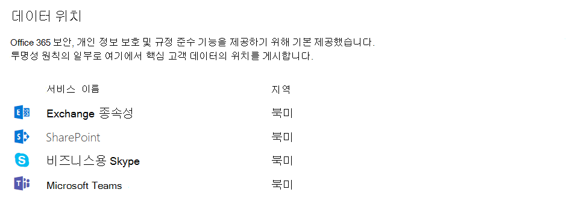

Microsoft 팀의 보안 및 준수에 대 한 개요
======================================================

Microsoft 팀은 고객이 기대 하는 고급 보안 및 규정 준수 기능을 제공 하는 Office 365 하이퍼 규모의 엔터프라이즈 등급 클라우드를 기반으로 합니다.

보안 및 규정 준수에 대 한 다음 Microsoft 기술 비디오를 놓치지 마세요.
- [Microsoft 팀의 주요 기능: 보안 및 준수](https://youtu.be/91lHNKVVvQ4) (12:42 분)
- [Microsoft 팀의 보안 및 규정 준수 제어](https://www.youtube.com/watch?v=Km4T4hMM__k) (10:54 분)

팀은 계층 D 규격입니다. 여기에는 ISO 27001, ISO 27018, SSAE16 SOC 1, SOC 2, HIPAA 및 EU 모델 절 (EUMC)이 포함 됩니다. Microsoft 규정 준수 프레임 워크 내에서 Microsoft는 Office 365 응용 프로그램 및 서비스를 네 가지 범주로 분류 합니다. 각 범주는 해당 범주에 나열 되는 Office 365 서비스 또는 관련 Microsoft 서비스에 대해 충족 해야 하는 특정 준수 약정에 의해 정의 됩니다.

규정 준수 범주에서 업계 선두적인 규정 준수 약정을 갖는 서비스는 기본적으로 사용 하도록 설정 되어 있습니다. 범주 A 및 B의 서비스는 전체 조직에 대해 이러한 서비스를 설정 하거나 해제 하는 컨트롤과 함께 사용 됩니다. 자세한 내용은 [업계 표준 및 규정 준수 프레임 워크](https://download.microsoft.com/download/1/4/3/1434ABAB-B8E9-412D-8C3A-187B5FCB7A2F/Compliance%20Framework%20document.pdf)에 나와 있습니다. 또한 팀은 클라우드 보안 동맹 준수를 지원 합니다.

또한 팀은 조직 차원의 2 단계 인증, Active Directory를 통한 single sign-on, 전송 되는 데이터의 암호화를 적용 합니다. 파일은 SharePoint에 저장 되며 SharePoint 암호화를 통해 지원 됩니다. 노트는 OneNote에 저장 되며 OneNote 암호화를 통해 지원 됩니다. OneNote 데이터는 팀 SharePoint 사이트에 저장 됩니다. Wiki 탭은 노트 작성에도 사용할 수 있으며, 콘텐츠는 팀 SharePoint 사이트에도 저장 됩니다.

또한 Microsoft Intune을 사용 하 여 채널, 채팅 및 파일에 대 한 감사 로그 검색, eDiscovery 및 법률 보존에 대 한 지원도 추가 했습니다. 이러한 설정을 관리 하려면 Office 365 보안 & 준수 센터로 이동 합니다. 

Office 365 보안 및 준수에 대 한 자세한 내용은 [향상 된 보안을 위해 office 365 테 넌 트 구성을](https://docs.microsoft.com/office365/securitycompliance/tenant-wide-setup-for-increased-security)읽어 보세요.

> [!NOTE]
> 현재 [개인 채널](private-channels.md) 은 제한 된 보안 및 규정 준수 기능을 지원 합니다. 개인 채널의 모든 보안 및 규정 준수 기능에 대 한 지원은 곧 제공 될 예정입니다.

## 감사 및 보고

감사 로그 검색은 Office 365 보안 & 준수 센터에 있으며, 감사 이벤트에 대 한 알림 및/또는 보고서를 사용 가능 하 게 설정 하는 기능을 제공 하 고 무제한 감사 시간 표시 막대에서 관리자의 사용 및 확인을 위한 특정 또는 일반 이벤트 집합을 내보냅니다. 모든 감사 로그 데이터는 Office 365 보안 & 준수 센터 내에서 알림을 설정 하는 데 사용할 수 있으며 추가 분석을 위해 필터링 및 내보내기를 할 수도 있습니다. Office 365 보안 & 준수 센터에서 Microsoft 팀 이벤트에 대 한 감사 로그 검색을 수행 하는 방법에 대해 자세히 알아보려면이 [링크](https://support.office.com/article/Search-the-audit-log-in-the-Office-365-Security-Compliance-Center-0d4d0f35-390b-4518-800e-0c7ec95e946c) 를 참조 하세요. 

## 콘텐츠 검색 준수

콘텐츠 검색을 사용 하 여 풍부한 필터링 기능을 통해 모든 팀 데이터를 검색 하 고 규정 준수 및 소송 지원을 위한 특정 컨테이너에 내보낼 수 있습니다. 이 작업은 eDiscovery 사례와 관계 없이 수행할 수 있습니다. 이렇게 하면 규정 준수 관리자가 모든 사용자에 게 팀 데이터를 수집 하 고 추가 처리를 위해 검토 하 고 내보낼 수 있습니다. Office 365 보안 & 준수 센터에서 Microsoft 팀 콘텐츠에 대 한 규정 준수 콘텐츠 검색을 수행 하는 방법에 대 한 자세한 내용은이 [링크](https://support.office.com/article/content-search-in-office-365-53390468-eec6-45cb-b6cd-7511f9c909e4) 를 참조 하세요. 

팁: Microsoft 팀을 사용 하 여 Microsoft 팀의 콘텐츠, 즉 채팅 및 채널 메시지, 모임, 통화를 필터링 할 수 있습니다.

## eDiscovery

전자 검색은 법률 슈트 또는 조사에서 생산 요청에 대 한 응답으로 ESI (전자적 저장 정보)를 식별, 수집 및 생성 하는 전자적 측면입니다. 접근 권한 값에는 사례 관리, 유지, 검색, 분석, 팀 데이터 내보내기 등이 포함 됩니다. 여기에는 채팅, 메시지 및 파일, 모임 및 통화 요약도 포함 됩니다. 팀 모임 및 통화의 경우, 모임 및 통화에 발생 한 이벤트에 대 한 요약이 만들어져서 eDiscovery에서 사용할 수 있게 됩니다. 

보안 & 준수 센터에서 eDiscovery 작업을 수행 하 고 팀 콘텐츠에 대 한 규정 준수 콘텐츠 검색을 실행 하는 방법에 대 한 자세한 내용은 아래 링크로 이동 하세요. 

[eDiscovery](https://support.office.com/article/manage-legal-investigations-in-office-365-2e5fbe9f-ee4d-4178-8ff8-4356bc1b168e) 

[콘텐츠 검색](https://support.office.com/article/search-for-content-in-office-365-df2d1e0f-b476-42c9-aade-4a260b24f193)

고객은 요구 사항에 따라 현재 위치 eDiscovery 또는 [고급 eDiscovery]를 활용할https://support.office.com/article/Office-365-Advanced-eDiscovery-fd53438a-a760-45f6-9df4-861b50161ae4)수 있습니다 (. 다음 표에서는 두 가지 사이의 차이점에 대해 간략하게 설명 합니다.

| |원본 위치 eDiscovery  |고급 eDiscovery  |
|---------|---------|---------|
|사례 관리     |축        |축         |
|액세스 제어  |축         |축         |
|콘텐츠 검색     |축         | 축        |
|보류 (s)   |축         | 축        |
|내보내기     |축         |축         |
|중복 검색     |-         |축         |
|기계 학습으로 관련성 검색    |-         |축         |
|비구조적 데이터 분석      |-         |축         |

## 법률 보류

소송 중에는 사용자 (custodian)와 관련 된 모든 데이터를 대/소문자 증명 정보로 사용할 수 있도록 변경 불가능으로 유지 해야 하는 경우가 많습니다. 이는 사용자 (사용자 사서함) 또는 법률에 따라 팀을 배치 하 여 달성할 수 있습니다. 팀 내의 팀이 원본 위치 유지 (대상 쿼리 또는 필터링 된 콘텐츠를 통해 사서함 또는 사이트 모음의 하위 집합)에 배치 되는 경우 (전체 사서함 또는 사이트 모음) 보류가 그룹 사서함에 배치 됩니다. 이렇게 하면 최종 사용자가 그룹 사서함에 ingested 된 채널 메시지를 삭제 하거나 편집할 때도 변경 내용이 유지 되 고 eDiscovery 검색에서 사용할 수 있게 됩니다. 법률 보존은 일반적으로 eDiscovery 사례의 컨텍스트 내에서 적용 됩니다. Office 365 보안 & 준수 센터의 보존 및 유지에 대해 자세히 알아보려면 [이](https://support.office.com/article/overview-of-preservation-policies-9c3b1d52-40ce-4ba3-a520-9ae0be15538a) 도움말 문서를 참조 하세요. 

## Microsoft 팀에 대 한 정보 보호 아키텍처. 

다음 그림은 팀 파일 및 메시지에 대 한 Exchange 및 SharePoint 둘 다에 팀 데이터를 수집 하는 흐름을 나타냅니다. 

다음 그림은 Exchange로의 팀 모임 및 통화 데이터 수집 흐름을 나타냅니다.

> [!IMPORTANT]
> 팀 콘텐츠를 검색 하는 데 최대 24 시간이 걸릴 수 있습니다.

라이선싱
---------------

정보 보호 기능에 도달 하면 Office 365 구독 및 관련 독립 실행형 라이선스에서 사용 가능한 기능 집합을 결정 합니다.

| 정보 보호 기능 | Office 365 Business Essentials | Office 365 Business Premium | Office 365 Enterprise E1 | Office 365 Enterprise E3/E4 | Office 365 Enterprise E5 |
|-----------------------------------|--------------------------------|-----------------------------|--------------------------|-----------------------------|--------------------------|
|              보관할              |               -                |              -              |            -             |             예             |           예            |
|        원본 위치 eDiscovery        |               -                |              -              |            -             |             예             |           예            |
|        고급 eDiscovery        |               -                |              -              |            -             |              -              |           예            |
|            법률 보류             |               -                |              -              |            -             |             예             |           예            |
|     콘텐츠 검색 준수     |               -                |             예             |           예            |             예             |           예            |
|      감사 및 보고       |              예               |             예             |           예            |             예             |           예            |
|       조건부 액세스\*        |              예               |             예             |           예            |             예             |           예            |

> [!NOTE]
> \*조건부 액세스에 추가 라이선스가 필요 함

| |  |  |
|---------|---------|---------|
|     |판단 요점         |조직이 규정 준수 및 보안 비즈니스 요구 사항을 충족 하기 위해 필요한 라이선스를 보유 하 고 있나요?         |
|    |다음 단계         |조직의 현재 라이선스를 검토 하 고 규정 준수 및 보안에 대 한 모든 비즈니스 요구 사항에 맞는지 확인 합니다.         |

이러한 기능을 사용 하도록 설정 하기 전에 Microsoft 365 관리 센터에서 보안 & 준수 센터에 액세스할 수 있는지 확인 합니다. 기본적으로 테 넌 트 관리자는 액세스 권한이 있습니다.

콘텐츠 검색 및 eDiscovery는 보안 & 준수 센터에서의 실행이 필요 하지 않습니다.

Teams의 데이터 위치
-------------------------

팀의 데이터는 Office 365 테 넌 트와 연결 된 지리적 영역에 위치 합니다. 현재, 팀은 오스트레일리아, 캐나다, 프랑스, 인도, 일본, 영국, 대한민국, 남아프리카, 미주, APAC, EMEA 지역을 지원 합니다. 

> [!IMPORTANT]
> 팀은 현재 오스트레일리아, 캐나다, 프랑스, 인도, 일본, 영국, 대한민국, 대한민국, 그리고 새 테 넌 트에 대해서만 남아프리카 공화국로 데이터 영주권을 제공 합니다. 새 테 넌 트가 테 넌 트에서 팀에 로그인 한 사용자가 없는 모든 테 넌 트로 정의 됩니다. 오스트레일리아, 인도, 일본, 대한민국의 기존 테 넌 트는 계속 해 서 자신의 팀 데이터를 APAC 지역에 저장 합니다. 캐나다의 기존 테 넌 트는 계속 해 서 해당 데이터를 미주에 저장 합니다. 프랑스, 영국 및 남아프리카 공화국의 기존 테 넌 트는 계속 해 서 EMEA 지역에 데이터를 저장 합니다.

팀에 대 한 남아프리카 데이터 영주권에 대 한 자세한 내용은 Vargar의 블로그 게시물에서 찾을 수 있으며, [Microsoft 팀은 남아프리카 데이터 영주권를 시작](https://techcommunity.microsoft.com/t5/Microsoft-Teams-Blog/Microsoft-Teams-launches-South-Africa-Data-Residency/ba-p/776611)합니다.

팀의 영주권 데이터에 대 한 자세한 내용은 Varun Sagar의 블로그 게시물을 참조 하 여 [Microsoft 팀에서 동남 한국식 Data 영주권을 시작](https://techcommunity.microsoft.com/t5/Microsoft-Teams-Blog/Microsoft-Teams-launches-South-Korea-Data-Residency/ba-p/789171)합니다.

팀에 대 한 인도 및 영국 데이터 영주권의 출시에 대해 자세히 알아보려면, [Microsoft 팀에서 인도 데이터 영주권, 다른 geos가 출시](https://techcommunity.microsoft.com/t5/Microsoft-Teams-Blog/Microsoft-Teams-Launches-Australia-and-Japan-Data-Residency/ba-p/237827)되는 등의 블로그 게시물을 참조 하세요. 

팀에 대 한 캐나다 데이터 영주권에 대 한 자세한 내용, Varun Sagar 블로그 게시물에 대 한 자세한 내용은 Microsoft 팀이 곧 제공 되는 [캐나다 데이터 영주권, 오스트레일리아, 일본을 실행](https://techcommunity.microsoft.com/t5/Microsoft-Teams-Blog/Microsoft-Teams-Launches-Canada-Data-Residency-Australia-and/ba-p/227178)합니다. 

팀에 대 한 오스트레일리아 및 일본 데이터 영주권의 출시에 대해 자세히 알아보려면 [Microsoft 팀이 오스트레일리아와 일본 데이터 영주권을 시작](https://go.microsoft.com/fwlink/?linkid=867773)합니다. 

팀에 대 한 프랑스 데이터 영주권 시작에 대해 자세히 알아보려면 [Microsoft 팀이 프랑스 데이터 영주권를 실행](https://techcommunity.microsoft.com/t5/Microsoft-Teams-Blog/Microsoft-Teams-launches-France-Data-Residency/ba-p/364466)하 여 참조 하세요.

테 넌 트에 대 한 데이터가 들어 있는 영역을 확인 하려면 [Microsoft 365 관리 센터](https://portal.office.com/adminportal/home) > **설정** > **조직 프로필로**이동 합니다. 아래로 스크롤하여 **데이터 위치로**이동 합니다. 

조건부 액세스 정책은 팀에 맞게 작동 하는 방식
-------------------------

Microsoft 팀은 모임, 일정, interop 채팅, 파일 공유 등의 핵심 생산성 시나리오를 위해 Exchange Online, SharePoint Online, 비즈니스용 Skype Online에 크게 의존 합니다. 이러한 클라우드 앱에 대해 설정 된 조건부 액세스 정책은 사용자가 모든 클라이언트에서 Microsoft 팀에 직접 로그인 할 때 Microsoft 팀에 적용 됩니다. 

Microsoft 팀은 Azure Active Directory 조건부 액세스 정책의 클라우드 앱으로 별도로 지원 됩니다. Microsoft 팀 클라우드 앱에 대해 설정 된 조건부 액세스 정책은 사용자가 로그인 할 때 Microsoft 팀에 적용 됩니다. 그러나 Exchange Online 및 SharePoint Online과 같은 다른 앱에 대 한 올바른 정책이 없는 경우에도 사용자는 해당 리소스에 직접 액세스할 수 있습니다. Azure 포털에서 조건부 액세스 정책을 설정 하는 방법에 대 한 자세한 내용은 다음으로 이동 하세요.https://docs.microsoft.com/azure/active-directory/active-directory-conditional-access-azure-portal-get-started) 

Windows 및 Mac 용 Microsoft 팀 데스크톱 클라이언트는 최신 인증을 지원 합니다. 최신 인증은 office 용 ADAL (Active Directory 인증 라이브러리)을 플랫폼 전체의 Microsoft Office 클라이언트 응용 프로그램에 따라 로그인 합니다.

Microsoft 팀 데스크톱 응용 프로그램에서 AppLocker를 지원 합니다.  AppLocker 전제 조건에 대 한 자세한 내용은 AppLocker 사용에 대 한 요구 사항https://docs.microsoft.com/windows/security/threat-protection/windows-defender-application-control/applocker/requirements-to-use-applocker)을 참조 하세요.

팀의 개인 정보
--------------------------

Office 365의 고객은 데이터를 소유 하 고 제어 합니다. Microsoft는 귀하가 구독 한 서비스를 제공 하는 것 외에는 데이터를 사용 하지 않습니다. 서비스 제공 업체는 전자 메일, 문서 또는 팀이 광고 또는 서비스와 관련이 없는 목적을 검사 하지 않습니다. Microsoft는 업로드 된 콘텐츠에 액세스할 수 없습니다. 비즈니스용 OneDrive 및 SharePoint Online과 마찬가지로 고객 데이터는 테 넌 트 내에 남아 있습니다.

[Microsoft 보안 센터](https://microsoft.com/trustcenter)의 신뢰 및 보안 관련 정보에 대 한 자세한 내용을 확인 하세요. 팀은 Microsoft 보안 센터와 동일한 지침 및 원칙을 따릅니다.

관련 항목
----------------------
[Office 365 ATP 안전한 링크](https://docs.microsoft.com/office365/securitycompliance/atp-safe-links#how-to-get-atp-safe-links-protection)
