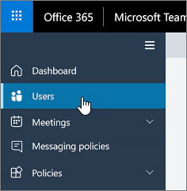

# Microsoft 팀의 초대에 포함 된 전화 번호 설정Set the phone numbers included on invites in Microsoft Teams

Office 365의 오디오 회의를 통해 조직의 사용자가 Microsoft 팀 모임을 만든 다음 사용자가 휴대폰을 사용 하 여 해당 모임에 전화를 걸 수 있습니다.Audio Conferencing in Office 365 enables users in your organization to create Microsoft Teams meetings, and then allow users to dial in to those meetings using a phone.
  
회의 브리지는 조직의 전화 접속 전화 번호 집합을 제공 합니다.A conferencing bridge gives you a set of dial-in phone numbers for your organization. 이 모든 항목은 모임 이끌이가 만든 모임에 참가 하는 데 사용할 수 있지만 모임 초대에 포함 될 모임을 선택할 수 있습니다.All of them can be used to join the meetings that a meeting organizer has created, but you can select which ones will be included on their meeting invites.
  
> [!NOTE]
> 모임 주최자에 대 한 모임 초대에는 최대 1 명의 유료 전화 번호와 한 명 이상의 무료 전화번호가 있을 수 있지만, 모임 참가에 사용할 수 있는 모든 전화 접속 전화 번호의 전체 목록을 여는 링크가 각 모임 초대의 맨 아래에 있는 링크 이기도 합니다.There can be a maximum of one toll and one toll-free phone number on the meeting invite for a meeting organizer, but there is also a link located at the bottom of each meeting invite that opens the full list of all dial-in phone numbers that can be used to join a meeting. 

> [!NOTE]
> [!INCLUDE [updating-admin-interfaces](includes/updating-admin-interfaces.md)]
  
## 새 사용자를 위해 모임 초대에 포함 된 전화 번호의 초기 할당Initial assignment of phone numbers that are included in the meeting invites for new users

오디오 회의에 사용 하도록 설정 된 사용자의 모임 초대에 포함 되는 전화 번호는 기본 회의 유료 전화 번호 및 기본 회의 무료 전화 번호 사용자 설정에 따라 정의 됩니다.The phone numbers that get included in the meeting invites of users enabled for Audio Conferencing are defined by the default conferencing toll phone number and the default conferencing toll-free phone number user's settings. 각 설정은 지정 된 사용자의 모임 초대에 포함 될 유료 및 무료 번호를 지정 합니다.Each setting specifies which toll and toll-free number will be included in the meeting invite of a given user. 위에서 언급 한 것 처럼 각 모임 초대에는 하나의 유료 번호와 추가 무료 번호, 그리고 특정 모임에 참가 하는 데 사용할 수 있는 모든 전화 접속 전화 번호의 전체 목록을 여는 링크가 포함 되어 있습니다.As noted above, each meeting invite contains one toll number, one optional toll-free number and a link that opens the full list of all dial-in phone numbers that can be used to join a given meeting.

새 사용자의 경우 기본 회의 유료 전화 번호는 사용자가 오디오 회의 서비스를 사용할 수 있는 경우 사용자의 Office 365 프로필에 설정 된 국가를 기준으로 지정 됩니다.For a new user, the default conferencing toll numbers is assigned based on the country that is set in the Office 365 profile of the user when the user is enabled for the Audio Conferencing service. 사용자의 국가와 일치 하는 유료 전화 번호가 있는 경우 해당 번호는 사용자의 기본 유료 번호로 자동으로 할당 됩니다.If there is a toll number in the conference bridge that matches the country of the user, that number will be automatically assigned as the default toll number of the user. 전화 회의 브리지의 기본 유료 번호로 정의 된 번호가 사용자의 기본 유료 번호로 할당 되지 않는 경우에 사용 됩니다.If there isn't one, the number that is defined as the default toll number of the conference bridge will be assigned as the default toll number of the user.  

사용자가 오디오 회의 서비스를 사용할 수 있게 되 면 사용자의 기본 유료 및 무료 전화 번호를 언제 든 지 초기 값으로 테 넌 트 관리자가 변경할 수 있습니다.Once the user is enabled for the Audio Conferencing service, the default toll and toll-free phone numbers of the user can be changed by the tenant administrator from their initial values at any moment.

## 모임 이끌이 또는 사용자의 기본 오디오 회의 전화 번호 설정 또는 변경Set or change the default audio conferencing phone number for a meeting organizer or user

 **Microsoft 팀 관리 센터를 사용 하 여** microsoft 팀 로고를 표시 하는 아이콘 **Using the Microsoft Teams admin center**

1. 왼쪽 탐색 창에서 **사용자**를 클릭 한 다음 사용 가능한 사용자 목록에서 사용자를 선택 합니다.In the left navigation, click **Users**, and then select the user from the list of available users.

    

2. 페이지 맨 위에서 **편집**을 클릭 합니다.At the top of the page, click **Edit**.

    

3. **오디오 회의**옆에 있는 **편집**을 클릭 합니다.Next to **Audio Conferencing**, click **Edit**. 
    
    

4. **유료** 번호 또는 **수신자 부담 번호** 필드를 사용 하 여 사용자의 번호를 입력 합니다.Use the **Toll number** or **Toll-free number** fields to enter the numbers for the user.

> [!IMPORTANT]
> 사용자의 오디오 회의 설정을 변경 하는 경우에는 되풀이 및 향후 Microsoft 팀 모임을 업데이트 하 고 참석자에 게 보내야 합니다.When you change a user's audio conferencing settings, recurring and future Microsoft Teams meetings must be updated and sent to attendees. 

## Windows PowerShell을 사용 하 고 싶으신가요?Want to use Windows PowerShell?

Windows PowerShell은 사용자 및 허용 되지 않거나 수행할 수 있는 사용자를 관리 하는 방법에 대해 설명 합니다.Windows PowerShell is all about managing users and what users are allowed or not allowed to do. Windows PowerShell을 사용 하면 여러 작업을 수행할 때 일상 업무를 단순화할 수 있는 단일 관리 지점을 사용 하 여 Office 365를 관리할 수 있습니다.With Windows PowerShell, you can manage Office 365 using a single point of administration that can simplify your daily work when you have multiple tasks to do. Windows PowerShell을 시작 하려면 다음 항목을 참조 하세요.To get started with Windows PowerShell, see these topics:
    
  - [Office 365 PowerShell을 사용 해야 하는 이유Why you need to use Office 365 PowerShell](https://go.microsoft.com/fwlink/?LinkId=525041)
    
  - [Windows PowerShell을 사용 하 여 Office 365를 관리 하는 가장 좋은 방법Best ways to manage Office 365 with Windows PowerShell](https://go.microsoft.com/fwlink/?LinkId=525142)
    
Windows PowerShell에 대 한 자세한 내용은 [Microsoft 팀 PowerShell 참조](https://docs.microsoft.com/powershell/module/teams/?view=teams-ps) 에서 자세한 내용을 참조 하세요.For more information about Windows PowerShell, see the [Microsoft Teams PowerShell reference](https://docs.microsoft.com/powershell/module/teams/?view=teams-ps) for more information. 
  
    
## 관련 항목Related topics

[Office 365에서 오디오 회의 체험 또는 구매Try or purchase Audio Conferencing in Office 365](/SkypeForBusiness/audio-conferencing-in-office-365/try-or-purchase-audio-conferencing-in-office-365)

[오디오 회의 브리지에서 전화 번호 변경Change the phone numbers on your Audio Conferencing bridge](change-the-phone-numbers-on-your-audio-conferencing-bridge.md)
