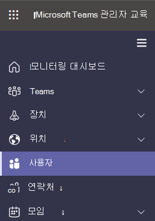

# Microsoft Teams의 초대에 포함된 전화 번호 설정

Microsoft 365 및 Office 365 오디오 회의를 사용하면 조직의 사용자가 Microsoft Teams 모임을 만든 다음 사용자가 전화 번호를 사용하여 해당 모임에 전화를 걸 수 있습니다.

회의 브리지는 조직의 전화 접속 전화 번호 집합을 제공합니다. 모임 이끌이가 만든 모임에 참가하는 데 모두 사용할 수 있지만 모임 초대에 포함할 모임을 선택할 수 있습니다.

모임 이끌이의 모임 초대에 포함된 전화 번호 외에도 모임에 참가하는 데 사용할 수 있는 모든 전화 접속 전화 번호의 전체 목록을 여는 링크가 각 모임 초대의 맨 아래에 있습니다.

> [!NOTE]
> [!INCLUDE [updating-admin-interfaces](includes/updating-admin-interfaces.md)]

## 사용자의 모임 초대에 포함된 전화 번호의 초기 할당

오디오 회의를 사용하도록 설정된 사용자의 모임 초대에 포함된 전화 번호는 사용자에게 할당된 *TeamsAudioConferencingPolicy* 에 정의되어 있습니다. *TeamsAudioConferencingPolicy* 가 사용자에게 할당되면 정책에 추가된 모든 수신자 부담 전화 번호와 무료 전화 번호가 해당 정책을 가진 사용자의 모임 초대에 포함됩니다. 사용자에게 *TeamsAudioConferencingPolicy* 가 할당되어 있고 요금 또는 무료 전화 번호가 정책에 추가되지 않은 경우 이러한 사용자의 모임 초대에 표시되는 전화 번호는 각 개별 사용자의 설정에서 기본 회의 유료 전화 번호 및 기본 회의 무료 전화 번호로 정의됩니다.

> [!NOTE]
> 사용자의 *TeamsAudioConferencingPolicy* 에 추가된 수신자 또는 무료 전화 번호는 기본 회의 유료 전화 번호 및 사용자 설정의 기본 회의 무료 전화 번호를 사용하여 개별적으로 설정된 전화 번호보다 우선합니다.

위에서 설명한 것처럼 각 모임 초대에는 전화 번호 외에도 지정된 모임에 참가하는 데 사용할 수 있는 모든 전화 접속 전화 번호의 전체 목록을 여는 링크가 포함되어 있습니다.

> [!IMPORTANT]
> 할당된 전화 번호가 모임 초대에 표시되는 데 최대 24시간이 걸릴 수 있습니다. 업데이트된 번호가 표시되지 않는 경우 지원에 문의하기 전에 최소 24시간 동안 기다려 주세요.

### 새 사용자

새 사용자를 위한 모임 초대에 포함된 유료 및 무료 전화 번호는 해당 사용자에게 할당된 *TeamsAudioconferencingPolicy* 에 의해 정의됩니다. 기본적으로 모든 새 사용자에게는 Global *TeamsAudioconferencingPolicy가* 할당됩니다. 전역 정책에는 전화 번호가 추가되지 않습니다(테넌트 관리자가 변경하지 않는 한). 이 경우 오디오 회의를 사용하도록 설정된 사용자의 모임 초대에 포함된 전화 번호는 기본 회의 유료 전화 번호와 각 사용자의 설정에 있는 기본 회의 무료 전화 번호로 정의됩니다.

새 사용자의 경우 사용자가 오디오 회의 서비스에 대해 사용하도록 설정된 경우 사용자의 Microsoft 365 관리 센터에 설정된 사용 위치에 따라 기본 회의 통행료 번호가 할당됩니다. 전화 회의 브리지에 사용자의 국가와 일치하는 통행료 번호가 있는 경우 해당 번호는 사용자의 기본 통행료 번호로 자동으로 할당됩니다. 전화 회의 브리지의 기본 통행료 번호로 정의된 번호가 없는 경우 사용자의 기본 통행료 번호로 할당됩니다.  

사용자가 오디오 회의 서비스에 대해 사용하도록 설정되면 테넌트 관리자가 필요에 따라 초기 값에서 사용자의 기본 통행료 및 무료 전화 번호를 변경할 수 있습니다.

## *TeamsAudioConferencingPolicy* cmdlet을 사용하여 Powershell에서 사용자의 기본 오디오 회의 전화 번호 설정 또는 변경

[유료 및 무료 번호에 대한 오디오 회의 정책 설정을](audio-conferencing-toll-free-numbers-policy.md) 참조하세요.

## 모임 이끌이 또는 사용자의 기본 오디오 회의 전화 번호를 개별적으로 설정하거나 변경합니다.

이러한 정책을 관리하려면 전역 관리자 또는 Teams 서비스 관리자여야 합니다. 관리 역할 및 사용 권한 가져오기에 대한 내용은 [Teams 관리자 역할 사용](./using-admin-roles.md)을 참조하세요.

1. Microsoft Teams 관리 센터에 로그인합니다.

2. 왼쪽 탐색 영역에서 **사용자를** 클릭합니다.

    

3. 사용 가능한 사용자 목록에서 사용자 이름을 클릭합니다.

4. **오디오 회의** 옆에 있는 **편집** 을 클릭합니다.

    

5. **수신자 번호** 또는 **무료 번호** 필드를 사용하여 사용자의 번호를 입력합니다.

> [!IMPORTANT]
> 사용자의 오디오 회의 설정을 변경하는 경우 되풀이 및 향후 Microsoft Teams 모임을 업데이트하고 참석자에게 보내야 합니다.

> [!NOTE]
> 이 설정에 입력된 전화 번호는 사용자에게 할당된 *TeamsAudioConferencingPolicy* 에 전화 번호가 추가되지 않은 경우에만 사용됩니다.

## Windows PowerShell 사용하려는 경우

Windows PowerShell 사용자를 관리하는 것과 사용자가 허용되거나 허용되지 않는 작업을 관리하는 것입니다. Windows PowerShell 사용하면 여러 작업을 수행할 때 일상적인 작업을 간소화할 수 있는 단일 관리 지점을 사용하여 Microsoft 365 또는 Office 365 관리할 수 있습니다. Windows PowerShell 시작하려면 다음 항목을 참조하세요.

- [Office 365 PowerShell을 사용해야 하는 이유](/microsoft-365/enterprise/why-you-need-to-use-microsoft-365-powershell)

- [Windows PowerShell 사용하여 Microsoft 365 또는 Office 365 관리하는 가장 좋은 방법](/previous-versions//dn568025(v=technet.10))

[Microsoft Teams PowerShell](/powershell/module/teams/?view=teams-ps)을 사용하여 모임 이끌이 또는 사용자의 기본 오디오 회의 전화 번호를 설정하거나 변경하려면 [Set-CsOnlineDialInConferencingUser](/powershell/module/skype/set-CsOnlineDialInConferencingUser?view=skype-ps) cmdlet의 매개 변수를 **`TollFreeServiceNumber`** 사용 가능한 숫자 중 하나로 설정합니다 **`ServiceNumber`**.

## 관련 주제

[Microsoft Teams용 Microsoft 365에서 오디오 회의 체험 또는 구매](try-or-purchase-audio-conferencing-in-office-365-for-teams.md)

[오디오 회의 브리지에서 전화 번호 변경](change-the-phone-numbers-on-your-audio-conferencing-bridge.md)
