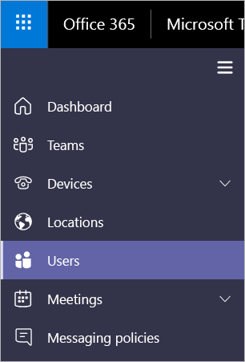

# 통화 분석 설정

팀 또는 비즈니스용 Skype Online 관리자는 통화 분석을 사용 하 여 비즈니스용 Skype 및 Microsoft 팀 통화 품질 및 연결 문제를 해결할 수 있습니다. 통화 분석에서 다음 기능을 설정 하는 것이 유용할 수 있습니다.
  
- 헬프 데스크 지원 상담원 등의 다른 담당자가 통화 분석을 사용할 수 있도록 하는 권한을 설정 하 되, 나머지 Microsoft 팀 관리 센터에는 액세스 하지 못하도록 합니다. 
    
- Tsv 또는 .csv 데이터 파일을 업로드 하 여 분석을 호출 하는 데 빌드, 사이트 및 테 넌 트 정보를 추가 합니다.
    
**이제 Microsoft 팀 관리 센터에서 통화 분석을 사용할 수**있습니다. 사용자의 모든 통화 정보 및 데이터를 보려면 **통화 기록** 탭을 사용 합니다. 이 작업을 수행 하려면 다음 중 하나를 수행 하 여 사용자의 프로필 페이지를 살펴봅니다.

- 대시보드에서 사용자를 검색 합니다.
  
   

-  왼쪽 탐색 모음에서 **사용자** 를 선택 합니다.

   
  
## 통화 분석 권한 설정

관리자는 통화 분석의 모든 기능에 대 한 모든 권한이 있습니다. 또한 지원 직원에 게 Azure Active Directory 역할을 할당할 수 있습니다. 통화 분석을 제한 된 보기를 사용 해야 하는 사용자에 게 팀 의사 소통 지원 전문가 역할을 배정 합니다. 통화 분석의 전체 기능에 대 한 액세스 권한이 필요한 사용자에 게 팀 의사 소통 지원 엔지니어 역할을 할당 합니다. 두 사용 권한 수준 모두에서 나머지 Microsoft 팀 관리 센터에 대 한 액세스를 방지 합니다.

> [!NOTE]
> 커뮤니케이션 지원 전문가 역할은 계층 1 지원과 같으며 통신 지원 엔지니어 역할은 계층 2 지원과 동일 합니다.

팀 관리자 역할에 대 한 자세한 내용은 [Microsoft 팀 관리자 역할을 사용 하 여 팀 관리](using-admin-roles.md)를 참조 하세요. 
  
통신 지원 전문가는 기본 통화 품질 문제를 처리 합니다. 모임 관련 문제를 조사 하지 않습니다. 그 대신 관련 정보를 수집한 다음 통신 지원 엔지니어로 승격 합니다. 통신 지원 엔지니어가 통신 지원 전문가에 게 서 숨겨진 자세한 콜 로그의 정보를 확인 합니다. 다음 표에서는 통화 분석을 사용할 때 통신 지원 엔지니어가 제공 하는 정보에 대 한 개요를 제공 합니다.

|**작동이**|**통화 분석의 정보**|**통신 지원 전문가가 볼 수 있는 기능**|**통신 지원 엔지니어가 볼 수 있는 기능**|
|:-----|:-----|:-----|:-----|
|**전화가**   |발신자 이름    |에이전트에서 검색 한 사용자의 이름만    |사용자 이름입니다.    |
||받는 사람 이름    |내부 사용자 또는 외부 사용자로 표시 됩니다.    |받는 사람 이름입니다.    |
||발신자 전화 번호    |마지막 세 자리 숫자를 제외한 전체 전화 번호는 별표 기호로 난독 처리 됩니다. 예를 들어 15552823 * * *.    |마지막 세 자리 숫자를 제외한 전체 전화 번호는 별표 기호로 난독 처리 됩니다. 예를 들어 15552823 * * *.    |
||받는 사람 전화 번호    |마지막 세 자리 숫자를 제외한 전체 전화 번호는 별표 기호로 난독 처리 됩니다. 예를 들어 15552823 * * *.    |마지막 세 자리 숫자를 제외한 전체 전화 번호는 별표 기호로 난독 처리 됩니다. 예를 들어 15552823 * * *.    |
||**통화 정보** > **고급** 탭   |정보가 표시 되지 않습니다.    |표시 되는 모든 정보 (예: 장치 이름, IP 주소, 서브넷 매핑 등)    |
||**통화 정보** > **고급** > **디버그** 탭   |정보가 표시 되지 않습니다.    |DNS 접미사 및 SSID와 같이 표시 되는 모든 정보    |
|**모임**   |참가자 이름    |에이전트에서 검색 한 사용자의 이름만 다른 참가자가 내부 사용자 또는 외부 사용자로 식별 되었습니다.    |모든 이름이 표시 됩니다.    |
||참가자 수    |참가자 수입니다.    |참가자 수입니다.    |
||세션 정보    |세션 정보가 예외와 함께 표시 됩니다. 에이전트가 검색 한 사용자의 이름만 표시 됩니다. 다른 참가자가 내부 사용자 또는 외부 사용자로 식별 되었습니다. 별표 기호로 난독 처리 된 전화 번호의 마지막 세 자리입니다.    |세션 정보가 표시 됩니다. 사용자 이름 및 세션 정보가 표시 됩니다. 별표 기호로 난독 처리 된 전화 번호의 마지막 세 자리입니다.    |
||||
   
 ### 관리자 역할을 할당 하 여 사용 권한 설정

Azure Active Directory에서 관리 역할을 할당 하는 방법에 대 한 자세한 내용은 [Azure Active directory에서 역할 보기 및 지정](https://docs.microsoft.com/en-us/azure/active-directory/users-groups-roles/directory-manage-roles-portal)을 참조 하세요.

## Tsv 또는 .csv 파일을 업로드 하 여 빌드, 사이트 및 테 넌 트 정보 추가

.Csv 또는 tsv 파일을 업로드 하 여 호출 분석에 빌드, 사이트 및 테 넌 트 정보를 추가할 수 있습니다. 모든 정보를 포함 하 여, Call Analytics는 IP 주소를 실제 위치로 매핑할 수 있습니다. 사용자 또는 헬프데스크 상담원은 통화 문제를 파악 하는 데 도움이 되는이 정보를 찾을 수 있습니다. 예를 들어 동일한 건물에 비슷한 통화 품질 문제가 있는 사용자가 많은 경우 

팀과 비즈니스용 Skype 관리자 인 경우 팀 & 비즈니스용 Skype 통화 품질 대시보드를 사용 하 여 기존 데이터 파일을 사용할 수 있습니다. 먼저 통화 품질 대시보드에서 파일을 다운로드 한 다음이를 통화 분석에 업로드 합니다. 

- 기존 데이터 파일을 다운로드 하려면 **Microsoft 팀 관리 센터** > 에서**지금 업로드****대시보드로** > 이동 합니다. **내 업로드** 목록에서 원하는 파일 옆에 있는 **다운로드** 를 클릭 합니다.

- 새 파일을 업로드 하려면 **Microsoft 팀 관리 센터** > **위치로**이동한 다음 **위치 데이터 업로드** 또는 **위치 데이터 바꾸기를**선택 합니다.
  
Tsv 또는 .csv 파일을 처음부터 만드는 경우에는 [테 넌 트 데이터 파일 형식 및 빌드 데이터 파일 구조](turning-on-and-using-call-quality-dashboard.md#BKMKTenantDataFile)를 참조 하세요.
  
## 관련 항목

[통화 분석을 사용하여 통화 품질 저하 문제 해결](use-call-analytics-to-troubleshoot-poor-call-quality.md)

[통화 분석 및 통화 품질 대시보드](difference-between-call-analytics-and-call-quality-dashboard.md)

  
 
