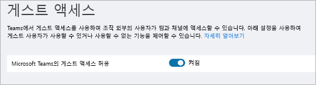

Microsoft Teams에 대한 게스트 액세스 켜기 또는 끄기Turn on or turn off guest access to Microsoft Teams
===================================================

기본적으로 게스트 액세스 기능은 꺼져있습니다.By default, guest access is turned off. Microsoft 365 또는 Office 365 관리자는 관리자 또는 팀 소유자가 게스트를 추가할 수 있으려면 먼저 팀에 대 한 게스트 액세스를 설정 해야 합니다.As the Microsoft 365 or Office 365 admin, you must turn on guest access for Teams before the admin or team owners can add guests. 게스트 액세스를 켜기 위해서는 [게스트 액세스 검사 목록](guest-access-checklist.md)을 사용하세요.To turn on guest access, use the [Guest access checklist](guest-access-checklist.md). 

게스트 액세스를 설정한 후 변경 내용이 적용 되는 데 몇 시간이 걸릴 수 있습니다.After you turn on guest access, it may take a few hours for the changes to take effect. 사용자가 팀에 게스트를 추가하려고 할 때 "관리자에게 문의하세요."라는 메시지가 표시되면 게스트 액세스가 켜지지 않았거나 설정이 아직 적용되지 않았을 가능성이 큽니다.If a user sees the message "Contact your administrator" when they try to add a guest to their team, it's likely that either guest access hasn't been turned on or the settings aren't effective yet.

> [!IMPORTANT]
> 게스트 액세스를 설정 하는 것은 Azure Active Directory, Microsoft 365 또는 Office 365, SharePoint Online, 팀의 설정에 따라 달라 집니다.Turning on guest access depends on settings in Azure Active Directory, Microsoft 365 or Office 365, SharePoint Online, and Teams. 자세한 내용은 [Team에서 게스트 액세스 권한 부여하기](Teams-dependencies.md)를 참조하세요.For more information, see [Authorize guest access in Teams](Teams-dependencies.md).

## Teams 관리 센터에서 게스트 액세스 구성하기Configure guest access in the Teams admin center

1. Microsoft Teams 관리 센터에 로그인합니다.Sign in to the Microsoft Teams admin center.

2. **조직 전체 설정** > **게스트 액세스**를 선택합니다.Select **Org-wide settings** > **Guest access**.

3. **Microsoft Teams에서 게스트 액세스 허용**을 **켬**으로 설정합니다.Set **Allow guest access in Microsoft Teams** to **On**.

    

4. **통화**, **모임**, **메시징**에서 게스트 사용자에게 허용할 항목에 따라 각 기능에 대한 **켬** 또는 **끔**를 선택합니다.Under **Calling**, **Meeting**, and **Messaging**, select **On** or **Off** for each capability, depending on what you want to allow for guest users.

      - **개인 전화 걸기** – 게스트가 피어 투 피어 전화를 걸 수 있도록 허용하려면 이를 **켬**으로 설정합니다.**Make private calls** – Turn this setting **On** to allow guests to make peer-to-peer calls.
      - **IP 비디오 허용** - 게스트가 통화 및 모임에서 비디오를 사용하도록 허용하려면 이를 **켬**으로 설정합니다.**Allow IP video** - Turn this setting **On** to allow guests to use video in their calls and meetings.
      - **화면 공유 모드** – 이 설정은 게스트 사용자에 대한 화면 공유 가용성을 제어합니다.**Screen sharing mode** – This setting controls the availability of screen sharing for guest users. 
          - 게스트가 Teams에서 화면을 공유할 수 있는 기능을 제거하려면 이 설정을 **사용 안 함**으로 설정합니다.Turn this setting to **Disabled** to remove the ability for guests to share their screens in Teams. 
          - 개별 응용 프로그램을 공유하도록 허용하려면 이 설정을 **단일 응용 프로그램**으로 설정합니다.Turn this setting to **Single application** to allow sharing of individual applications. 
          - 전체 화면 공유를 허용하려면 이 설정을 **전체 화면**으로 설정합니다.Turn this setting to **Entire screen** to allow complete screen sharing.
      - **모임 시작 허용** – 게스트가 Microsoft Teams에서 모임 시작 기능을 사용하도록 허용하려면 이를 **켬**으로 설정합니다.**Allow Meet Now** – Turn this setting **On** to allow guests to use the Meet Now feature in Microsoft Teams.
      - **보낸 메시지 편집** - 게스트가 이전에 보낸 메시지를 편집할 수 있도록 허용하려면 이를 **켬**으로 설정합니다.**Edit sent messages** - Turn this setting **On** to allow guests to edit messages they previously sent.
      - **게스트가 보낸 메시지를 삭제할 수 있음** – 게스트가 이전에 보낸 메시지를 삭제할 수 있도록 허용하려면 이를 **켬**으로 설정합니다.**Guests can delete sent messages** – Turn this setting **On** to allow guests to delete messages they previously sent.
      - **채팅** – 게스트가 Teams에서 채팅을 사용할 수 있도록 허용하려면 이를 **켬**으로 설정합니다.**Chat** – Turn this setting **On** to give guests the ability to use chat in Teams.
      - **대화에서 Giphys 사용** - 게스트가 대화에서 Giphys를 사용할 수 있도록 허용하려면 이를 **켬**으로 설정합니다.**Use Giphys in conversations** – Turn this setting **On** to allow guests to use Giphys in conversations. Giphy는 사용자가 애니메이션 GIF 파일을 검색하고 공유할 수 있는 온라인 데이터베이스 및 검색 엔진입니다.Giphy is an online database and search engine that allows users to search for and share animated GIF files. 각 Giphy에는 콘텐츠 등급이 할당됩니다.Each Giphy is assigned a content rating.
      - **Giphy 콘텐츠 등급** – 드롭다운 목록에서 등급을 선택합니다.**Giphy content rating** –  Select a rating from the drop-down list:
          - **모든 콘텐츠 허용** - 게스트는 콘텐츠 등급과 상관없이 모든 Giphy를 채팅에 삽입할 수 있습니다.**Allow all content** - Guests will be able to insert all Giphys in chats, regardless of the content rating.
          - **보통** - 게스트는 채팅에 Giphy를 삽입할 수 있지만 성인용 콘텐츠는 보통으로 제한됩니다.**Moderate** - Guests will be able to insert Giphys in chats, but will be moderately restricted from adult content.
          - **엄격** - 게스트는 채팅에 Giphy를 삽입할 수 있지만 성인용 콘텐츠 삽입은 제한됩니다.**Strict** – Guests will be able to insert Giphys in chats, but will be restricted from inserting adult content.
      - **대화에서 밈 사용** - 게스트가 대화에서 밈을 사용할 수 있도록 허용하려면 이를 **켬**으로 설정합니다.**Use memes in conversations** - Turn this setting **On** to allow guests to use Memes in conversations.
      - **대화에서 스티커 사용** – 게스트가 대화에서 스티커를 사용할 수 있도록 허용하려면 이를 **켬**으로 설정합니다.**Use Stickers in conversations** – Turn this setting **On** to allow guests to use stickers in conversations. 

5. **저장**을 클릭합니다.Click **Save**.

## PowerShell을 사용하여 게스트 액세스 켜기 또는 끄기Use PowerShell to turn guest access on or off

[PowerShell을 사용하여 게스트 액세스 켜기 또는 끄기](guest-access-PowerShell.md#use-powershell-to-turn-guest-access-on-or-off) 참조하기Read [Use PowerShell to turn guest access on or off](guest-access-PowerShell.md#use-powershell-to-turn-guest-access-on-or-off)

## 비디오: Teams에서 게스트 추가하기Video: Adding guests in Teams

|  |  |
|---------|---------|
| Microsoft Teams에서 게스트 추가하기Adding Guests in Microsoft Teams   | <iframe width="350" height="200" src="https://www.youtube.com/embed/1daMBDyBLZc" frameborder="0" allowfullscreen></iframe>   | 

## 외부 액세스(페더레이션) 대 게스트 액세스External access (federation) vs. guest access

[!INCLUDE [guest-vs-external-access](includes/guest-vs-external-access.md)]