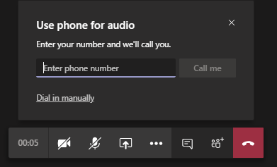

# 사용자에 게 전화 걸기 기능 설정Set up the Call me feature for your users

Microsoft 팀에서 전화 **걸기** 기능을 통해 사용자는 휴대폰으로 모임의 오디오 부분에 참가할 수 있습니다.In Microsoft Teams, the **Call me** feature gives users a way to join the audio portion of a meeting by phone. 이 방법은 오디오를 사용 하는 것이 불가능할 수 있는 시나리오에서 유용 합니다.This is handy in scenarios when using a computer for audio might not be possible. 사용자는 휴대폰 또는 육지 모임의 오디오 부분을 받고 다른 모임 참가자가 화면을 공유 하거나 컴퓨터를 통해 비디오&mdash;&mdash;를 재생할 때 모임의 콘텐츠 부분을 사용할 수 있습니다.Users get the audio portion of the meeting through their cell phone or land line and the content portion of the meeting&mdash;such when another meeting participant shares their screen or plays a video&mdash;through their computer.

## 사용자 환경The user experience

### 오디오 용 전화를 사용 하 여 모임 참가Join a meeting by using phone for audio

**참가** 를 클릭 하 여 모임에 참가 한 다음 **오디오 및 비디오 설정 선택** 화면에서 **전화 오디오** 를 클릭 합니다.Click **Join** to join a meeting, and then click **Phone audio** on the  **Choose your audio and video settings** screen. 여기서는 사용자가 모임 통화를 진행 하 고 참가 하거나 수동으로 모임에 전화를 걸 수 있습니다.From here, users can have the meeting call and join them or dial in manually to the meeting.

**팀 모임 통화 허용****Let the Teams meeting call**

**오디오 용 전화 사용** 화면에서 사용자가 전화 번호를 입력 한 다음 전화를 클릭 합니다 \*\*\*\*.On the **Use phone for audio** screen, the user enters their phone number, and then clicks **Call me**. 모임이 사용자에 게 전화를 걸고 모임에 참가 합니다.The meeting calls the user and joins them to the meeting.

**수동으로 전화 접속****Dial in manually**

참가 하는 또 다른 방법은 모임에 직접 전화 접속 하는 것입니다.Another way to join is to dial in directly to the meeting. **오디오 용 전화 사용** 화면에서 **수동으로 전화 접속** 을 클릭 하 여 모임에 전화를 걸 때 사용할 전화 번호 목록을 가져옵니다.On the **Use phone for audio** screen, click **Dial in manually** to get a list of phone numbers to use to dial in to the meeting.

### 모임 중 오디오에 문제가 있는 경우 다시 전화 받기Get a call back when something goes wrong with audio during a meeting

사용자가 모임 중에 컴퓨터를 사용할 때 오디오 문제가 발생 하는 경우 사용자는 오디오를 사용 하 여 쉽게 전환할 수 있습니다.If a user experiences audio issues when using their computer during a meeting, the user can easily switch to using their phone for audio. 팀은 오디오 또는 장치 문제가 발생 하는 경우를 감지 하 고 사용자에 게 콜백 옵션을 \*\*\*\* 표시 하 여 전화를 사용 하도록 리디렉션합니다.Teams detects when an audio or device issue occurs and redirects the user to use their phone by displaying a **Call me back** option.

다음은 팀에서 마이크를 감지 하지 못하는 \*\*\*\* 경우 표시 되는 메시지 및 콜백 옵션의 예입니다.Here's an example of the message and the **Call me back** option that's displayed when Teams doesn't detect a microphone.

사용자가 **오디오를 사용** 하는 것을 전화 걸기 화면을 표시 하는 **me 뒤로**를 클릭 합니다.The user clicks **Call me back**, which brings up the **Use phone for audio** screen. 여기서는 전화 번호를 입력 하 고 팀이 통화를 하 여 모임에 참가 하거나 수동으로 모임에 전화를 걸 수 있습니다.From here, they can enter their phone number and have the Teams meeting call and join them to the meeting or dial in manually to the meeting.

## 전화 걸기 기능 설정Set up the Call me feature

조직의 사용자에 게 전화 걸기 기능을 사용 하도록 설정 하려면 다음을 구성 해야 합니다.To enable the Call me feature for users in your organization, the following must be configured:

- 모임을 예약 하는 조직의 사용자 (모임 이끌이)는 오디오 회의를 사용할 수 있습니다.Audio Conferencing is enabled for users in your organization who schedule meetings (meeting organizers). 자세한 내용은 팀 [에 대 한 오디오 회의 설정](set-up-audio-conferencing-in-teams.md) 및 [팀에서 사용자의 오디오 회의 설정 관리](manage-the-audio-conferencing-settings-for-a-user-in-teams.md)를 참조 하세요.To learn more, see [Set up Audio Conferencing for Teams](set-up-audio-conferencing-in-teams.md) and [Manage the Audio Conferencing settings for a user in Teams](manage-the-audio-conferencing-settings-for-a-user-in-teams.md).

- 사용자가 모임에서 전화를 걸 수 있습니다.Users can dial out from meetings. 자세히 알아보려면 [팀에서 사용자에 대 한 오디오 회의 설정 관리](manage-the-audio-conferencing-settings-for-a-user-in-teams.md)를 참조 하세요.To learn more, see [Manage the Audio Conferencing settings for a user in Teams](manage-the-audio-conferencing-settings-for-a-user-in-teams.md).

사용자가 모임에서 전화를 걸지 않은 경우 **call me** 옵션을 사용할 수 없으며 사용자가 모임에 참가 하는 전화를 받지 않습니다.If a user doesn't have dial out from meetings enabled, the **Call me** option isn't available and the user won't receive a call to join them to the meeting. 대신 사용자는 휴대폰에서 직접 전화 접속 하는 데 사용할 수 있는 **오디오 사용** 화면의 전화 번호 목록을 표시 합니다.Instead, the user sees a list of phone numbers on the **Use phone for audio** screen that they can use to dial in manually to the meeting on their phone.
