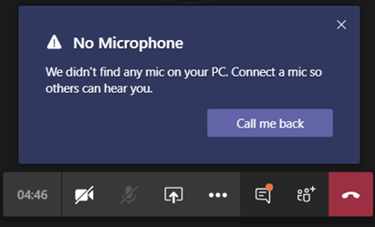

# 사용자의 전화 받기 기능 설정Set up the Call me feature for your users

Microsoft Teams에서  통화 기능을 사용하면 전화로 모임의 오디오 부분에 참가할 수 있습니다.In Microsoft Teams, the **Call me** feature gives users a way to join the audio portion of a meeting by phone. 이 시나리오는 오디오에 컴퓨터를 사용할 수 없는 경우 유용합니다.This is handy in scenarios when using a computer for audio might not be possible. 사용자는 다른 모임 참가자가 자신의 화면을 공유하거나 자신의 컴퓨터를 통해 비디오를 재생하는 경우와 같이 휴대폰이나 유선 전화 및 모임의 콘텐츠 부분을 통해 모임의 오디오 부분을 &mdash; &mdash; 얻습니다.Users get the audio portion of the meeting through their cell phone or land line and the content portion of the meeting&mdash;such as when another meeting participant shares their screen or plays a video&mdash;through their computer.

> [!IMPORTANT]
> 
> COVID-19 발생과 관련하여 경험한 대로 모임이 많은 기간에는 PSTN 회의 번호 또는 <strong>전화 번호</strong>를 사용해 전화를 거는 대신 <strong>Teams 모임 참가</strong> 버튼을 눌러 모임에 참석하는 것이 좋습니다.During periods of high meeting volume (which we've been experiencing in conjunction with the COVID-19 outbreak), we recommend that users join meetings by clicking the <strong>Join Teams Meeting</strong> button rather than dialing in by using the PSTN conference numbers or by using <strong>Call me at</strong>. 이러면 모임이 증가하여 PSTN 네트워크가 정체되는 시기에 오디오 품질을 유지할 수 있습니다.This helps ensure quality audio during times when high meeting volume is causing congestion on the PSTN network. 

> [!IMPORTANT]
> COVID-19 발생 기간에는 PSTN 회의 번호 또는 **전화 번호**</strong>를 사용해 전화를 거는 대신 **Teams 모임 참가** 버튼을 눌러 모임에 참석하는 것이 좋습니다.During the duration of the COVID-19 outbreak, we recommend that users join meetings by clicking the **Join Teams Meeting** button rather than dialing in by using the PSTN conference numbers or by using **Call me at**</strong>. 이는 주로 COVID-19의 영향을 받는 국가의 전화 통신 인프라의 혼잡 때문입니다.This is primarily because of congestion in the telephony infrastructures of countries impacted by COVID-19. PSTN 통화를 피하면 오디오 품질이 향상될 수 있습니다.By avoiding PSTN calls, you'll likely experience better audio quality. 

## 사용자 환경The user experience

### 오디오에 휴대폰을 사용하여 모임 참가Join a meeting by using phone for audio

**참가를** 클릭하여 모임에 참가한  다음 오디오 및 비디오 설정 선택 화면에서 전화 **오디오를** 클릭합니다.Click **Join** to join a meeting, and then click **Phone audio** on the  **Choose your audio and video settings** screen. 여기에서 사용자는 모임 전화를 걸고 모임에 참가하거나 모임에 수동으로 전화를 걸 수 있습니다.From here, users can have the meeting call and join them or dial in manually to the meeting.

**Teams 모임 전화 걸기****Let the Teams meeting call**

오디오 **화면용 전화** 사용 화면에서 사용자가 자신의 전화 번호를 입력한 다음 통화를 **클릭합니다.**On the **Use phone for audio** screen, the user enters their phone number, and then clicks **Call me**. 모임에서 사용자에게 전화를 걸고 모임에 참가합니다.The meeting calls the user and joins them to the meeting.

**수동으로 전화 접속****Dial in manually**

참가하는 또 다른 방법은 모임에 직접 전화를 걸 수 있는 것입니다.Another way to join is to dial in directly to the meeting. 오디오 **화면에서 전화** 접속을  수동으로 클릭하여 모임에 전화 접속하는 데 사용할 전화 번호 목록을 표시합니다.On the **Use phone for audio** screen, click **Dial in manually** to get a list of phone numbers to use to dial in to the meeting.

### 모임 중에 오디오에 문제가 있는 경우 다시 전화 걸기Get a call back when something goes wrong with audio during a meeting

사용자가 모임 중에 컴퓨터를 사용할 때 오디오 문제가 있는 경우 사용자는 오디오에 휴대폰을 사용하여 쉽게 전환할 수 있습니다.If a user experiences audio issues when using their computer during a meeting, the user can easily switch to using their phone for audio. Teams는 오디오 또는 장치 문제가 발생하는 경우를 감지하고 전화 걸기 옵션을 표시하여 사용자가 자신의 휴대폰을 사용할 수 있도록 **리디렉션합니다.**Teams detects when an audio or device issue occurs and redirects the user to use their phone by displaying a **Call me back** option.

다음은 Teams에서 마이크를 감지하지  못하면 표시되는 메시지 및 전화 걸기 옵션의 예입니다.Here's an example of the message and the **Call me back** option that's displayed when Teams doesn't detect a microphone.

사용자가 전화 걸기 **기능을 다시** 클릭하면 오디오 화면용 **휴대폰이** 나타납니다.The user clicks **Call me back**, which brings up the **Use phone for audio** screen. 여기에서 전화 번호를 입력하고 Teams 모임 통화를 하여 모임에 참가하거나 모임에 수동으로 전화를 걸 수 있습니다.From here, they can enter their phone number and have the Teams meeting call and join them to the meeting or dial in manually to the meeting.

## 전화 걸기 기능 설정Set up the Call me feature

조직의 사용자에 대해 전화 걸기 기능을 사용하도록 설정하려면 다음을 구성해야 합니다.To enable the Call me feature for users in your organization, the following must be configured:

- 모임(모임 이끌이)을 예약하는 조직의 사용자가 오디오 회의를 사용할 수 있습니다.Audio Conferencing is enabled for users in your organization who schedule meetings (meeting organizers). 자세한 내용은 [Teams에](set-up-audio-conferencing-in-teams.md) 대한 오디오 회의 설정 및 Teams에서 사용자의 오디오 회의 설정 [관리를 참조하세요.](manage-the-audio-conferencing-settings-for-a-user-in-teams.md)To learn more, see [Set up Audio Conferencing for Teams](set-up-audio-conferencing-in-teams.md) and [Manage the Audio Conferencing settings for a user in Teams](manage-the-audio-conferencing-settings-for-a-user-in-teams.md).

- 사용자는 모임에서 전화를 걸 수 있습니다.Users can dial out from meetings. 자세한 내용은 Teams에서 사용자의 오디오 회의 설정 관리를 [참조하세요.](manage-the-audio-conferencing-settings-for-a-user-in-teams.md)To learn more, see [Manage the Audio Conferencing settings for a user in Teams](manage-the-audio-conferencing-settings-for-a-user-in-teams.md).

사용자가 활성화된 모임에서 전화 접속을 하지  않은 경우 전화 걸기 옵션을 사용할 수 없습니다. 사용자는 모임에 참가하기 위한 전화를 받지 못합니다.If a user doesn't have dial out from meetings enabled, the **Call me** option isn't available and the user won't receive a call to join them to the meeting. 대신 오디오 화면의 사용 전화기에서 전화  번호 목록을 볼 수 있습니다. 이 목록은 전화기에서 모임에 수동으로 전화를 걸 때 사용할 수 있습니다.Instead, the user sees a list of phone numbers on the **Use phone for audio** screen that they can use to dial in manually to the meeting on their phone.
