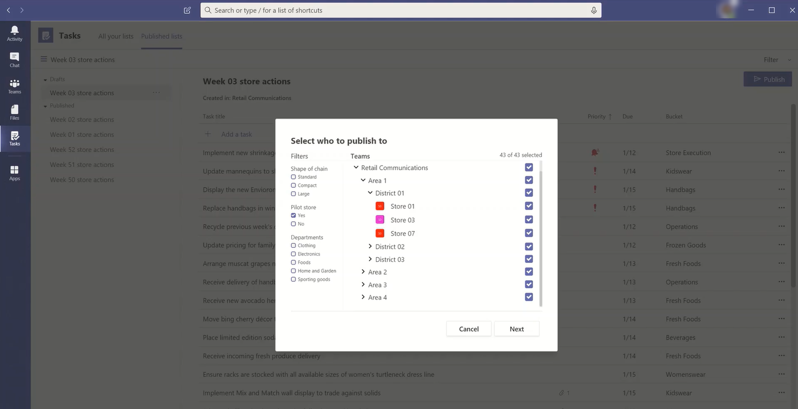
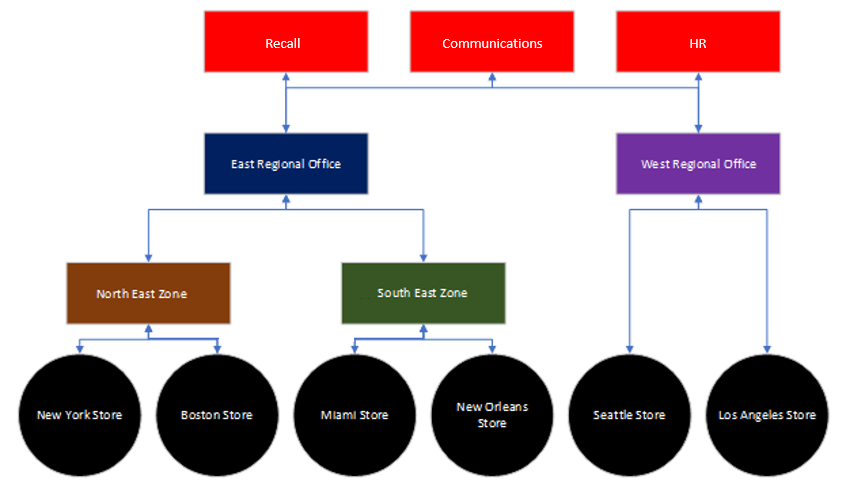

# <a name="set-up-your-team-targeting-hierarchy"></a><span data-ttu-id="bc5b8-103">팀 대상 계층 구조 설정</span><span class="sxs-lookup"><span data-stu-id="bc5b8-103">Set up your team targeting hierarchy</span></span>

> <span data-ttu-id="bc5b8-104">**이 기능은 현재 비공개 미리 보기로 제공됩니다.**</span><span class="sxs-lookup"><span data-stu-id="bc5b8-104">**This feature is currently in private preview.**</span></span>

<span data-ttu-id="bc5b8-105">조직에서 대규모 팀 집합에 콘텐츠를 게시하는 데 사용할 수 있는 팀 계층 구조를 만들하려면 팀 대상을 지정하는 팀을 설정해야 합니다.</span><span class="sxs-lookup"><span data-stu-id="bc5b8-105">To create a hierarchy of teams that can be used by your organization to publish content to a large set of teams, you need to set up your team targeting schema.</span></span> <span data-ttu-id="bc5b8-106">이마트는 계층 구조의 모든 팀이 서로 관련되는 방식과 팀을 필터링하는 데 사용할 수 있는 특성을 정의합니다.</span><span class="sxs-lookup"><span data-stu-id="bc5b8-106">The schema defines how all the teams in your hierarchy are related to each other and the attributes that can be used to filter your teams.</span></span> <span data-ttu-id="bc5b8-107">스마마를 만든 후 Teams에 업로드하면 계층 구조가 조직 전체에 적용됩니다.</span><span class="sxs-lookup"><span data-stu-id="bc5b8-107">After you create the schema, you upload it to Teams and the hierarchy is applied throughout your organization.</span></span> <span data-ttu-id="bc5b8-108">스마마가 업로드된 후 Teams 클라이언트 내의 앱에서 사용할 수 있습니다.</span><span class="sxs-lookup"><span data-stu-id="bc5b8-108">After the schema is uploaded, apps within the Teams client can use it.</span></span> 

> [!IMPORTANT]
> <span data-ttu-id="bc5b8-109">팀 또는 채널을 검색할 때 팀 계층 구조가 표시되지 않습니다.</span><span class="sxs-lookup"><span data-stu-id="bc5b8-109">You won't see a hierarchy of teams when you're browsing teams or channels within them.</span></span> <span data-ttu-id="bc5b8-110">팀의 계층 구조를 표시하려면 팀을 지원하는 앱을 사용해야 합니다.</span><span class="sxs-lookup"><span data-stu-id="bc5b8-110">To see the hierarchy of teams, you need to use an app that supports it.</span></span> <span data-ttu-id="bc5b8-111">초기 릴리스의 경우 작업 앱만 계층적 팀을 지원합니다.</span><span class="sxs-lookup"><span data-stu-id="bc5b8-111">For the initial release, only the Tasks app supports hierarchical teams.</span></span> <span data-ttu-id="bc5b8-112">이 문서의 나머지에서는 받는 사람 팀에 작업을 게시하는 컨텍스트에서 팀 계층 구조를 설정하는 데 대해 설명합니다.</span><span class="sxs-lookup"><span data-stu-id="bc5b8-112">The remainder of this article discusses setting up a team hierarchy in the context of publishing tasks to recipient teams.</span></span> <span data-ttu-id="bc5b8-113">팀 대상 계층 구조를 설정하기 전에 [Teams에서](manage-tasks-app.md) 조직의 작업 앱 관리에서 작업 게시 개요를 참조하세요.</span><span class="sxs-lookup"><span data-stu-id="bc5b8-113">Before you set up your team targeting hierarchy, see [Manage the Tasks app for your organization in Teams](manage-tasks-app.md) for an overview of task publishing.</span></span>

<span data-ttu-id="bc5b8-114">다음은 Teams의 작업 앱에서 계층 구조를 나타내는 방법의 예입니다.</span><span class="sxs-lookup"><span data-stu-id="bc5b8-114">Here's an example of how the hierarchy is represented in the Tasks app in Teams.</span></span> <span data-ttu-id="bc5b8-115">작업 목록을 만든 후 게시 팀의 구성원은 받는 사람 팀을 선택하여 작업 목록을 보내(게시)할 수 있습니다.</span><span class="sxs-lookup"><span data-stu-id="bc5b8-115">After a task list is created, members of the publishing team can then select the recipient teams to send (publish) the task list to.</span></span> <span data-ttu-id="bc5b8-116">팀을 선택할 때 게시 팀은 계층 구조, 특성 또는 둘의 조합을 통해 필터링할 수 있습니다.</span><span class="sxs-lookup"><span data-stu-id="bc5b8-116">When selecting teams, the publishing team can filter by hierarchy, by attributes, or a combination of both.</span></span><br>



## <a name="plan-your-hierarchy"></a><span data-ttu-id="bc5b8-118">계층 구조 계획</span><span class="sxs-lookup"><span data-stu-id="bc5b8-118">Plan your hierarchy</span></span>

<span data-ttu-id="bc5b8-119">계층 구조를 정의하는 스마마를 만들기 전에 몇 가지 계획을 세우고 조직을 구성할 방법을 결정해야 합니다.</span><span class="sxs-lookup"><span data-stu-id="bc5b8-119">Before you create the schema that defines your hierarchy, you need to do some planning and decide how you want to shape your organization.</span></span> <span data-ttu-id="bc5b8-120">여기에는 작업을 다른 그룹에 게시해야 하는 조직 그룹 결정이 포함됩니다.</span><span class="sxs-lookup"><span data-stu-id="bc5b8-120">This includes deciding which organizational groups need to publish tasks to other groups.</span></span> <span data-ttu-id="bc5b8-121">계층 구조의 각 노드는 작업 그룹 또는 그룹 그룹을 나타냅니다.</span><span class="sxs-lookup"><span data-stu-id="bc5b8-121">Each node in the hierarchy represents a working group or group of groups.</span></span> <span data-ttu-id="bc5b8-122">계층 구조의 아래쪽에 있는 노드(자식이 없는 노드)는 작업을 받을 수 있는 팀인 반면 다른 노드(부모)는 작업을 아래쪽으로 게시할 수 있는 권한이 있는 조직 그룹입니다.</span><span class="sxs-lookup"><span data-stu-id="bc5b8-122">Nodes at the bottom of the hierarchy (those without children) are teams that can receive tasks while other nodes (parents) are organizational groups with permission to publish tasks downward.</span></span> <span data-ttu-id="bc5b8-123">팀은 계층 구조에서 한 번만 표현할 수 있습니다.</span><span class="sxs-lookup"><span data-stu-id="bc5b8-123">A team can only be represented one time in the hierarchy.</span></span>

<span data-ttu-id="bc5b8-124">예를 들어 다음 계층 구조에서 Recall, Retail Communications 및 HR은 계층 구조의 모든 아래쪽 노드(팀)에 작업을 게시할 수 있는 반면, North East Zone은 뉴욕 스토어 및 보스턴 스토어 팀에만 작업을 게시할 수 있습니다.</span><span class="sxs-lookup"><span data-stu-id="bc5b8-124">For example, in the following hierarchy, Recall, Retail Communications, and HR, can publish tasks to every bottom node (team) in the hierarchy, whereas North East Zone can only publish tasks to the New York Store and Boston Store teams.</span></span> <span data-ttu-id="bc5b8-125">이 계층 구조를 사용하면 회수, 소매 통신 및 HR 그룹에서 CEO의 혜택 정보 또는 메시지와 같이 회사 전체에 적용되는 작업을 게시할 수 있습니다.</span><span class="sxs-lookup"><span data-stu-id="bc5b8-125">This hierarchy allows the Recall, Retail Communications, and HR groups to publish tasks that apply to the entire company, such as benefits information or messages from the CEO.</span></span> <span data-ttu-id="bc5b8-126">북동부 영역은 직원 일기 예보, 날씨 정보 등의 작업을 뉴욕 스토어 및 보스턴 스토어 팀에만 게시할 수 있습니다.</span><span class="sxs-lookup"><span data-stu-id="bc5b8-126">North East Zone can publish tasks, such as personnel scheduling, weather information, and so on, only to the New York Store and Boston Store teams.</span></span>



## <a name="create-your-hierarchy"></a><span data-ttu-id="bc5b8-128">계층 구조 만들기</span><span class="sxs-lookup"><span data-stu-id="bc5b8-128">Create your hierarchy</span></span>

<span data-ttu-id="bc5b8-129">계층 구조를 정의하는 스마는 CSV(콤마로 구분된 값) 파일을 기반으로 합니다.</span><span class="sxs-lookup"><span data-stu-id="bc5b8-129">The schema that defines your hierarchy is based on a comma-separated values (CSV) file.</span></span> <span data-ttu-id="bc5b8-130">CSV 파일의 각 행은 팀 계층 구조 내의 한 노드에 해당합니다.</span><span class="sxs-lookup"><span data-stu-id="bc5b8-130">Each row in the CSV file corresponds to one node within the hierarchy of teams.</span></span> <span data-ttu-id="bc5b8-131">각 행에는 계층 구조 내의 노드 이름을 입력하고, 선택적으로 팀에 연결하며, 이를 지원하는 앱에서 팀을 필터링하는 데 사용할 수 있는 특성이 포함되어 있습니다.</span><span class="sxs-lookup"><span data-stu-id="bc5b8-131">Each row contains information that names the node within the hierarchy, optionally links it to a team, and includes attributes that can be used to filter teams in apps that support it.</span></span>

<span data-ttu-id="bc5b8-132">또한 게시 팀이 받는 사람 팀에 전송된 콘텐츠를 구성하는 데 사용할 수 있는 범주인 버킷을 정의하여 관련 콘텐츠를 더 쉽게 보고, 정렬하고, 집중할 수 있습니다.</span><span class="sxs-lookup"><span data-stu-id="bc5b8-132">You can also define buckets, which are categories that the publishing team can use to organize content sent to recipient teams to make it easier for them to view, sort, and focus on relevant content.</span></span>

### <a name="add-required-columns"></a><span data-ttu-id="bc5b8-133">필요한 열 추가</span><span class="sxs-lookup"><span data-stu-id="bc5b8-133">Add required columns</span></span>

<span data-ttu-id="bc5b8-134">CSV 파일에는 첫 번째 열부터 다음 세 개의 열이 다음 순서대로 포함되어야 합니다.</span><span class="sxs-lookup"><span data-stu-id="bc5b8-134">The CSV file must contain the following three columns, in the following order, starting at the first column.</span></span> <span data-ttu-id="bc5b8-135">태스크를 수신하려면 노드를 팀에 연결해야 합니다.</span><span class="sxs-lookup"><span data-stu-id="bc5b8-135">A node must be linked to a team for it to receive tasks.</span></span> <span data-ttu-id="bc5b8-136">비공개 미리 보기 중에는 2,000개 노드가 지원됩니다.</span><span class="sxs-lookup"><span data-stu-id="bc5b8-136">During private preview, we support 2,000 nodes.</span></span> <span data-ttu-id="bc5b8-137">시작 시 기본적으로 15,000개 이상의 노드를 지원할 것으로 예상됩니다.</span><span class="sxs-lookup"><span data-stu-id="bc5b8-137">At launch, we expect to support at least 15,000 nodes by default.</span></span> <span data-ttu-id="bc5b8-138">더 큰 조직에 대해 이 제한을 높이기 위해 고객과 협력할 계획입니다.</span><span class="sxs-lookup"><span data-stu-id="bc5b8-138">We plan to work with customers to raise this limit for larger organizations.</span></span>

| <span data-ttu-id="bc5b8-139">열 이름</span><span class="sxs-lookup"><span data-stu-id="bc5b8-139">Column name</span></span>   | <span data-ttu-id="bc5b8-140">필수</span><span class="sxs-lookup"><span data-stu-id="bc5b8-140">Required</span></span> | <span data-ttu-id="bc5b8-141">설명</span><span class="sxs-lookup"><span data-stu-id="bc5b8-141">Description</span></span>   |
----------------|----------|---------------|
| <span data-ttu-id="bc5b8-142">TargetName</span><span class="sxs-lookup"><span data-stu-id="bc5b8-142">TargetName</span></span>    | <span data-ttu-id="bc5b8-143">예</span><span class="sxs-lookup"><span data-stu-id="bc5b8-143">Yes</span></span>      | <span data-ttu-id="bc5b8-144">노드의 이름입니다.</span><span class="sxs-lookup"><span data-stu-id="bc5b8-144">This is the name of the node.</span></span> <span data-ttu-id="bc5b8-145">이름은 최대 100자까지 사용할 수 있으며 A-Z, a-z 및 0-9 문자만 포함할 수 있습니다.</span><span class="sxs-lookup"><span data-stu-id="bc5b8-145">The name can be up to 100 characters long and contain only the characters A-Z, a-z, and 0-9.</span></span> <span data-ttu-id="bc5b8-146">노드 이름은 고유해야 합니다.</span><span class="sxs-lookup"><span data-stu-id="bc5b8-146">Node names must be unique.</span></span> |
| <span data-ttu-id="bc5b8-147">ParentName</span><span class="sxs-lookup"><span data-stu-id="bc5b8-147">ParentName</span></span>    | <span data-ttu-id="bc5b8-148">예</span><span class="sxs-lookup"><span data-stu-id="bc5b8-148">Yes</span></span>       | <span data-ttu-id="bc5b8-149">부모 노드의 이름입니다.</span><span class="sxs-lookup"><span data-stu-id="bc5b8-149">This is the name of the parent node.</span></span> <span data-ttu-id="bc5b8-150">여기서 지정한 값은 부모 노드의 TargetName 필드 값과 정확히 일치해야 합니다.</span><span class="sxs-lookup"><span data-stu-id="bc5b8-150">The value you specify here must match the value in the TargetName field of the parent node exactly.</span></span> <span data-ttu-id="bc5b8-151">두 개 이상의 부모 노드를 추가하려는 경우 각 부모 노드 이름을 세미코론(;).</span><span class="sxs-lookup"><span data-stu-id="bc5b8-151">If you want to add more than one parent node, separate each parent node name with a semicolon (;).</span></span> <span data-ttu-id="bc5b8-152">최대 25개 부모 노드를 추가할 수 있으며 각 부모 노드 이름은 최대 2500자까지 입력할 수 있습니다.</span><span class="sxs-lookup"><span data-stu-id="bc5b8-152">You can add up to 25 parent nodes, and each parent node name can be up to 2500 characters long.</span></span> <span data-ttu-id="bc5b8-153">노드는 부모 노드가 루트 노드인 경우 여러 부모 노드를 사용할 수 있습니다.</span><span class="sxs-lookup"><span data-stu-id="bc5b8-153">A node can have multiple parent nodes only if the parent nodes are root nodes.</span></span>   <br><br><span data-ttu-id="bc5b8-154">**중요** 계층 구조에서 상위 부모가 계층 구조의 하위 노드를 참조하는 루프를 만들지 않도록 주의하세요.</span><span class="sxs-lookup"><span data-stu-id="bc5b8-154">**IMPORTANT** Be careful not to create a loop where a parent higher up in the hierarchy references a child node lower in the hierarchy.</span></span> <span data-ttu-id="bc5b8-155">지원되지 않습니다.</span><span class="sxs-lookup"><span data-stu-id="bc5b8-155">This isn't supported.</span></span> |
| <span data-ttu-id="bc5b8-156">TeamId</span><span class="sxs-lookup"><span data-stu-id="bc5b8-156">TeamId</span></span>        | <span data-ttu-id="bc5b8-157">예, 팀이 태스크를 게시하거나 부모 노드에서 작업을 수신하는 경우</span><span class="sxs-lookup"><span data-stu-id="bc5b8-157">Yes, if the team publishes tasks or receives tasks from a parent node</span></span>       | <span data-ttu-id="bc5b8-158">여기에는 노드를 연결하려는 팀의 ID가 포함되어 있습니다.</span><span class="sxs-lookup"><span data-stu-id="bc5b8-158">This contains the ID of the team you want to link a node to.</span></span> <span data-ttu-id="bc5b8-159">계층 구조의 맨 아래에 있는 경우, 사용자가 해당 노드에서 게시할 수 있도록 하려는 경우 또는 사용자가 해당 노드 및 해당 자산에 대한 보고를 볼 수 있도록 하려는 경우 노드가 팀에 연결되어야 합니다.</span><span class="sxs-lookup"><span data-stu-id="bc5b8-159">A node must be linked to a team if it's is at the bottom of your hierarchy, if you want users to be able to publish from that node, or if you want users to be able to see reporting for that node and its descendants.</span></span> <span data-ttu-id="bc5b8-160">예를 들어 서부 지역 Office의 관리자가 해당 지역에 속한 노드에 대한 작업 완료 보고를 확인하려는 경우입니다.</span><span class="sxs-lookup"><span data-stu-id="bc5b8-160">For example, if your manager for the West Region Office wants to see task completion reporting for the nodes that belong in that region.</span></span><br><br><span data-ttu-id="bc5b8-161">계층 구조에서 다른 노드를 그룹화하기 위해 노드를 추가하려는 경우 해당 노드를 팀에 연결하지 필요가 없습니다. 이 필드는 비워 두면 됩니다.</span><span class="sxs-lookup"><span data-stu-id="bc5b8-161">If you want to add a node only for the purpose of grouping other nodes in the hierarchy, you don't need to link that node to a team and can leave this field blank.</span></span> <span data-ttu-id="bc5b8-162">각 노드를 하나의 팀에만 연결하면 됩니다.</span><span class="sxs-lookup"><span data-stu-id="bc5b8-162">You can link each node to only one team.</span></span><br><span data-ttu-id="bc5b8-163">노드를 연결하려는 팀의 ID를 얻으면 다음 PowerShell 명령을 `Get-Team | Export-Csv TeamList.csv` 실행합니다.</span><span class="sxs-lookup"><span data-stu-id="bc5b8-163">To get the ID of a team you want to link a node to, run the following PowerShell command: `Get-Team | Export-Csv TeamList.csv`.</span></span> <span data-ttu-id="bc5b8-164">조직의 팀을 나열하고 각 팀의 이름과 ID를 포함합니다.</span><span class="sxs-lookup"><span data-stu-id="bc5b8-164">This lists the teams in your organization and includes the name and ID for each team.</span></span> <span data-ttu-id="bc5b8-165">연결하려는 팀의 이름을 찾은 다음 이 필드에 ID를 복사합니다.</span><span class="sxs-lookup"><span data-stu-id="bc5b8-165">Find the name of the team you want to link to, and then copy the ID into this field.</span></span>|

### <a name="add-attribute-columns"></a><span data-ttu-id="bc5b8-166">특성 열 추가</span><span class="sxs-lookup"><span data-stu-id="bc5b8-166">Add attribute columns</span></span>

<span data-ttu-id="bc5b8-167">세 개의 필수 열을 추가한 후 선택적 특성 열을 추가할 수 있습니다.</span><span class="sxs-lookup"><span data-stu-id="bc5b8-167">After you add the three required columns, you can add optional attribute columns.</span></span> <span data-ttu-id="bc5b8-168">이러한 특성은 태스크를 게시하려는 특성을 보다 쉽게 선택할 수 있도록 노드를 필터링하는 데 사용할 수 있습니다.</span><span class="sxs-lookup"><span data-stu-id="bc5b8-168">These attributes can be used to filter nodes so that you can more easily select the ones you want to publish tasks to.</span></span> <span data-ttu-id="bc5b8-169">해당 특성의 값이 상호 배타적인지 여부에 따라 특성을 정의하는 두 가지 방법이 있습니다.</span><span class="sxs-lookup"><span data-stu-id="bc5b8-169">There are two ways to define your attributes, depending on whether values for that attribute are mutually exclusive.</span></span>

|<span data-ttu-id="bc5b8-170">특성을 추가하는 방법</span><span class="sxs-lookup"><span data-stu-id="bc5b8-170">Ways to add attributes</span></span>|<span data-ttu-id="bc5b8-171">설명</span><span class="sxs-lookup"><span data-stu-id="bc5b8-171">Description</span></span> |<span data-ttu-id="bc5b8-172">예제</span><span class="sxs-lookup"><span data-stu-id="bc5b8-172">Example</span></span>  |
|---|---------|---------|
|<span data-ttu-id="bc5b8-173">특성 값이 상호 배타적이면 지정한 열 이름이 특성의 이름이 됩니다.</span><span class="sxs-lookup"><span data-stu-id="bc5b8-173">If the values for an attribute are mutually exclusive, the column name you specify becomes the name of the attribute.</span></span>|<span data-ttu-id="bc5b8-174">각 행은 해당 특성에 대해 하나의 값을 포함할 수 있으며, 각 값은 최대 100자까지 사용할 수 있습니다.</span><span class="sxs-lookup"><span data-stu-id="bc5b8-174">Each row can contain one value for that attribute, and each value can be up to 100 characters long.</span></span> <span data-ttu-id="bc5b8-175">특성 열에 지정한 특성 값 집합은 계층 구조를 사용하는 Teams 앱에서 해당 특성에 대해 사용 가능한 필터 값으로 표시됩니다.</span><span class="sxs-lookup"><span data-stu-id="bc5b8-175">The set of attribute values you specify in the attribute column will be displayed as available filter values for that attribute in Teams apps that use the hierarchy.</span></span> <span data-ttu-id="bc5b8-176">각 특성 열에는 최대 50개 고유 값이 있습니다.</span><span class="sxs-lookup"><span data-stu-id="bc5b8-176">Each attribute column can have up to 50 unique values.</span></span> |<span data-ttu-id="bc5b8-177">사용자가 레이아웃을 통해 저장소를 필터링할 수 있도록 하려는 경우</span><span class="sxs-lookup"><span data-stu-id="bc5b8-177">You want users to be able to filter stores by layout.</span></span> <span data-ttu-id="bc5b8-178">저장소에 레이아웃이 하나만 있기 때문에 이 특성의 값은 상호 배타적입니다.</span><span class="sxs-lookup"><span data-stu-id="bc5b8-178">The values for this attribute are mutually exclusive because a store can have only one layout.</span></span> <br><br><span data-ttu-id="bc5b8-179">레이아웃을 통해 저장소를 필터링하는 특성을 추가하기 위해 스토어 레이아웃이라는 열을 추가합니다.</span><span class="sxs-lookup"><span data-stu-id="bc5b8-179">To add an attribute to filter stores by layout, add a column named Store layout.</span></span> <span data-ttu-id="bc5b8-180">이 예제에서 스토어 레이아웃 특성의 값은 Compact, Standard 및 Large입니다.</span><span class="sxs-lookup"><span data-stu-id="bc5b8-180">In this example, values for the Store layout attribute are Compact, Standard, and Large.</span></span>
|<span data-ttu-id="bc5b8-181">특성에 대해 여러 값을 나타내야 하지만 값이 상호 배타적이지 않은 경우 열 이름에 **AttributeName:UniqueValue** 형식을 사용합니다.</span><span class="sxs-lookup"><span data-stu-id="bc5b8-181">If you need to indicate multiple values for an attribute and the values aren't mutually exclusive, use the **AttributeName:UniqueValue** format for the column names.</span></span> |<span data-ttu-id="bc5b8-182">콜론 앞의 텍스트 문자열(:) 특성의 이름이 됩니다.</span><span class="sxs-lookup"><span data-stu-id="bc5b8-182">The text string before the colon (:) becomes the name of the attribute.</span></span> <span data-ttu-id="bc5b8-183">콜론 앞에 동일한 텍스트 문자열이 포함된 모든 열(:) 필터링 메뉴의 섹션으로 그룹화됩니다.</span><span class="sxs-lookup"><span data-stu-id="bc5b8-183">All columns that contain the same text string before the colon (:) are grouped together into a section in the filtering menu.</span></span> <span data-ttu-id="bc5b8-184">콜론 뒤의 각 문자열은 이 섹션의 값이 됩니다.</span><span class="sxs-lookup"><span data-stu-id="bc5b8-184">Each of the strings after the colon become the values for that section.</span></span><br><br><span data-ttu-id="bc5b8-185">각 행의 값은 해당 특성에 대해 0 또는 1일 수 있습니다.</span><span class="sxs-lookup"><span data-stu-id="bc5b8-185">Each row can have a value of 0 (zero) or 1 for that attribute.</span></span> <span data-ttu-id="bc5b8-186">값이 0이면 특성이 노드에 적용되지 않는 것이고 값 1은 특성이 해당 노드에 적용된다는 의미입니다.</span><span class="sxs-lookup"><span data-stu-id="bc5b8-186">A value of 0 means that the attribute doesn't apply to the node and a value of 1 means that the attribute applies to that node.</span></span>|<span data-ttu-id="bc5b8-187">사용자가 부서를 통해 저장소를 필터링할 수 있도록 하려는 경우</span><span class="sxs-lookup"><span data-stu-id="bc5b8-187">You want users to be able to filter stores by department.</span></span> <span data-ttu-id="bc5b8-188">저장소에는 여러 부서가 있을 수 있으므로 이 특성의 값은 상호 배타적이지 않습니다.</span><span class="sxs-lookup"><span data-stu-id="bc5b8-188">A store can have multiple departments and so the values for this attribute aren't mutually exclusive.</span></span><br><br><span data-ttu-id="bc5b8-189">이 예제에서는 Departments:의류, Departments:Electronics, Departments:Foods, Departments:Home and Garden, Departments:Sporting 상품을 특성 열로 추가합니다.</span><span class="sxs-lookup"><span data-stu-id="bc5b8-189">In this example, we add Departments:Clothing, Departments:Electronics, Departments:Foods, Departments:Home and Garden, Departments:Sporting goods as attribute columns.</span></span> <span data-ttu-id="bc5b8-190">부서는 특성 이름이 됐고 사용자는 의류, 전자, 음식, 집 및 정원 및 스포츠 상품 부서를 통해 필터링할 수 있습니다.</span><span class="sxs-lookup"><span data-stu-id="bc5b8-190">Departments becomes the attribute name and users can filter by the Clothing, Electronics, Foods, Home and Garden, and Sporting goods departments.</span></span>|

<span data-ttu-id="bc5b8-191">특성 열을 추가할 때 다음에 유의해야 합니다.</span><span class="sxs-lookup"><span data-stu-id="bc5b8-191">When you add an attribute column, keep the following in mind:</span></span>

- <span data-ttu-id="bc5b8-192">지정한 열 이름 또는 콜론 앞에 지정한 열 이름(:) 특성의 이름이 됩니다.</span><span class="sxs-lookup"><span data-stu-id="bc5b8-192">The column name you specify or the column name that you specify before the colon (:) becomes the name of the attribute.</span></span> <span data-ttu-id="bc5b8-193">이 값은 계층 구조를 사용하는 Teams 앱에 표시됩니다.</span><span class="sxs-lookup"><span data-stu-id="bc5b8-193">This value will be displayed in the Teams apps that use the hierarchy.</span></span>
- <span data-ttu-id="bc5b8-194">열 이름은 최대 100자까지 사용할 수 있으며 문자 A-Z, a-z 및 0-9 및 공백만 포함할 수 있습니다.</span><span class="sxs-lookup"><span data-stu-id="bc5b8-194">The column name can be up to 100 characters long and contain only the characters A-Z, a-z, and 0-9, and spaces.</span></span> <span data-ttu-id="bc5b8-195">열 이름은 고유해야 합니다.</span><span class="sxs-lookup"><span data-stu-id="bc5b8-195">Column names must be unique.</span></span>
- <span data-ttu-id="bc5b8-196">시작 시 50개 특성 열을 허용할 계획입니다.</span><span class="sxs-lookup"><span data-stu-id="bc5b8-196">At launch, we plan to allow 50 attribute columns.</span></span>

### <a name="add-bucket-columns"></a><span data-ttu-id="bc5b8-197">버킷 열 추가</span><span class="sxs-lookup"><span data-stu-id="bc5b8-197">Add bucket columns</span></span>

<span data-ttu-id="bc5b8-198">버킷 열을 추가하여 작업을 구성할 수 있는 그룹화인 버킷을 만들 수 있습니다.</span><span class="sxs-lookup"><span data-stu-id="bc5b8-198">You can add bucket columns to create buckets, which are groupings into which tasks can be organized.</span></span> <span data-ttu-id="bc5b8-199">각 버킷은 CSV 파일에서 자체 열을 얻습니다.</span><span class="sxs-lookup"><span data-stu-id="bc5b8-199">Each bucket gets its own column in the CSV file.</span></span> <span data-ttu-id="bc5b8-200">만든 버킷은 게시 팀에서 사용할 수 있습니다.</span><span class="sxs-lookup"><span data-stu-id="bc5b8-200">The buckets you create are made available to the publishing team.</span></span> <span data-ttu-id="bc5b8-201">게시 팀은 이러한 버킷을 사용하여 받는 사람 팀에 대한 작업을 분류할 수 있습니다.</span><span class="sxs-lookup"><span data-stu-id="bc5b8-201">The publishing team can then use these buckets to categorize tasks for the recipient teams.</span></span> <span data-ttu-id="bc5b8-202">팀에 버킷이 아직 없는 경우 작업이 게시될 때 필요한 경우 버킷이 만들어집니다.</span><span class="sxs-lookup"><span data-stu-id="bc5b8-202">If a bucket doesn't already exist on a team, buckets are created on-demand when tasks are published.</span></span>

<span data-ttu-id="bc5b8-203">게시 팀은 작업을 한 번 중앙에서 분류하여 작업 목록을 받는 수십, 수백 또는 수천 명의 받는 사람 팀에 대해 작업 목록을 미리 구성할 수 있습니다.</span><span class="sxs-lookup"><span data-stu-id="bc5b8-203">By categorizing the work one time centrally, the publishing team can pre-organize the task list for all the tens, hundreds, or thousands of recipient teams that receive the task list.</span></span> <span data-ttu-id="bc5b8-204">그런 다음 받는 사람 팀은 버킷별로 작업을 정렬하고 필터링하여 업무와 가장 관련성이 높은 영역에 집중할 수 있습니다.</span><span class="sxs-lookup"><span data-stu-id="bc5b8-204">The recipient teams can then sort and filter their tasks by bucket to focus on the area most relevant to their work.</span></span>

<span data-ttu-id="bc5b8-205">버킷 열을 추가할 때 다음에 유의합니다.</span><span class="sxs-lookup"><span data-stu-id="bc5b8-205">When you add a bucket column, note the following:</span></span>

- <span data-ttu-id="bc5b8-206">열 이름은 버킷의 이름이 됩니다.</span><span class="sxs-lookup"><span data-stu-id="bc5b8-206">The column name becomes the name of the bucket.</span></span> <span data-ttu-id="bc5b8-207">지정한 각 버킷은 계층 구조를 사용하는 Teams 앱의 버킷 목록에 표시됩니다.</span><span class="sxs-lookup"><span data-stu-id="bc5b8-207">Each bucket you specify will appear in the Buckets list in the Teams apps that use the hierarchy.</span></span> <span data-ttu-id="bc5b8-208">버킷 이름에 중요한 정보를 포함하지 않는 것이 좋습니다.</span><span class="sxs-lookup"><span data-stu-id="bc5b8-208">We recommend that you don't include sensitive information in bucket names.</span></span> <span data-ttu-id="bc5b8-209">현재 게시 팀은 버킷을 만든 후 게시를 통해 버킷을 제거할 수 없습니다.</span><span class="sxs-lookup"><span data-stu-id="bc5b8-209">At this time, publishing teams can't remove a bucket through publishing after it's created.</span></span>
- <span data-ttu-id="bc5b8-210">열 이름 앞에 해시태그(#)가 있어야 합니다.</span><span class="sxs-lookup"><span data-stu-id="bc5b8-210">The column name must be preceded by a hashtag (#).</span></span> <span data-ttu-id="bc5b8-211">최대 100자까지 사용할 수 있으며 A-Z, a-z 및 0-9 문자만 포함할 수 있습니다.</span><span class="sxs-lookup"><span data-stu-id="bc5b8-211">It can be up to 100 characters long and contain only the characters A-Z, a-z, and 0-9.</span></span> <span data-ttu-id="bc5b8-212">예를 들어 #Operations #Frozen 수 있습니다.</span><span class="sxs-lookup"><span data-stu-id="bc5b8-212">For example, #Operations and #Frozen Goods.</span></span>
- <span data-ttu-id="bc5b8-213">시작 시 25개 버킷 열을 지원할 것으로 예상됩니다.</span><span class="sxs-lookup"><span data-stu-id="bc5b8-213">At launch, we expect to support 25 bucket columns.</span></span> <span data-ttu-id="bc5b8-214">더 큰 조직에 대해 이 제한을 늘리기 위해 고객과 협력할 계획입니다.</span><span class="sxs-lookup"><span data-stu-id="bc5b8-214">We plan to work with customers to increase this limit for larger organizations.</span></span>

### <a name="example"></a><span data-ttu-id="bc5b8-215">예제</span><span class="sxs-lookup"><span data-stu-id="bc5b8-215">Example</span></span>

<span data-ttu-id="bc5b8-216">다음은 위의 이미지에 표시된 계층 구조를 지원하기 위해 만들어질 Schema CSV 파일의 예입니다.</span><span class="sxs-lookup"><span data-stu-id="bc5b8-216">Here's an example of a schema CSV file that would be created to support the hierarchy shown in the image above.</span></span> <span data-ttu-id="bc5b8-217">이 Schema에는 다음이 포함되어 있습니다.</span><span class="sxs-lookup"><span data-stu-id="bc5b8-217">This schema contains the following:</span></span>

- <span data-ttu-id="bc5b8-218">3개의 필수 열 `TargetName` `ParentName` , 및 `TeamId`</span><span class="sxs-lookup"><span data-stu-id="bc5b8-218">Three required columns named `TargetName`, `ParentName`, and `TeamId`</span></span>
- <span data-ttu-id="bc5b8-219">3개의 특성 `Store layout` 열, `Departments:Clothing` 및 `Departments:Foods`</span><span class="sxs-lookup"><span data-stu-id="bc5b8-219">Three attribute columns named `Store layout`, `Departments:Clothing`, and `Departments:Foods`</span></span>
- <span data-ttu-id="bc5b8-220">3개의 버킷 열 `Fresh Foods` `Frozen Foods` , 및 `Womenswear`</span><span class="sxs-lookup"><span data-stu-id="bc5b8-220">Three bucket columns named `Fresh Foods`, `Frozen Foods`, and `Womenswear`</span></span>

<span data-ttu-id="bc5b8-221">특성에는 `Store layout` `Compact` , 및 `Standard` .를 포함 하는 값이 `Large` 있습니다.</span><span class="sxs-lookup"><span data-stu-id="bc5b8-221">The `Store layout` attribute has values that include `Compact`, `Standard`, and `Large`.</span></span> <span data-ttu-id="bc5b8-222">특성 `Departments` 열은 값(0) 또는 `0` 0으로 설정할 수 `1` 있습니다.</span><span class="sxs-lookup"><span data-stu-id="bc5b8-222">The `Departments` attribute columns can be set to a value of `0` (zero) or `1`.</span></span> <span data-ttu-id="bc5b8-223">레이아웃 `Store` 및 `Departments` 특성은 위의 이미지에 나와 있지 않습니다.</span><span class="sxs-lookup"><span data-stu-id="bc5b8-223">The `Store` layout and `Departments` attributes aren't shown in the image above.</span></span> <span data-ttu-id="bc5b8-224">노드 항목에 특성을 추가하는 방법을 보여 주기 위해 여기에 추가됩니다.</span><span class="sxs-lookup"><span data-stu-id="bc5b8-224">They're added here to help show how attributes can be added to node entries.</span></span> <span data-ttu-id="bc5b8-225">세 개의 버킷 열도 마찬가지입니다.</span><span class="sxs-lookup"><span data-stu-id="bc5b8-225">The same is true for the three bucket columns.</span></span>


| <span data-ttu-id="bc5b8-226">TargetName</span><span class="sxs-lookup"><span data-stu-id="bc5b8-226">TargetName</span></span>             | <span data-ttu-id="bc5b8-227">ParentName</span><span class="sxs-lookup"><span data-stu-id="bc5b8-227">ParentName</span></span>                      | <span data-ttu-id="bc5b8-228">TeamId</span><span class="sxs-lookup"><span data-stu-id="bc5b8-228">TeamId</span></span>                       | <span data-ttu-id="bc5b8-229">스토어 레이아웃</span><span class="sxs-lookup"><span data-stu-id="bc5b8-229">Store layout</span></span>|<span data-ttu-id="bc5b8-230">Departments:의류</span><span class="sxs-lookup"><span data-stu-id="bc5b8-230">Departments:Clothing</span></span>|<span data-ttu-id="bc5b8-231">Departments:Foods</span><span class="sxs-lookup"><span data-stu-id="bc5b8-231">Departments:Foods</span></span>|<span data-ttu-id="bc5b8-232">#Fresh 음식</span><span class="sxs-lookup"><span data-stu-id="bc5b8-232">#Fresh Foods</span></span>|<span data-ttu-id="bc5b8-233">#Frozen 음식</span><span class="sxs-lookup"><span data-stu-id="bc5b8-233">#Frozen Foods</span></span>|<span data-ttu-id="bc5b8-234">#Womenswear</span><span class="sxs-lookup"><span data-stu-id="bc5b8-234">#Womenswear</span></span>|
|------------------------|-------------------------|--------------------------------------|-------------|---|---|---|---|---|
| <span data-ttu-id="bc5b8-235">회수</span><span class="sxs-lookup"><span data-stu-id="bc5b8-235">Recall</span></span>                 |                         | <span data-ttu-id="bc5b8-236">db23e6ba-04a6-412a-95e8-49e5b01943ba</span><span class="sxs-lookup"><span data-stu-id="bc5b8-236">db23e6ba-04a6-412a-95e8-49e5b01943ba</span></span> |||||||
| <span data-ttu-id="bc5b8-237">커뮤니케이션</span><span class="sxs-lookup"><span data-stu-id="bc5b8-237">Communications</span></span>         |                         | <span data-ttu-id="bc5b8-238">145399ce-a761-4843-a110-3077249037fc</span><span class="sxs-lookup"><span data-stu-id="bc5b8-238">145399ce-a761-4843-a110-3077249037fc</span></span> |||||||
| <span data-ttu-id="bc5b8-239">HR</span><span class="sxs-lookup"><span data-stu-id="bc5b8-239">HR</span></span>                     |                         | <span data-ttu-id="bc5b8-240">b8f7db91-201c-4cf9-9f7e-90a4894ed8e4</span><span class="sxs-lookup"><span data-stu-id="bc5b8-240">b8f7db91-201c-4cf9-9f7e-90a4894ed8e4</span></span> |||||||
| <span data-ttu-id="bc5b8-241">동부 지역 Office</span><span class="sxs-lookup"><span data-stu-id="bc5b8-241">East Regional Office</span></span>   |                         |                                      |||||||
| <span data-ttu-id="bc5b8-242">서부 지역 Office</span><span class="sxs-lookup"><span data-stu-id="bc5b8-242">West Regional Office</span></span>   |                         |                                      |||||||
| <span data-ttu-id="bc5b8-243">북동 영역</span><span class="sxs-lookup"><span data-stu-id="bc5b8-243">North East Zone</span></span>        | <span data-ttu-id="bc5b8-244">동부 지역 Office</span><span class="sxs-lookup"><span data-stu-id="bc5b8-244">East Regional Office</span></span>    |                                      |||||||
| <span data-ttu-id="bc5b8-245">동남 영역</span><span class="sxs-lookup"><span data-stu-id="bc5b8-245">South East Zone</span></span>        | <span data-ttu-id="bc5b8-246">동부 지역 Office</span><span class="sxs-lookup"><span data-stu-id="bc5b8-246">East Regional Office</span></span>    |                                      |||||||
| <span data-ttu-id="bc5b8-247">뉴욕 스토어</span><span class="sxs-lookup"><span data-stu-id="bc5b8-247">New York Store</span></span>         | <span data-ttu-id="bc5b8-248">북동 영역</span><span class="sxs-lookup"><span data-stu-id="bc5b8-248">North East Zone</span></span>         | <span data-ttu-id="bc5b8-249">e2ba65f6-25e7-488b-b8f0-b8562d5de60a</span><span class="sxs-lookup"><span data-stu-id="bc5b8-249">e2ba65f6-25e7-488b-b8f0-b8562d5de60a</span></span> |<span data-ttu-id="bc5b8-250">대형</span><span class="sxs-lookup"><span data-stu-id="bc5b8-250">Large</span></span>|<span data-ttu-id="bc5b8-251">1</span><span class="sxs-lookup"><span data-stu-id="bc5b8-251">1</span></span>|<span data-ttu-id="bc5b8-252">1</span><span class="sxs-lookup"><span data-stu-id="bc5b8-252">1</span></span>||||
| <span data-ttu-id="bc5b8-253">보스턴 스토어</span><span class="sxs-lookup"><span data-stu-id="bc5b8-253">Boston Store</span></span>           | <span data-ttu-id="bc5b8-254">북동 영역</span><span class="sxs-lookup"><span data-stu-id="bc5b8-254">North East Zone</span></span>         | <span data-ttu-id="bc5b8-255">0454f08a-0507-437c-969a-682eb2fae7fc</span><span class="sxs-lookup"><span data-stu-id="bc5b8-255">0454f08a-0507-437c-969a-682eb2fae7fc</span></span> |<span data-ttu-id="bc5b8-256">표준</span><span class="sxs-lookup"><span data-stu-id="bc5b8-256">Standard</span></span>|<span data-ttu-id="bc5b8-257">1</span><span class="sxs-lookup"><span data-stu-id="bc5b8-257">1</span></span>|<span data-ttu-id="bc5b8-258">1</span><span class="sxs-lookup"><span data-stu-id="bc5b8-258">1</span></span>||||
| <span data-ttu-id="bc5b8-259">마이애미 스토어</span><span class="sxs-lookup"><span data-stu-id="bc5b8-259">Miami Store</span></span>            | <span data-ttu-id="bc5b8-260">동남 영역</span><span class="sxs-lookup"><span data-stu-id="bc5b8-260">South East Zone</span></span>         | <span data-ttu-id="bc5b8-261">619d6e4e-5f68-4b36-8e1f-16c98d7396c1</span><span class="sxs-lookup"><span data-stu-id="bc5b8-261">619d6e4e-5f68-4b36-8e1f-16c98d7396c1</span></span> |<span data-ttu-id="bc5b8-262">압축</span><span class="sxs-lookup"><span data-stu-id="bc5b8-262">Compact</span></span>|<span data-ttu-id="bc5b8-263">0</span><span class="sxs-lookup"><span data-stu-id="bc5b8-263">0</span></span>|<span data-ttu-id="bc5b8-264">1</span><span class="sxs-lookup"><span data-stu-id="bc5b8-264">1</span></span>||||
| <span data-ttu-id="bc5b8-265">New Orleans 스토어</span><span class="sxs-lookup"><span data-stu-id="bc5b8-265">New Orleans Store</span></span>      | <span data-ttu-id="bc5b8-266">동남 영역</span><span class="sxs-lookup"><span data-stu-id="bc5b8-266">South East Zone</span></span>         | <span data-ttu-id="bc5b8-267">6be960b8-72af-4561-a343-9ac4711874eb</span><span class="sxs-lookup"><span data-stu-id="bc5b8-267">6be960b8-72af-4561-a343-9ac4711874eb</span></span> |<span data-ttu-id="bc5b8-268">압축</span><span class="sxs-lookup"><span data-stu-id="bc5b8-268">Compact</span></span>|<span data-ttu-id="bc5b8-269">0</span><span class="sxs-lookup"><span data-stu-id="bc5b8-269">0</span></span>|<span data-ttu-id="bc5b8-270">1</span><span class="sxs-lookup"><span data-stu-id="bc5b8-270">1</span></span>||||
| <span data-ttu-id="bc5b8-271">시애틀 스토어</span><span class="sxs-lookup"><span data-stu-id="bc5b8-271">Seattle Store</span></span>          | <span data-ttu-id="bc5b8-272">서부 지역 Office</span><span class="sxs-lookup"><span data-stu-id="bc5b8-272">West Regional Office</span></span>    | <span data-ttu-id="bc5b8-273">487c0d20-4e55-4dc2-8187-a24c826e0fee</span><span class="sxs-lookup"><span data-stu-id="bc5b8-273">487c0d20-4e55-4dc2-8187-a24c826e0fee</span></span> |<span data-ttu-id="bc5b8-274">표준</span><span class="sxs-lookup"><span data-stu-id="bc5b8-274">Standard</span></span>|<span data-ttu-id="bc5b8-275">1</span><span class="sxs-lookup"><span data-stu-id="bc5b8-275">1</span></span>|<span data-ttu-id="bc5b8-276">1</span><span class="sxs-lookup"><span data-stu-id="bc5b8-276">1</span></span>||||
| <span data-ttu-id="bc5b8-277">로스앤젤레스 스토어</span><span class="sxs-lookup"><span data-stu-id="bc5b8-277">Los Angeles Store</span></span>      | <span data-ttu-id="bc5b8-278">서부 지역 Office</span><span class="sxs-lookup"><span data-stu-id="bc5b8-278">West Regional Office</span></span>    | <span data-ttu-id="bc5b8-279">204a1287-2efb-4a8a-88e0-56fbaf5a2389</span><span class="sxs-lookup"><span data-stu-id="bc5b8-279">204a1287-2efb-4a8a-88e0-56fbaf5a2389</span></span> |<span data-ttu-id="bc5b8-280">대형</span><span class="sxs-lookup"><span data-stu-id="bc5b8-280">Large</span></span>|<span data-ttu-id="bc5b8-281">1</span><span class="sxs-lookup"><span data-stu-id="bc5b8-281">1</span></span>|<span data-ttu-id="bc5b8-282">1</span><span class="sxs-lookup"><span data-stu-id="bc5b8-282">1</span></span>||||

## <a name="apply-your-hierarchy"></a><span data-ttu-id="bc5b8-283">계층 구조 적용</span><span class="sxs-lookup"><span data-stu-id="bc5b8-283">Apply your hierarchy</span></span>

> [!IMPORTANT]
> <span data-ttu-id="bc5b8-284">이 단계를 수행하려면 PowerShell 갤러리에서 Teams PowerShell 공개 미리 보기 모듈을 [설치하고 사용해야 합니다.](https://www.powershellgallery.com/packages/MicrosoftTeams/)</span><span class="sxs-lookup"><span data-stu-id="bc5b8-284">To perform this step, you must install and use the Teams PowerShell public preview module from the [PowerShell Gallery](https://www.powershellgallery.com/packages/MicrosoftTeams/).</span></span> <span data-ttu-id="bc5b8-285">모듈을 설치하는 방법에 대한 단계는 [Teams PowerShell 설치를 참조하세요.](teams-powershell-install.md)</span><span class="sxs-lookup"><span data-stu-id="bc5b8-285">For steps on how to install the module, see [Install Teams PowerShell](teams-powershell-install.md).</span></span>

<span data-ttu-id="bc5b8-286">Schema CSV 파일에서 계층 구조를 정의한 후 Teams에 업로드할 준비가 된 것입니다.</span><span class="sxs-lookup"><span data-stu-id="bc5b8-286">After you've defined your hierarchy in the schema CSV file, you're ready to upload it to Teams.</span></span> <span data-ttu-id="bc5b8-287">이를 위해 다음 명령을 실행합니다.</span><span class="sxs-lookup"><span data-stu-id="bc5b8-287">To do this, run the following command.</span></span> <span data-ttu-id="bc5b8-288">이 단계를 수행하려면 전역 관리자 또는 Teams 서비스 관리자 되어야 합니다.</span><span class="sxs-lookup"><span data-stu-id="bc5b8-288">You must be a global admin or Teams service admin to perform this step.</span></span>

```powershell
Set-TeamTargetingHierarchy -FilePath "C:\ContosoTeamSchema.csv"
```

## <a name="remove-your-hierarchy"></a><span data-ttu-id="bc5b8-289">계층 구조 제거</span><span class="sxs-lookup"><span data-stu-id="bc5b8-289">Remove your hierarchy</span></span>

> [!IMPORTANT]
> <span data-ttu-id="bc5b8-290">이 단계를 수행하려면 PowerShell 갤러리에서 Teams PowerShell 공개 미리 보기 모듈을 [설치하고 사용해야 합니다.](https://www.powershellgallery.com/packages/MicrosoftTeams/)</span><span class="sxs-lookup"><span data-stu-id="bc5b8-290">To perform this step, you must install and use the Teams PowerShell public preview module from the [PowerShell Gallery](https://www.powershellgallery.com/packages/MicrosoftTeams/).</span></span> <span data-ttu-id="bc5b8-291">모듈을 설치하는 방법에 대한 단계는 [Teams PowerShell 설치를 참조하세요.](teams-powershell-install.md)</span><span class="sxs-lookup"><span data-stu-id="bc5b8-291">For steps on how to install the module, see [Install Teams PowerShell](teams-powershell-install.md).</span></span>

<span data-ttu-id="bc5b8-292">조직의 모든 사용자에  대해 게시된 목록 탭을 즉시 사용하지 않도록 설정하려면 계층 구조를 제거할 수 있습니다.</span><span class="sxs-lookup"><span data-stu-id="bc5b8-292">If you want to immediately disable the **Published lists** tab for all users in your organization, you can remove your hierarchy.</span></span> <span data-ttu-id="bc5b8-293">사용자는 게시된 목록 탭  또는 탭의 기능에 액세스할 수 없습니다.  여기에는 새 작업 목록을 만들어 게시, 초안 목록에 액세스, 게시 및 중복 목록을 보고하는 기능을 포함합니다.</span><span class="sxs-lookup"><span data-stu-id="bc5b8-293">Users won't have access to the **Published lists** tab or any of the functionality on the tab.  This includes the ability to create new task lists to publish, access draft lists, publish, unpublish, and duplicate lists, and view reporting.</span></span> <span data-ttu-id="bc5b8-294">계층 구조를 제거해도 이전에 게시된 작업이 게시되지 않습니다.</span><span class="sxs-lookup"><span data-stu-id="bc5b8-294">Removing the hierarchy doesn't unpublish tasks that were previously published.</span></span> <span data-ttu-id="bc5b8-295">이러한 작업은 받는 사람 팀이 완료할 수 있도록 유지됩니다.</span><span class="sxs-lookup"><span data-stu-id="bc5b8-295">These tasks will remain available for recipient teams to complete.</span></span> 

<span data-ttu-id="bc5b8-296">계층 구조를 제거하려면 다음 명령을 실행합니다.</span><span class="sxs-lookup"><span data-stu-id="bc5b8-296">To remove your hierarchy, run the following command.</span></span> <span data-ttu-id="bc5b8-297">이 단계를 수행하려면 관리자 되어야 합니다.</span><span class="sxs-lookup"><span data-stu-id="bc5b8-297">You must be an admin to perform this step.</span></span> 

```powershell
Remove-TeamTargetingHierarchy
```

## <a name="troubleshooting"></a><span data-ttu-id="bc5b8-298">문제 해결</span><span class="sxs-lookup"><span data-stu-id="bc5b8-298">Troubleshooting</span></span>

### <a name="you-receive-an-error-message-when-you-upload-your-schema-csv-file"></a><span data-ttu-id="bc5b8-299">Schema CSV 파일을 업로드할 때 오류 메시지가 표시됩니다.</span><span class="sxs-lookup"><span data-stu-id="bc5b8-299">You receive an error message when you upload your schema CSV file</span></span>

<span data-ttu-id="bc5b8-300">문제 해결 정보를 포함해야 하여 이 오류 메시지를 메모해 두어, 이 문제를 해결할 수 없는 이유를 나타냅니다.</span><span class="sxs-lookup"><span data-stu-id="bc5b8-300">Take note of the error message as it should include troubleshooting information to indicate why the schema couldn't be uploaded.</span></span> <span data-ttu-id="bc5b8-301">오류 메시지의 정보를 기반으로 SCHEMA CSV 파일을 검토하고 편집한 다음 다시 시도합니다.</span><span class="sxs-lookup"><span data-stu-id="bc5b8-301">Review and edit your schema CSV file based on the information in the error message and then try again.</span></span>

### <a name="you-receive-an-error-invalidteamid-error-message-when-you-upload-your-schema-csv-file"></a><span data-ttu-id="bc5b8-302">Schema CSV 파일을 업로드할 때 "오류: InvalidTeamId" 오류 메시지가 표시됩니다.</span><span class="sxs-lookup"><span data-stu-id="bc5b8-302">You receive an "Error: InvalidTeamId" error message when you upload your schema CSV file</span></span>

<span data-ttu-id="bc5b8-303">Schema CSV 파일을 업로드하려고 할 때 다음과 같은 오류 메시지가 표시됩니다.</span><span class="sxs-lookup"><span data-stu-id="bc5b8-303">When you try to upload your schema CSV file, you get the following error message:</span></span>

```console
Error: InvalidTeamId
Description: TeamID in row # doesn't match a valid Group ID. Please view our documentation to learn how to get the proper GroupID for each team.
```

<span data-ttu-id="bc5b8-304">Schema CSV 파일에서 팀에 대해 올바른 TeamId를 사용하고 있는지 확인합니다.</span><span class="sxs-lookup"><span data-stu-id="bc5b8-304">Check to make sure that you're using the correct TeamId for the team in your schema CSV file.</span></span> <span data-ttu-id="bc5b8-305">TeamId는 팀을 지원하는 Microsoft 365 그룹의 그룹 ID와 동일해야 합니다.</span><span class="sxs-lookup"><span data-stu-id="bc5b8-305">The TeamId should be the same as the Group ID of the Microsoft 365 group that backs the team.</span></span> <span data-ttu-id="bc5b8-306">Microsoft Teams 관리 센터에서 팀의 그룹 ID를 찾아 볼 수 있습니다.</span><span class="sxs-lookup"><span data-stu-id="bc5b8-306">You can look up the Group ID of the team in the Microsoft Teams admin center.</span></span> 

1. <span data-ttu-id="bc5b8-307">[Microsoft Teams](https://admin.teams.microsoft.com/)관리 센터의 왼쪽 탐색 모음에서 Teams **관리**  >  **팀으로 이동하세요.**</span><span class="sxs-lookup"><span data-stu-id="bc5b8-307">In the left navigation of the [Microsoft Teams admin center](https://admin.teams.microsoft.com/), go to **Teams** > **Manage teams**.</span></span>
2. <span data-ttu-id="bc5b8-308">테이블에 그룹 **ID** 열이 표시되지 않는  경우 테이블의 오른쪽 위 모서리에 있는 열 편집을 선택한 다음 그룹 **ID를 켜면 됩니다.**</span><span class="sxs-lookup"><span data-stu-id="bc5b8-308">If the **Group ID** column isn't displayed in the table, select **Edit columns** in the upper-right corner of the table, and then turn on **Group ID**.</span></span>
3. <span data-ttu-id="bc5b8-309">목록에서 팀을 찾은 다음 그룹 ID를 찾습니다.</span><span class="sxs-lookup"><span data-stu-id="bc5b8-309">Find the team in the list, and then locate the Group ID.</span></span>

<span data-ttu-id="bc5b8-310">Schema CSV 파일의 TeamId가 Microsoft Teams 관리 센터에 표시되는 그룹 ID와 일치하는지 확인</span><span class="sxs-lookup"><span data-stu-id="bc5b8-310">Make sure that the TeamId in your schema CSV file matches the Group ID that's displayed in the Microsoft Teams admin center.</span></span> 

## <a name="related-topics"></a><span data-ttu-id="bc5b8-311">관련 항목</span><span class="sxs-lookup"><span data-stu-id="bc5b8-311">Related topics</span></span>

- [<span data-ttu-id="bc5b8-312">Teams에서 조직의 작업 앱 관리</span><span class="sxs-lookup"><span data-stu-id="bc5b8-312">Manage the Tasks app for your organization in Teams</span></span>](manage-tasks-app.md)
- [<span data-ttu-id="bc5b8-313">Teams PowerShell 개요</span><span class="sxs-lookup"><span data-stu-id="bc5b8-313">Teams PowerShell overview</span></span>](teams-powershell-overview.md)
