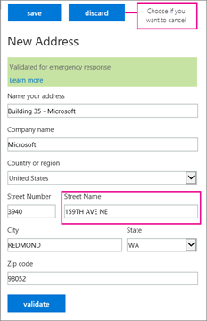

# 조직에서 전화 시스템 설정Setting up Phone System in your organization

다음은 Office 365에서 전화 시스템을 설정 하는 단계별 지침입니다.The following is a step-by-step guide for setting up Phone System in Office 365. 자세한 정보에 대 한 링크는 각 단계의 마지막에 나와 있습니다.Links to additional, detailed information are available at the end of each step.

## 1 단계: 전화 시스템을 해당 국가 또는 지역에서 사용할 수 있는지 확인Step 1: Make sure that Phone System is available in your country or region

1.  먼저 [오디오 회의 및 통화 요금제의 국가 및 지역 사용 가능성](country-and-region-availability-for-audio-conferencing-and-calling-plans/country-and-region-availability-for-audio-conferencing-and-calling-plans.md)으로 이동 하 고 페이지 위쪽에 있는 목록에서 국가 또는 지역을 선택 합니다.First go to [Country and region availability for Audio Conferencing and Calling Plans](country-and-region-availability-for-audio-conferencing-and-calling-plans/country-and-region-availability-for-audio-conferencing-and-calling-plans.md), and select your country or region from the list at the top of the page. 
2.  **전화 시스템**에서 기능 목록과 세부 정보를 검토 합니다.Under **Phone System**, review the list of features and details. 
3.  전화 시스템을 사용할 수 있는 경우 2 단계로 이동 합니다.If Phone System is available, go to step 2. 

**전화 시스템 및 오디오 회의의 국가별 사용 가능성에 대 한 자세한 내용은 [오디오 회의 및 통화 요금제의 국가 및 지역 사용 가능성](country-and-region-availability-for-audio-conferencing-and-calling-plans/country-and-region-availability-for-audio-conferencing-and-calling-plans.md)을 참조 하세요.****To learn more about regional availability of Phone System and Audio Conferencing, see [Country and region availability for Audio Conferencing and Calling Plans](country-and-region-availability-for-audio-conferencing-and-calling-plans/country-and-region-availability-for-audio-conferencing-and-calling-plans.md).**

## 2 단계: 전화 시스템 및 통화 계획 라이선스 구입 및 할당Step 2: Buy and assign Phone System and Calling Plan licenses

전화 시스템 및 통화 계획 라이선스를 단일 사용자에 게 할당 하려면 Office 365 라이선스를 할당 하는 것과 같은 단계를 수행 합니다.To assign a Phone System and Calling Plan license to a single user the steps are the same as assigning an Office 365 license. [Microsoft 팀 라이선스 할당](assign-teams-licenses.md)을 참조 하세요.See [Assign Microsoft Teams licenses](assign-teams-licenses.md). 대량으로 여러 사용자를 할당 하려는 경우 [Microsoft 팀 라이선스 할당](assign-teams-licenses.md)을 참조 하세요.If you want to assign multiple users in bulk, see [Assign Microsoft Teams licenses](assign-teams-licenses.md).

## 3 단계: 사용자의 전화 번호 가져오기Step 3: Get phone numbers for your users

전화를 걸고 받을 수 있도록 조직에 사용자를 설정 하려면 먼저 전화 번호를 받아야 합니다.Before you can set up users in your organization to make and receive phone calls, you must get phone numbers for them.

다음과 같은 세 가지 방법으로 사용자에 대 한 번호를 얻을 수 있습니다.You have three ways of getting numbers for your users:
- 비즈니스용 Skype 관리 센터를 사용 하 여 새로운 번호를 받으세요.Get new numbers using the Skype for Business admin center.
- 비즈니스용 Skype 관리 센터에서 사용할 수 없는 새로운 번호를 받으세요.Get new numbers that aren't available in the Skype for Business admin center.
- 현재 서비스 공급자 또는 전화 통신 회사의 기존 번호를 Office 365으로 이식 하거나 이전 합니다.Port or transfer your existing numbers from your current service provider or phone carrier to Office 365.

이러한 번호를 보고, 검색 하 고, 가져오고, 예약 하려면 **새 사용자 번호 추가** 페이지를 사용 해야 합니다.You must use the **Add new user numbers** page to see, search, acquire, and reserve those numbers. 국가/지역, 시/도, 시/도를 기준으로 검색할 수 있으며, 사용자에 게 필요한 전화 번호 수를 입력 합니다.You can search by Country/Region, State, and City, and then enter the number of phone numbers you will need for your users.

### 새 사용자 전화 번호 받기Get new user phone numbers 
 
 **관리 센터를 사용 하 여** 비즈니스용 skype 로고를 표시 하는 아이콘 **Using the Skype for Business admin center**

1. 회사 또는 학교 계정으로 Microsoft 365에 로그인 합니다.Sign in to Microsoft 365 with your work or school account.

2. **Microsoft 365 관리 센터** > **비즈니스용 Skype**로 이동 합니다.Go to the **Microsoft 365 admin center** > **Skype for Business**.
    
3. 왼쪽 탐색 창에서 **음성** > **전화 번호로**이동 하 고, **새 번호** 표시 한 다음 **새 사용자 번호**를 클릭 합니다.In the left navigation go to **Voice** > **Phone numbers**, click **Add new number** , and then click **New user numbers**.
    
### 비즈니스용 Skype 관리 센터에서 사용할 수 없는 새로운 번호 가져오기Get new numbers that aren't available in the Skype for Business admin center
  
때로는 (국가/지역에 따라) 비즈니스용 Skype 관리 센터를 사용 하 여 새 번호를 받을 수 없습니다.Sometimes (depending on your country/region) you won't be able to get your new numbers using the Skype for Business admin center. 이 경우 양식을 다운로드 하 여 다시 전송 해야 합니다.In this case, you will need to download a form and send it back to us. 새 사용자 번호를 요청 하는 방법을 알아보려면 [조직의 전화 번호 관리](manage-phone-numbers-for-your-organization/manage-phone-numbers-for-your-organization.md) 를 참조 하세요.See [Manage phone numbers for your organization](manage-phone-numbers-for-your-organization/manage-phone-numbers-for-your-organization.md) to learn how to request new user numbers.   
  
### 서비스 공급자 또는 전화 통신 회사의 전화 번호를 이식 하거나 전송 합니다.Port or transfer phone numbers from your service provider or phone carrier
  
- 사용자에 게 999 이하의 전화 번호가 필요한 경우 비즈니스용 Skype 관리 센터의 **새 로컬 번호 포트 주문** 마법사를 사용할 수 있습니다.If you need 999 or fewer phone numbers for your users, you can use the **New Local Number Port Order** wizard in the Skype for Business admin center. 전화 [번호를 Office 365에 전송](transfer-phone-numbers-to-office-365.md) 하 여 비즈니스용 Skype Online으로 전화 번호를 전송 하는 방법을 설명 하는 단계를 따르세요.Follow the steps found in [Transfer phone numbers to Office 365](transfer-phone-numbers-to-office-365.md) to transfer your phone numbers over to Skype for Business Online.
    
- 999 개 이상의 전화 번호를 이식 해야 하는 경우에는 [조직의 전화 번호 관리](manage-phone-numbers-for-your-organization/manage-phone-numbers-for-your-organization.md) 를 참조 하 여 이러한 전화 번호를 모두 Office 365로 전송 하는 방법으로 포트 주문 서비스 요청 또는 주문을 제출 해 보세요.If you need to port more than 999 phone numbers, see [Manage phone numbers for your organization](manage-phone-numbers-for-your-organization/manage-phone-numbers-for-your-organization.md) to submit a port order service request or order to get all of these phone numbers ported over to Office 365. 

**새 전화 번호를 받고 있거나 기존 번호를 전송 하는 방법에 대 한 자세한 내용은 [조직의 전화 번호 관리](manage-phone-numbers-for-your-organization/manage-phone-numbers-for-your-organization.md)를 참조 하세요.****For detailed information about getting new phone numbers or transferring existing numbers, see [Manage phone numbers for your organization](manage-phone-numbers-for-your-organization/manage-phone-numbers-for-your-organization.md).**

## 4 단계: 서비스 전화 번호 가져오기 (오디오 회의, 통화 대기열, 자동 전화 교환)Step 4: Get service phone numbers (audio conferencing, call queues, auto attendants)

Office 365에서 사용자의 전화 번호를 가져올 수 있을 뿐만 아니라 오디오 회의 (컨퍼런스), 자동 전화 교환, 통화 대기열 (서비스 번호 라고도 함) 등의 서비스에 대 한 유료 또는 무료 전화 번호를 검색 하 고 받을 수도 있습니다.In addition to getting phone numbers for your users from Office 365, you can search and acquire toll or toll-free phone numbers for services such as audio conferencing (for conference bridges), auto attendants, and call queues (also called service numbers). 서비스 전화 번호는 사용자 또는 구독자 전화 번호 보다 높은 동시 통화 용량을가지고 있습니다.Service phone numbers have a higher concurrent calling capacity than user or subscriber phone numbers. 예를 들어 서비스 번호는 통화를 동시에 한 번만 처리할 수 있지만, 사용자의 전화 번호는 일부 통화를 동시에 처리할 수 있습니다.For example, a service number can handle 100s of calls simultaneously, whereas a user's phone number can only handle a few calls simultaneously.

### 새 서비스 번호 가져오기Get new service numbers

 **관리 센터를 사용 하 여** 비즈니스용 skype 로고를 표시 하는 아이콘 **Using the Skype for Business admin center**

1. 회사 또는 학교 계정으로 Office 365에 로그인 합니다.Sign in to Office 365 with your work or school account.

2. **Microsoft 365 관리 센터** > **비즈니스용 Skype**로 이동 합니다.Go to the **Microsoft 365 admin center** > **Skype for Business**.

3. 왼쪽 탐색 창에서 **음성** > **전화 번호로** > 이동한 다음 새**번호를 추가**하 고 **새 서비스 번호**를 클릭 합니다.In the left navigation go to **Voice** > **Phone numbers** > **Add new number**, and then click **New service numbers**.

    > [!IMPORTANT]
    > 비즈니스용 Skype 관리 센터의 왼쪽 탐색 창에서 **음성** 옵션을 보려면 먼저 하나 이상의 **Enterprise E5 라이선스**, 하나의 **전화 시스템** 추가 기능 라이선스 또는 하나의 **오디오 회의** 추가 기능 라이선스를 구입 해야 합니다.For you to see the **Voice** option in the left navigation in the Skype for Business admin center, you must first buy at least one **Enterprise E5 license**, one **Phone System** add-on license, or one **Audio Conferencing** add-on license.

### 비즈니스용 Skype 관리 센터에서 사용할 수 없는 새로운 번호 가져오기Get new numbers that aren't available in the Skype for Business admin center
  
때로는 (국가/지역에 따라) 비즈니스용 Skype 관리 센터를 사용 하 여 새 번호를 받을 수 없습니다.Sometimes (depending on your country/region) you won't be able to get your new numbers using the Skype for Business admin center. 이 경우 양식을 다운로드 하 여 다시 전송 해야 합니다.In this case, you will need to download a form and send it back to us. 새 번호를 요청 하는 방법을 알아보려면 [조직의 전화 번호 관리](manage-phone-numbers-for-your-organization/manage-phone-numbers-for-your-organization.md) 를 참조 하세요.See [Manage phone numbers for your organization](manage-phone-numbers-for-your-organization/manage-phone-numbers-for-your-organization.md) to learn how to request new numbers. 

### 기존 서비스 번호 포트 또는 전송Port or transfer existing service numbers

현재 서비스 공급자 또는 통신 회사에서 서비스 번호를 전송 하려면 Microsoft에 수동으로 포트 순서를 제출 해야 합니다.If you want to transfer service numbers from your current service provider or carrier, you need to manually submit a port order to Microsoft. 각 서비스 번호 유형 (유료 및 무료)에 대해 별도의 포트 주문을 제출 하 여 승인 문자 (LOA)를 사용 하 여 전송 하 게 됩니다.You have to submit separate port orders for each type of service number (toll vs. toll-free) that you will be transferring using a Letter of Authorization (LOA). 인증 문자 (LOA)에서 올바른 서비스 번호 유형을 선택 해야 합니다.In the Letter of Authorization (LOA), you must select the correct type of service number. Microsoft support에 문의 하는 경우*사용자 또는 구독자 번호가 아닌*서비스 번호를 전송 하 고 있는지, 아니면 동시 호출 용량이 통화 볼륨을 처리 하는 데 충분 하지 않을 수 있다는 것을 지정 하십시오.When contacting Microsoft support, please make sure you specify that you are transferring a service number (*and not a user or subscriber number*), or the concurrent calling capacity may not be enough to handle call volumes. 전화 번호를 전송 하거나 전화 번호를 사용 하 여 다른 작업을 수행 하려는 경우 [조직의 전화 번호 관리](manage-phone-numbers-for-your-organization/manage-phone-numbers-for-your-organization.md)를 참조 하세요.If you want to transfer phone numbers or do other things with your phone numbers, see [Manage phone numbers for your organization](manage-phone-numbers-for-your-organization/manage-phone-numbers-for-your-organization.md).

## 5 단계: 통화 계획을 설정 하려는 경우Step 5: If you want to set up Calling Plans

위의 단계를 수행한 후에는 이미 전화 시스템 및 라이선스와 통화 요금제 (2 단계)를 구입 하 고 할당 하 고 사용자에 게 확보 한 전화 번호 (3 단계)를 사용 하 여 통화 계획이 부분적으로 설정 되어 있습니다.If you have been following the steps above, you have already bought and assigned Phone System and licenses and a Calling Plan (step 2) and acquired phone numbers for your users (step 3), so your calling plan is partially set up. 다음 세 절차에 따라 통화 요금제 설정을 완료 합니다.Follow the three procedures below to complete the setup of your Calling Plan.

### 조직의 긴급 주소 및 위치 추가Add emergency addresses and locations for your organization

1. **음성** 페이지에서 **응급 위치** > 에서**새 주소 추가**를 선택 합니다.On the **Voice** page, choose **Emergency locations** > **Add new address**.

2. **새 주소** 창에서 주소의 이름을 입력 한 다음 나머지 상자를 완료 합니다.In the **New Address** pane, enter a name for your address, and then complete the remaining boxes.
    
     
  
    > [!TIP]
    > 영어 고객의 경우, 해당 하는 이름이 숫자 이면 위의 그림에 표시 된 대로 끝에 "st" 또는 "th"를 포함 해야 합니다.For English customers, if the street name is a number, be sure to include "st" or "th" at the end, as shown in the above picture.

3. **유효성 검사**를 선택 합니다.Choose **Validate**.

    필요한 경우 주소를 수정 하 라는 메시지가 표시 됩니다.If needed, you'll be prompted to make corrections to the address.

    > [!CAUTION]
    > 주소 또는 도심 주소의 유효성을 검사 하는 경우 정확 하 게 서식이 지정 된 상태 인지 확인 해야 합니다.Validating a street or civic address involves making sure that it is legitimate and correctly formatted. 구/군/시 이름을 잘못 입력 하는 등 부분적으로 올바른 긴급 주소를 입력 해도 여전히 유효성 검사를 통과할 수 있습니다.It is possible that a partially correct emergency address, such as if you mistyped the name of the city, may still pass validation. 철자가 잘못 입력 되어 있고 유효성 검사를 통과 한 경우에는 주소의 다른 올바른 부분과 함께 철자가 틀린 이름을 조합 하 여 통화를 적절 한 긴급 파견 센터로 라우팅할 수 있는 충분 한 정보가 있습니다.Even though it's misspelled and passed validation, the combination of the misspelled name of city along with the other correct parts of the address are enough information to route the call to the appropriate emergency dispatch center.

    > [!TIP]
    > 긴급 응답을 위해 주소를 수정 해야 하는 경우 녹색 배너에 주소가 업데이트 되었음을 알리는 메시지가 표시 됩니다.If the address needs to be corrected for emergency response, a green banner will appear notifying you that the address was updated.

4. 주소의 유효성을 검사 한 후 **저장**을 선택 합니다.After the address is validated, choose **Save**.

### 사용자에 게 전화 번호 및 긴급 주소 할당Assign phone numbers and emergency addresses to users

> [!TIP]
> 이 단계를 수행 하기 전에 비즈니스에 더 많은 사람을 추가 하는 경우 **음성 사용자** 페이지에 표시 되는 데 **몇 시간이** 걸릴 수 있습니다.If you add more people to your business right before doing this step, it may take **several hours** for them to appear on the **Voice users** page. 대기 시간이 있습니다.There's a latency.

1. **음성 사용자** 페이지에서 전화 번호와 긴급 주소를 할당 하려는 사용자를 선택 합니다.On the **Voice users** page, select the people who you want to assign a phone number and emergency address to.

2. 작업 창에서 **번호 지정**을 클릭 합니다.In the Action pane, click **Assign number**.

3. **번호 할당** 페이지의 **배정할 번호 선택** 목록에서 사용자의 전화 번호를 선택 합니다.On the **Assign number** page, in the **Select number to assign** list, select the phone number for the user.

4. 긴급 주소를 선택 하려면 상자에 구/군/시의 이름을 입력 하 고 **검색**을 선택 합니다.To select an emergency address, enter name of the city in the box and choose **Search**.

    > [!IMPORTANT]
    > 미국 이외의 지역에 거주 하는 사용자에 게는 이미 긴급 한 주소가 있지만, 지금이 번호를 변경할 수 있습니다.If you are outside the United States, your numbers already have an emergency address, but you can change it now. [사용자에 대 한 긴급 주소 할당 또는 변경을](/skypeforbusiness/what-are-calling-plans-in-office-365/assign-or-change-an-emergency-address-for-a-user)참조 하세요.See [Assign or change an emergency address for a user](/skypeforbusiness/what-are-calling-plans-in-office-365/assign-or-change-an-emergency-address-for-a-user). 
  
5. 전화 번호와 긴급 주소를 모두 할당 한 후 **저장**을 선택 합니다.After you assign both the phone number and emergency address, choose **Save**.

### 사용자에 게 새로운 전화 번호에 대해 알아보기Tell your users about their new phone numbers

메일을 보내거나 비즈니스의 선호 하는 통신 방법을 사용 하 여 새 전화 번호에 대 한 정보를 제공 하는 것이 좋습니다.We recommend sending mail or using your business's preferred communication method to tell the people about their new phone numbers.

**Skype For Business** 앱에서 해당 전화 번호를 볼 수 있는 방법은 다음과 같습니다.Here's how they can see that phone number in their **Skype for Business** app:

1. 데스크톱에서 비즈니스용 Skype에 로그인 합니다.Sign in to Skype for Business on your desktop.
    
2. **설정** > \*\*\*\* 도구 > **옵션**을 선택 합니다.Choose **Settings** > **Tools** > **Options**. 
    
     
  
3. 그런 다음 **전화**를 선택 합니다.Then choose **Phones**. 
    
    
 
**Microsoft 팀**에서 사용자는 왼쪽 탐색 창에서 **통화** 를 클릭 하 여 전화 번호를 볼 수 있습니다.In **Microsoft Teams**, users can see their phone number by clicking **Calls** in the left navigation. 전화 번호가 다이얼 패드 위에 표시 됩니다.The phone number is shown above the dial pad.

**통화 요금제 설정에 관련 된 모든 단계에 대 한 자세한 내용은 [통화 계획](set-up-calling-plans.md)설정을 참조 하세요.****For more detailed information about all of the steps involved in setting up a Calling Plan, see [Set up Calling Plans](set-up-calling-plans.md).**

## 6 단계: 오디오 회의를 설정 하려는 경우Step 6: If you want to set up Audio Conferencing

조직의 사용자가 모임에 전화를 걸 때 휴대폰을 사용 해야 하는 경우가 있습니다.Sometimes people in your organization will need to use a phone to call in to a meeting. 비즈니스용 Skype 및 Microsoft 팀에는 이러한 상황에 대 한 오디오 회의 기능이 포함 되어 있습니다.Skype for Business and Microsoft Teams include the audio conferencing feature for just this situation! 모바일 장치 또는 PC에서 비즈니스용 Skype 또는 Microsoft 팀 앱을 사용 하는 대신 휴대폰을 사용 하 여 비즈니스용 Skype 또는 Microsoft 팀 모임으로 통화할 수 있습니다.People can call in to Skype for Business or Microsoft Teams meetings using a phone, instead of using the Skype for Business or Microsoft Teams app on a mobile device or PC.

일정을 예약 하거나 리드 회의를 하는 사용자를 위해 오디오 회의를 설정 하기만 하면 됩니다.You only need to set up Audio Conferencing for people who plan to schedule or lead meetings. 전화를 걸 수 있는 모임 참석자는 해당 사용자 또는 다른 설정에 할당 된 라이선스가 필요 하지 않습니다.Meeting attendees who dial in don't need any licenses assigned to them or other setup.
  
오디오 회의에 대 한 질문과 대답은 [오디오 회의 일반적인 질문](audio-conferencing-common-questions.md)을 참조 하세요.For frequently asked questions about Audio Conferencing, see [Audio Conferencing common questions](audio-conferencing-common-questions.md).
    
1. **오디오 회의** 추가 기능 라이선스 및 통신 크레딧 라이선스를 구입한 경우에는 할당 합니다.If you purchased **Audio Conferencing** add-on licenses and Communications Credits licenses, assign them too. 지침은 [Microsoft 팀 라이선스 할당](assign-teams-licenses.md)을 참조 하세요.For instructions, see [Assign Microsoft Teams licenses](assign-teams-licenses.md).

    오디오 회의 공급자를 결정 합니다.Decide on your audio conferencing provider. 오디오 회의 공급자가 오디오 회의 브리지를 제공 합니다.An audio conferencing provider supplies an audio conferencing bridge. 회의 브리지는 모임에 대 한 전화 접속 전화 번호, Pin 및 회의 Id를 설정 합니다.The conferencing bridge sets your dial-in phone numbers, PINs, and conference IDs for meetings. Microsoft 또는 타사 오디오 회의 공급자를 사용할지 여부를 결정 합니다.Decide whether to use Microsoft or a third-party audio conferencing provider:

    > [!NOTE]
    > Microsoft 팀 사용자는 타사 오디오 회의 공급자를 사용자가 사용할 수 없습니다.Microsoft Teams users can't user a third-party audio conferencing provider.

    - **Microsoft의 오디오 회의 공급자**: 오디오 회의를 위한 가장 쉬운 솔루션을 원하는 경우 오디오 회의 공급자로 Microsoft를 선택 합니다.**Microsoft as your audio conferencing provider**: If you want the easiest solution for audio conferencing, choose Microsoft as your audio conferencing provider.
    
    - 타사 **오디오 회의 공급자**: Office 365의 오디오 회의를 사용할 수 없는 국가의 경우 해당 위치 때문에 서비스 품질은 좋지 않거나 기존 계약이 있으므로 타사 오디오를 선택 합니다. 회의 공급자.**Third party as your audio conferencing provider**: If you are in a country where Audio Conferencing in Office 365 isn't available, the service quality isn't great because of its location, or you have an existing contract, choose a third-party audio conferencing provider. 공급자를 찾으려면 [Microsoft](http://go.microsoft.com/fwlink/?LinkId=797530)로 이동 하세요.To find a provider, go to [Microsoft PinPoint](http://go.microsoft.com/fwlink/?LinkId=797530).
 
2. 모임을 진행 하거나 예약 하는 사람에 게 오디오 회의 공급자를 할당 합니다.Assign the audio conferencing provider to people who lead or schedule meetings. [Microsoft를 오디오 회의 공급자로 지정](/skypeforbusiness/audio-conferencing-in-office-365/assign-microsoft-as-the-audio-conferencing-provider)을 참조 하세요.See [Assign Microsoft as the audio conferencing provider](/skypeforbusiness/audio-conferencing-in-office-365/assign-microsoft-as-the-audio-conferencing-provider).

3. 모임 초대를 설정 합니다.Set up meeting invitations. 다음 단계는 선택 사항 이지만, 다음과 같은 관리자가 많습니다.The following steps are optional, but a lot of admins like to do them: 
  
   1. [비즈니스용 Skype에서 모임 초대를 사용자 지정](/skypeforbusiness/set-up-skype-for-business-online/customize-meeting-invitations)합니다.[Customize meeting invitations in Skype for Business](/skypeforbusiness/set-up-skype-for-business-online/customize-meeting-invitations). 사용자에 대해 설정 된 전화 접속 번호가 참석자에 게 전송 되는 모임 초대에 자동으로 추가 됩니다.The dial-in numbers that are set for the user will be automatically added to the meeting invitations that are sent to attendees. 그러나 고유한 도움말 및 법률 링크, 문자 메시지 및 작은 회사 그래픽을 추가할 수 있습니다.However, you can add your own help and legal links, a text message, and small company graphic.
    
   2. [비즈니스용 Skype](/skypeforbusiness/audio-conferencing-in-office-365/set-the-phone-numbers-included-on-invites) 또는 [Microsoft 팀](set-the-phone-numbers-included-on-invites-in-teams.md)의 초대에 포함 된 모임 이끌이의 오디오 회의 전화 번호를 설정 합니다.Set the Audio Conferencing phone numbers for meeting organizers that are included on invites [in Skype for Business](/skypeforbusiness/audio-conferencing-in-office-365/set-the-phone-numbers-included-on-invites) or [in Microsoft Teams](set-the-phone-numbers-included-on-invites-in-teams.md). 사용자가 예약한 모임에 표시 되는 전화 번호입니다.This is the phone number that will show up in the meeting that is scheduled by the user.
    
   3. 비즈니스용 [Skype](/skypeforbusiness/audio-conferencing-in-office-365/set-auto-attendant-languages-for-audio-conferencing) 또는 [Microsoft 팀](set-auto-attendant-languages-for-audio-conferencing-in-teams.md) 에서 오디오 회의에 대 한 자동 전화 교환 언어를 설정 합니다. 오디오 회의 자동 전화 교환은 음성 회의 전화 번호로 전화를 걸 때 발신자에 게이를 인사 하는 데 사용 됩니다.Set auto attendant languages for Audio Conferencing [in Skype for Business](/skypeforbusiness/audio-conferencing-in-office-365/set-auto-attendant-languages-for-audio-conferencing) or [in Microsoft Teams](set-auto-attendant-languages-for-audio-conferencing-in-teams.md) that the audio conferencing auto attendant uses to greet a caller when they dial in to an Audio Conferencing phone number. 이 단계는 Microsoft를 오디오 공급자로 사용 중인 경우에만 적용 됩니다.This step only applies if you're using Microsoft as your audio provider.
    
   4. [Microsoft 팀에서](set-the-pin-length-for-audio-conferencing-meetings-in-teams.md)오디오 회의 모임에 대 한 PIN 길이를 설정 합니다.Set the length of the PIN for Audio Conferencing meetings [in Microsoft Teams](set-the-pin-length-for-audio-conferencing-meetings-in-teams.md).
    
      > [!NOTE]
      > 중국에서 21Vianet이 운영 하는 Office 365를 사용 하는 고객은이 기능을 아직 사용할 수 없습니다.This feature is not yet available to customers using Office 365 operated by 21Vianet in China. 자세한 내용은 [21vianet에서 운영 하는 Office 365에 대 한](https://support.office.com/article/A8AB5061-3346-4DA0-BB7C-5260822B53AE)자세한 내용을 알아보세요.To learn more, see [Learn about Office 365 operated by 21Vianet](https://support.office.com/article/A8AB5061-3346-4DA0-BB7C-5260822B53AE).

**오디오 회의에 대 한 자세한 내용은 [Microsoft 팀을 위한 오디오 회의 설정을](set-up-audio-conferencing-in-teams.md)참조 하세요.****For more information about Audio Conferencing, see [Set up Audio Conferencing for Microsoft Teams](set-up-audio-conferencing-in-teams.md).**

## 7 단계: 클라우드 통화 큐를 설정 하려면Step 7: If you want to set up a Cloud call queue

클라우드 통화 큐에는 사용자가 조직의 전화 번호를 호출할 때 사용 되는 인사말, 통화 대기를 자동으로 전환 하는 기능, 전화를 거는 사용자가 통화를 처리 하기 위해 사용할 수 있는 다음 통화 에이전트 검색 기능 등이 포함 됩니다. 대기 중인 음악 듣기.Cloud call queues include greetings that are used when someone calls in to a phone number for your organization, the ability to automatically put the calls on hold, and the ability to search for the next available call agent to handle the call while the people who call are listening to music on hold. 조직에 대 한 단일 또는 복수 통화 대기열을 만들 수 있습니다.You can create single or multiple call queues for your organization.

통화 대기열을 만들고 설정 하기 전에 기존의 유료 또는 무료 서비스 번호를 가져오거나 이전 해야 합니다.Before you can create and set up your call queues, you will need to get or transfer your existing toll or toll-free service numbers. 무료 또는 무료 서비스 전화 번호를 얻은 후에는 **비즈니스용 Skype 관리 센터** > **음성** > **전화 번호**에 표시 되며 나열 된 **번호 종류가** 서비스로 표시 됩니다 \*\*-무료입니다. \*\*.After you get the toll or toll-free service phone numbers, they will show up in **Skype for Business admin center** > **Voice** > **Phone numbers**, and the **Number type** listed will be listed as **Service - Toll-Free**. 서비스 번호를 얻으려면 [비즈니스용 Skype 및 Microsoft 팀에 대 한 서비스 전화 번호 가져오기를](/microsoftteams/getting-service-phone-numbers) 참조 하거나, 기존 서비스 번호를 전송 하 고 싶다면 [전화 번호를 Office 365에](transfer-phone-numbers-to-office-365.md)연결을 참조 하세요.To get your service numbers, see [Getting service phone numbers for Skype for Business and Microsoft Teams](/microsoftteams/getting-service-phone-numbers) or if you want to transfer and existing service number, see [Transfer phone numbers to Office 365](transfer-phone-numbers-to-office-365.md).
  
> [!NOTE]
> 미국 이외의 지역에 거주 하는 경우 비즈니스용 Skype 관리 센터를 사용 하 여 서비스 번호를 얻을 수 없습니다.If you are outside the United States, you can't use the Skype for Business admin center to get service numbers. 미국 이외의 지역에서이를 수행 하는 방법을 확인 하려면 [조직의 전화 번호 관리](manage-phone-numbers-for-your-organization/manage-phone-numbers-for-your-organization.md) 로 이동 하세요.Go to [Manage phone numbers for your organization](manage-phone-numbers-for-your-organization/manage-phone-numbers-for-your-organization.md) instead to see how to do it from the outside of the United States.

새 통화 대기열을 만들려면 **비즈니스용 Skype 관리 센터**에서 **통화 라우팅** > **통화 대기열**을 클릭 하 고 **새로 추가**를 클릭 한 다음 [클라우드 통화 대기열 만들기](/SkypeForBusiness/what-is-phone-system-in-office-365/create-a-phone-system-call-queue#step-3---create-a-new-call-queue)의 **3 단계** 에 나오는 지침을 따릅니다.To create a new call queue, in the **Skype for Business admin center**, click **Call routing** > **Call queues**, click **Add new**, and then follow the instructions in **Step 3** of  [Create a Cloud call queue](/SkypeForBusiness/what-is-phone-system-in-office-365/create-a-phone-system-call-queue#step-3---create-a-new-call-queue).

**통화 대기열에 대 한 자세한 내용은 [클라우드 통화 대기열 만들기](/SkypeForBusiness/what-is-phone-system-in-office-365/create-a-phone-system-call-queue)를 참조 하세요.****For more details about call queues, see [Create a Cloud call queue](/SkypeForBusiness/what-is-phone-system-in-office-365/create-a-phone-system-call-queue).**

## 8 단계: 클라우드 자동 전화 교환을 설정 하려면Step 8: If you want to set up a Cloud auto attendant

자동 전화 교환을 통해 조직에 전화를 걸고 메뉴 시스템을 탐색 하 여 올바른 부서, 통화 대기열, 사람, 교환원에 게 얻을 수 있습니다.Auto attendants let people that call in to your organization and navigate a menu system to get them to the right department, call queue, person, or the operator. 비즈니스용 Skype 관리 센터를 사용 하 여 조직의 자동 전화 교환을 만들 수 있습니다.You can create an auto attendant for your organization by using the Skype for Business admin center.

새 자동 전화 교환을 만들려면 비즈니스용 Skype 관리 센터에서 **통화 라우팅** > **자동 전화 교환을**클릭 하 고 **새로 추가**를 클릭 한 다음 클라우드 자동 전화 교환 만들기의 **2 단계** 에서 각 페이지에 대 한 지침을 따릅니다. .To create a new auto attendant, in the Skype for Business admin center, click **Call routing** > **Auto attendants**, click **Add new**, and then follow the instructions for each page in **Step 2** of [Create a Cloud auto attendant](https://docs.microsoft.com/microsoftteams/create-a-phone-system-auto-attendant#step-2---create-a-new-auto-attendant).

**클라우드 자동 전화 교환에 대 한 자세한 내용은 [클라우드 자동 전화 교환 설정을](https://docs.microsoft.com/microsoftteams/create-a-phone-system-auto-attendant)참조 하세요.****For more details about Cloud auto attendants, see [Set up a Cloud auto attendant](https://docs.microsoft.com/microsoftteams/create-a-phone-system-auto-attendant).**

## 9 단계: 서비스 전화 번호 지정 (오디오 회의, 통화 대기열, 자동 전화 교환)Step 9: Assign service phone numbers (audio conferencing, call queues, auto attendants)

**위의 4 단계**에서 서비스 번호를 찾았으면 원하는 각 서비스 유형에 할당 해야 합니다.Once you have your service numbers from **Step 4 above**, you need to assign them to each type of service that you want. 예를 들어 유료 또는 무료 서비스 전화 번호를 원할 경우 회의 브리지에 해당 번호를 할당 해야 합니다.For example, if you want a dedicated service phone number (toll or toll-free), you will need to assign the number to the conferencing bridge.

- 오디오 회의의 경우 **Microsoft 365 관리 센터** > **관리 센터** > 에서**비즈니스용 Skype** > **오디오 회의** 로 이동 하 여 회의 브리지에 전용 번호를 할당 하 고 다음을 클릭 합니다. 회의 브리지를 사용 하거나 [오디오 회의 브리지에서 유료 또는 무료 전화 번호 변경을](change-the-phone-numbers-on-your-audio-conferencing-bridge.md)볼 수 있습니다.For Audio Conferencing, you can assign a dedicated number to a conferencing bridge by going to **Microsoft 365 admin center** > **Admin centers** > **Skype for Business** > **Audio conferencing** and click on the conference bridge or by seeing  [Change the toll or toll-free numbers on your Audio Conferencing bridge](change-the-phone-numbers-on-your-audio-conferencing-bridge.md).

- 자동 전화 교환의 경우 **Microsoft 365 관리 센터** > **관리 센터** > (비즈니스용**Skype** > **통화 라우팅** > \*\*자동 전화 교환)로 이동 하 여 자동 전화 교환에 전용 번호를 할당할 수 있습니다. \*\*자동 전화 교환 단추를 클릭 합니다.For Auto Attendants, you can assign a dedicated number to an auto attendant by going to **Microsoft 365 admin center** > **Admin centers** > **Skype for Business** > **Call routing** > **Auto attendants** and clicking on the auto attendant. **일반** 페이지에서 이미 존재 하는 서비스 번호가 **전화 번호** 드롭다운에 나열 됩니다.On the **General** page, the service number you already have will be listed in the **Phone number** drop down. 자세한 내용은 [클라우드 자동 전화 교환 설정을](https://docs.microsoft.com/microsoftteams/create-a-phone-system-auto-attendant)참조 하세요.For details, see [Set up a Cloud auto attendant](https://docs.microsoft.com/microsoftteams/create-a-phone-system-auto-attendant).
- 통화 대기열의 경우 **Microsoft 365 관리 센터** > **관리 센터** > **비즈니스용 Skype** > **통화 라우팅** > **통화 전담팀** 으로 이동 하 여 통화 대기열에 전용 번호를 할당할 수 있으며, 다음을 클릭 합니다. 통화 대기열For Call Queues, you can assign a dedicated number to a call queue by going to **Microsoft 365 admin center** > **Admin centers** > **Skype for Business** > **Call routing** > **Call queues** and click on the call queue. **일반** 페이지에서 이미 존재 하는 서비스 번호가 **전화 번호** 드롭다운에 나열 됩니다.On the **General** page the service number you already have will be listed in the **Phone number** drop down. 자세한 내용은 [클라우드 통화 대기열 만들기](https://docs.microsoft.com/microsoftteams/create-a-phone-system-call-queue)를 참조 하세요.For details, see [Create a Cloud call queue](https://docs.microsoft.com/microsoftteams/create-a-phone-system-call-queue).

**새 서비스 번호를 받고 기존 서비스 번호를 포팅 하는 방법에 대 한 자세한 내용은 [서비스 전화 번호 가져오기를](/microsoftteams/getting-service-phone-numbers)참조 하세요.****For detailed information about getting new service numbers and porting existing service numbers, see [Getting service phone numbers](/microsoftteams/getting-service-phone-numbers).**

## 10 단계: 조직의 통신 크레딧을 설정Step 10: Set up Communications Credits for your organization

비즈니스용 Skype 및 Microsoft 팀에 무료 전화 번호를 사용 하려는 경우에는 통신 크레딧을 설정 해야 합니다.You will need to set up Communications Credits if you would like to use toll-free numbers with Skype for Business and Microsoft Teams. 또한 통화 요금제 (국내 또는 국제) 및 오디오 회의 사용자에 게 통신 크레딧을 설정 하 고 **목적지**로 전화를 걸 수 있는 기능이 필요한 경우이 좋습니다.Also, we recommend that you set up Communications Credits for your Calling Plans (Domestic or International) and Audio Conferencing users who need the ability to dial out to **any destination**. 여러 국가/지역이 포함 되어 있지만 일부 대상은 통화 요금제 또는 오디오 회의 구독에 포함 되지 않을 수 있습니다.Many countries/regions are included, but some destinations may not be included in your Calling Plan or Audio Conferencing subscriptions. 통신 크레딧 청구를 설정 하지 않고 사용자에 게 **통신 크레딧** 라이선스를 할당 하지 않은 경우 (해당 국가/지역의 통화 요금제 또는 오디오 회의 계획에 따라 다름) 해당 사용자는 오디오 회의 모임에서 통화 하거나 전화를 걸 수 없습니다.If you don't set up Communications Credits billing and assign a **Communications Credits** license to your users and you run out minutes for your organization (depending on your Calling Plan or Audio Conferencing plan in your country/region), those users won't be able to make calls or dial out from Audio Conferencing meetings. [통신 크레딧을 확인](what-are-communications-credits.md) 하 여 권장 자금을 포함 하 여 더 많은 정보를 얻을 수 있습니다.You can get more information, including recommended funding amounts, by reading [What are Communications Credits?](what-are-communications-credits.md)
  
> [!NOTE]
> 비용을 확인 하려면 [여기에서 요금](https://go.microsoft.com/fwlink/p/?LinkId=799523 )을 보세요.To find out how much it costs, [see the rates here](https://go.microsoft.com/fwlink/p/?LinkId=799523 ).

### 통신 크레딧을 설정 하려면To set up Communications Credits

1. 회사 또는 학교 계정으로 Microsoft 365에 로그인 합니다.Sign in to Microsoft 365 with your work or school account.

2. 관리 센터의 왼쪽 탐색 모음에서 **청구** > **구독** > **추가** > 기능으로 이동 하 여 추가 기능을**구매한**다음, 지금 **통신 크레딧** > **구매**를 선택 합니다.In the left navigation of the admin center, go to **Billing** > **Subscriptions** > **Add-ons** > **Buy add-ons**, and then choose **Communications Credits** > **Buy now**.

3. **커뮤니케이션 크레딧** 신청 페이지에서 정보를 입력 하 고 **다음**을 클릭 합니다.On the **Communications Credits** subscription page, fill in your information, and then click **Next**.

4. 결제 정보를 입력 하 고 **주문을**클릭 합니다.Enter your payment information and click **Place order**.
    >[!IMPORTANT]
    >볼륨 라이선스 고객 인 경우 결제를 위해 엔터프라이즈 계약 번호를 선택할 수 있습니다.If you are a volume licensing customer, you may choose your enterprise agreement number for payment. 여러 엔터프라이즈 계약 번호를 사용 하는 경우 결제에 사용할 엔터프라이즈 계약을 선택할 수 있습니다.If you have multiple enterprise agreement numbers, you will be able to select which enterprise agreement you would like to use for payment. 또한 회사 계약 번호와 연결할 구매 주문 번호를 지정할 기회가 주어 집니다 (해당 하는 경우).You will also be given an opportunity to specify a purchase order number to associate with the enterprise agreement number (if applicable).
    
**통신 크레딧을 설정 하는 방법에 대 한 자세한 내용은 [조직의 통신 크레딧을 설정](set-up-communications-credits-for-your-organization.md)을 참조 하세요.****For more detailed information about setting up Communications Credits, see [Set up Communications Credits for your organization](set-up-communications-credits-for-your-organization.md).**
  
### 사용자에 게 통신 크레딧 라이선스 할당Assign a Communications Credits license to users

1. 회사 또는 학교 계정으로 Office 365에 로그인 합니다.Sign in to Office 365 with your work or school account.

2. Microsoft 365 관리 센터의 왼쪽 탐색 창에서 **사용자** > **활성 사용자**로 이동한 다음 목록에서 한 명 또는 몇 명의 사용자를 선택 합니다.In the left navigation of the Microsoft 365 admin center, go to **Users** > **Active users**, and then select a user or users from the list.

3. 작업 창의 **제품 라이선스**에서 **편집**을 클릭 합니다.In the Action pane under **Product licenses**, click **Edit**.

4. **제품 라이선스** 페이지에서이 **라이선스를 할당 하도록** **통신 크레딧을** 설정/해제 한 다음 **저장**을 클릭 합니다.On the **Product licenses** page, toggle **Communications Credits** to **On** to assign this license, and then click **Save**.

    > [!NOTE]
    > **Enterprise E5** 라이선스를 할당 받은 사용자가 있는 경우에도이 작업을 수행 하는 것이 좋습니다.Even if you have users who are assigned an **Enterprise E5** license, it's still recommended that you do this.

**통신 제작진 라이선스를 할당 하는 방법에 대 한 자세한 내용은 [조직의 통신 크레딧 설정을](set-up-communications-credits-for-your-organization.md)참조 하세요.****To learn more about assigning Communications Credits licenses, see [Set up Communications Credits for your organization](set-up-communications-credits-for-your-organization.md).**

## 관련 항목Related topics
[Office 365에서 전화 시스템을 사용 하 여 얻을 수 있는 기능Here's what you get with Phone System in Office 365](here-s-what-you-get-with-phone-system.md)

[비즈니스용 Skype 및 Microsoft 팀에 대 한 서비스 전화 번호 가져오기Getting service phone numbers for Skype for Business and Microsoft Teams](/microsoftteams/getting-service-phone-numbers)

[오디오 회의 및 통화 요금제의 국가 및 지역 사용 가능 여부Country and region availability for Audio Conferencing and Calling Plans](country-and-region-availability-for-audio-conferencing-and-calling-plans/country-and-region-availability-for-audio-conferencing-and-calling-plans.md)
    
  
 
