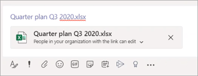

# Microsoft Teams에서 파일 공유Sharing files in Microsoft Teams

Microsoft Teams에서 사용자는 조직 내부 및 외부의 다른 Teams 사용자와 콘텐츠를 공유할 수 있습니다.In Microsoft Teams, users can share content with other Teams users within and outside their organization. Teams에서 파일 및 폴더 공유는 SharePoint 및 OneDrive에 구성된 설정을 기반으로 하여 SharePoint 및 OneDrive에 대해 설정한 모든 것이 Teams의 공유에도 영향을 미치게 됩니다.Sharing files and folders in Teams is based on the settings configured in SharePoint and OneDrive, so whatever you set up for SharePoint and OneDrive will affect sharing in Teams as well.

## 개요Overview

사용자는 OneDrive, 액세스 권한이 있는 팀 및 사이트에서, 그리고 자신의 컴퓨터에서 파일을 공유할 수 있습니다.Users can share files from OneDrive, from teams and sites they have access to, and from their computer. 파일을 공유하기 위해 사용자는 다음을 할 수 있습니다.To share a file, users can do the following:

- 채널에서 **첨부(종이클립** 아이콘)를 클릭하고 최근, Teams 및 **채널** 찾아보기, **OneDrive** 또는 내 컴퓨터에서 업로드를 선택한 다음 공유할 파일을 선택합니다. In a channel, click **Attach** (the paperclip icon), select **Recent**, **Browse Teams and Channels**, **OneDrive**, or **Upload from my computer**, and then choose the file they want to share.   
    
- 채팅에서 첨부(종이클립 아이콘)를 클릭하고 컴퓨터에서 **OneDrive** 또는 업로드를 클릭한 다음 공유할 파일을 선택합니다.  In a chat, click **Attach** (the paperclip icon), select  or **OneDrive** or **Upload from my computer**, and then choose the file they want to share.  
    
- 공유 링크를 복사하여 작성 상자에 붙여넣습니다.Copy and paste the sharing link in the compose box. 
    

### 공유 파일 및 공유 링크의 사용 권한Permissions of shared files and sharing links

사용자가 Teams 내에서 파일을 공유하는 경우 Microsoft 365에서와 마찬가지로 파일에 액세스할 수 있는 사용자를 설정할 수 있습니다.When users share a file from within Teams, they can set who can access the file just like they do across Microsoft 365. 모든 사용자, 조직의 사용자, 기존 액세스 권한이 있는 사용자 또는 특정 사용자(1:1 채팅, 그룹 채팅 또는 채널에 사람 포함)에 대한 액세스 권한을 부여할 수 있습니다.They can give access to anyone, people in your organization, people with existing access, or specific people (which can include the people in a 1:1 chat, group chat, or channel).  파일이 공유되는 경우 파일 미리 보기는 온라인 열기, 다운로드 및 복사 링크와 같은 모든 파일 작업과 함께 메시지에서 사용할 **수 있습니다.**When a file is shared, the file preview is available in the message, along with all file actions such as **Open online**, **Download**, and **Copy link**. 기본적으로 파일은 Teams에서 열립니다.By default, the file opens in Teams.

사용자가 채팅 또는 채널에서 파일을 공유하면 일부 또는 모든 받는 사람이 파일을 볼 수 있는 권한이 없는지 여부에 대한 알림을 수신하게 됩니다.When users share a file in a chat or channel, they're notified whether some or all recipients don't have permission to view the file. 이제 메시지에 나타나는 파일 미리 보기 옆에 있는 화살표를 클릭하여 공유하기 전에 파일에 대한 사용 권한을 변경할 수 있습니다.They can change the permissions on the file before they share it by clicking the arrow next to the file preview that now appears in the message.

## 관련 항목Related topics

[SharePoint Online 및 비즈니스용 OneDrive가 Microsoft Teams와 상호 작용하는 방법How SharePoint Online and OneDrive for Business interact with Microsoft Teams](sharepoint-onedrive-interact.md)

[사이트의 기본 링크 유형 변경Change the default link type for a site](https://docs.microsoft.com/sharepoint/change-default-sharing-link)

[팀의 게스트와 공동 작업Collaborate with guests in a team](https://docs.microsoft.com/microsoft-365/solutions/collaborate-as-team)