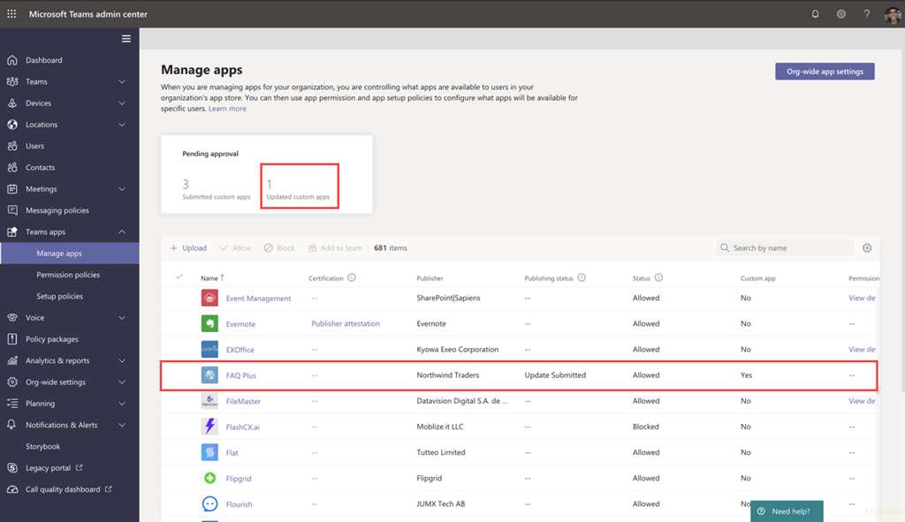

# 팀 앱 제출 API를 통해 제출 된 사용자 지정 앱 게시Publish a custom app submitted through the Teams App Submission API

[!INCLUDE [preview-feature](includes/preview-feature.md)]

## 개요Overview

> [!NOTE]
> 사용자 지정 팀 앱을 게시 하면 조직의 앱 스토어에 있는 사용자가 사용할 수 있습니다.When you publish a custom Teams app, it's available to users in your organization's app store. 두 가지 방법으로 사용자 지정 앱을 게시할 수 있으며, 사용 하는 방법은 앱을 가져오는 방법에 따라 다릅니다.There are two ways to publish a custom app and the way that you use depends on how you get the app. **이 문서에서는 개발자가 팀 앱 제출 API를 통해 제출 하는 사용자 지정 앱을 승인 하 고 게시 하는 방법에 대해 설명**합니다.**This article focuses on how to approve and publish a custom app that a developer submits through the Teams App Submission API**. 사용자 지정 앱을 업로드 하는 다른 방법은 개발자가 .zip 형식으로 앱 패키지를 보내는 경우에 사용 됩니다.The other method, uploading a custom app, is used when a developer sends you an app package in .zip format. 해당 방법에 대 한 자세한 내용은 [앱 패키지를 업로드 하 여 사용자 지정 앱 게시](manage-your-custom-apps.md)를 참조 하세요.To learn more about that method, see [Publish a custom app by uploading an app package](manage-your-custom-apps.md).
 
이 문서에서는 팀 앱을 개발에서 배포로 가져오는 방법에 대 한 종단 간 지침을 제공 합니다.This article provides end-to-end guidance for how to take your Teams app from development to deployment to discovery. 팀에서 앱 수명 주기 동안 제공 하는 연결 된 환경에 대해 개괄적으로 살펴보고 조직의 앱 스토어에서 사용자 지정 앱을 개발, 배포 및 관리 하는 방법을 간소화 합니다.You'll get an overview of the connected experiences that Teams provides across the app lifecycle to streamline how to develop, deploy, and manage custom apps in your organization's app store.

개발자가 팀 앱 제출 API를 사용 하 여 Microsoft 팀 관리 센터에 직접 사용자 지정 앱을 제출 하 고, 조직의 사용자에 대 한 앱을 관리 하는 정책을 설정 하 고, 사용자가 팀에서 검색 하는 방법을 비롯 하 여 주기의 각 단계를 다룹니다.We'll cover each step of the lifecycle, including how developers can use the Teams App Submission API to submit custom apps directly to the Microsoft Teams admin center for you to review and approve, how to set policies to manage apps for users in your organization, and how your users discover them in Teams.

이 가이드는 앱의 팀 측면에 중점을 둔 것 이며 관리자 및 IT 전문가를 대상으로 합니다.This guidance focuses on the Teams aspects of the app and is intended for admins and IT pros. 팀 앱을 개발 하는 방법에 대 한 자세한 내용은 <a href="https://docs.microsoft.com/microsoftteams/platform" target="_blank">팀 개발자 설명서</a>를 참조 하세요.For information about developing Teams apps, see the <a href="https://docs.microsoft.com/microsoftteams/platform" target="_blank">Teams developer documentation</a>.

## 개발Develop

### 앱 만들기Create the app

Microsoft 팀 개발자 플랫폼을 사용 하면 개발자가 자신의 앱과 서비스를 쉽게 통합 하 여 생산성을 개선 하 고, 의사 결정을 더 빠르게 하 고, 기존 콘텐츠 및 워크플로를 통해 공동 작업을 만들 수 있습니다.The Microsoft Teams developer platform makes it easy for developers to integrate your own apps and services to improve productivity, make decisions faster, and create collaboration around existing content and workflows. 팀 플랫폼에 빌드된 앱은 팀 클라이언트와 서비스 및 워크플로 간의 브리지로 공동 작업 플랫폼의 컨텍스트로 직접 전환 됩니다.Apps built on the Teams platform are bridges between the Teams client and your services and workflows, bringing them directly into the context of your collaboration platform. 자세한 내용은 <a href="https://docs.microsoft.com/microsoftteams/platform" target="_blank">팀 개발자 설명서</a>를 참조 하세요.For more information, go to the <a href="https://docs.microsoft.com/microsoftteams/platform" target="_blank">Teams developer documentation</a>.

### 앱 제출Submit the app

앱을 프로덕션에 사용할 준비가 되 면 개발자는 Graph API, Visual Studio 코드 등의 IDE (통합 개발 환경) 또는 플랫폼 (예: Power Apps 및 Power Virtual Agent)에서 호출할 수 있는 팀 앱 제출 API를 사용 하 여 앱을 제출할 수 있습니다.When the app is ready for use in production, the developer can submit the app using the Teams App Submission API, which can be called from Graph API, an integrated development environment (IDE) such as Visual Studio Code, or a platform such as Power Apps and Power Virtual Agents. 이렇게 하면 Microsoft 팀 관리 센터의 <a href="https://docs.microsoft.com/microsoftteams/manage-apps" target="_blank">앱 관리</a> 페이지에서 앱을 사용할 수 있으며, 여기에서 관리자는이를 검토 하 고 승인할 수 있습니다.Doing this makes the app available on the <a href="https://docs.microsoft.com/microsoftteams/manage-apps" target="_blank">Manage apps</a> page of the Microsoft Teams admin center, where you, the admin, can review and approve it.this 

Microsoft Graph를 기반으로 하는 팀 앱 제출 API는 조직이 선택한 플랫폼에서 개발 하 고 팀의 사용자 지정 앱에 대 한 제출 승인 프로세스를 자동화할 수 있도록 합니다.The Teams App Submission API, built on Microsoft Graph, allows your organization to develop on the platform of your choice and automates the submission-to-approval process for custom apps on Teams.

다음은이 앱 제출 단계가 Visual Studio 코드에서 보여 주는 예입니다.Here's an example of what this app submission step looks like in Visual Studio Code:

이는 아직 조직의 app store에 앱을 게시 하지 않는다는 점에 유의 하세요.Keep in mind that this doesn't publish the app to your organization's app store yet. 이 단계에서는 앱을 조직의 앱 스토어에 게시 하기 위해 승인할 수 있는 Microsoft 팀 관리 센터에 제출 합니다.This step submits the app to the Microsoft Teams admin center where you can approve it for publishing to your organization's app store.

## ValidateValidate

Microsoft 팀 관리 센터의 <a href="https://docs.microsoft.com/microsoftteams/manage-apps" target="_blank">앱 관리</a> 페이지 (왼쪽 탐색에서 **팀 앱**  >  **관리**로 이동)에서 조직의 모든 팀 앱에 대 한 보기를 제공 합니다.The <a href="https://docs.microsoft.com/microsoftteams/manage-apps" target="_blank">Manage apps</a> page in the Microsoft Teams admin center (in the left navigation, go to **Teams apps** > **Manage apps**), gives you a view into all Teams apps for your organization. 페이지 위쪽의 **보류 중인 승인** 위젯은 사용자 지정 앱이 승인을 위해 제출 되는 시기를 알 수 있습니다.The **Pending approval** widget at the top of the page lets you know when a custom app is submitted for approval.

표에서 새로 제출 된 앱에는 **제출** 됨의 **게시 상태** 와 **차단** **상태가** 자동으로 표시 됩니다.In the table, a newly submitted app automatically shows a **Publishing status** of **Submitted** and **Status** of **Blocked**. **게시 상태** 열을 내림차순으로 정렬 하 여 앱을 빠르게 찾을 수 있습니다.You can sort the **Publishing status** column in descending order to quickly find the app.

앱 이름을 클릭 하 여 앱 세부 정보 페이지로 이동 합니다.Click the app name to go to the app details page. **정보** 탭에서 설명, 상태, 제출자, 앱 ID를 포함 하 여 앱에 대 한 세부 정보를 볼 수 있습니다.On the **About** tab, you can view details about the app, including description, status, submitter, and app ID.

## 부분만Publish

사용자가 앱을 사용할 수 있도록 설정 하려면 앱을 게시 합니다.When you're ready to make the app available to users, publish the app.

1. Microsoft 팀 관리 센터의 왼쪽 탐색 창에서 **팀 앱**으로  >  **앱 관리**로 이동 합니다.In the left navigation of the Microsoft Teams admin center, go to **Teams apps** > **Manage apps**.
2. 앱 이름을 클릭 하 여 앱 세부 정보 페이지로 이동한 다음 **게시 상태** 상자에서 **게시**를 선택 합니다.Click the app name to go to the app details page, and then in the **Publishing status** box, select **Publish**.

    앱을 게시 하면 게시 **상태가** **게시** 로 변경 되 고 **상태가** 자동으로 **허용**으로 변경 됩니다.After you publish the app, the **Publishing status** changes to **Published** and the **Status** automatically changes to **Allowed**.

## 설정 및 관리Set up and manage

### 앱에 대 한 액세스 제어Control access to the app

기본적으로 조직의 모든 사용자가 조직의 app store에서 앱에 액세스할 수 있습니다.By default, all users in your organization can access the app in your organization's app store. 앱을 사용할 권한이 있는 사용자를 제한 하 고 제어 하기 위해 앱 사용 권한 정책을 만들고 할당할 수 있습니다.To restrict and control who has permission to use the app, you can create and assign an app permission policy. 자세히 알아보려면 <a href="https://docs.microsoft.com/microsoftteams/teams-app-permission-policies" target="_blank">팀에서 앱 권한 정책 관리</a>를 참조 하세요.To learn more, see <a href="https://docs.microsoft.com/microsoftteams/teams-app-permission-policies" target="_blank">Manage app permission policies in Teams</a>.

### 사용자가 검색할 수 있도록 앱을 고정 하 고 설치 합니다.Pin and install the app for users to discover

기본적으로 사용자는 조직의 app store로 이동 하 여 해당 앱을 찾거나 검색 해야 합니다.By default, for users to find the app they have to go to your organization's app store and browse or search for it. 사용자가 앱에 쉽게 액세스할 수 있도록 하려면 팀의 앱 표시줄에 앱을 고정 하면 됩니다.To make it easy for users to get to the app, you can pin the app to the app bar in Teams. 이렇게 하려면 앱 설치 정책을 만들어 사용자에 게 할당 합니다.To do this, create an app setup policy and assign it to users. 자세히 알아보려면 <a href="https://docs.microsoft.com/microsoftteams/teams-app-setup-policies" target="_blank">팀에서 앱 설정 정책 관리</a>를 참조 하세요.To learn more, see <a href="https://docs.microsoft.com/microsoftteams/teams-app-setup-policies" target="_blank">Manage app setup policies in Teams</a>.

## 검색 및 채택Discover and adopt

앱에 대 한 사용 권한이 있는 사용자는 조직의 앱 스토어에서 찾을 수 있습니다.Users who have permissions to the app can find it in your organization's app store. 조직의 사용자 지정 앱을 찾을 수 있도록 앱 페이지에서 \*\* *조직 이름* 으로 기본\*\* 설정으로 이동 합니다.Go to **Built for *Your Organization Name*** on the Apps page to find your organization's custom apps.

앱 설치 정책을 만들고 할당 한 경우 앱은 정책에 할당 된 사용자에 게 쉽게 액세스할 수 있도록 팀의 앱 표시줄에 고정 됩니다.If you created and assigned an app setup policy, the app is pinned to the app bar in Teams for easy access for those users who were assigned the policy.

## UpdateUpdate

앱을 업데이트 하려면 개발자가 [개발](#develop) 섹션의 단계를 계속 수행 해야 합니다.To update an app, developers should continue to follow the steps in the [Develop](#develop) section.

개발자가 게시 된 사용자 지정 앱에 대 한 업데이트를 제출 하면 <a href="https://docs.microsoft.com/microsoftteams/manage-apps" target="_blank">앱 관리</a> 페이지의 **보류 중인 승인** 위젯에 알림 메시지가 표시 됩니다.When the developer submits an update to a published custom app, you'll get notified in the **Pending approval** widget of the <a href="https://docs.microsoft.com/microsoftteams/manage-apps" target="_blank">Manage apps</a> page. 표에서 앱의 **게시 상태가** **제출 됨 업데이트로**설정 됩니다.In the table, the **Publishing status** of the app will be set to **Update submitted**.

앱 업데이트를 검토 하 고 게시 하려면 다음을 수행 합니다.To review and publish an app update:

1. Microsoft 팀 관리 센터의 왼쪽 탐색 창에서 **팀 앱**으로  >  **앱 관리**로 이동 합니다.In the left navigation of the Microsoft Teams admin center, go to **Teams apps** > **Manage apps**.
2. 앱 이름을 클릭 하 여 앱 세부 정보 페이지로 이동한 다음 업데이트 **가능** 을 선택 하 여 업데이트 세부 정보를 검토 합니다.Click the app name to go to the app details page, and then select **Update available** to review details of the update.

    
3. 준비가 완료 되 면 **게시** 를 선택 하 여 업데이트를 게시 합니다.When you're ready, select **Publish** to publish the update. 이렇게 하면 기존 앱이 바뀌며 버전 번호를 업데이트 하 고 **게시 상태** 를 **게시 됨**으로 변경 합니다.Doing this replaces the existing app, updates the version number, and changes the **Publishing status** to **Published**. 모든 앱 사용 권한 정책 및 앱 설치 정책은 업데이트 된 앱에 적용 됩니다.All app permission policies and app setup policies remain enforced for the updated app.

    업데이트를 거부 하면 이전 버전의 앱이 게시 된 상태로 유지 됩니다.If you reject the update, the earlier version of the app remains published.

다음 사항에 유의 하세요.Keep in mind the following:

- 앱이 승인 되는 경우에는 언제 든 지 앱에 대 한 업데이트를 제출할 수 있습니다.When an app is approved, any one can submit an update to the app. 즉, 앱을 원래 제출한 개발자를 비롯 한 다른 개발자가 앱에 업데이트를 제출할 수 있습니다.This means other developers, including the developer who originally submitted the app, can submit an update to the app.
- 개발자가 앱을 제출 하 고 요청이 보류 중인 경우 해당 개발자만 앱에 업데이트를 제출할 수 있습니다.When a developer submits an app and the request is pending, only that same developer can submit an update to the app. 다른 개발자는 앱이 승인 된 후에만 업데이트를 제출할 수 있습니다.Other developers can submit an update only after the app is approved.

### 사용자에 대 한 업데이트 환경Update experience for users

대부분의 경우 앱 업데이트를 게시 하면 사용자에 대 한 새 버전이 자동으로 표시 됩니다.In most cases, after you publish an app update, the new version automatically appears for users. 그러나 사용자에 게 완료 해야 하는 <a href="https://docs.microsoft.com/microsoftteams/platform/resources/schema/manifest-schema" target="_blank">Microsoft 팀 매니페스트에</a> 대 한 몇 가지 업데이트가 있습니다.However, there are some updates to the <a href="https://docs.microsoft.com/microsoftteams/platform/resources/schema/manifest-schema" target="_blank">Microsoft Teams manifest</a> that require user acceptance to complete:

* 봇이 추가 되거나 제거 되었습니다.A bot was added or removed
* 기존 봇의 "botId" 속성이 변경 됨An existing bot's "botId" property changed
* 기존 봇의 "isNotificationOnly" 속성이 변경 됨An existing bot's "isNotificationOnly" property changed
* Bot "supportsFiles" 속성이 변경 되었습니다.The bot's "supportsFiles" property changed
* 메시징 확장이 추가 또는 제거 됨A messaging extension was added or removed
* 새 커넥터가 추가 되었습니다.A new connector was added
* 새 정적 탭이 추가 되었습니다.A new static tab was added
* 구성 가능한 새 탭이 추가 되었습니다.A new configurable tab was added
* "WebApplicationInfo" 내의 속성 변경 됨Properties inside "webApplicationInfo" changed

## 관련 항목Related topics

- [Microsoft 팀 관리 센터에서 앱 관리Manage your apps in the Microsoft Teams admin center](manage-apps.md)
- [Teams에서 사용자 지정 앱 정책 및 설정 관리Manage custom app policies and settings in Teams](teams-custom-app-policies-and-settings.md)
- [Teams에서 앱 사용 권한 정책 관리Manage app permission policies in Teams](teams-app-permission-policies.md)
- [Teams에서 앱 설정 정책 관리Manage app setup policies in Teams](teams-app-setup-policies.md)
