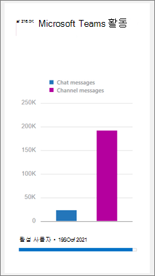

Microsoft 팀을 위한 활동 보고서 사용 
========================================

Microsoft 365 관리 센터에서 활동 보고서를 사용 하 여 조직의 사용자가 Microsoft 팀을 사용 하는 방법을 확인할 수 있습니다. 예를 들어 일부 Microsoft 팀을 사용 하지 않는 경우 시작 하는 방법을 모르는 경우 팀을 사용 하 여 생산성과 공동 작업을 수행할 수 있는 방법을 이해 하지 못할 수 있습니다. 조직에서 활동 보고서를 사용하여 교육 및 커뮤니케이션 노력에 대한 우선 순위를 결정할 수 있습니다.

## 보고서 대시보드에서 팀 보고서를 보는 방법

1. [Microsoft 365 관리 센터](https://portal.office.com/adminportal/home)에서 **보고서** > **사용 현황을**선택 합니다.
 
2. **배정 현황** 페이지에서 **보고서 선택을**선택 하 고 보고서 목록의 **Microsoft 팀** 에서 보려는 보고서를 선택 합니다.

## 사용할 수 있는 팀 활동 보고서

현재 볼 수 있는 활동 보고서는 다음과 같이 두 가지가 있습니다.

- [Microsoft 팀 사용자 활동 보고서](#microsoft-teams-user-activity-report) 
- [Microsoft 팀 장치 사용 보고서](#microsoft-teams-device-usage-report) 

### Microsoft 팀 사용자 활동 보고서

팀 사용자 활동 보고서를 통해 사용자가 팀에서 수행 하는 가장 일반적인 활동을 볼 수 있습니다. 여기에는 채널의 채팅에 참여 하는 사용자의 수, 개인 채팅 메시지를 통한 통신 수, 통화 또는 모임 참가 수 등이 포함 됩니다. 전체 조직에 대 한이 정보와 각 개별 사용자에 대 한 정보를 볼 수 있습니다.

#### Microsoft 팀의 사용자 활동 보고서 해석

**활동** 및 **사용자** 차트를 보고 팀의 사용자 활동에 대 한 보기를 가져올 수 있습니다.

|호출 |설명  |
|--------|-------------|
|**1**   |팀 사용자 활동 보고서는 지난 7 일, 30 일, 90 일 또는 180 일 동안의 추세에 대해 볼 수 있습니다. 그러나 보고서에서 특정 시간 범위에 클릭 하는 경우 테이블 (7)에는 보고서가 생성 된 날짜까지 30 일간 데이터 (2)가 표시 됩니다. |
|**2**   |각 보고서에는이 보고서가 생성 된 날짜에 대 한 날짜가 있습니다. 일반적으로이 보고서에는 활동 시간부터 24 ~ 48 시간 대기 시간이 반영 됩니다. |
|**3**   |**활동** 보기에는 활동 유형별 Microsoft 팀 활동 수가 표시 됩니다. 활동 유형은 팀 채팅 메시지 수, 개인 채팅 메시지, 통화, 회의 등입니다. |
|**4(tcp/ipv4)**   |**사용자** 보기에는 활동 유형별 사용자 수가 표시 됩니다. 활동 유형은 팀 채팅 메시지 수, 개인 채팅 메시지, 통화, 회의 등입니다. |
|**5mb**   |차트의 X 축은 특정 보고서에 대해 선택 된 날짜 범위입니다. <ul><li>**활동** 차트에서 Y 축은 지정 된 활동의 수입니다.</ul></li> <ul><li>**사용자** 차트에서 Y 축은 팀 채팅, 개인 채팅, 통화 또는 모임에 참여 한 사용자 수입니다.</ul></li> |
|**26**   |범례에서 항목을 클릭 하 여 차트에 표시 되는 계열을 필터링 할 수 있습니다. 예를 들어 **활동** 차트에서 **채널 메시지**, **채팅 메시지**, **통화**또는 **모임을** 클릭 하거나 탭 하 여 각 항목에 관련 된 정보만 표시 합니다. 이 선택을 변경 해도 그리드 표의 정보는 변경 되지 않습니다. |
|**7**   |활성 팀 목록 (180-일별) 보고 시간 프레임  활동 수는 날짜 선택에 따라 달라 집니다.    표에 다음 정보를 표시 하려면 열을 표에 추가 해야 합니다. <ul><li>**Username** 은 사용자의 전자 메일 주소입니다. 실제 전자 메일 주소를 표시 하거나이 필드를 익명으로 설정할 수 있습니다.</ul></li> <ul><li>**마지막 활동 날짜 (UTC)** 는 사용자가 Microsoft 팀 활동에 참여 한 마지막 날짜를 나타냅니다.</ul></li> <ul><li>**채널 메시지** 는 사용자가 지정 된 기간에 팀 채팅에 게시 한 고유 메시지 수입니다.</ul></li> <ul><li>**채팅 메시지** 는 사용자가 지정 된 기간 동안 비공개 채팅에 게시 한 고유 메시지 수입니다.</ul></li> <ul><li>**통화** 는 사용자가 지정 된 기간에 참가 한 통화 수입니다.</ul></li> <ul><li>**모임은** 지정 된 기간 동안 사용자가 참가 한 온라인 모임의 수입니다.</ul></li> <ul><li>**다른 활동** 은 사용자에의 한 다른 팀 활동의 수 이며, 제한 되지 않은 메시지, 앱, 파일 작업, 검색, 팀 및 채널 팔 로우, 즐겨찾기에 등이 포함 됩니다.</ul></li> <ul><li>**삭제** 됨은 팀이 삭제 되었는지 여부를 나타냅니다. 팀이 삭제 되었지만 보고 기간에 활동이 있는 경우 삭제 된 true로 설정한 내용이 눈금에 표시 됩니다.</ul></li> <ul><li>**삭제 된 날짜** 는 사용자가 삭제 된 날짜입니다.</ul></li> <ul><li>**할당 된 제품은** 사용자에 게 할당 된 제품의 목록입니다.</ul></li>조직의 정책에 따라 사용자 정보가 식별 가능한 보고서를 볼 수 없는 경우에는 이러한 모든 보고서에 대 한 개인 정보 설정을 변경 하면 됩니다. [Microsoft 365 관리 센터 미리 보기의 활동 보고서](https://support.office.com/article/activity-reports-in-the-office-365-admin-center-0d6dfb17-8582-4172-a9a9-aed798150263)에서 **사용자 수준 세부 정보를 숨기는 방법** 섹션을 확인 하세요.</ui> |
|**20cm(8**   |표에서 열을 추가 하거나 제거 하려면 **열** 을 클릭 하거나 탭 합니다. |
|**되었는지**   |**내보내기를** 클릭 하거나 탭 하 여 보고서 데이터를 Excel .csv 파일로 내보냅니다. 이렇게 하면 모든 사용자의 데이터가 내보내며 추가 분석을 위해 간단한 정렬 및 필터링이 가능 합니다. 2000 명 미만의 사용자가 있는 경우 보고서 자체의 표 내에서 정렬 및 필터링을 수행할 수 있습니다. 2000 명 이상의 사용자가 있는 경우 보고서를 필터링 하 고 정렬 하려면 데이터를 내보내야 합니다. 

### Microsoft 팀 장치 사용 보고서

팀 장치 사용 보고서는 사용자가 모바일 앱을 비롯 한 팀에 연결 하는 방법에 대 한 정보를 제공 합니다. 보고서는 조직에서 사용 하는 디바이스와 이동 중에 작업 하는 사용자의 수를 파악 하는 데 도움이 됩니다.

### Microsoft 팀 장치 사용 현황 보고서 해석

**사용자** 및 **분포** 차트를 확인 하 여 팀 디바이스 사용에 대 한 보기를 얻을 수 있습니다.

|호출 |설명  |
|--------|-------------|
|**1**   |팀 장치 보고서는 지난 7 일, 30 일, 90 일 또는 180 일 동안의 추세에 대해 볼 수 있습니다. 그러나 보고서에서 특정 시간 범위에 클릭 하는 경우 테이블 (7)에는 보고서가 생성 된 날짜까지 30 일간 데이터 (2)가 표시 됩니다. |
|**2**   |각 보고서에는이 보고서가 생성 된 날짜에 대 한 날짜가 있습니다. 일반적으로이 보고서에는 활동 시간부터 24 ~ 48 시간 대기 시간이 반영 됩니다. |
|**3**   |**사용자** 보기에는 디바이스 유형별 일일 사용자 수가 표시 됩니다. |
|**4(tcp/ipv4)**   |**배포** 보기에는 선택한 기간 동안의 장치별 사용자 수가 표시 됩니다.  |
|**5mb**   | <ul><li>**사용자** 차트에서 X 축은 보고서에 대해 선택 된 날짜 범위이 고 Y 축은 디바이스 유형별 사용자 수입니다.</ul></li> <ul><li>**분포** 차트에서 X 축은 팀 연결에 사용 되는 여러 장치를 표시 하 고 Y 축은 장치를 사용 하는 사용자 수입니다.</ul></li> |
|**26**   |범례에서 항목을 클릭 하 여 차트에 표시 되는 계열을 필터링 할 수 있습니다. 예를 들어 **배포** 차트에서 **Windows**, **Mac**, **Linux**, **웹**, **iOS**또는 **Android** 를 클릭 하거나 탭 하 여 각 항목에 관련 된 정보만 표시 합니다. 이 선택을 변경 해도 그리드 표의 정보는 변경 되지 않습니다. |
|**7**   |활성 팀 목록 (180-일별) 보고 시간 프레임  활동 수는 날짜 선택에 따라 달라 집니다.    표에 다음 정보를 표시 하려면 열을 표에 추가 해야 합니다. <ul><li>**Username** 은 사용자의 전자 메일 주소입니다. 실제 전자 메일 주소를 표시 하거나이 필드를 익명으로 설정할 수 있습니다.</ul></li> <ul><li>**마지막 활동 날짜 (UTC)** 는 사용자가 팀 활동에 참여 한 마지막 날짜를 나타냅니다.</ul></li> <ul><li>**삭제** 됨은 팀이 삭제 되었는지 여부를 나타냅니다. 팀이 삭제 되었지만 보고 기간에 활동이 있는 경우 삭제 된 true로 설정한 내용이 눈금에 표시 됩니다.</ul></li><ul><li>**삭제 된 날짜** 는 사용자가 삭제 된 날짜입니다.</ul></li> <ul><li>**Windows는** 사용자가 windows 기반 컴퓨터의 팀 데스크톱 클라이언트에서 활성 상태 였던 경우 선택 됩니다.</ul></li> <ul><li>**Mac** 은 사용자가 macos 컴퓨터의 팀 데스크톱 클라이언트에서 활성 상태 였던 경우 선택 됩니다.</ul></li>  <ul><li>**Linux는** 사용자가 linux 컴퓨터의 팀 데스크톱 클라이언트에서 활성 상태 였던 경우 선택 됩니다.</ul></li>   <ul><li>사용자가 팀 웹 클라이언트에서 활성 상태 였던 경우 **웹** 이 선택 됩니다.</ul></li> <ul><li>사용자가 iOS 용 팀 모바일 클라이언트에서 활성 상태 였던 경우 **ios** 가 선택 됩니다.</ul></li> <ul><li>Android 용 팀 모바일 클라이언트에서 사용자가 활성 상태 였던 경우 **android 전화** 를 선택 합니다.</ul></li></li> <ui>조직의 정책에 따라 사용자 정보가 식별 가능한 보고서를 볼 수 없는 경우에는 이러한 모든 보고서에 대 한 개인 정보 설정을 변경 하면 됩니다. [Microsoft 365 관리 센터 미리 보기의 활동 보고서](https://support.office.com/article/activity-reports-in-the-office-365-admin-center-0d6dfb17-8582-4172-a9a9-aed798150263)에서 **사용자 수준 세부 정보를 숨기는 방법** 섹션을 확인 하세요.</ui> |
|**20cm(8**   |표에서 열을 추가 하거나 제거 하려면 **열** 을 클릭 하거나 탭 합니다. |
|**되었는지**   |**내보내기를** 클릭 하거나 탭 하 여 보고서 데이터를 Excel .csv 파일로 내보냅니다. 이렇게 하면 모든 사용자의 데이터가 내보내며 추가 분석을 위해 간단한 정렬 및 필터링이 가능 합니다. 2000 명 미만의 사용자가 있는 경우 보고서 자체의 표 내에서 정렬 및 필터링을 수행할 수 있습니다. 2000 명 이상의 사용자가 있는 경우 보고서를 필터링 하 고 정렬 하려면 데이터를 내보내야 합니다. 

## 팀 활동 보고서에 액세스할 수 있는 사람

활동 보고서에는 할당 된 사용자가 액세스할 수 있습니다.

- Office 365 전역 관리자 역할
- 제품 관련 관리자 역할 (Exchange, 비즈니스용 Skype 또는 SharePoint)
- 보고서 독자 역할

### 보고서 독자 역할

*보고서 읽기 프로그램* 역할을 해당 보고서에 대 한 액세스 권한을 부여 하려는 비 IT 담당자에 게 할당할 수 있습니다. 교육 관리자나 비즈니스 관련자에 게이 역할을 할당 하 여 팀의 채택을 확인 하 고 추적 하는 데 도움이 되는 정보에 대 한 액세스 권한이 있는지 확인할 수 있습니다.

## 보고서 대시보드의 기타 정보

### 한눈 활동 위젯

Reports 대시보드에는 사용자가 Office 365의 다른 다양 한 서비스를 사용 하 여 통신 하 고 공동 작업 하는 방법에 대 한 교차 제품 보기가 제공 되는 간략 한 활동 위젯의 팀의 사용량 데이터가 포함 됩니다.

### 팀 활동 카드

보고서 대시보드의 팀 활동 카드는 활성 사용자 수를 포함 하 여 팀의 활동에 대 한 개요를 제공 하므로 서비스를 사용 하는 사용자 수를 신속 하 게 파악할 수 있습니다. 대시보드에서 활동 카드를 클릭 하면 팀 사용자 활동 보고서로 이동 합니다. 

