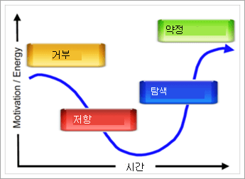

# 조직에서 Microsoft 팀을 준비 하는 방법은 무엇 인가요?How ready is your organization for Microsoft Teams?

이제 프로젝트 팀이 공동으로 작업 하 고 조직에 대해 수행할 수 있는 팀을 확인 하기 시작 하면 조직에서 팀 전환에 대 한 조직의 준비 상태를 평가 하는 것이 중요 합니다.Now that your project team has come together and you are beginning to see what Teams can do for your organization, it's important to assess your organization's readiness for the Teams transition. 준비를 평가 하려면 다음을 수행 해야 합니다.To assess your readiness, you will need to:

1. 관련자를 평가 합니다.Assess your stakeholders.
2. 조기 도입자를 확인 합니다.Identify early adopters.
3. 조직의 상태를 변경할 것인지 평가 합니다.Evaluate the organization's readiness for change. 

## 관련자 평가Assess your stakeholders

조직의 핵심 관련자와 비즈니스 리더를 나열 합니다.List the core stakeholders and business leaders in your organization. 각 개인에 대해 다음 질문을 확인 합니다.For each individual, ask the following questions:
 
1. 이 리더가 새로운 기술에 대 한 이해를 하시 나요?Is this leader friendly to new technology?
2. 현재 기술에 대 한이 리더의 만족도를 평가해 보세요.Rate this leader's satisfaction with your current technology.
3. 이 리더는 unsanctioned 기술을 사용 하 여 결과를 가속화 하거나 팀 구성원에 게 더 나은 환경을 만드는 것이 있나요?Is this leader willing to use unsanctioned technology to accelerate results or create a better experience for his/her team members?
4. 이 리더가 주요 비즈니스 결과를 전달 하는 데 많은 부담을 주는가?Is this leader under a high degree of pressure to deliver key business results? 
5. 이 리더는 전환을 지원 하기 위해 팀과 자신의 경험을 evangelize 하 게 됩니다.Will this leader be willing to evangelize his/her experience with Teams to assist in the transition?
6. 이 리더가 기존 프로젝트 팀의 주요 구성원과 긍정적으로 관계가 있나요?Does this leader have a positive relationship with key members of the existing project team?
7. 이 리더를 조직 내 "변경 에이전트"로 표시 하 시겠습니까?Does this leader like to be viewed as an "agent of change" within the organization?  

조직과 관련 된 질문을 더 추가할 수 있습니다.You can add additional questions that are relevant to your organization. 처음 두 단계의 경우 (시작 및 실험)에는 변경 하는 데 익숙한 리더와 현재 기술에 약간 불만족, 그리고 적절 한 관계를 제공 합니다.For your initial two phases (startup and experiment), you'll see leaders who are friendly to change, somewhat dissatisfied with current technology, and that you have a good relationship with. 이러한 팀장은 비즈니스 관리자로 서 핵심 프로젝트 팀으로 가져와야 하며, 실험 단계에 필수적인 프로젝트가 있을 수 있습니다.These leaders should be brought into the core project team as business advisors and may have projects that will be essential for your experimentation phase. 처음 실험을 위한 높은 위험 수준 프로젝트를 방지 하기 위해 실험해 볼 수 있는 실제 상황을 선택 하는 것이 중요 합니다.It is important to select impactful, real world situations to experiment with, and avoid high risk projects for your initial experiments.
   
> [!NOTE]
> 조직 내에서의 인적 관계 요소에 대 한 영향을 최소화 하는이 질문에 점수를 할당할 수는 있지만, 변화를 추진 하는 것은 기술 기술 또는 비즈니스 acumen 만큼 팀의 연금술에 따라 달라 집니다.While it's possible to assign a score to this sort of questionnaire that would minimize the impact of the human element of relationships within your organization, driving change depends on the chemistry of the team as much as their technical skill or business acumen. 팀 구성원과 함께이 목록을 검토 하 여 다음 단계로 프로젝트와 직원을 선택할 때이 프로젝트를 사용 하 여 다양 한 리더를 토론할 수 있습니다.Review this list with your team members to discuss the "fit" of your various leaders with this project as you select projects and staff for subsequent phases. 

## 조기 도입자 확인Identify early adopters

초기의 사용자는 조직의 규모 또는 업계에 관계 없이 특정 특성을 공유 합니다.Early adopters share certain traits no matter what size or industry your organization may be. 일반적으로 초기에는 다음과 같은 특징이 공유 됩니다.Typically, early adopters share these traits:

- 기술 관련 관심이Interested in technology
- 변경의 일부일 수 있습니다.Willing to be a part of change
- 개선 하기 위해 검색Seeking to make improvements
- 본질적으로 공동 작업Collaborative by nature
- 자신의 관찰 및 학습이를 그룹과 공유 하기Willing to share their observations and learnings with the group
- 위험 takers. 즉, 제대로 작동 하는지 확인 하는 것을 시도 하겠습니다.Are risk takers; that is, they're willing to try something to see if it works

Office 365의 간단한 양식을 사용 하 여 이러한 개인이 팀의 초기 도입자 프로그램을 선택할 수 있도록 합니다.Use a simple form in Office 365 to allow these individuals to opt into your early adopter program for Teams. 조직의 규모 및 복잡도에 따라 실험 단계에서 이러한 개인 중 일부나 전부를 사용 하도록 선택할 수 있습니다.Depending on the size and complexity of your organization, you may choose to enable some or all of these individuals for your experimentation phase. 이 프로그램에서는 실험 단계에 적극적으로 참여 하 고 프로젝트 팀에 게 정기적으로 피드백을 제공 하는 데 동의 하는 것입니다.In this program, they are agreeing to actively participate in your experimentation phase and provide regular feedback to the project team. 단순히 드라이브 신기술을 테스트 하고자 하는 사람을 피하는 것이 좋습니다.Avoid having individuals who simply want to test drive new technology. 이 활성 피드백을 제공 하 여 프로젝트의 결과를 작성 하는 데 도움이 되는 것을 알립니다.Let them know that by giving this active feedback, they are helping to craft the outcome of your project. [2 단계 실험](teams-adoption-phase2-experiment.md)에서이 사람 목록을 사용 합니다.You will use this list of people in [Phase 2 - experiment](teams-adoption-phase2-experiment.md).

초기 도입자 프로그램 가이드는 해당 환경에서이 프로그램을 계획는 데 도움이 되는 유용한 리소스입니다.Our Early Adopter Program Guide is a helpful resource for kicking off this program in your environment.  
 
## 조직의 변경 준비 상태 평가Assess your organization's readiness for change

변경은 기술과 관련 하 여 수행 해야 하는 인적 프로세스입니다.Change is a human process that has nothing to do with technology. 변화에 대 한 자연 저항력을 도움말이 하는 행동 psychology 및 neuroscience 있습니다.There is behavioral psychology and neuroscience that educates us about the natural resistance to change. 변경 내용을 적용할 수 있으려면 사용자의 요구를 예상 하 고 해당 상황에 대 한 이해를 표현 하 고 해당 상황을 개선 하는 솔루션을 만들어야 합니다.To make change acceptable, it's critical to anticipate the needs of your users, express your understanding of their situation, and create solutions that improve that situation. 이렇게 해도 변화에 대 한 자연 저항력을 경험할 수 있습니다.Even in doing so you will encounter natural resistance to change.  

모든 조직은 지역, 작업 스타일, 전문적인 프로필, 조직의 기타 요소에 따라 변경 사항이 달라 집니다.Every organization approaches change differently, depending on region, work style, professional profile, and other elements of the organization. 조직의 준비 상태를 평가 하려면 [조직 변경 준비 상태 평가](upgrade-org-change-readiness.md)를 참조 하세요.To assess your organization's readiness, see [Assess organizational change readiness](upgrade-org-change-readiness.md). 지침을 사용 하 여 다음 질문에 대답 합니다.Use the guidelines to answer the following questions:

1. 각 버킷에 있는 사용자의 비율은 얼마 입니까?What percentage of users fall into each bucket? (*저항 변경*)(*Change resistance*)
    - **조기**요구: 해결 방법을 제공 하기 전에 먼저 요청 하세요.**Early adopters**: request the solution before it's available.
    - **사용자에 게 알리기**: 값이 입증 된 경우 솔루션을 사용 합니다.**Informed users**: use the solution once its value is proven.
    - **Dissenters**: 변경 내용을 다시 푸시합니다.**Dissenters**: push back on any change.
    
   > [!TIP]
   > 초기에는 훌륭한 파일럿 테스터와 피어 챔피언.Early adopters make great pilot testers and peer champions. 새로운 도구를 채택 하는 속도가 느려지는 사용자는 추가 encouragement와 더 많은 시간을 조정 해야 합니다.Users who are slow to adopt new tools require additional encouragement and more time to adjust. 

2. 사용자가 변경할 수 있는 능력은 무엇 인가요?What is the users' competency for change? (*교육*)(*Training*)
    - **자체** 옵션을 통해 비디오에 대 한 링크만 필요 합니다.**Self starters** require only a link to a video.
    - **팀 구축자** 는 그룹 교육을 통해 잘 작동 합니다.**Team builders** do well with group training.
    - **일대일 학습자** 는 개인 지원이 필요 합니다.**One-to-one learners** require personal support.

    > [!TIP]
    > 능력 및 가상 사용자에 게 교육의 유형 및 양을 조정 합니다.Tailor the type and amount of training to competency and personas. 새로운 기능이 온라인 상태가 되 면 교육을 최신 상태로 유지 합니다.Keep training updated as new features come online.

3. 이 서비스 배포 외에도 발생 하는 다른 변경 사항은 몇 개입니까?In addition to this service deployment, how many other changes are happening? (*적응성*)(*Adaptability*)  변경 사항에는 Office/Windows 업그레이드, 사무실 이동, 합병, reorgs 등이 포함 됩니다.Changes could include Office/Windows upgrades, office moves, mergers, reorgs, and so on.
    - 없음None
    - 1-3 변경1-3 changes
    - 3 개 이상 변경More than 3 changes
 
    > [!TIP] 
    > 너무 많은 변경이 허용 및 생산성을 방해할 수 있습니다.Too much change can impede acceptance and productivity. 3 개 이상의 변경 내용이 진행 되 고 있는 경우에는 축소 하거나 테마를 만들어 변경 내용을 그룹화 하는 것이 좋습니다.If more than 3 changes are underway, consider spacing them out or creating a theme to bundle changes together.  

이 데이터를 초기 도입자 프로그램을 옵트인 하려는 직원과 관계자 프로필에 결합 합니다.Combine this data with the stakeholder profiles and employees who wish to opt in for the early adopter program. 이를 통해 준비가 된 그룹을 식별 하 고 기존 의무와 함께 변경할 수 있습니다.This will let you identify groups that are ready for and can absorb change alongside their existing duties. 이 메서드를 사용 하 여 파트너를 변경 내용으로 만들 수 있습니다.This method will allow you to create partners in change.

내부 챔피언를 사용 하 여 다양 한 변경 형식이 있는 문제를 해결할 수 있습니다.You can use internal champions to address the problem of having different change types. 여기에서 피드백은 성공의 주요 사항입니다. 사용자가 챌린지와 요구 사항을 공유 하도록 장려 합니다.Here, feedback is the key to success: encourage people to share their challenges and needs. Disrupters를 도입 하 고 실험 하는 동안 해당 사용자 또는 그룹을 해당 테이블에 제공 하 여 입력 합니다.Embrace disrupters and dissenters by giving these individuals or groups a seat at the table during experimentation. 이 모범 사례는 공동 작업 향상을 더욱 광범위 하 게 배포 하는 방법을 pave 것입니다.This best practice will pave the way for a smoother broad deployment of your collaboration improvements.  

 를 나타내는 아이콘 다음: [Microsoft 팀 채택 2 단계: 실험](teams-adoption-phase2-experiment.md) Next: [Microsoft Teams adoption phase 2: Experiment](teams-adoption-phase2-experiment.md) 
