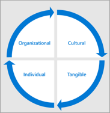

# 사용자 채택에 대한 결과 및 성공 Microsoft Teams 정의

현대화하는 모든 비즈니스 시나리오 또는 서비스의 경우 비즈니스에 대한 성공의 모양을 정의하는 것이 중요합니다. 이전 단계에서 매핑할 때 초기 시나리오에 대한 해당 정보를 수집했습니다. 확장 구현을 준비할 때 이러한 중요한 성공 조건을 다시 확인하고 확장해야 합니다.
  
다음은 이러한 조건을 매핑하기 위한 권장 전략입니다. 이 단계에 대한 많은 유효한 접근 방식이 있습니다. Microsoft 가이드를 따르거나 작업할 Microsoft 파트너의 가이드를 따를 수 있습니다. 어떤 방법을 선택하든지, 서비스의 기술 구현 및 조직의 전반적인 목표에 의해 비즈니스 결과가 지원되는지 확인해야 합니다.
  
비즈니스에 우선 순위를 지정할 수 있는 결과의 네 가지 범주가 있습니다. 상호 연결되어 개별 직원이 경험할 현대화 및 디지털 변환의 토대를 형성합니다.  

각 범주의 결과의 예는 다음과 같습니다.

- **조직**
   - 문화적 변환
   - 직원 보존
   - 인재 획득
   - 소셜 참여
   - 운영 민첩성 

- **문화**
   - 직원 정서
   - 직원 권장 사항
   - 고객 피드백
   - 혁신 조치(예: 아이디어 포럼 기여, 해커톤, 제품 혁신 참여)

- **Tangible**
   - 고객 환경 영향(빠른 서비스, 서비스 인시던트 감소, 고객 추천/로열티 프로그램 참여)
   - 비용 절감
   - 수익 생성
   - 데이터 보안
   - 프로세스 단순화
   - 레거시 시스템 사용 중지
   
- **개인**
   - 원하는 도구 사용
   - 직원의 도덕적
   - 직원 생산성
   - 직원 참여
   - 아이디어 생성
 
일반적으로 이러한 측정값을 집계하여 회사에 대한 변경 할당량은 이 방식으로 만들어야 합니다.

## 서비스 사용 전략 선택

Teams 혁신 기술입니다. 따라서 조직의 크기와 기존 기술에 따라 다른 접근 방식을 취할 수 있습니다. 다음 전략을 고려합니다.

| Teams 첫 번째 | Teams Core | Teams 큰 이동 | Skype 좌우 정렬 | 마이그레이션 |
|------------ | ---------- | ------------ | ------------------ | --------- |
| 클라우드 배포를 Teams | 리드 공동 작업 시나리오를 사용하여 Teams | 모든 직원 Teams 조직 전체 팀 | Teams 및 비즈니스용 Skype | 사용자 마이그레이션을 비즈니스용 Skype Teams |
| - 신규 또는 낮은 사용 Microsoft 365 또는 Office 365 적용 가능  - 고객 Teams 시나리오에서 잠재 고객을 위한 잠재 고객  - 통합된 사용자 환경 및 사용자 또는 사용자에 대한 가치 Microsoft 365 가속화된 Office 365  - 직렬 구현을 방지하기 위해 함께 계획 워크로드 활성화 수행 | - Teams 및 OneDrive SharePoint 사용  - Microsoft Stream과 뉴스 리소스 및 비디오를 공유하는 회사 인트라넷 만들기 **더 나은 함께**:  Teams SharePoint Yammer Planner PowerApps |- 5000석 미만의 고객(현재 제한) - 모든 팀과 조직 간 공동 작업 사용 - 일반적인 작업 자동화(휴가 요청, 직원 설문 조사, 임원 참여) |- Teams 핵심 전술을 사용하여 공동 작업 가속화 - 필요한 크기 및 기능 집합에 따라 모임 시나리오 지침 강조 표시 - 엔터프라이즈 비즈니스용 Skype, 상호 연동성 및 하이브리드 시나리오에 사용할 수 있습니다. - 기능 계획에 공용 로드맵을 사용 합니다. |- 고객에 Teams 비즈니스용 Skype 전략 로드맵을 만들어 계획 - 기능 릴리스 일정에 연결 - 전환을 용이하게 Teams 나란히 포함하고 코어를 추가하는 것이 좋습니다.

다음은 대부분의 고객 조직에 대한 권장 사항입니다. 그러나 예외가 있습니다. 여기에서 다루지 않는 시나리오에 대한 지침을 얻거나, 드라이빙 채택 커뮤니티에서 질문하거나 팀 또는 Microsoft 파트너 네트워크에 FastTrack 문의하세요.

- **첫 Teams 또는** Teams Core: 대부분의 조직에는 Microsoft 기술에 대한 기존 투자가 있습니다. 한 번씩 두 개 이상의 워크로드를 사용하도록 설정하는 경우(예: Exchange Online, 비즈니스용 OneDrive 또는 SharePoint. 이러한 경우 첫 번째 또는 Teams 또는 Teams 선택하는 것이 현명한 선택입니다. 사용자가 향상된 공동 작업 환경을 사용할 수 Teams. 그런 다음 공동 작업 프로젝트 팀은 성공하기 위해 필요한 추가 기능 및 교육 및 지원을 롤아웃할 계획입니다. 

- **큰 Teams** 선택 : 새로운 Microsoft 365 Office 365 조직에서 새로운 기술을 여러 번 학습하여 Teams 변경 피로를 최소화하기 위해 Go Big 접근 방식을 사용하는 것이 가장 좋습니다. 핵심 공동 작업 및 Teams, SharePoint, OneDrive, 플래너 및 기타 워크로드에 대해 모두 사용할 수 있도록 설정하고 직원들이 배포의 컨텍스트에서 해당 워크로드에 대해 Teams 이점을 얻을 수 있습니다. 

    Teams Go Big은 직원 커뮤니케이션 및 참여를 간소화하려는 1,000명 미만의 조직에서 선호하는 사용 전략입니다. 조직 전체 팀을 사용하여 모든 디바이스에서 일반적인 작업 및 이니셔티브를 검토할 수 있습니다. 

- **나란히** 선택 : 오디오 회의, 비즈니스용 Skype 회의실 디바이스 또는 클라우드 음성 기능에 대한 지원 또는 클라우드 음성 기능을 사용하는 조직의 경우 직원에게 핵심 공동 작업 기능에 익숙해지기 위해 Teams 비즈니스용 Skype Skype 및 클라우드 음성 기능을 나란히 실행하는 것이 좋습니다. 회사에 대한 부적격입니다. 두 클라이언트를 나란히 실행하면 사용할 도구에 대한 사용자 혼동이 가중될 수 있으므로 이 단계를 채택하는 동안 짧게 유지하는 것이 좋습니다. 

- **마이그레이션 선택**: 마이그레이션 : 비즈니스용 Skype Teams 추가 구성 요소가 있지만 사용자 채택 여정에는 Go Big 구현과 동일한 구성 요소가 Teams 있습니다. 또한 모임 환경 및 인터페이스, Teams 영구 채팅 동작 및 다른 환경의 다른 요소에 대해 비즈니스용 Skype.

각 사용 전략에 대해 사용자 환경이 훌륭한 직원 환경을 제공할 수 있도록 기술 준비 팀과 긴밀히 협력해야 합니다. 

 결정: 비즈니스 성과를 가장 잘 지원하고 기술 구현 팀에서 사용할 수 있는 Microsoft Teams 사용 전략을 선택합니다. 이는 IT 리더십, 프로그램 관리 리드 및 사용자 채택 전문가 간의 공동 결정입니다. 이 결정은 종종 조직의 공동 작업 또는 공동 작업 서비스에 대한 Microsoft Teams 최종 성공 소유자인 경영진에게 있습니다.

모범 사례: 사용 전략은 프로젝트 또는 부서 구현 일정의 주어진 단계에 적합할 수 있습니다. 주요 사람 및 그 요구 사항을 사용하여 선택을 합니다. 기술 구현 팀과 긴밀히 협력하여 사용자에게 고품질 환경을 보장합니다.  

## 이해 관계자 참여

통신 및 기대 관리는 성공적인 변경 프로젝트의 핵심 요소입니다. 조직의 이해 관계자 및 다른 이에게 해당 목표에 대한 전반적인 비전과 진행 상황을 정기적으로 전달하는 것이 중요합니다. 

 결정: 회사 문화에 맞게 이해 관계자와 통신하는 리듬과 방법을 결정합니다. 조직 전체의 다양한 참여 및 관심 수준에 대한 커뮤니케이션을 대상으로 합니다. 

옵션: 프로젝트에 대한 지속적인 기술 자료의 작성을 위해 통신 사이트에서 뉴스 페이지를 SharePoint 고려합니다. 뉴스 페이지 라이브러리(계획 팀과 SharePoint 사이트의 사이트 페이지)를 공개하여 모든 관심 있는 당사자와 공유할 수 있습니다.

## 구현 팀 확장

대규모 조직에서는 광범위한 사용 단계에 다양한 역할을 통합해야 합니다. 여기에는 추가 비즈니스 스폰서, IT 지원 직원, 챔피언 커뮤니티의 추가 구성원 및 경우에 따라 공식적인 변경 관리 또는 교육 담당자가 포함됩니다. 아래 그림에서는 업무를 분리할 수 있는 대규모 채택 팀을 보여 주었다.

소규모 조직에서는 이러한 역할 중 하나 이상을 단일 개인이 수행할 수 있지만 필요한 기술은 동일하게 유지됩니다.  성공적인 변경 프로젝트에서 기술, 통신 및 교육 기술이 중요합니다. 

## 거버넌스 및 정보 관리 정책 확장

사용 전략이 선택되면 1단계에서 결정한 거버넌스 결정을 다시 확인 및 확장할 준비가 됩니다. 거버넌스에서 의사 결정 1에서  6을 다시 시작하여 이 정책을 사용할 비즈니스 사용자와 Teams. 

| 팀 수준 | 범위/목적 | 표준 멤버 자격 | 기간 |
|----------- | ------------- | ------------------- | -------- |
|수준 1 | 부서 또는 사업부에 대한 권위 있는 팀 | 일반적으로 이 부서/단위의 공식 구성원으로 제한됩니다. | 부서가 있는 한 지속성(예: IT 부서, 인사 관리, 마케팅)|
| 수준 2 | Project 범위가 작은 팀, 서비스 또는 이니셔티브 팀 |  일반적으로 조직 간 및 게스트를 포함할 수 있습니다. | 프로젝트 또는 서비스가 작동하고 있는 한 |
| 수준 3 | 시점 프로젝트 | 개별 범위가 있는 작은 타이트한 니트 팀; 게스트를 포함할 수 있습니다. | 핵심 결과물에 묶인 짧은 수명 주기 |

팀 수준 프로비전 및 관리 모범 사례 예제:

|팀 수준 | Who 만들 수 있나요? | 래벨 및 보존 | 고려 사항 |
| --------- | ------------ | -------------------- | -------------- |
| 수준 1 - 디비전 | 해당 그룹에 대한 IT 또는 챔피언의 이름을 올바르게 지정합니다. | 표준 보존 정책이 적용된 기밀 및 1년 갱신 정책 | 도메인 이름을 보존하는 것 같은 생각을 합니다. 디비전 팀의 이름을 지정하는 방법과 포함된 기능을 제어할 수 있습니다.  사용자를 추가하기 전에 팀을 디자인합니다.|
| 수준 2 - Project/서비스 | Project 또는 챔피언 | 콘텐츠에 따라 기밀 또는 기밀성이 매우 높습니다. 보존 정책이 있을 수 있습니다. 6개월 갱신. | 이 작업을 만들기 전에 작업하는 프로젝트 또는 서비스의 경계를 넘어 생각해야 합니다. 다른 팀과 힘을 결합하는 것이 더 합리적일까요? 동일한 프로젝트 또는 서비스를 작업할 때 개별 사용자가 방문해야 하는 팀 수를 최소화하기 위해 모든 노력을 기울입니다.|
| 수준 3 – 소규모 On-Demand 프로젝트 팀 | 조직의 모든 사용자 | 표준 보존 및 6개월 갱신이 있는 일반 레이블입니다. 이름 규칙(접두사/접미사)을 포함할 수 있습니다.| 셀프 서비스 On Demand 팀. 마찰 없는 프로비전. 이를 통해 회사에서 제공하는 서비스에서 즉각적인 가치를 얻게 될 소규모 프로젝트 팀의 원활한 공동 작업 및 통신을 용이하게 할 수 있습니다. |

## 비즈니스 참여 간소화

디지털 변환 및 사용 현황을 Microsoft Teams 필요한 요소, 기회 및 어려움을 이해하기 위해 비즈니스 단위와 협력하는 것입니다. 기존의 IT와 비즈니스 대화와 비슷하게 필요한 대화에 집중해야 합니다. 기술 요구 사항으로 이동하기 전에 듣습니다. 대부분의 경우 조직의 기능을 Teams 기능을 사용할 수 있습니다.   

모범 사례: 사용자 지정 솔루션을 개발하는 것을 고려하기 전에 조직에서 사용자 지정 솔루션 또는 Microsoft 365 기능을 완전히 Office 365. 사용자 지정 솔루션 개발은 항상 IT 및 지원 부서에 대한 장기 비용을 부담합니다.
 
다음 단계를 수행하여 비즈니스 단위로 작업을 간소화합니다.  대규모의 다국적 기업에서 이 프로세스는 첫 번째 대규모 배포 후에도 계속될 수 Microsoft Teams.

1. 인사이트와 맞춤을 얻기 위해 임원을 참여하기 전에 비즈니스 단위 내의 주요 영향력 있는 인사이트를 만나보자.
2. 일반적인 시나리오(전자 메일, 전자 메일SharePoint, Yammer 솔루션 이해
3. 규모를 조정할 때 높은 영향, 낮은/중간 난이도에 매핑된 시나리오를 선택하여 작은 시작
4. 전환을 지원하기 위해 비즈니스 단위 지식을 통해 피드백을 캡처하고 챔피언을 개발합니다.
5. 진행 상황을 논의하고 추가 프로젝트의 백로그 우선 순위를 지정하기 위해 월별 확인 지점을 설정합니다.

 다음: [피드백 및 보고 최적화](teams-adoption-optimize-feedback-and-reporting.md)
