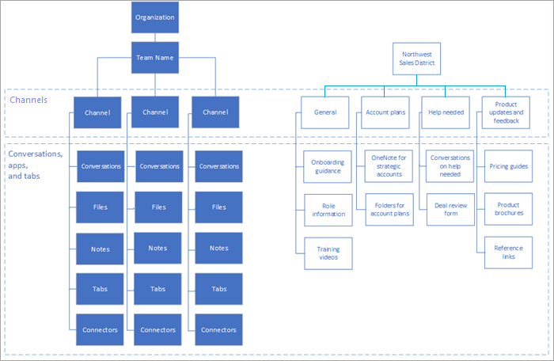

# Microsoft 팀의 팀 및 채널 이해

팀과 채널의 개념은 Microsoft 팀의 정상적인 생산성을 구현 하는 데 기본적으로 적합 합니다. 

- 팀은 회사에 대 한 비즈니스 결과물을 생성 하기 위해 함께 작동 하는 사람, 콘텐츠, 도구 모음입니다. 팀은 Office 365 그룹 및 팀에 대 한 Office 365 그룹 구성원 동기화 변경 사항에 따라 빌드됩니다. 

- 채널은 실제 작업 시간이 완료 된 팀 내의 공동 작업 공간입니다. 

팀과 채널에 대 한 자세한 내용은 [Microsoft 팀의 팀 및 채널 개요](teams-channels-overview.md)를 참조 하세요. 종합적인 팀 채택을 안내 하는 경우 [팀 채택을 가이드](https:aka.ms/teamstoolkit)하세요. 팀 및 Office 365 그룹에 대 한 자세한 내용은 [office 365 그룹 및 Microsoft 팀](office-365-groups.md) 을 참조 하 고 [office 365 그룹에 대해 자세히 알아보세요](https://support.office.com/article/Learn-about-Office-365-groups-b565caa1-5c40-40ef-9915-60fdb2d97fa2).

|  |  |
|---------|---------|
| 이 짧은 비디오 보기   | <iframe width="350" height="200" src="https://www.youtube.com/embed/hjJWtoaRJeE" frameborder="0" allowfullscreen></iframe>   |

팀 액세스 유형은 팀에 참여할 수 있는 사용자를 결정 합니다.

- *비공개* 팀은 팀 소유자가 승인한 팀 구성원으로 제한 됩니다. 이는 대규모 조직의 프로젝트 팀과 가상 팀에 대 한 일반적인 설정입니다.

- *공용* 팀은 조직의 모든 사용자에 게 공개 되며 사용자는 직접 참가할 수 있습니다. 공용 팀은 다양 한 부서나 다른 프로젝트에서 작업 하는 사용자에 게 일반적인 관심 항목을 공동 작업 하는 데 유용 합니다. 이는 소규모 조직에 대 한 기본 설정입니다.

## 팀을 사용 하 여 조직 간 공동 작업 구동

팀을 사용 하 여 조직 간 공동 작업을 개선 하는 것이 가장 좋지만, 여러 프로젝트는이 모델에 자기 자신을 대상으로 합니다. 또한 조직 내부의 지도자 또는 디비전에는 자신만의 전담 팀이 필요할 수도 있습니다. 다음 그림에 표시 된 조직 및 프로젝트 모델을 고려 하세요.

조직 팀 (왼쪽에 표시)에서 조직이 비즈니스를 실행 하는 방식, 팀 이벤트, 핵심 전략 및 비즈니스 리뷰와 같은 기타 작업 정보를 공유할 수 있는 방법에 대 한 주요 정보가 공유 될 수 있습니다. 오른쪽에 표시 된 팀의 경우 학구 정보는 해당 팀에서 수행 하는 작업 범주를 나타내는 채널로 분류 됩니다. 이 팀의 구성원은 동일한 사람에 게 보고 하지 않을 수 있지만, 모두 학구에 대 한 결과를 추진 하 게 됩니다.
  
구현의 [2 단계](teams-adoption-phase2-experiment.md) 에서 팀 구조에 대해 더 많은 작업을 수행 합니다.

 하는 아이콘: [첫 번째 팀 만들기](teams-adoption-your-first-teams.md)
