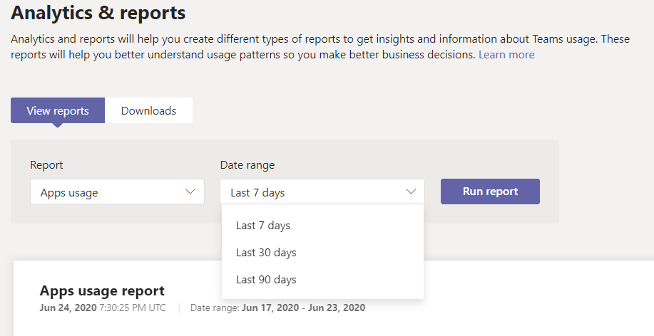

# Microsoft Teams 앱 사용 보고서

Teams 관리 센터의 Microsoft Teams 앱 사용 현황 보고서는 사용자가 Teams.  

## 앱 사용 보고서 보기

1.  관리 센터의 왼쪽 탐색에서 분석 & <https://admin.teams.microsoft.com> **보고서** \> **를 클릭합니다.** 보고서 보기 **탭의** **보고서에서** **앱 사용 을 선택합니다.**

     :::image type="content" source="media/app-usage-report1.png" alt-text="사용 현황 보고서 메뉴 항목의 스크린샷.":::

2.  **날짜 범위에서** 범위를 선택한 다음 보고서 실행 **을 클릭합니다.**

      :::image type="content" source="media/app-usage-report2.png" alt-text="앱 사용 보고서 스크린샷.":::

## 보고서 해석

|콜아웃 |설명  |
|--------|-------------|
|**1**   |앱 Teams 최근 7일, 30일 또는 90일 동안의 추세를 볼 수 있습니다. |
|**2**   |각 보고서에는 보고서가 생성된 날짜가 있습니다. 보고서는 일반적으로 앱이 열리기 전의 24시간 대기 시간을 반영합니다.   |
|**3**    | <ul><li>차트의 X 축은 특정 보고서에 대해 선택한 날짜 범위입니다.</li><li>Y축은 차트에서 마우스를 쥐고 있는 주어진 날의 사용자 수로, 해당 사용자가 앱을 적어도 한 번 열고, 이렇게 하면 활성 사용자로 간주하고 마우스를 마우스로 마우스로 마우스를 놓는 총 합계로 누적됩니다.</li></ul>|
|**4**   |해당 날짜에 앱 사용량을 나타내는 점 위에 마우스를 대고 해당 날짜에 해당 앱의 총 활성 사용자의 인스턴스 수를 볼 수 있습니다.  |
|**5**   |모든 앱이 포함되지만 필터 아이콘을 선택하여 추가 필터를 사용할 수 있습니다.  |
|**6**   |이 표에서는 앱 이름으로 활성 사용자 및 팀을 분석할 수 있습니다. <ul><li>**앱 이름은** 앱에 사용되는 앱의 표시 Teams.</li><li>**활성 사용자는** 지정된 기간 동안 앱을 한 번 이상 연 사용자 수입니다.</li><li>**앱 형식은** "Microsoft" 또는 "타사"의 정적 값입니다.</li><li>**활성 팀은** 팀의 구성원 중 하나 이상과 지정된 기간 동안 앱을 연 팀의 수입니다.</li><li>**Publisher** 앱의 소프트웨어 게시자입니다.</li><li>**버전은** 앱 게시자의 소프트웨어 버전입니다.</li></ul><b> 참고 :</b> 현재 '활성 사용자' 및 '활성 팀'은 채널에서만 사용되는 앱에 대해 계산됩니다.     
 |
|**7**  |열 **편집을 선택하여** 표에 열을 추가하거나 제거합니다.    |
|**8**  |오프라인 분석을 위해 보고서를 CSV 파일로 내보낼 수 있습니다. 내보내기를 **Excel** 클릭한 다음 다운로드  탭에서 다운로드를  클릭하여 준비가되면 보고서를 다운로드합니다.   |
|**9**   |보고서에서 보고서를 Excel 앱 **ID를** 나타내는 ID 열도 표시됩니다. 팀 ID는 일반적으로 영수 문자열입니다. Id **열에** **\n****로 표시되면 사용자가 해당 정보를 삭제하도록 요청한 것입니다.   |

## 관련 항목

- [Teams 분석 및 보고](teams-reporting-reference.md)