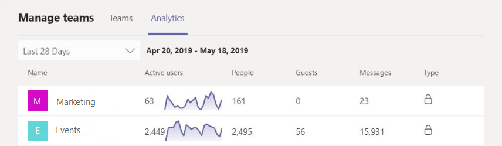

# Teams의 교차 팀 및 팀 단위 분석 보기View cross-team and per-team analytics in Teams

Microsoft 팀에서 사용자는 자신이 구성원 또는 소유자 인 팀에 대 한 분석을 볼 수 있습니다.In Microsoft Teams, users can view analytics for teams that they are members or owners of. 이 정보는 사용자가 팀의 사용 패턴 및 활동에 대 한 통찰력을 제공 합니다.This information gives users insight into usage patterns and activity on their teams. 각 팀의 활성 사용자, 게스트 및 메시지 수와 같은 데이터를 볼 수 있습니다.They can see data such as the number of active users, guests, and messages in each team.

팀 간 분석을 통해 사용자는 단일 목록 보기의 구성원 또는 소유자 인 모든 팀의 사용 현황 데이터에 대 한 폭넓은 개요를 제공할 수 있습니다.Cross-team analytics gives users a broad overview of usage data for all teams that they are a member or owner of in a single list view. 여기에는 활성 사용자 및 메시지 개수와 팀 활동에 대 한 추세선이 포함 됩니다.This includes active user and message counts and trend lines for team activity.  

팀 단위 분석을 통해 사용자는 특정 팀에 대 한 사용 현황 데이터를 보다 세부적으로 볼 수 있습니다.Per-team analytics gives users a more granular view of usage data for a specific team. 여기에는 활성 사용자 및 메시지 수를 위한 temporal 기반 차트와 사용자 유형 및 활동 추세에 대 한 깊은 분석 포함 됩니다.This includes temporal-based charts for active user and message counts plus deeper breakdowns of user types and activity trends.

## 구성원 또는 소유자 인 모든 팀에 대 한 분석 보기View analytics for all teams that you're a member or owner of

1. 팀의 팀 목록 아래에서 **팀 참가 또는 만들기**옆에 있는 팀 **관리**를 클릭 합니다.In Teams, at the bottom of the teams list, next to **Join or create a team**, click **Manage teams**.
2. **분석** 탭에서 구성원 또는 소유자 인 모든 팀의 사용량 데이터를 표시할 날짜 범위를 선택 합니다.On the **Analytics** tab, select a date range to show usage data for all teams that you're a member or owner of.

    

    |항목과Item |설명Description  |
    |--------|-------------|
    |**이름****Name**   |팀의 이름입니다.Name of the team. |
    |**활성 사용자****Active users**   |지정 된 기간 동안 팀 활동 및 추세 행의 활성 사용자 수입니다.Number of active users on the team and trend line of team activity during the specified time period. 정의한We define 
    |**사용자****People**   |지정 된 기간에 팀의 총 사용자 수입니다.Total number of people on the team in the specified time period. 여기에는 팀 소유자, 팀 구성원 및 게스트가 포함 됩니다.This includes team owners, team members, and guests.|
    |**게스트로****Guests**   |지정 된 기간에 팀의 게스트 수입니다.Number of guests on the team during the specified time period. |
    |**보내는****Messages**   |지정 된 기간 동안 팀 채팅에 게시 한 고유 메시지 수입니다.Number of unique messages posted in team chat during the specified time period. |
    |**유형****Type**   |팀이 비공개 팀 인지 또는 공개 팀입니다.Whether the team is a private team or public team.|

## 구성원 또는 소유자 인 팀에 대 한 분석 보기View analytics for a team that you're a member or owner of

1. 팀에서 원하는 팀으로 이동 하 고 **기타 옵션 (...)** 을 클릭 한 다음 **팀 관리**를 클릭 합니다.In Teams, go to the team that you want, click **More options (...)**, and then click **Manage team**.  
2. **분석** 탭에서 해당 팀의 사용량 데이터를 표시할 날짜 범위를 선택 합니다.On the **Analytics** tab, select a date range to show usage data for that team.  

    

    |항목과Item |설명Description  |
    |--------|-------------|
    |**요약****Summary**   |다음을 포함 한 팀 활동 요약:Summary of team activity including the following:<ul><li>팀의 총 사용자 수Total users on the team</li> <li> 팀 채팅에 게시 된 고유 메시지의 총 수입니다.Total number of unique messages posted in team chat </li> </ul> |
    |**활성 사용자****Active users**   |팀의 활성 및 비활성 사용자 수입니다.Number of active and inactive users on the team.|
    |**역할인****Role**   |팀 소유자, 팀 구성원, 게스트를 포함 하 여 역할별 팀의 사용자 수Numbers of users on the team by role, including team owners, team members, and guests.|
    |**활성 사용자** 차트**Active users** chart  |팀의 활성 사용자 수를 날짜별로 표시 합니다.Number of active users on the team by date. 지정 된 날짜의 점을 마우스로 가리켜 해당 날짜의 활성 사용자 수를 확인 합니다.Hover over the dot on a given date to see the number of active users on that date.|
    |**메시지** 차트**Messages** chart  |날짜별로 팀 채팅에 게시 된 고유 메시지 수입니다.Number of unique messages posted in team chat by date. 지정 된 날짜의 점을 마우스로 가리켜 해당 날짜에 게시 한 고유 메시지 수를 확인 합니다.Hover over the dot on a given date to see the number of unique messages posted on that date.|
    
> [!NOTE]
> 데스크톱 클라이언트, 모바일 클라이언트, 웹 클라이언트에서 의도적인 작업을 수행 하는 사용자로 활성 사용자를 정의 합니다.We define Active Users as users performing an intentional action in the desktop client, mobile client, and web client. 의도적인 작업의 예로는 채팅 시작, 전화 걸기, 파일 공유, 팀 내에서 문서 편집, 모임 참여 등이 포함 됩니다. 자동 부팅, 화면 최소화 또는 앱 닫기와 같은 수동 작업을 제거 합니다.Examples of an intentional action includes starting a chat, placing a call, sharing a file, editing a document within teams, participating in a meeting, etc. We strip out passive actions like auto boot, minimizing a screen, or closing the app. 또한 단일 사용자 ID로 모든 작업을 해제 합니다.We also de-dupe all actions across a single user ID.

## 관련 항목Related topics

- [팀 분석 및 보고Teams analytics and reporting](teams-reporting-reference.md)
