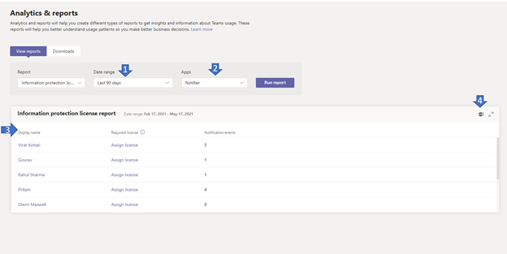

# Microsoft Teams 보호 라이선스 보고서Microsoft Teams information protection license report

Teams 정보 보호 라이선스 보고서는 테넌트  수준에서 메시지  생성, 업데이트 또는 삭제된 메시지 수신을 수신하기 위해 알림 이벤트를 변경하기 위해 구독한 앱(즉, /teams/getAllMessagesage 또는 /chats/getAllMessages)에 대한 정보를 제공합니다.The Teams information protection license report gives insight into apps that have [subscribed](/graph/api/resources/subscription?view=graph-rest-1.0) to [change notification](/graph/api/resources/webhooks?view=graph-rest-1.0) events to listen to created, updated, or deleted messages at tenant level (that is, /teams/getAllMessage or /chats/getAllMessages). 메시지에 해당하는 변경 알림은 사용자에게 필요한 라이선스가 있는 경우만 성공적으로 [전송됩니다.](/graph/teams-licenses)A change notification corresponding to the message is sent successfully only when the user has the [required license](/graph/teams-licenses).  특정 사용자가 트리거한 변경 알림 수를 볼 수 있습니다.You can see how many change notifications was triggered by a given user.

## 정보 보호 라이선스 보고서 보기View the information protection license report

이러한 정책을 관리하려면 전역 관리자 또는 Teams 서비스 관리자여야 합니다.You must be a Teams service admin to make these changes. 관리 역할 및 사용 권한 가져오기에 대한 내용은 [Teams 관리자 역할 사용](../using-admin-roles.md)을 참조하세요.See [Use Teams administrator roles to manage Teams](../using-admin-roles.md) to read about getting admin roles and permissions.

1. 관리 센터의 왼쪽 탐색에서 Microsoft Teams 보고서 **&**  >  **분석을 선택합니다.**In the left navigation of the Microsoft Teams admin center, select **Analytics & reports** > **Usage reports**. 보고서 보기 **탭의** **보고서에서** 정보 보호 **라이선스를 선택합니다.**On the **View reports** tab, under **Report**, select **Information Protection License**.
2. 날짜 **범위에서** 범위를 선택합니다.Under **Date range**, select a range.
3. **앱에서** 앱을 선택한 다음 보고서 실행 **을 선택합니다.**Under **Apps**, select an app and then select **Run report**.

    

## 보고서 해석Interpret the report

|콜아웃Callout |설명Description  |
|--------|-------------|
|**1****1**   |정보 보호 라이선스 보고서는 지난 7일, 30일 또는 90일 동안의 추세를 볼 수 있습니다.The information protection license report can be viewed for trends over the last 7 days, 30, or 90 days. |
|**2****2**   |앱 이름은 날짜 범위에서 선택한 지난 n일 동안 메시지의 알림 이벤트를 변경하기 위해 구독한 모든 앱의 목록을 표시합니다.App name will display a list of all apps that have subscribed to change notification events of messages in the last n days as selected in the date range. |
|**3****3**   |이 표에서는 선택한 앱에 대한 사용자당 사용량을 분석할 수 있습니다.The table gives you a breakdown of usage per user for the selected app.<ul><li>**표시 이름은** 사용자의 표시 이름입니다.**Display name** is the display name of the user. 관리자 센터의 사용자 세부 정보 페이지로 이동하려면 표시 Microsoft Teams 선택합니다.Select the display name to go to the user's details page in the Microsoft Teams admin center.</li><li>**필수 라이선스가** 있는 경우 사용자가 정의한 필수 라이선스 중 하나(여기)[ https://docs.microsoft.com/en-us/graph/teams-licenses ]가 있습니다.**Has Required License** is yes if the user has one of the required licenses as defined (here)[https://docs.microsoft.com/en-us/graph/teams-licenses]. 사용자에게 필요한 라이선스가 없는 경우  Microsoft 관리 센터에서 사용자의 라이선스 세부 정보 페이지로 이동하는 라이선스할당 링크가 표시됩니다(사용자 활성 >  >   사용자 이름 선택).If the user does not have the required license, the _Assign license_ link is displayed which navigated to the user's license detail page in the Microsoft admin center (**Users** > **Active Users** > select username).</li><li>**라이선스 보호 이벤트는** 해당 사용자가 생성, 업데이트 또는 삭제한 메시지에 대해 앱에 전송된 고유 변경 알림 이벤트의 수입니다.**License Protected Events** is the number of unique change notification events sent to the app against a message which was created, updated or deleted by that user.</li></ul> |
|**4****4**   |오프라인 분석을 위해 보고서를 CSV 파일로 내보낼 수 있습니다.Export the report to a CSV file for offline analysis. 내보내기를 **Excel** 및 **다운로드 탭을** 선택합니다. **다운로드를** 선택하여 준비가되면 보고서를 다운로드합니다.Select **Export to Excel**, and then the **Downloads** tab. Select **Download** to download the report when it's ready. |
|**5****5**   |오프라인 분석을 위해 보고서를 CSV 파일로 내보낼 수 있습니다.Export the report to a CSV file for offline analysis. 내보내기를 **Excel** 및 **다운로드 탭을** 선택합니다. **다운로드를** 선택하여 준비가되면 보고서를 다운로드합니다.Select **Export to Excel**, and then the **Downloads** tab. Select **Download** to download the report when it's ready. 보고서에서 보고서를 Excel 사용자의 사용자 **ID** 및 전자 메일  주소를 나타내는 ID 및 전자 메일 열도 표시됩니다.When you view the report in Excel, you'll also see an **Id** and **email** column, which represents the User ID and email address of the user. |

## 사용자별 데이터를 익명으로 지정합니다.Make the user-specific data anonymous

사용자 활동 보고서의 Teams 익명으로 만들기 위해 전역 관리자로 설정해야 합니다.To make the data in the Teams user activity report anonymous, you have to be a global administrator. 그러면 보고서 및 내보내기에서 표시 이름, 전자 메일 및 Azure AD ID와 같은 식별 가능한 정보가 숨겨지게 됩니다.This will hide identifiable information such as display name, email, and Azure AD ID in reports and their exports.

1. Microsoft 365 관리 센터 또는 설정 또는 설정  탭에서 보고서를 \>  **선택합니다.** In the Microsoft 365 admin center, go to **Settings** \> **Org Settings**, and under the **Services** tab, choose **Reports**.
    
2. 보고서를 **선택한** 다음 익명 식별자 **표시를 선택합니다.**Select **Reports**, and then choose to **Display anonymous identifiers**. 이 설정은 Microsoft 365 관리 센터 관리 센터의 Microsoft 365 관리 센터 모두 Teams 적용됩니다.This setting gets applied both to the usage reports in the Microsoft 365 admin center and the Teams admin center.
  
3. 변경 **내용 저장 을 선택합니다.**Select **Save changes**.
