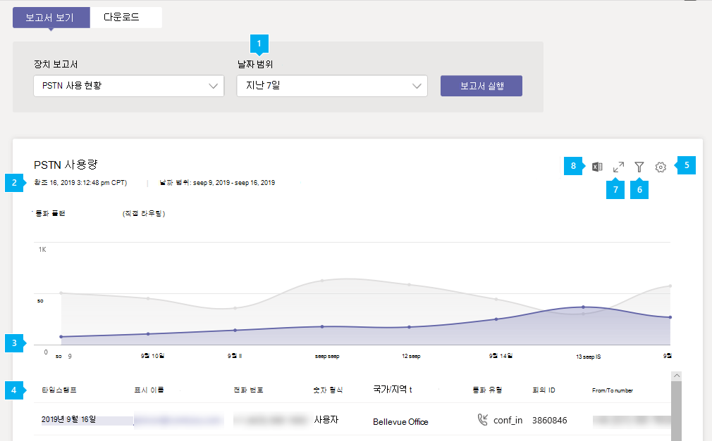
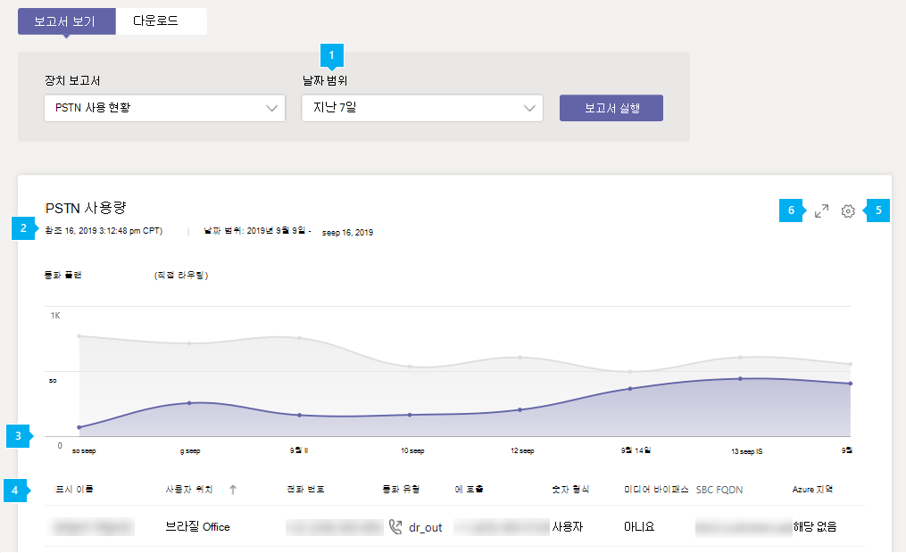

# Microsoft Teams PSTN 사용 현황 보고서

Microsoft Teams 관리 센터의 Teams PSTN 사용 현황 보고서에서는 조직의 통화 및 오디오 회의 활동에 대한 개요를 제공합니다. 통신사로 Microsoft를 사용하는 경우 통화 요금제에 대한 자세한 통화 활동을 볼 수 있으며, 통신사 자체를 사용하는 경우 직접 라우팅을 사용할 수 있습니다.

통화 **계획 탭에는** 사용자가 인바운드 및 아웃바운드 PSTN 통화에 소요한 시간(분) 및 이러한 호출의 비용을 포함한 정보가 표시됩니다. 직접 **라우팅 탭에는** SIP 주소 및 통화 시작 및 종료 시간을 포함한 정보가 표시됩니다. 이 보고서의 정보를 사용하여 조직의 PSTN 사용 현황을 파악하고 비즈니스 의사 결정을 조사, 계획 및 내릴 수 있습니다.

> [!NOTE]
> Telstra 또는 Softbank 통화 요금제가 있는 경우 PSTN 사용 보고서에 통화 세부 정보 레코드가 없습니다. 보고 요구에 대해 Telstra 또는 Softbank에 문의하세요. 

## PSTN 사용 보고서 보기

1. Microsoft Teams 관리 센터의 왼쪽 탐색 모음에서 Analytics & **보고서를**  >  **클릭합니다.** 보고서 보기 **탭의** **보고서** **아래에서 PSTN 사용 현황 보고서를 선택합니다.**
2. 날짜 **범위에서** 미리 정의한 범위를 7일 또는 28일로 선택하거나 사용자 지정 범위를 설정한 다음 보고서 **실행을 선택합니다.**

## 보고서 해석

### 통화 플랜

[ 사용 보고서 스크린샷](../media/teams-reports-pstn-usage-calling-plans-with-callouts.png#lightbox)

|Callout |설명  |
|--------|-------------|
|**1**   |보고서에서 지난 7일, 28일 또는 설정한 사용자 지정 날짜 범위의 추세를 볼 수 있습니다. |
|**2**   |각 보고서에는 생성된 날짜가 있습니다. 보고서는 일반적으로 활동 시간으로부터 24~48시간의 대기 시간을 반영합니다. |
|**3**   |X축은 특정 보고서에 대해 선택한 날짜 범위입니다. Y축은 선택한 기간 동안의 총 호출 수입니다.  주어진 날짜의 점 위에 마우스를 대면 총 호출 수를 볼 수 있습니다.  |
|**4**   |이 표에서는 호출당 PSTN 사용량을 분석합니다. <ul><li>**타임스탬프(UTC)는** 통화가 시작된 시간입니다.</li><li>**표시 이름은** 사용자의 표시 이름입니다. 표시 이름을 클릭하여 Microsoft Teams 관리 센터의 사용자 설정 페이지로 이동합니다.</li><li>**사용자** 이름은 사용자의 로그인 이름입니다.</li><li>**전화 번호는** 인바운드 통화 또는 아웃바운드 통화에 전화 걸기 번호를 수신한 번호입니다.</li><li>**통화 유형은** 통화가 PSTN 아웃바운드 또는 인바운드 통화인지 여부와 사용자 또는 오디오 회의와 같은 통화 유형입니다. 표시될 수 있는 호출 유형은 다음과 같습니다.  **Teams 사용자 통화 유형**<ul><li>**user_in** - 사용자가 인바운드 PSTN 호출을 수신합니다.</li><li>**user_out** - 사용자가 아웃바운드 PSTN 호출을 배치한 경우</li><li>**user_out_conf** - 사용자가 3자 전화 회의와 같은 두 개 이상의 PSTN 참가자를 통화에 추가했습니다.</li><li>**user_out_transfer** - 사용자가 PSTN 번호로 통화를 전송</li><li>**user_out_forwarding** - 사용자가 PSTN 번호로 통화를 전달한 경우</li><li>**conf_in** - 오디오 회의 브리지에 대한 인바운드 호출</li><li>**conf_out** - 일반적으로 회의에 PSTN 번호를 추가하기 위한 오디오 회의 브리지의 아웃바운드 통화</li></ul> **Teams 봇 통화 유형**<ul><li>**ucap_in** - 자동 전화 걸기 또는 통화 큐와 같은 Teams 봇에 대한 인바운드 PSTN 통화</li><li>**ucap_out** - 자동 전화 걸기 또는 통화 큐와 같은 Teams 봇의 아웃바운드 PSTN 통화</li></ul> <li>**전화 걸기** 번호입니다.</li><li>**국가 또는 지역은** 전화 걸기 국가 또는 지역입니다.</li><li>**호출은** 호출을 배치한 번호입니다.</li><li>**국가 또는 지역에서는** 통화가 걸러진 국가 또는 지역입니다.</li><li>**요금은** 계정에 청구되는 통화의 금액 또는 비용입니다. </li><li>**통화는** 통화 비용을 계산하는 데 사용되는 통화 유형입니다. </li><li>**기간은** 통화가 연결된 기간입니다.</li><li>**국내/국제** 통화는 사용자의 위치를 기준으로 국내 통화(국가 또는 지역 내) 또는 국제(국가 또는 지역 외부)에 대해 알 수 있습니다.</li><li>**통화 ID는** 통화의 통화 ID입니다. Microsoft 지원을 호출할 때 사용할 수 있는 호출에 대한 식별자입니다.</li><li>**번호 유형은** 무료 번호 서비스 등 사용자의 전화 번호 유형입니다. </li><li>**국가 또는 지역이** 사용 위치입니다. </li> <li>**회의 ID는** 오디오 회의의 회의 ID입니다. </li><li>**기능은** 호출에 사용되는 라이선스입니다. 표시될 수 있는 라이선스 유형은 다음과 같습니다.<ul><li>**MCOPSTNPP** - 통신 크레딧</li><li>**MCOEV 또는 MCOEV_VIRTUALUSER** - 자동 전화 걸기 또는 통화 큐와 같은 음성 응용 프로그램</li><li>**FREECALL** - 통화 가격을 책정하지 못하게 하는 기술적인 문제가 발생하면 통화가 무료로 제공되어 이 기능과 함께 표시됩니다.</li><li>**MCOPSTN1** - 국내 통화 요금제(미국 3000분/EU 1200분 요금제)</li><li>**MCOPSTN2** - 국제 통화 계획</li><li>**MCOPSTN5** - 국내 통화 요금제(120분 통화 요금제)</li><li>**MCOPSTN6** - 국내 통화 요금제(240분 통화 요금제)</li><li>**MCOMEETADD** - 오디오 회의</li><li>**MCOMEETACPEA** - 분당 유료 오디오 회의</li></ul></li></ul> 표에서 원하는 정보를 확인하려는 경우 테이블에 열을 추가해야 합니다.|
|**5**   |열 **편집을 선택하여** 표에서 열을 추가하거나 제거합니다. |
|**6**   |**필터를** 선택하여 사용자 이름 또는 통화 유형별로 보고서 필터링 |
|**7**   |전체 **화면을 선택하여** 전체 화면 모드에서 보고서를 볼 수 있습니다. |
|**8**   |오프라인 분석을 위해 보고서를 CSV 파일로 내보낼 수 있습니다. **Excel로 내보내기를** 클릭한  다음 다운로드 탭에서 다운로드를 클릭하여 준비가 되면 보고서를 다운로드합니다. |

### 직접 라우팅

[ 사용 보고서 스크린샷](../media/teams-reports-pstn-usage-direct-routing-with-callouts.png#lightbox)

|Callout |설명  |
|--------|-------------|
|**1**   |보고서에서 지난 7일 또는 28일간의 추세를 볼 수 있습니다. |
|**2**   |각 보고서에는 생성된 날짜가 있습니다. 보고서는 일반적으로 활동 시간으로부터 24~48시간의 대기 시간을 반영합니다. |
|**3**   |X축은 특정 보고서에 대해 선택한 날짜 범위입니다. Y축은 선택한 기간 동안의 총 호출 수입니다. 주어진 날짜의 점 위에 마우스를 대면 총 호출 수를 볼 수 있습니다.  |
|**4**   |이 표에서는 호출당 PSTN 사용량을 분석합니다. <ul><li>**타임스탬프(UTC)는** 통화가 시작된 시간입니다.</li><li>**표시 이름은** 사용자의 표시 이름입니다. 표시 이름을 클릭하여 Microsoft Teams 관리 센터의 사용자 설정 페이지로 이동합니다. 이 이름은 봇의 이름일 수도 있습니다(예: 호출 큐 또는 클라우드 자동 전화 교환. </li><li>**SIP 주소는** 호출을 받거나 호출한 사용자 또는 봇의 SIP 주소입니다.</li><li>**호출자 번호는** 호출을 한 사용자 또는 봇의 수입니다. </li><li>**수신자 번호는** 호출을 받은 사용자 또는 봇의 수입니다. Teams 사용자에 대한 인바운드 통화에서는 Teams 사용자가고, Teams 사용자의 아웃바운드 통화에서는 PSTN 사용자가 됩니다. </li><li>**통화 유형은** 통화가 PSTN 아웃바운드 또는 인바운드 통화인지 여부와 사용자 또는 오디오 회의와 같은 통화 유형입니다. 표시될 수 있는 통화 유형은 다음과 같습니다.  **Teams 사용자 통화 유형**<ul><li>**dr_in** - 사용자가 인바운드 PSTN 통화를 수신한 경우</li><li>**dr_out** - 사용자가 아웃바운드 PSTN 호출을 배치한 경우</li><li>**dr_out_user_conf** - 사용자가 통화에 PSTN 참가자를 추가한 경우</li><li>**user_out_transfer** - 사용자가 PSTN 번호로 통화를 전송</li><li>**dr_out_user_forwarding** - 사용자가 PSTN 번호로 통화를 전달한 경우</li><li>**dr_out_user_transfer** - 사용자가 PSTN 번호로 통화를 전송한 경우</li><li>**dr_emergency_out** - 사용자가 긴급 전화 걸기</li></ul> **Teams 봇 통화 유형**<ul><li>**dr_in_ucap** - 자동 전화 걸기 또는 통화 큐와 같은 Teams 봇에 대한 인바운드 PSTN 통화</li><li>**dr_out_ucap** - 자동 전화 걸기 또는 통화 큐와 같은 Teams 봇의 아웃바운드 PSTN 통화</li></ul> <li>**호출은** 통화를 받은 사용자의 수입니다.</li><li>**시작 시간(UTC)은** SIP 프록시가 아웃바운드 호출(Teams/봇에서 PSTN 사용자로)에서 SBC에서 최종 응답(SIP 메시지 "200 OK")을 받거나 SIP 프록시가 인바운드 호출(Teams/봇에 대한 PSTN 사용자)의 Teams 백엔드 내의 다음 홉으로 초대를 보낸 시간입니다. </li><li>**초대 시간(UTC)은** Teams 사용자 또는 봇 호출에서 SBC로의 아웃바운드 통화에서 초기 초대를 보냈거나, SBC에서 직접 라우팅의 SIP 프록시 구성 요소에 의해 Teams 또는 봇에 대한 인바운드 호출에서 수신된 시간입니다.</li><li>**실패 시간(UTC)은** 호출이 실패한 시간입니다. 실패한 호출만 해당합니다. 최종 SIP 코드, 최종 Microsoft 하위 코드 및 최종 SIP 구문은 호출이 실패한 이유를 제공하고 문제 해결에 도움이 될 수 있습니다. </li><li>**종료 시간(UTC)은** 통화가 종료된 시간입니다(성공한 호출의 경우만 해당).</li><li>**기간은** 통화가 연결된 기간입니다.</li><li>**번호 유형은** 무료 번호 서비스 등 사용자의 전화 번호 유형입니다. </li><li>**미디어 우회는** 트렁크가 미디어 우회에 사용하도록 설정되어 있는지 여부를 나타냅니다. </li> <li>**SBC FQDN은** SBC(세션 테두리 컨트롤러)의 FQDN(정식 도메인 이름)입니다. </li><li>**미디어용 Azure 지역은** 비 우회 호출에서 미디어 경로로 사용된 데이터 센터입니다. </li><li>**Signaling에 대한 Azure 지역은** 우회 및 비 우회 호출 모두에 대한 신호에 사용된 데이터 센터입니다. </li><li>**이벤트 유형은** 호출의 이벤트 유형입니다. 성공한 호출에 대한 성공 및 실패한 호출 시도가 표시됩니다. </li><li>**최종 SIP 코드는** 호출이 종료된 코드입니다.</li><li>**최종 Microsoft 하위 코드는** 발생한 특정 작업을 나타내는 코드입니다.</li><li>**최종 SIP 구문은** SIP 코드 및 Microsoft 하위 코드에 대한 설명입니다.</li><li>**상관 관계 ID는** Microsoft 지원을 호출할 때 사용할 수 있는 호출의 고유 식별자입니다.</li><li>**공유 상관 관계 ID는** 다운로드 가능한 CSV 파일에서만 볼 수 있으며 포털에 존재하지 않습니다. 공유 상관 관계 ID는 관련된 두 개 이상의 호출에 존재합니다. 아래에서 자세한 설명을 참조하세요.</li></ul> 표에서 원하는 정보를 확인하려는 경우 테이블에 열을 추가해야 합니다.|
|**5**   |열 **편집을 선택하여** 표에서 열을 추가하거나 제거합니다. |
|**6**   |전체 **화면을 선택하여** 전체 화면 모드에서 보고서를 볼 수 있습니다. |
|**7**   |Excel로 **내보내기를** 선택하여 오프라인 분석을 위해 CSV(콤마로 구분된 파일)에 데이터를 다운로드하거나 청구 시스템에 대한 입력으로 사용할 수 있습니다. |

#### 호출자/호출자 필드 고려 사항

통화 방향에 따라 발신자 또는 발신자 이름에 E164가 아닌 번호가 포함될 수 있습니다.

이러한 필드는 고객 SBC에서 제공될 수 있습니다. SBC에서 직접 라우팅에 보낼 수 있는 세 가지 형식은 E.164 숫자, E.164가 아닌 숫자 및 문자열입니다.

- E.164 번호가 있는 사용자로부터 E.164 번호가 있는 사용자까지의 E.164 전화 번호입니다. 
- 비 E.164 번호에서 호출합니다. 직접 라우팅과 상호 연결된 타사 PBX의 사용자가 Teams 사용자에게 전화를 걸 수 있습니다. 이 경우 호출자 번호는 E.164가 아닌 번호일 수 있습니다(예: +1001). 
- 스위머가 전화를 걸고 숫자( 예: "Internal Revenue Service")는 이름만 제시하지 않습니다. 이 문자열은 보고서에 표시됩니다.

#### 공유 상관 관계 ID

공유 상관 관계 ID는 다운로드한 내보낼 Excel 파일에만 존재하며 둘 이상의 호출이 관련이 있습니다. 다음은 공유 상관 관계 ID가 있는 경우와 다양한 시나리오에 대해 설명합니다.

1.    Teams 클라이언트에서 Teams 사용자 1이라는 PSTN 엔드포인트의 PSTN 사용자 1, 통화 유형Dr_In, 상관 관계 ID 57f28917-42k5-4c0c-9433-79734873f2ac, 공유 상관 관계 ID 없음
2.    PSTN 엔드포인트의 PSTN 사용자 1이라는 Teams 클라이언트의 Teams 사용자 1은 2c12b8ca-62eb-4c48-b68d-e451f518ff4, 공유 상관 관계 ID가 없는 Dr_Out를 호출합니다.
3.    Teams 클라이언트에서 Teams 사용자 2라는 PSTN 엔드포인트의 PSTN Dr_In 사용자 1 f45e9a25-9f94-46e7-a457-84f5940efde9, 공유 상관 관계 ID f45e9a25-9f94-46e7-a457-84f5940efde9를 호출합니다.
4.    상관 관계 ID가 "f45e9a25-9f94-46e7-a457-84f5940efde9"인 기존 호출 3. Teams 사용자 2와의 통화에서 PSTN 사용자 1. Teams 사용자 2가 Teams 또는 PSTN 사용자에 대한 통화를 양도(블라인드 또는 컨설턴트)한 경우 호출 유형 Dr_Out_User_Transfer 45a1da7c-9e97-481a-8a05-3fe19a9a77e0, 공유 상관 관계 ID f45e9a25-9f94-46e7-a457-84f5940efde9.

## 보고서 내보내기
**Excel로 내보내기를** 클릭한  다음 다운로드 탭에서 다운로드를 클릭하여 준비가 되면 보고서를 다운로드합니다.  데이터 수량에 따라 내보내기 프로세스를 완료하는 데 몇 초에서 몇 분까지 걸릴 수 있습니다.

이렇게 하면 모든 사용자의 데이터를 내보내고 추가 분석을 위해 간단한 정렬 및 필터링을 할 수 있습니다. 내보낼 파일에는 온라인 보고서에서 사용할 수 없는 추가 필드가 포함되어 있습니다. 이러한 방법은 문제 해결 및 자동화된 워크플로에 사용할 수 있습니다.

 **"Calls.Export. `[identifier]` . zip**", 식별자가 문제 해결에 사용할 수 있는 내보내기 고유 ID입니다.

통화 계획과 직접 라우팅이 모두 있는 경우 내보낼 파일에 두 제품에 대한 데이터가 모두 포함될 수 있습니다. PSTN 사용 보고서 파일에는 파일 이름 "**PSTN.calls. `[UTC date]` . csv**" 및 직접 라우팅 "**DirectRouting.calls. `[UTC date]` . csv**".

 PSTN 및 직접 라우팅 **파일** 외에도 보관 파일에는 "parameters.js" 파일과 선택한 내보내기 시간 범위 및 기능이 포함되어 있습니다.

내보낼 파일은 [RFC 4180](https://tools.ietf.org/html/rfc4180) 표준을 준수하는 CSV(콤마로 구분된 값) 형식입니다. 변환을 요구하지 않고 Excel 또는 기타 표준 규격 편집기에서 파일을 열 수 있습니다.

CSV의 첫 번째 행에는 열 이름이 포함되어 있습니다. 모든 날짜는 UTC 및 [ISO 8601 형식입니다.](https://en.wikipedia.org/wiki/ISO_8601)

### 내보낼 PSTN 사용 현황 보고서

 국가별 규정에서 12개월 동안 데이터 보존을 금지하지 않는 한 현재 날짜에서 최대 1년까지 데이터를 내보낼 수 있습니다.

> [!div class="has-no-wrap"]  
> | # | 이름 | [데이터 형식(SQL Server)](https://docs.microsoft.com/sql/t-sql/data-types/data-types-transact-sql) | 설명 |
> | :-: | :-: | :-: |:------------------- |
> | 0 | UsageId | `uniqueidentifier` | 고유 호출 식별자 |
> | 1 | 통화 ID | `nvarchar(64)` | 호출 식별자입니다. 고유하지 않을 수도 있습니다. |
> | 2 | 회의 ID | `nvarchar(64)` | 오디오 회의의 ID |
> | 3 | 사용자 위치 | `nvarchar(2)` | 사용자의 국가 코드, [ISO 3166-1 alpha-2](https://en.wikipedia.org/wiki/ISO_3166-1_alpha-2) |
> | 4 | AAD ObjectId | `uniqueidentifier` | Azure Active Directory에서 사용자의 ID 호출  이 및 기타 사용자 정보는 봇 호출 유형에 대해 null/비어 있습니다(ucap_in, ucap_out). |
> | 5 | UPN | `nvarchar(128)` | Azure Active Directory의 UserPrincipalName(로그인 이름)입니다. 이 주소는 일반적으로 사용자의 SIP 주소와 동일하며 사용자의 전자 메일 주소와 같을 수 있습니다. |
> | 6 | 사용자 표시 이름 | `nvarchar(128)` | 사용자의 표시 이름 |
> | 7 | 발신자 ID | `nvarchar(128)` | 인바운드 통화 또는 아웃바운드 통화에 전화 걸 수 있는 번호에 대한 호출을 받은 번호입니다. [E.164](https://en.wikipedia.org/wiki/E.164) 형식 |
> | 8 | 통화 유형 | `nvarchar(32)` | 통화가 PSTN 아웃바운드 또는 인바운드 통화인지 여부와 사용자 또는 오디오 회의와 같은 통화 유형 |
> | 9 | 숫자 형식 | `nvarchar(16)` | 사용자의 전화 번호 유형(예: 무료 번호 서비스) |
> | 10 | 국내/국제 | `nvarchar(16)` | 통화가 국내(국가 또는 지역 내) 또는 국제(국가 또는 지역 외부)에 따라 사용자의 위치를 기반으로 하는지 여부 |
> | 11 | 대상 전화 걸기 | `nvarchar(64)` | 국가 또는 지역 전화 걸기 |
> | 12 | 대상 번호 | `nvarchar(32)` | [E.164 형식으로](https://en.wikipedia.org/wiki/E.164) 전화 걸기 번호 |
> | 13 | 시작 시간 | `datetimeoffset` | 통화 시작 시간 |
> | 14 | 종료 시간 | `datetimeoffset` | 통화 종료 시간 |
> | 15 | 기간 초 | `int` | 통화가 연결된 기간 |
> | 16 | 연결 요금 | `numeric(16, 2)` | 연결 요금 가격 |
> | 17 | 요금 | `numeric(16, 2)` | 계정에 청구되는 통화의 금액 또는 비용 |
> | 18 | 통화 | `nvarchar(3)` | 통화 비용을 계산하는 데 사용되는 통화[유형(ISO 4217)](https://en.wikipedia.org/wiki/ISO_4217) |
> | 19 | 기능 | `nvarchar(32)` | 통화에 사용되는 라이선스 |

### 내보낼 직접 라우팅 사용 현황 보고서

국가별 규정에서 해당 기간 동안의 데이터 보존을 금지하지 않는 한 현재 날짜에서 최대 5개월(150일)까지 데이터를 내보낼 수 있습니다.

> [!div class="has-no-wrap"]  
> | # | 이름 | [데이터 형식(SQL Server)](https://docs.microsoft.com/sql/t-sql/data-types/data-types-transact-sql) | 설명 |
> | :-: | :-: | :-: |:------------------- |
> | 0 | CorrelationId | `uniqueidentifier` | 고유 호출 식별자 |
> | 1 | SIP 주소 | `nvarchar(128)` | 호출을 걸거나 받은 사용자 또는 봇의 주소입니다. 실제로 Azure Active Directory의 UserPrincipalName(UPN, 로그인 이름)으로, 일반적으로 SIP 주소와 동일합니다. |
> | 2 | 표시 이름 | `nvarchar(128)` | Microsoft 365 관리 센터에 설정된 사용자 또는 호출 봇의 이름(예: 자동 전화 교환 또는 통화 대기열)입니다. |
> | 3 | 사용자 국가 | `nvarchar(2)` | 사용자의 국가 코드, [ISO 3166-1 alpha-2](https://en.wikipedia.org/wiki/ISO_3166-1_alpha-2) |
> | 4 | 초대 시간 | `datetimeoffset` | 초기 초대가 Teams 사용자 또는 봇 호출에서 SBC로 아웃바운드로 보내거나, SBC에서 직접 라우팅의 SIP 프록시 구성 요소에 의해 Teams 또는 봇에 대한 인바운드 호출을 수신하는 경우 |
> | 5 | 시작 시간 | `datetimeoffset` | SIP 프록시가 아웃바운드(Teams/봇을 PSTN 사용자로) SBC에서 최종 응답(SIP 메시지 "200 OK")을 받거나 SIP 프록시가 인바운드 호출(Teams/봇에 PSTN 사용자)의 Teams 백엔드 내에서 다음 홉으로 초대를 전송한 시간입니다. 실패 및 호출의 경우 초대 또는 실패 시간과 같을 수 있습니다. |
> | 6 | 실패 시간 | `datetimeoffset` | 실패한(완전히 설정되지 않은) 호출에만 존재합니다. |
> | 7 | 종료 시간 | `datetimeoffset` | 성공한(완전히 설정된) 호출에만 존재합니다. 통화가 종료된 시간 |
> | 8 | 기간(초) | `int` | 통화 기간 |
> | 9 | 성공 | `nvarchar(3)` | 예/아니요. 성공 또는 시도 |
> | 10 | 발신자 번호 | `nvarchar(32)` | 호출한 사용자 또는 봇의 수입니다. 팀 사용자 호출에 대한 인바운드에서는 PSTN 사용자로, Teams 사용자 호출의 아웃바운드에서는 Teams 사용자 번호가 됩니다. |
> | 12 | 발신자 번호 | `nvarchar(32)` | 호출을 받은 사용자 또는 봇의 수입니다. 팀 사용자 호출에 대한 인바운드에서는 Teams 사용자가고, Teams 사용자 호출의 아웃바운드에서는 PSTN 사용자가 됩니다. |
> | 13 | 통화 유형 | `nvarchar(32)` | 통화 유형 및 방향 |
> | 14 | 미디어용 Azure 지역 | `nvarchar(8)` | 비 우회 호출의 미디어 경로에 사용되는 데이터 센터 |
> | 15 | 신호에 대한 Azure 지역 | `nvarchar(8)` | 우회 및 비 우회 호출 모두에 대한 신호에 사용되는 데이터 센터 |
> | 16 | 최종 SIP 코드 | `int` | 호출이 종료된 코드, [RFC 3261](https://tools.ietf.org/html/rfc3261) |
> | 17 | 최종 Microsoft 하위 코드 | `int` | SIP 코드 외에도 Microsoft에는 특정 문제를 나타내는 자체 하위 코드가 있습니다. |
> | 18 | 최종 SIP 구 | `nvarchar(256)` | SIP 코드 및 Microsoft 하위 코드에 대한 설명 |
> | 19 | SBC FQDN | `nvarchar(64)` | 세션 테두리 컨트롤러의 정식 도메인 이름 |
> | 20 | 미디어 바이패스 | `nvarchar(3)` | 예/아니요. 트렁크가 미디어 우회에 대해 사용하도록 설정되어 있지 않은지 나타냅니다. |
> | 21 | 공유 상관 관계 ID | `uniqueidentifier` | 둘 이상의 호출이 관련이 있는 경우를 나타냅니다. |

## 관련 항목

- [Teams 분석 및 보고](teams-reporting-reference.md)
