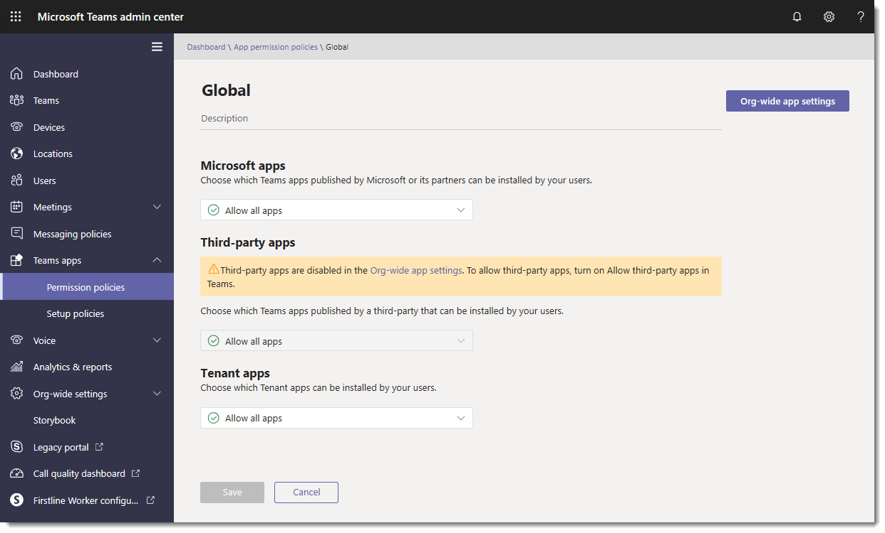
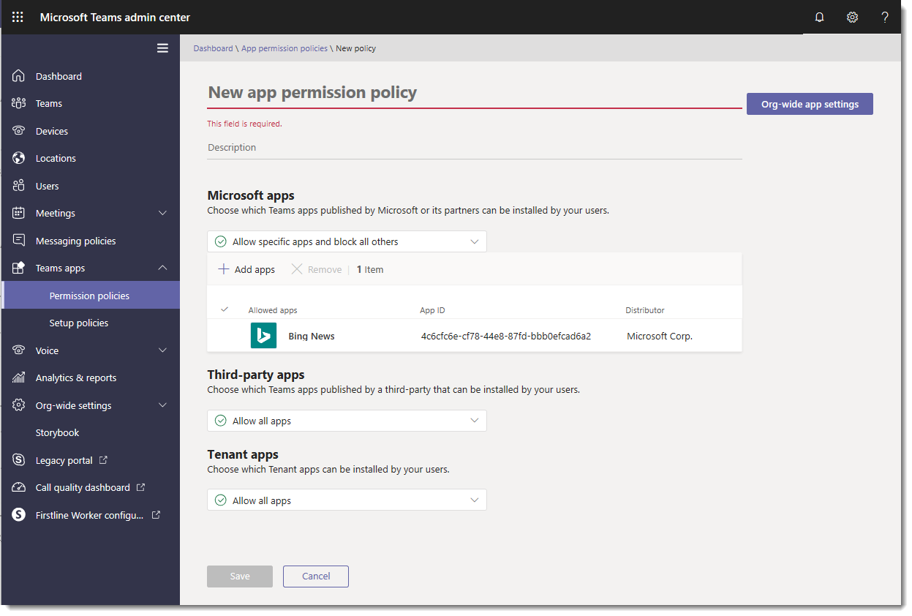
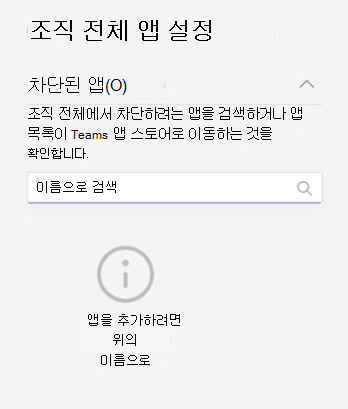

# Microsoft Teams에서 앱 사용 권한 정책 관리

관리자는 앱 사용 권한 정책을 사용하여 조직의 Microsoft Teams 사용자가 사용할 수 있는 앱을 제어할 수 있습니다. 모든 앱 또는 Microsoft, 타사 및 조직에서 게시한 특정 앱을 허용하거나 차단할 수 있습니다. 앱을 차단하면 정책이 있는 사용자는 Teams 앱 스토어에서 goekd 앱을 설치할 수 없습니다. 이러한 정책을 관리하려면 전역 관리자 또는 Teams 서비스 관리자여야 합니다.

Microsoft Teams 관리 센터에서 앱 사용 권한 정책을 관리합니다. 전역(조직 전체 기본값) 정책을 사용하거나 사용자 지정 정책을 만들어 사용자에게 할당할 수 있습니다. 사용자 지정 정책을 만들고 할당하지 않으면 조직의 사용자에게 전역 정책이 자동으로 적용됩니다. 정책을 편집하거나 할당한 후 변경 내용을 적용하는 데 몇 시간이 걸릴 수 있습니다.

> [!NOTE]
> 조직 전체 앱 설정은 자신이 만들고 사용자에게 할당하는 모든 사용자 지정 정책과 전역 정책에 대해 재정의합니다.

조직이 이미 Teams에 있는 경우 Microsoft 365 관리 센터의 **테넌트 전체 설정** 에서 구성한 앱 설정은 [앱 관리](manage-apps.md) 페이지의 조직 전체 앱 설정에 반영됩니다. Teams를 새로 시작한 경우 기본적으로 모든 앱은 전역 정책에서 허용됩니다. 여기에는 Microsoft, 타사 소프트웨어 공급자 및 조직에서 게시한 앱이 포함됩니다.

예를 들어 조직의 HR 팀에 대해 몇 가지 특정 앱만 허용하려고 합니다. 먼저 [앱 관리](https://admin.teams.microsoft.com/policies/manage-apps) 페이지에서 HR 팀에 허용하려는 앱이 조직 수준에서 허용되는지 확인합니다. 그런 다음 사용자 지정 정책을 만들고, 원하는 앱을 차단 및 허용하도록 설정하고, HR 팀의 사용자에게 정책을 할당합니다.

> [!NOTE]
> GCCH(Microsoft 365 정부 커뮤니티 클라우드 High) 및 국방부(DoD) 환경에 고유한 타사 앱 설정에 대해 알아보려면 [Microsoft 365 Government에 대한 조직 전체 앱 설정 관리를](#manage-org-wide-app-settings-for-microsoft-365-government) 참조하세요.

## 사용자 지정 앱 사용 권한 정책 만들기

여러 사용자 그룹에 사용할 수 있는 앱을 제어하려면 하나 이상의 사용자 지정 앱 권한 정책을 사용합니다. 앱이 Microsoft, 타사 또는 조직에 의해 게시되는지 여부에 따라 별도의 사용자 지정 정책을 만들고 할당할 수 있습니다. 사용자 지정 정책을 만든 후에는 조직 전체 앱 설정에서 타사 앱을 사용하지 않도록 설정한 경우 변경할 수 없습니다.

1. [Teams 관리 센터에](https://admin.teams.microsoft.com/dashboard) 로그인
1. 왼쪽 패널에서 **Teams 앱** > **권한 정책** 으로 이동합니다.
1. **추가** 를 선택합니다.

    

1. 정책에 대한 이름과 설명을 제공합니다.
1. **Microsoft 앱**, **타사 앱** 및 **사용자 지정 앱** 아래에서 다음 중 하나를 선택합니다.

    * **모든 앱 허용**
    * **특정 앱 허용 및 다른 모든 앱 차단**
    * **특정 앱 차단 및 다른 모든 앱 허용**
    * **모든 앱 차단**

1. **특정 앱 허용 및 다른 앱 차단** 을 선택한 경우 허용하려는 앱을 추가합니다.

    1. **앱 허용** 을 선택합니다.
    1. 허용하려는 앱을 검색한 다음 **추가** 를 선택합니다. 검색 결과는 앱 게시자(**Microsoft 앱**, **타사 앱** 또는 **사용자 지정 앱**)로 필터링됩니다.
    1. 앱 목록을 선택한 경우 **[허용**]을 선택합니다.

1. 마찬가지로 **특정 앱 차단을 선택하고 다른 모든 앱을 허용하는** 경우 차단하려는 앱을 검색하여 추가한 다음 **차단** 을 선택합니다.
1. **저장** 을 선택합니다.

## 앱 사용 권한 정책 편집

Teams 관리 센터를 사용하여 만든 전역 정책 및 사용자 지정 정책을 포함하여 정책을 편집할 수 있습니다.

1. Microsoft Teams 관리 센터의 왼쪽 창에서 **Teams 앱** > **사용 권한 정책** 으로 이동합니다.
1. 정책 이름 왼쪽을 클릭하여 정책을 선택한 다음 **편집** 을 선택합니다.
1. 여기서 원하는 대로 변경합니다. 앱 게시자를 기반으로 설정을 관리하고 허용/차단 설정에 따라 앱을 추가 및 제거할 수 있습니다.
1. **저장** 을 선택합니다.

## 사용자에게 사용자 지정 앱 사용 권한 정책 할당

[!INCLUDE [assign-policy](includes/assign-policy.md)]

## Microsoft 365 Government에 대한 조직 전체 앱 설정 관리  

Microsoft 365 Government - GCC, GCCH 및 DoD 배포에서 Teams 모든 타사 앱은 기본적으로 차단됩니다. GCCH 및 DOD 클라우드에서는 타사 앱을 사용할 수 없습니다. 또한 GCC Microsoft Teams 관리 센터의 앱 권한 정책 페이지에서 타사 앱을 관리하는 방법에 대한 다음 메모가 표시됩니다.

:::image type="content" source="media/app-permission-policies-gcc.png" alt-text="GCCH 및 DoD의 앱 권한 정책 스크린샷":::

조직 전체 앱 설정을 사용하여 사용자가 타사 앱을 설치할 수 있는지 여부를 제어할 수 있습니다. 조직 전체 앱 설정은 모든 사용자의 동작을 관리하고 사용자에게 할당된 다른 모든 앱 사용 권한 정책을 재정의합니다. 악의적이거나 문제가 있는 앱을 제어하는 데 사용할 수 있습니다.

<!---
1. On the **Permission policies** page, select **Org-wide app settings**. You can then configure the settings you want in the panel. --->

### GCC 클라우드의 경우

1. **앱 관리** 페이지에서 **조직 전체 앱 설정을** 선택합니다. 그런 다음 패널에서 원하는 설정을 구성할 수 있습니다.

  

1. **타사 앱** 에서 이 설정을 끄거나 켜면 타사 앱에 대한 액세스를 제어할 수 있습니다.

    * **타사 앱 허용**: 이 옵션은 사용자가 타사 앱을 사용할 수 있는지 여부를 제어합니다. 이 설정을 해제하면 사용자는 타사 앱을 설치하거나 사용할 수 없습니다. Teams Microsoft 365 Government - GCCH 및 DoD 배포에서는 이 설정이 기본적으로 해제되어 있습니다.
    * **기본적으로 스토어에 게시된 새 타사 앱** 허용: 이 옵션은 Teams 앱 스토어에 게시된 새 타사 앱을 Teams 자동으로 사용할 수 있는지 여부를 제어합니다. 타사 앱을 허용하는 경우에만 이 옵션을 설정할 수 있습니다.

1. **차단된 앱** 아래에서 조직 전체에서 차단하려는 앱을 추가합니다. Microsoft 365 Government - GCCH 및 DoD 배포에서 Teams 모든 타사 앱이 기본적으로 이 목록에 추가됩니다. 조직에서 허용하려는 타사 앱의 경우 이 차단된 앱 목록에서 앱을 제거합니다. 앱 조직 전체를 차단하면 앱 사용 권한 정책에서 허용되는지 여부에 관계없이 모든 사용자에 대해 앱이 자동으로 차단됩니다.

1. 조직 전체 앱 설정에 대해 **저장** 을 선택하여 적용합니다.

타사 앱을 허용하려면 전역(조직 전체 기본값) 정책을 편집하고 사용하거나 사용자 지정 정책을 만들고 할당합니다.

### GCCH 및 DoD 클라우드의 경우

1. **사용 권한 정책** 페이지에서 **조직 전체 앱 설정** 을 선택합니다. 그런 다음 패널에서 원하는 설정을 구성할 수 있습니다.

  

1. **차단된 앱** 아래에서 조직 전체에서 차단하려는 앱을 추가합니다. Microsoft 365 Government - GCCH 및 DoD 배포에서 Teams 모든 타사 앱이 기본적으로 이 목록에 추가됩니다. 앱 조직 전체를 차단하면 앱 사용 권한 정책에서 허용되는지 여부에 관계없이 모든 사용자에 대해 앱이 자동으로 차단됩니다.
1. 조직 전체 앱 설정에 대해 **저장** 을 선택하여 적용합니다.

## FAQ

### 앱 권한 정책 작업

#### 사용 권한 정책은 어떤 앱 상호 작용에 영향을 미치나요?

사용 권한 정책은 최종 사용자에 대한 설치, 검색 및 상호 작용을 제어하여 앱 사용을 관리합니다. 관리자는 할당된 사용 권한 정책에 관계없이 Microsoft Teams 관리 센터에서 여전히 앱을 관리할 수 있습니다.

#### LOB(line of business) 앱을 제어할 수 있나요?

예, 앱 사용 권한 정책을 이용하여 사용자 지정 (LOB) 앱의 출시 및 배포를 제어할 수 있습니다. 사용자 지정 정책을 만들거나 조직의 요구에 따라 사용자 지정 앱을 허용하거나 차단하도록 전역 정책을 편집할 수 있습니다.

#### 앱 사용 권한 정책은 고정된 앱 및 앱 설정 정책과 어떻게 관련이 있나요?

앱 설정 정책을 앱 사용 권한 정책과 함께 사용할 수 있습니다. 미리 고정된 앱은 사용자에 대해 사용 가능한 앱 집합에서 선택됩니다. 또한 사용자가 앱 설정 정책에서 앱을 차단하는 앱 사용 권한 정책이 있는 경우 해당 앱은 Teams에 나타나지 않습니다.

#### 앱 사용 권한 정책을 사용하여 사용자 지정 앱 업로드를 제한할 수 있나요?

**앱 관리** 페이지 또는 앱 설정 정책에서 조직 전체 설정을 사용하여 사용자 지정 앱 업로드를 제한할 수 있습니다.  

특정 사용자가 사용자 지정 앱을 업로드하지 못하도록 제한하려면 사용자 지정 앱 정책을 사용하세요. 자세한 내용은 [Teams에서 사용자 지정 앱 정책 및 설정 관리](teams-custom-app-policies-and-settings.md)를 참조하세요.

#### 앱 차단이 Teams 모바일 클라이언트에 적용되나요?

예, 앱을 차단하면 모든 Teams 클라이언트에서 해당 앱이 차단됩니다.  

### 사용자 환경

#### 앱이 차단된 경우 사용자 환경은 어떻게 됩니까?

사용자는 차단된 앱 또는 봇, 탭, 메시징 익스텐션 등 앱의 기능과 상호 작용할 수 없습니다. 팀 또는 그룹 채팅과 같은 공유 컨텍스트에서 봇은 여전히 해당 컨텍스트의 모든 참가자에게 메시지를 보낼 수 있습니다. Teams는 앱이 차단된 경우 사용자에게 이를 표시합니다.

예를 들어 앱이 차단되면 사용자는 다음 작업을 수행할 수 없습니다.

* 앱을 개인적으로 추가하거나 채팅 또는 팀에 추가
* 앱의 봇에 메시지 보내기
* 실행 가능한 메시지와 같은 정보를 앱으로 다시 보내는 버튼 작업 수행  
* 앱의 탭 보기
* 알림을 수신할 커넥터 설정
* 앱의 메시징 익스텐션 사용

레거시 포털이 조직 수준에서 앱을 제어할 수 있도록 허용했습니다. 즉, 앱이 차단되면 조직의 모든 사용자에게 차단됩니다. [웹 관리](manage-apps.md) 페이지에서의 앱 차단은 정확히 동일한 방식으로 작동합니다.

특정 사용자에게 할당된 앱 사용 권한 정책의 경우, 봇 또는 커넥터 기능이 있는 앱이 허용된 다음 차단된 경우 및 공유 컨텍스트의 일부 사용자에게만 앱이 허용된 경우, 해당 앱에 대한 권한이 없는 그룹 채팅 또는 채널의 구성원은 봇 또는 커넥터가 게시한 메시지 기록과 메시지를 볼 수 있지만 상호 작용할 수 없습니다.

## 참고 항목

* [Teams의 앱에 대한 관리 설정](admin-settings.md)
* [Teams에서 사용자에게 정책 할당](policy-assignment-overview.md)
* [Teams 기능 가용성 비교](/office365/servicedescriptions/teams-service-description#feature-availability)
