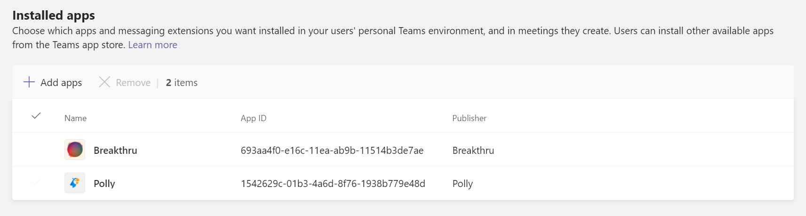

# 앱 설정 정책 관리 Microsoft Teams

관리자는 앱 설정 정책을 사용하여 앱을 설치하고 고정하여 조직에서 가장 많이 사용되는 앱을 홍보하고 사용자가 사용자 지정 앱을 업로드할지 여부를 결정할 수 Teams.

- **앱 고정:** 앱 설정 정책을 사용하면 고정할 앱을 선택하고, 사용자에게 표시하는 순서를 설정하고, 사용자가 자신의 앱을 앱 표시줄에 고정할 수 있는지 여부를 Teams 수 있습니다. 자세한 내용은 앱 [고정을 참조하세요](#pin-apps).
- **앱 설치:** 앱 설정 정책을 사용하면 사용자가 앱을 시작할 때나 모임 중에 앱을 Teams 수 있습니다. 자세한 내용은 앱 [설치를 참조하세요](#install-apps).
- **업로드 사용자** 지정 앱: 앱 설정 정책을 사용하면 사용자가 사용자 지정 앱을 업로드할 수 Teams. 자세한 내용은 사용자 [지정 업로드 참조하세요](#upload-custom-apps).

## 앱 고정

앱을 고정하면 타사 또는 조직의 개발자가 구축한 앱을 포함하여 조직의 사용자가 필요로 하는 앱을 선보일 수 있습니다.

앱 설정 정책을 사용하여 다음 작업을 수행할 수 있습니다.

- 팀을 사용자 지정하여 사용자에게 가장 중요한 앱을 강조 표시합니다. 앱을 선택하고 표시하는 순서를 고정하고 설정할 수 있습니다.
- 사용자가 앱을 Teams에 고정할 수 있는지 여부를 제어합니다.

앱은 앱 표시줄에 고정됩니다. 이 막대는 데스크톱 클라이언트의 Teams 및 모바일 클라이언트(iOS 및 Android) Teams 아래쪽에 있습니다.

|Teams 데스크톱 클라이언트  |Teams 모바일 클라이언트 |
|---------|---------|
|   |         |

> [!NOTE]
> 할당이 교육용 Teams 있는 경우 할당 앱이 현재 전역 정책에 기본적으로 고정되어 있는 경우 전역 정책에 나열되지 않습니다. 클라이언트의 고정된 앱 목록에서 네 번째 Teams 됩니다.

앱을 고정하기 위한 앱 설정 정책을 만들 경우 다음 단계를 수행합니다.

1. 관리 센터의 왼쪽 Microsoft Teams **appsSetup** >  정책으로 Teams **이동하세요**.

2. **추가** 를 선택합니다.

3. 정책의 이름과 설명을 입력합니다.

4. 앱에 앱을 고정하여 사용자가 앱 표시줄을 개인 설정하도록 할지 여부에 따라 사용자 고정을 설정하거나 해제합니다.

   > [!NOTE]
   > 사용자 **고정** 설정은 Teams(Microsoft 365 정부 커뮤니티 클라우드GCC) 환경(GCC, GCC 및 DoD)의 관리 센터에서 사용할 수 있지만 현재는 효과가 없습니다.

5. 고정 **된 앱 아래** 에서 앱 **추가를 선택합니다**.

6. 고정 **된 앱** 추가 창에서 추가할 앱을 검색한 다음 추가를 **선택합니다**. 앱 사용 권한 정책에 따라 앱을 필터링할 수 있습니다.

7. **추가** 를 선택합니다.

8. 앱에 표시하려는 순서대로 앱을 Teams.

   

9. **저장** 을 선택합니다.

## 앱 설치

개인 환경의 사용자에 대해 기본적으로 설치되는 앱을 선택하고, Teams 확장으로 앱을 설치[하고, 모임](/microsoftteams/platform/messaging-extensions/what-are-messaging-extensions)에 설치할 앱을 지정할 수 있습니다.

앱 설정 정책을 사용하여 다음 작업을 수행할 수 있습니다.

- 개인 환경의 사용자에 Teams 앱 설치
- 메시징 확장으로 사용자에 대한 앱 설치
- 모임 이끌이를 위한 모임에 앱 설치

> [!NOTE]
> 사용자에게 할당된 앱 사용 권한 정책이  허용하는 경우 사용자가 앱을 직접 설치할 수 있습니다.

앱을 설치하기 위한 앱 설정 정책을 만들 경우 다음 단계를 수행합니다.

1. 관리 센터의 왼쪽 Microsoft Teams **appsSetup** >  정책으로 Teams **이동하세요**.

2. **추가** 를 선택합니다.

3. 정책의 이름과 설명을 입력합니다.

4. 설치된 **앱 아래** 에서 앱 **추가를 선택합니다**.

5. 설치된 **앱** 추가 창에서 사용자를 위해 자동으로 설치할 앱을 검색합니다. 앱 사용 권한 정책에 따라 앱을 필터링할 수 있습니다.

6. **추가** 를 선택합니다.

> [!IMPORTANT]
> 사용자는 관리자가 설치한 앱을 제거할 수 없습니다.

## 업로드 앱

관리 센터를 Microsoft Teams 사용자 지정 앱을 업로드할 수 있는 사용자 지정 정책을 만들 수 Teams.

사용자가 사용자 지정 앱을 업로드할 수 있도록 앱 설정 정책을 만들 Teams 다음 단계를 수행합니다.

1. 관리 센터의 왼쪽 Microsoft Teams **appsSetup** >  정책으로 Teams **이동하세요**.

2. **추가** 를 선택합니다.

3. 정책의 이름과 설명을 입력합니다.

4. 사용자 지정 앱을 업로드 사용자 지정 앱을 업로드할지 여부에 따라 사용자 지정 앱을 켜거나 Teams.

> [!NOTE]
> 타사 앱이 오그 전체 앱 설정에서  꺼져 있는 경우 이 설정을 변경할 [수 없습니다](manage-apps.md#manage-org-wide-app-settings).

## 앱 설정 정책 관리

관리 센터에서 앱 Microsoft Teams 관리합니다. 전역(Org-wide 기본값) 정책을 사용하거나 사용자 지정 정책을 만들고 할당합니다.  사용자 지정 정책을 만들고 할당하지 않으면 조직의 사용자에게 전역 정책이 자동으로 적용됩니다. 이러한 정책을 관리하려면 전역 관리자 또는 Teams 서비스 관리자여야 합니다.

전역 정책의 설정을 편집하여 원하는 앱을 포함합니다. 조직의 Teams 사용자 그룹에 대한 사용자 지정을 사용자 지정하기 위해 하나 이상의 사용자 지정 정책을 만들고 할당합니다.

### 앱 설정 정책 편집

관리 센터를 사용하여 Microsoft Teams(Org-wide default) 정책 및 만든 사용자 지정 정책을 포함하여 정책을 편집할 수 있습니다.

1. 관리 센터의 왼쪽 Microsoft Teams **appsSetup** >  정책으로 Teams **이동하세요**.

2. 편집할 정책을 선택한 다음 편집을 **선택합니다**.

3. 원하는 내용을 변경합니다.

4. **저장** 을 선택합니다.

### 사용자 및 그룹에 사용자 지정 앱 설정 정책 할당

사용자 및 그룹에 정책 할당에 대한 자세한 내용은 사용자 및 그룹에 정책 [할당을 참조하세요](assign-policies-users-and-groups.md).

## FAQ

### 앱 설정 정책 작업

#### 관리 센터에 포함된 기본 제공 앱 Microsoft Teams 정책

- **전역(조직 전체 기본값)**: 이 기본 정책은 다른 정책을 할당하지 않는 한 조직의 모든 사용자에게 적용됩니다. 전역 정책을 편집하여 사용자에게 가장 중요한 앱을 고정합니다.

- **FrontlineWorker**: 이 정책은 프런트라인 작업자를 위한 것입니다. 조직의 Frontline Workers에 할당할 수 있습니다. 만드는 사용자 지정 정책과 마찬가지로 설정이 활성화될 수 있도록 사용자에게 정책을 할당해야 합니다. 자세한 내용은 이 문서의 사용자에게 사용자  지정 앱 설정 정책 할당 섹션으로 이동하세요.

#### 고정된 앱 추가 창에서 앱을 찾을 수 없는 이유

앱 설정 정책을 통해 모든 앱을 Teams 수 있습니다. 일부 앱은 이 기능을 지원하지 않을 수 있습니다. 고정할 수 있는 앱을 찾으면 고정된 앱 추가 창에서 앱을 **검색** 합니다. 개인 범위(고정 탭)와 봇이 있는 탭은 데스크톱 Teams 고정할 수 있으며 이러한 앱은 고정된 앱 추가 창에서 **사용할 수** 있습니다.

앱 스토어에 Teams 모든 앱이 나열되어 Teams 있습니다. 고정 **된 앱** 추가 창에는 정책을 통해 앱에 고정할 수 있는 앱만 Teams 있습니다.

#### 저는 교육용 Teams 관리자입니다. 앱 설정 정책에 대해 알아야 할 교육용 Teams

통화 앱은 앱에서 사용할 수 교육용 Teams. 새 사용자 지정 앱 설정 정책을 만들 때 호출 앱이 앱 목록에 표시됩니다. 그러나 앱이 클라이언트에 고정되지 Teams 교육용 Teams 사용자가 호출 앱을 볼 수 Teams.

#### 정책에 추가할 수 있는 고정된 앱 수

모바일 클라이언트(iOS 및 Android)에 최소 2개의 앱을 Teams 고정해야 합니다. 정책에 앱이 두 개 미만인 경우 모바일 클라이언트는 정책 설정을 반영하지 않고 기존 구성을 계속 사용합니다.

정책에 추가할 수 있는 고정된 앱 수에는 제한이 없습니다.

#### 정책 변경이 적용하는 데 얼마나 오래 걸릴 수 있습니다.

정책을 편집하거나 할당한 후 변경 내용을 적용하는 데 몇 시간이 걸릴 수 있습니다.

### 사용자 환경

#### 사용자가 고정된 모든 앱을 어떻게 볼 수 Teams

사용자에 대해 고정된 모든 앱을 보기 위해 사용자는 설치된 앱 수와 클라이언트 창의 크기에 따라 다음을 Teams 수 있습니다.

|Teams 데스크톱 클라이언트 |Teams 모바일 클라이언트 |
|---------|---------|
|앱 표시줄의 Teams...를 선택합니다 **. 더 많은 앱**.| 앱 표시줄의 아래쪽에 있는 Teams 위쪽으로 으로 아|
|    |  

#### 모바일 경험에 대해 알아야 할 Teams

모바일 Teams(iOS 및 Android)는 정적 탭을 사용하여 개인 앱을 지원합니다. 데스크톱 클라이언트에 고정된 Teams 모바일 클라이언트에 Teams 표시됩니다. 모바일 클라이언트의 채팅에 개인 봇이 표시됩니다.

타사 앱(스토어에서 다운로드할 수 Teams)은 모바일에 표시되기 전에 승인해야 합니다. 관리자가 모바일용 Microsoft에서 승인하지 않은 앱을 고정하는 경우 데스크톱에 Teams 데스크톱에 표시되지만 모바일에는 표시되지 않습니다. 자세한 [내용은 모바일 클라이언트](/microsoftteams/platform/tabs/what-are-tabs#mobile-clients) 를 참조하세요.

모바일 Teams 경우 사용자는 활동, 채팅 및 Teams 앱과 같은 핵심 Teams 볼 수 있으며 Shifts와 같은 Microsoft의 일부 자사 앱을 고정할 수 있습니다.

#### 사용자가 정책을 통해 고정된 앱의 순서를 변경할 수 있습니다.

사용자 고정 옵션이 켜져 있는 경우 데스크톱 및 모바일 Teams 고정된 앱의 순서를 변경할 수 있습니다. 사용자는 웹 클라이언트에서 고정된 앱의 Teams 수 없습니다.

#### 사용자 고정이 우선 순위를 적용하는가

관리자 핀은 항상 우선합니다. 사용자 **고정** 옵션이 켜져 있는 경우 사용자는 고정된 앱을 관리자 고정 앱 아래에 유지하게 됩니다. 사용자 **고정 옵션이** 해제된 경우 사용자가 기존 핀을 잃고 관리자 고정된 앱만 앱 표시줄에 표시됩니다.

### 사용자 Teams 앱

#### 내 조직은 사용자 지정 Teams 앱을 만들어 AppSource 또는 테넌트 앱 카탈로그에 게시했지만 앱이 앱 표시줄에 고정되면 앱 아이콘이 예상대로 표시되지 Teams. 해결 방법

앱을 제출하기 전에 로고 지침을 준수해야 합니다. 자세한 내용은 판매자 대시보드 제출 [확인 목록을 참조하세요](/microsoftteams/platform/concepts/deploy-and-publish/appsource/prepare/overview).

## 관련 기사

[Teams의 앱에 대한 관리 설정](admin-settings.md)

[Teams에서 사용자에게 정책 할당](assign-policies-users-and-groups.md)
