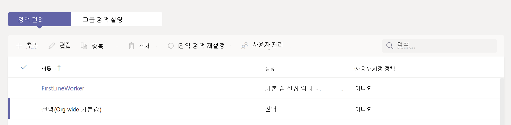

# Microsoft Teams에서 앱 설정 정책 관리

관리자는 앱 설정 정책을 사용하여 앱을 설치 및 고정하고 사용자가 사용자 지정 앱을 업로드할 수 있도록 허용합니다. 고정은 조직에서 관련 앱의 채택을 촉진하는 데 도움이 됩니다.

* **앱 고정:** 앱 설정 정책을 사용하면 고정할 앱을 선택하고, Teams 앱 바 또는 메시지 작성 영역에 앱이 사용자에게 표시되는 순서를 설정할 수 있습니다. 관리자는 또한 최종 사용자가 자신의 앱을 고정할 수 있는지를 제어할 수 있습니다. [앱 고정](#pin-apps)을 참조하세요.
* **앱 설치:** 앱 설정 정책을 사용하면 사용자가 Teams를 시작할 때와 모임 중에 사용자를 대신하여 허용된 앱을 설치할 수 있습니다. 자세한 내용은 [앱 설치](#install-apps)를 참조하세요.
* **사용자 지정 앱 업로드:** 앱 설정 정책을 통해 사용자가 Teams에 사용자 지정 앱을 업로드할 수 있습니다. 자세한 내용은 [사용자 지정 앱 업로드](teams-custom-app-policies-and-settings.md)를 참조하세요.

Microsoft Teams 관리 센터에서 기본적으로 다음과 같은 기본 제공 앱 설정 정책을 사용할 수 있습니다.

* **글로벌(조직 전체 기본값)**: 이 기본 정책은 다른 정책을 할당하지 않는 한 조직의 모든 사용자에게 적용됩니다. 사용자에게 가장 중요한 앱을 고정하도록 글로벌 정책을 편집합니다.

* **최전방 인력**: 이 정책은 최전방 인력용입니다. 정책을 사용자 지정할 수 없습니다. 조직의 최전방 인력에 할당할 수 있습니다.

## 앱 고정

앱을 고정하면 조직의 사용자가 가장 필요로 하는 앱을 강조 표시할 수 있습니다. 고정은 Teams의 모든 앱 유형(핵심 앱, Microsoft 제공 앱, 타사 앱 및 조직 내에서 개발된 사용자 지정)에 대해 작동합니다. 사용자에게 앱이 허용된 경우 앱 설정 정책을 통해 앱을 고정해도 설치됩니다. 앱 설정 정책을 사용하여 다음 작업을 수행할 수 있습니다.

* 최종 사용자를 위해 Microsoft Teams를 사용자 지정하여 가장 중요한 앱을 강조 표시합니다. 고정할 앱과 앱이 표시되는 순서를 선택합니다.
* 사용자가 앱을 고정할 수 있는지를 제어합니다.

앱은 Teams 데스크톱 클라이언트의 왼쪽과 Teams 모바일 클라이언트의 하단에 있는 앱 바에 고정되어 있습니다.

|Teams 데스크톱 클라이언트  |Teams 모바일 클라이언트 |
|---------|---------|
|.  |         |

메시징 확장은 메시지 작성 영역의 맨 아래에 있습니다.

앱 설정 정책을 사용하여 앱을 고정하려면 다음 단계를 수행합니다.

1. Teams 관리 센터에 로그인하고 **Teams 앱** > **[정책 설정](https://admin.teams.microsoft.com/policies/app-setup)** 에 액세스합니다.

1. **추가** 를 선택합니다.

1. 정책의 이름과 설명을 입력합니다.

1. **사용자 고정** 을 켭니다.

   > [!NOTE]
   > **사용자 고정** 설정은 Microsoft 365 GCC(정부 커뮤니티 클라우드) 환경(GCC, GCC High 및 DoD)의 Teams 관리 센터에서 사용할 수 있지만 영향을 주지 않습니다.

1. **고정된 앱** 에서 **앱 추가** 를 선택합니다.

1. **고정된 앱 추가** 창에서 추가할 앱을 검색한 다음 **추가** 를 선택합니다. 앱 권한 정책으로 앱을 필터링할 수도 있습니다.

1. **추가** 를 선택합니다.

1. **앱 바** 또는 **메시징 확장** 에서 Teams에 표시할 순서대로 앱을 정렬합니다.

   :::image type="content" source="media/pin-messaging-extensions.png" alt-text="설치 정책에서 고정된 앱과 고정된 메시징 확장의 스크린샷":::

1. **저장** 을 선택합니다.

> [!NOTE]
> 교육용 Teams에서 과제 앱은 글로벌 정책에 나열되지 않더라도 기본적으로 글로벌 정책에 고정됩니다.

> [!NOTE]
> 조직의 최전방 인력에게는 맞춤형 일선 앱 환경을 사용하는 것이 좋습니다. 이 기능은 [F 라이선스](https://www.microsoft.com/en-us/microsoft-365/enterprise/frontline?rtc=1#office-SKUChooser-0dbn8nt)를 보유한 사용자를 위해 Teams에서 가장 관련성이 높은 앱을 고정합니다. 자세한 내용은 [최전방 직원을 위한 맞춤형 Teams 앱](/microsoft-365/frontline/pin-teams-apps-based-on-license?bc=%2fmicrosoftteams%2fbreadcrumb%2ftoc.json&toc=%2fmicrosoftteams%2ftoc.json)을 참조하세요.

## 앱 설치

관리자는 앱 설정 정책을 사용하여 다음 작업을 수행할 수 있습니다.

* 개인 Teams 환경에 최종 사용자를 위한 앱을 설치합니다.
* 최종 사용자를 위한 앱을 [메시징 확장](/microsoftteams/platform/messaging-extensions/what-are-messaging-extensions)으로 설치합니다.

최종 사용자는 [앱 사용 권한 정책](teams-app-permission-policies.md) 에서 앱을 허용하고 Teams 관리자가 앱을 허용하는 경우 앱을 직접 설치할 수 있습니다. 대신 사용자 또는 조직에 대해 앱이 차단되면 최종 사용자가 [관리자 승인을 요청할](manage-apps.md#manage-user-requests-to-allow-apps) 수 있습니다.

앱 설정 정책을 사용하여 앱을 설치하려면 다음 단계를 수행합니다.

1. Teams 관리 센터에 로그인하고 **Teams 앱** > **[정책 설정](https://admin.teams.microsoft.com/policies/app-setup)** 에 액세스합니다.
1. **추가** 를 선택합니다.
1. 정책의 이름과 설명을 제공합니다.
1. **설치된 앱** 에서 **앱 추가** 를 선택합니다.
1. **설치된 앱 추가** 창에서 사용자를 위해 설치할 앱을 검색합니다. 앱 권한 정책으로 앱을 필터링할 수도 있습니다.
1. **추가** 를 선택합니다.

:::image type="content" source="media/install-apps-in-meeting.png" alt-text="앱 정책을 통해 앱을 설치하는 스크린샷":::

## 앱 설정 정책 관리

Microsoft Teams 관리 센터에서 앱 설정 정책을 관리합니다. 글로벌(조직 전체 기본값) 정책을 사용하거나 사용자 지정 정책을 만들어 할당합니다. 최종 사용자는 글로벌 정책을 받습니다. 사용자 지정 정책을 생성하면 글로벌 정책이 재정의됩니다. 전역 관리자 또는 Teams 서비스 관리자가 이러한 정책을 관리할 수 있습니다.

글로벌 정책의 설정을 편집하여 원하는 앱을 포함할 수 있습니다. 조직의 여러 사용자 그룹에 대해 Teams를 사용자 지정하려면 하나 이상의 사용자 지정 정책을 만들고 할당합니다.

### 앱 설정 정책 편집

Microsoft Teams 관리 센터를 사용하여 글로벌(조직 전체 기본값) 정책 및 사용자가 만든 사용자 지정 정책을 포함하여 정책을 편집할 수 있습니다. 정책을 편집하거나 할당한 후 변경 내용을 적용하는 데 몇 시간이 걸릴 수 있습니다.

1. Teams 관리 센터에 로그인하고 **Teams 앱** > **[정책 설정](https://admin.teams.microsoft.com/policies/app-setup)** 에 액세스합니다.
1. 편집할 정책을 선택한 다음 **편집** 을 선택합니다.

1. 원하는 대로 변경합니다.

1. **저장** 을 선택합니다.

### 사용자 및 그룹에 사용자 지정 앱 설정 정책 할당

최종 사용자 및 그룹에 정책을 할당하는 방법을 알아보려면 [사용자 및 그룹에 정책을 할당하는 방법](assign-policies-users-and-groups.md)을 참조하세요.

## 고려 사항 및 제한 사항

* 앱 설정 정책을 사용하여 구성 가능한 탭으로 사용자 지정 앱을 설치할 수 없습니다.
* 최종 사용자는 관리자가 설치한 앱을 제거할 수 없습니다.
* 앱 설정 정책을 통해 고정되는 앱은 사용자가 고정 해제할 수 있습니다(설정 정책에서 사용자 고정이 허용되는 경우).
* 교육용 Teams에서 과제 앱은 글로벌 정책에 나열되지 않더라도 기본적으로 글로벌 정책에 고정됩니다.
* 정책에 추가할 수 있는 최대 고정 앱 수에는 제한이 없습니다. 그러나 적어도 두 개의 앱이 Teams 모바일 클라이언트(iOS 및 Android)에 고정되어 있어야 합니다. 정책에 앱이 두 개 미만인 경우 모바일 클라이언트는 정책 설정을 반영하지 않고 기존 구성을 계속 사용합니다.
* 정책을 편집하거나 할당한 후 변경 내용을 적용하는 데 몇 시간이 걸릴 수 있습니다.

## FAQ

### 앱 설정 정책 작업

#### 고정된 앱 추가 창에서 앱을 찾을 수 없는 이유

앱 설정 정책을 통해 모든 앱을 Teams에 고정할 수 있는 것은 아닙니다. 일부 앱은 이 기능을 지원하지 않을 수 있습니다. 고정할 수 있는 앱을 찾으려면 **고정된 앱 추가** 창에서 앱을 검색합니다. 개인 범위(정적 탭)와 봇이 있는 탭은 Teams 데스크톱 클라이언트에 고정할 수 있으며, 이러한 앱은 **고정된 앱 추가** 창에서 사용할 수 있습니다.

Teams 앱 스토어에는 모든 Teams 앱이 나열됩니다. **고정된 앱 추가** 창에는 정책을 통해 Teams에 고정될 수 있는 앱만 포함됩니다.

#### 저는 교육용 Teams 관리자입니다. 교육용 Teams의 앱 설정 정책에 대해 알아야 할 사항은 무엇인가요?

교육용 Teams에서는 통화 앱을 사용할 수 없습니다. 새 사용자 지정 앱 설정 정책을 만들면 통화 앱이 앱 목록에 표시됩니다. 그러나 이 앱은 Teams 클라이언트에 고정되어 있지 않으며 교육용 Teams 사용자는 Teams에서 통화 앱을 볼 수 없습니다.

### 사용자 환경

#### 사용자가 Teams에서 고정된 모든 앱을 볼 수 있는 방법

사용자에게 고정된 모든 앱을 보려면 설치된 앱의 수와 Teams 클라이언트 창의 크기에 따라 다음 작업을 수행해야 할 수 있습니다.

|Teams 데스크톱 클라이언트 |Teams 모바일 클라이언트 |
|---------|---------|
|Teams 측면의 앱 바에서 **... 더 많은 앱** 을 선택합니다.| Teams 아래쪽에 있는 앱 바에서 위로 살짝 밉니다.|
|   |  

#### Teams 모바일 환경에 대해 알아야 할 사항

Teams 모바일 클라이언트(iOS 및 Android)는 정적 탭이 있는 개인 앱을 지원합니다. Teams 데스크톱 클라이언트에 고정된 앱이 Teams 모바일 클라이언트에 표시됩니다. 개인 봇은 모바일 클라이언트의 채팅에 표시됩니다.

타사 앱(Teams 스토어에서 다운로드할 수 있음)은 모바일에서 표시되기 전에 승인을 받아야 합니다. Microsoft에서 승인하지 않은 모바일용 앱을 관리자가 고정하면 Teams 데스크톱에는 표시되지만 모바일에는 표시되지 않습니다. 자세한 내용은 [모바일 클라이언트](/microsoftteams/platform/tabs/what-are-tabs#mobile-clients)를 참조하세요.

Teams 모바일 클라이언트를 사용하면 활동, 채팅 및 Teams와 같은 핵심 Teams 앱이 사용자에게 표시되고 Microsoft에서 제공하는 앱 중 일부를 고정할 수 있습니다.

#### 정책을 통해 고정된 앱 순서

사용자는 **사용자 고정** 옵션이 설정된 경우 Teams 데스크톱 및 모바일 클라이언트에서 고정된 앱의 순서를 변경할 수 있습니다. 사용자는 Teams 웹 클라이언트에서 고정된 앱의 순서를 변경할 수 없습니다.

#### 사용자 고정이 우선적으로 적용되나요?

관리자 핀이 항상 우선적으로 적용됩니다. **사용자 고정** 옵션이 켜져 있으면 사용자가 고정한 앱이 관리자가 고정한 앱 아래에 표시됩니다. **사용자 고정** 옵션이 해제된 경우 사용자는 기존 핀을 잃게 되며 관리자가 고정한 앱만 앱 표시줄에서 사용할 수 있습니다.

### 사용자 지정 Teams 앱

#### 조직에서 사용자 지정 Teams 앱을 빌드하여 AppSource 또는 테넌트 앱 카탈로그에 게시했지만, 앱이 Teams의 앱 바에 고정되면 앱 아이콘이 예상대로 표시되지 않습니다. 이 문제를 해결하려면 어떻게 하나요?

앱을 제출하기 전에 로고 지침을 따라야 합니다. 자세한 내용은 [판매자 대시보드 제출을 위한 체크리스트](/microsoftteams/platform/concepts/deploy-and-publish/appsource/prepare/overview)를 참조하세요.

## 관련 기사

* [Teams의 앱에 대한 관리 설정](admin-settings.md)
* [Teams에서 최종 사용자에게 정책 할당](assign-policies-users-and-groups.md)
