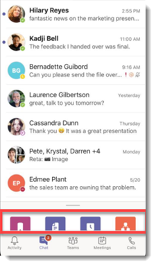

# Microsoft Teams에서 앱 설정 정책 관리

> [!NOTE]
> 전체 앱 **설정,** 사용자 지정 앱과의 상호 작용 허용을 사용하도록 설정한 경우 Microsoft Teams 관리 센터에 앱 설정 정책이 아직 표시되지 않을 수 있습니다. 현재 롤아웃 중으로, 조직에서 곧 사용할 수 있습니다.

관리자는 앱 설정 정책을 사용하여 다음 작업을 수행할 수 있습니다.

- 팀을 사용자 지정하여 사용자에게 가장 중요한 앱을 강조 표시합니다. 고정할 앱을 선택하고 표시 순서를 설정할 수 있습니다. 앱을 고정하면 타사 또는 조직의 개발자가 구축한 앱을 포함하여 조직의 사용자가 필요로 하는 앱을 소개할 수 있습니다.
- 사용자가 앱을 Teams에 고정할 수 있는지 여부를 제어합니다.
- 사용자를 대신하여 앱을 **설치합니다(미리 보기 상태).** Teams를 시작할 때 사용자가 기본적으로 설치할 앱을 선택할 수 있습니다. 할당된 앱 사용 권한 정책이  허용하는 경우 사용자가 앱을 직접 설치할 수 있습니다.

앱은 Teams 데스크톱 클라이언트의 측면 및 Teams 모바일 클라이언트(iOS 및 Android) 아래쪽에 있는 표시줄인 앱 바에 고정됩니다.

|Teams 데스크톱 클라이언트  |Teams 모바일 클라이언트 |
|---------|---------|
|   |         |

미리 설치된 앱을 표시하려면 앱 표시줄에서 ...를 **선택합니다.** Teams 데스크톱 및 웹 클라이언트에 더 많은 앱이 있으며 모바일 클라이언트에서 위를 스와이프합니다.

Microsoft Teams 관리 센터에서 앱 설정 정책을 관리합니다. 전역(전체 기본) 정책을 사용하거나 사용자 지정 정책을 만들고 할당합니다.  사용자 지정 정책을 만들고 할당하지 않으면 조직의 사용자에게 전역 정책이 자동으로 적용됩니다. 이러한 정책을 관리하려면 전역 관리자 또는 Teams 서비스 관리자여야 합니다.

원하는 앱을 포함하려면 전역 정책에서 설정을 편집합니다. 조직의 다른 사용자 그룹에 대해 Teams를 사용자 지정하기 위해 하나 이상의 사용자 지정 정책을 만들고 할당합니다.

> [!NOTE]
> 교육용 Teams가 있는 경우 과제 앱이 기본적으로 전역 정책에 고정되어 있는 경우에도 전역 정책에 나열되어 있는 것은 아는 것이 중요합니다. Teams 클라이언트의 고정된 앱 목록에서 네 번째 앱입니다.

## 사용자 지정 앱 설정 정책 만들기

Microsoft Teams 관리 센터를 사용하여 사용자 지정 정책을 만들 수 있습니다.

1. Microsoft Teams 관리 센터의 왼쪽 탐색 모음에서 **Teams** 앱 설정  >  **정책으로 이동하세요.**

2. **추가** 를 선택합니다.

   
    
3. 정책의 이름과 설명을 입력합니다.

4. 사용자가 Teams에 사용자 지정 앱을 업로드할지 여부에 따라 사용자 지정 앱 업로드를 설정하거나 해제합니다. 타사 앱 허용이 전체  앱 설정에서 해제되어 있는 경우 이 설정을 변경할 [수 없습니다.](manage-apps.md#manage-org-wide-app-settings)

5. 사용자가 앱을 고정하여 앱 바를 개인 설정하도록 할지 여부에 따라 사용자 고정 허용을 설정하거나 해제합니다. 

   > [!NOTE]
   > 사용자 **고정** 허용 설정은 Microsoft 365 GCC(Government Community Cloud) 환경(GCC, GCC High 및 DoD)의 Teams 관리 센터에서 사용할 수 있지만 현재는 효과가 없습니다.

6. 사용자용 앱(미리 **보기)을 설치하려면** 다음 작업을 수행합니다.

    1. 설치된 **앱 아래에서** 앱 **추가를 선택합니다.**
    
    2. 설치된 앱 **추가** 창에서 Teams를 시작할 때 사용자를 위해 자동으로 설치하려는 앱을 검색합니다. 앱 사용 권한 정책에 따라 앱을 필터링할 수 있습니다. 앱 목록을 선택한 경우 추가를 **선택합니다.**

       

7. 앱을 고정하기 위해 다음을 실행합니다.

    1. 고정된 **앱에서** 앱 **추가를 선택합니다.**
    
    2. 고정된  앱 추가 창에서 추가할 앱을 검색한 다음 추가를 **선택합니다.** 앱 사용 권한 정책에 따라 앱을 필터링할 수 있습니다. 고정할 앱 목록을 선택한 경우 추가를 **선택합니다.**

       

    3. 앱을 Teams에 표시하려는 순서대로 정렬한 다음 저장을 **선택합니다.**

       

## 앱 설정 정책 편집

Microsoft Teams 관리 센터를 사용하여 만든 전역(전체 기본) 정책 및 사용자 지정 정책을 포함하여 정책을 편집할 수 있습니다.

1. Microsoft Teams 관리 센터의 왼쪽 탐색 모음에서 **Teams** 앱 설정  >  **정책으로 이동하세요.**

2. 정책 이름 왼쪽을 클릭하여 정책을 선택한 다음 편집을 **선택합니다.**

3. 여기에서 원하는 내용을 변경합니다.

4. 저장을 **선택합니다.**

## 사용자에게 사용자 지정 앱 설정 정책 할당

[!INCLUDE [assign-policy](includes/assign-policy.md)]

## FAQ

### 앱 설정 정책 작업

#### Microsoft Teams 관리 센터에 포함된 기본 제공 앱 설정 정책

- **전역(조직** 전체 기본값) : 이 기본 정책은 다른 정책을 할당하지 않는 한 조직의 모든 사용자에게 적용됩니다. 사용자에게 가장 중요한 앱을 고정하려면 전역 정책을 편집합니다.

- **FrontlineWorker:** 이 정책은 Frontline Workers에 대한 것입니다. 조직의 일선 작업자에게 할당할 수 있습니다. 만드는 사용자 지정 정책과 마찬가지로 설정이 활성화될 수 있도록 사용자에게 정책을 할당해야 합니다. 자세한 내용은 이 문서의 사용자에 대한 사용자 지정 앱 설정 정책 할당 섹션으로 이동하세요. 

#### 고정된 앱 추가 창에서 앱을 찾을 수 없는 이유

일부 앱은 앱 설정 정책을 통해 Teams에 고정할 수 없습니다. 일부 앱은 이 기능을 지원하지 않을 수 있습니다. 고정할 수 있는 앱을 찾으면 고정된 앱 추가 창에서 앱을 **검색합니다.** 개인 범위(정적 탭)와 봇이 있는 탭은 Teams 데스크톱 클라이언트에 고정할 수 있으며 이러한 앱은 고정된 앱 추가 창에서 사용할 **수** 있습니다.

Teams 앱 스토어에는 모든 Teams 앱이 나열됩니다. 고정된 **앱 추가** 창에는 정책을 통해 Teams에 고정할 수 있는 앱만 포함됩니다.

#### 저는 교육용 Teams 관리자입니다. 교육용 Teams의 앱 설정 정책에 대해 알아야 할 정보

교육용 Teams에서 통화 앱을 사용할 수 없습니다. 새 사용자 지정 앱 설정 정책을 만들면 호출 앱이 앱 목록에 표시됩니다. 그러나 앱이 Teams 클라이언트에 고정되지 않은 경우 교육용 Teams 사용자는 Teams의 통화 앱을 볼 수 없습니다.

#### 정책에 추가할 수 있는 고정된 앱 수

Teams 모바일 클라이언트(iOS 및 Android)에 최소 두 개의 앱을 고정해야 합니다. 정책에 두 개 미만의 앱이 있는 경우 모바일 클라이언트는 정책 설정을 반영하지 않고 기존 구성을 계속 사용합니다.

정책에 추가할 수 있는 고정된 앱 수에는 제한이 없습니다.

#### 정책 변경 내용을 적용하는 데 시간이 얼마나 걸릴 수 있습니다.

정책을 편집하거나 할당한 후 변경 내용을 적용하는 데 몇 시간이 걸릴 수 있습니다.

### 사용자 환경

#### 사용자가 Teams에서 고정된 모든 앱을 보는 방법

사용자에 대해 고정된 모든 앱을 보기 위해 사용자는 설치된 앱 수 및 Teams 클라이언트 창의 크기에 따라 다음을 실행해야 할 수 있습니다.

|Teams 데스크톱 클라이언트 |Teams 모바일 클라이언트 |
|---------|---------|
|Teams 측면의 앱 바에서 ... **더 많은 앱.**| Teams 아래쪽에 있는 앱 바에서 위쪽으로 손가락을 다.|
|    |  

#### Teams 모바일 경험에 대해 알아야 할 것

Teams 모바일 클라이언트(iOS 및 Android)는 현재 정적 탭이 있는 개인 앱을 지원하지 않습니다. 정책에 설정된 앱에 따라 Teams 데스크톱 클라이언트에 고정된 앱이 Teams 모바일 클라이언트에 나타나지 않을 수 있습니다. 개인 봇은 모바일 클라이언트의 채팅에 계속 표시됩니다.

Teams 모바일 클라이언트를 사용하면 사용자는 활동, 채팅, Teams와 같은 핵심 Teams 앱을 볼 수 있으며 Shifts와 같은 Microsoft의 일부 파티 앱을 고정할 수 있습니다.

#### 사용자가 정책을 통해 고정된 앱의 순서를 변경할 수 있습니다.

사용자 고정 허용 옵션이 켜져 있는 경우 Teams 데스크톱  및 모바일 클라이언트에서 고정된 앱의 순서를 변경할 수 있습니다. 사용자는 Teams 웹 클라이언트에서 고정된 앱의 순서를 변경할 수 없습니다.

#### 사용자 고정이 우선적으로 적용

사용자에게 할당된 앱 설정 정책이 사용자 앱 고정을 차단하도록 변경된 경우 Teams는 앱 바에 고정된 모든 앱을 제거합니다. 정책이 사용자 앱 고정을 허용하도록 변경된 경우 사용자는 이전에 고정된 앱을 다시 고정해야 합니다.

### 사용자 지정 Teams 앱

#### 조직에서 사용자 지정 Teams 앱을 구축하여 AppSource 또는 테넌트 앱 카탈로그에 게시했지만 앱이 Teams의 앱 바에 고정되어 있는 경우 앱 아이콘이 예상대로 표시되지 않습니다. 해결 방법

앱을 제출하기 전에 로고 지침을 따라야 합니다. 자세한 내용은 판매자 대시보드 [제출에 대한 검사 목록을 참조하세요.](/microsoftteams/platform/concepts/deploy-and-publish/appsource/prepare/overview)

## 관련 항목

[Team에서 앱의 관리 설정](admin-settings.md)

[Teams에서 사용자에게 정책 할당](assign-policies.md)
