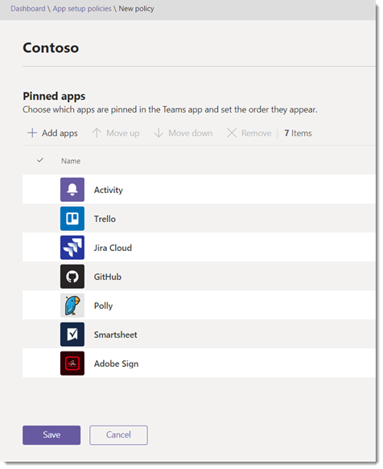

# <a name="manage-app-setup-policies-in-microsoft-teams"></a><span data-ttu-id="5ab56-103">Microsoft 팀에서 앱 설치 정책 관리</span><span class="sxs-lookup"><span data-stu-id="5ab56-103">Manage app setup policies in Microsoft Teams</span></span>

> [!NOTE]
> <span data-ttu-id="5ab56-104">조직 전체 앱 설정을 사용 하도록 설정한 경우 **사용자 지정 앱과의 상호 작용을 허용**하면 Microsoft 팀 관리 센터에 앱 설정 정책이 아직 표시 되지 않을 수 있습니다.</span><span class="sxs-lookup"><span data-stu-id="5ab56-104">If you enabled the org-wide app setting, **Allow interaction with custom apps**, you may not see app setup policies yet in the Microsoft Teams admin center.</span></span> <span data-ttu-id="5ab56-105">현재 출시 되 고 있으며 조직에서 곧 사용할 수 있게 됩니다.</span><span class="sxs-lookup"><span data-stu-id="5ab56-105">It's currently being rolled out and will be available soon in your organization.</span></span>

<span data-ttu-id="5ab56-106">관리자는 앱 설정 정책을 사용하여 다음을 수행할 수 있습니다.</span><span class="sxs-lookup"><span data-stu-id="5ab56-106">As an admin, you can use app setup policies to do the following:</span></span>

- <span data-ttu-id="5ab56-107">팀을 사용자 지정하여 사용자에게 가장 중요한 앱을 강조 표시합니다.</span><span class="sxs-lookup"><span data-stu-id="5ab56-107">Customize Teams to highlight the apps that are most important for your users.</span></span> <span data-ttu-id="5ab56-108">고정할 앱을 선택 하 고 표시 되는 순서를 설정 합니다.</span><span class="sxs-lookup"><span data-stu-id="5ab56-108">You choose the apps to pin and set the order that they appear.</span></span> <span data-ttu-id="5ab56-109">앱 고정을 사용하면 조직의 개발자나 타사에서 빌드한 앱을 비롯하여 조직의 사용자에게 필요한 앱을 표시할 수 있습니다.</span><span class="sxs-lookup"><span data-stu-id="5ab56-109">Pinning apps lets you showcase apps that users in your organization need, including those built by third parties or by developers in your organization.</span></span>
- <span data-ttu-id="5ab56-110">사용자가 앱을 Teams에 고정할 수 있는지 여부를 제어합니다.</span><span class="sxs-lookup"><span data-stu-id="5ab56-110">Control whether users can pin apps to Teams.</span></span>
- <span data-ttu-id="5ab56-111">사용자를 대신 하 여 앱을 설치 합니다 **(미리 보기)**.</span><span class="sxs-lookup"><span data-stu-id="5ab56-111">Install apps on behalf of users **(in preview)**.</span></span> <span data-ttu-id="5ab56-112">사용자가 팀을 시작할 때 기본적으로 설치 되는 앱을 선택 합니다.</span><span class="sxs-lookup"><span data-stu-id="5ab56-112">You choose which apps are installed by default for users when they start Teams.</span></span> <span data-ttu-id="5ab56-113">할당 된 [앱 권한 정책이](teams-app-permission-policies.md) 허용 하는 경우에도 사용자가 앱을 설치할 수 있다는 점에 유의 하세요.</span><span class="sxs-lookup"><span data-stu-id="5ab56-113">Keep in mind that users can still install apps themselves if the [app permission policy](teams-app-permission-policies.md) that's assigned to them allows it.</span></span>

<span data-ttu-id="5ab56-114">앱은 앱 표시줄에 고정됩니다.</span><span class="sxs-lookup"><span data-stu-id="5ab56-114">Apps are pinned to the app bar.</span></span> <span data-ttu-id="5ab56-115">앱 표시줄 Teams 데스크톱 클라이언트의 측면과 Teams 모바일 클라이언트(iOS 및 Android)의 하단에 있는 표시줄입니다.</span><span class="sxs-lookup"><span data-stu-id="5ab56-115">This is the bar on the side of the Teams desktop client and at the bottom of the Teams mobile clients (iOS and Android).</span></span>

|<span data-ttu-id="5ab56-116">팀 데스크톱 클라이언트</span><span class="sxs-lookup"><span data-stu-id="5ab56-116">Teams desktop client</span></span>  |<span data-ttu-id="5ab56-117">팀 모바일 클라이언트</span><span class="sxs-lookup"><span data-stu-id="5ab56-117">Teams mobile client</span></span> |
|---------|---------|
|<br>  |         |

<span data-ttu-id="5ab56-120">사전 설치 된 앱을 보려면 앱 표시줄에서 사용자 \*\*를 클릭 합니다. \*\*팀 데스크톱 및 웹 클라이언트의 앱을 더 추가 하 고 모바일 클라이언트에서 위로 살짝 밉니다.</span><span class="sxs-lookup"><span data-stu-id="5ab56-120">To see their pre-installed apps, in the app bar, users click **... More apps** in the Teams desktop and web clients and swipe up in the mobile clients.</span></span>

<span data-ttu-id="5ab56-121">Microsoft 팀 관리 센터에서 앱 설치 정책을 관리할 수 있습니다.</span><span class="sxs-lookup"><span data-stu-id="5ab56-121">You manage app setup policies in the Microsoft Teams admin center.</span></span> <span data-ttu-id="5ab56-122">전역(조직 전체 기본값) 정책을 사용하거나 사용자 지정 정책을 만들어 사용자에게 할당할 수 있습니다.</span><span class="sxs-lookup"><span data-stu-id="5ab56-122">You can use the global (Org-wide default) policy or create custom policies and assign them to users.</span></span> <span data-ttu-id="5ab56-123">사용자 지정 정책을 만들고 할당하지 않으면 조직의 사용자에게 전역 정책이 자동으로 적용됩니다.</span><span class="sxs-lookup"><span data-stu-id="5ab56-123">Users in your organization will automatically get the global policy unless you create and assign a custom policy.</span></span> <span data-ttu-id="5ab56-124">이러한 정책을 관리하려면 전역 관리자 또는 Teams 서비스 관리자여야 합니다.</span><span class="sxs-lookup"><span data-stu-id="5ab56-124">You must be a global admin or Teams service admin to manage these policies.</span></span>

<span data-ttu-id="5ab56-125">전역 정책의 설정을 편집 하 여 원하는 앱을 포함할 수 있습니다.</span><span class="sxs-lookup"><span data-stu-id="5ab56-125">You can edit the settings in the global policy to include the apps that you want.</span></span> <span data-ttu-id="5ab56-126">조직의 다른 사용자 그룹에 대해 팀을 사용자 지정 하려면 하나 이상의 사용자 지정 정책을 만들고 할당 합니다.</span><span class="sxs-lookup"><span data-stu-id="5ab56-126">If you want to customize Teams for different groups of users in your organization, create and assign one or more custom policies.</span></span> <span data-ttu-id="5ab56-127">사용자가 사용자 지정 정책을 할당 한 경우 해당 정책이 사용자에 게 적용 됩니다.</span><span class="sxs-lookup"><span data-stu-id="5ab56-127">If a user is assigned a custom policy, that policy applies to the user.</span></span> <span data-ttu-id="5ab56-128">사용자가 사용자 지정 정책을 할당 하지 않으면 전역 정책이 사용자에 게 적용 됩니다.</span><span class="sxs-lookup"><span data-stu-id="5ab56-128">If a user isn't assigned a custom policy, the global policy applies to the user.</span></span>


> [!NOTE]
> <span data-ttu-id="5ab56-130">교육 팀이 있는 경우 현재 글로벌 정책에는 할당 앱이 기본적으로 고정 되어 있지만,이는 전역 정책에 나열 되지 않은 경우에도 확인 하는 것이 중요 합니다.</span><span class="sxs-lookup"><span data-stu-id="5ab56-130">If you have Teams for Education, it's important to know that the Assignments app is pinned by default in the global policy even though currently, you don't see it listed in the global policy.</span></span> <span data-ttu-id="5ab56-131">팀 클라이언트의 고정 된 앱 목록에서 네 번째 앱이 됩니다.</span><span class="sxs-lookup"><span data-stu-id="5ab56-131">It will be the fourth app in the list of pinned apps on Teams clients.</span></span>

## <a name="create-a-custom-app-setup-policy"></a><span data-ttu-id="5ab56-132">사용자 지정 앱 설정 정책 만들기</span><span class="sxs-lookup"><span data-stu-id="5ab56-132">Create a custom app setup policy</span></span>

<span data-ttu-id="5ab56-133">Microsoft 팀 관리 센터를 사용 하 여 사용자 지정 정책을 만들 수 있습니다.</span><span class="sxs-lookup"><span data-stu-id="5ab56-133">You can use the Microsoft Teams admin center to create a custom policy.</span></span>

1. <span data-ttu-id="5ab56-134">Microsoft 팀 관리 센터의 왼쪽 탐색 창에서 **팀 앱**  >  **설정 정책**으로 이동 합니다.</span><span class="sxs-lookup"><span data-stu-id="5ab56-134">In the left navigation of the Microsoft Teams admin center, go to **Teams apps** > **Setup policies**.</span></span>
2. <span data-ttu-id="5ab56-135">**추가**를 클릭 합니다.</span><span class="sxs-lookup"><span data-stu-id="5ab56-135">Click **Add**.</span></span>
    <span data-ttu-id="5ab56-136"></span><span class="sxs-lookup"><span data-stu-id="5ab56-136"></span></span>
3. <span data-ttu-id="5ab56-137">정책의 이름과 설명을 입력합니다.</span><span class="sxs-lookup"><span data-stu-id="5ab56-137">Enter a name and description for the policy.</span></span>
4. <span data-ttu-id="5ab56-138">사용자 지정 앱을 팀에 업로드 하도록 허용할지 여부에 따라 **사용자 지정 앱 업로드**를 설정 하거나 해제 합니다.</span><span class="sxs-lookup"><span data-stu-id="5ab56-138">Turn on or turn off **Upload custom apps**, depending on whether you want to let users upload custom apps to Teams.</span></span> <span data-ttu-id="5ab56-139">[조직 전체 앱 설정](manage-apps.md#manage-org-wide-app-settings)에서 타사 **앱 허용** 이 해제 되어 있는 경우에는이 설정을 변경할 수 없습니다.</span><span class="sxs-lookup"><span data-stu-id="5ab56-139">You won't be able to change this setting if **Allow third-party apps** is turned off in [org-wide app settings](manage-apps.md#manage-org-wide-app-settings).</span></span>
5. <span data-ttu-id="5ab56-140">사용자에 게 앱을 고정 하 여 앱 표시줄을 개인 설정할 수 있도록 할지 여부에 따라 **사용자 고정 허용**을 설정 하거나 해제 합니다.</span><span class="sxs-lookup"><span data-stu-id="5ab56-140">Turn on or turn off **Allow user pinning**, depending on whether you want to let users personalize their app bar by pinning apps to it.</span></span>
6. <span data-ttu-id="5ab56-141">사용자를 위해 앱을 설치 하려면 **(미리 보기에서)** 다음을 수행 합니다.</span><span class="sxs-lookup"><span data-stu-id="5ab56-141">To install apps for users **(in preview)**, do the following:</span></span>

    1. <span data-ttu-id="5ab56-142">**설치 된 앱**에서 **앱 추가**를 클릭 합니다.</span><span class="sxs-lookup"><span data-stu-id="5ab56-142">Under **Installed apps**, click **Add apps**.</span></span>
    2. <span data-ttu-id="5ab56-143">**설치 된 앱 추가** 창에서 팀을 시작할 때 자동으로 설치 하려는 앱을 검색 합니다.</span><span class="sxs-lookup"><span data-stu-id="5ab56-143">In the **Add installed apps** pane, search for the apps you want to automatically install for users when they start Teams.</span></span> <span data-ttu-id="5ab56-144">앱 사용 권한 정책을 기준으로 앱을 필터링 할 수도 있습니다.</span><span class="sxs-lookup"><span data-stu-id="5ab56-144">You can also filter apps by app permission policy.</span></span> <span data-ttu-id="5ab56-145">앱 목록을 선택한 후 **추가**를 클릭 합니다.</span><span class="sxs-lookup"><span data-stu-id="5ab56-145">When you've chosen your list of apps, click **Add**.</span></span>

        

7. <span data-ttu-id="5ab56-147">앱을 고정 하려면 다음을 수행 합니다.</span><span class="sxs-lookup"><span data-stu-id="5ab56-147">To pin apps, do the following:</span></span>

    1. <span data-ttu-id="5ab56-148">**고정 된 앱**에서 **앱 추가**를 클릭 합니다.</span><span class="sxs-lookup"><span data-stu-id="5ab56-148">Under **Pinned apps**, click **Add apps**.</span></span>
    2. <span data-ttu-id="5ab56-149">고정 된 **앱 추가** 창에서 추가 하려는 앱을 검색 한 다음 **추가**를 클릭 합니다.</span><span class="sxs-lookup"><span data-stu-id="5ab56-149">In the **Add pinned apps** pane, search for the apps you want to add, and then click **Add**.</span></span> <span data-ttu-id="5ab56-150">앱 사용 권한 정책을 기준으로 앱을 필터링 할 수도 있습니다.</span><span class="sxs-lookup"><span data-stu-id="5ab56-150">You can also filter apps by app permission policy.</span></span> <span data-ttu-id="5ab56-151">고정할 앱 목록을 선택 했으면 **추가**를 클릭 합니다.</span><span class="sxs-lookup"><span data-stu-id="5ab56-151">When you've chosen your list of apps to pin, click **Add**.</span></span>

         

    3. <span data-ttu-id="5ab56-153">팀에 표시할 순서 대로 앱을 정렬 한 다음 **저장**을 클릭 합니다.</span><span class="sxs-lookup"><span data-stu-id="5ab56-153">Arrange the apps in the order that you want them to appear in Teams, and then click **Save**.</span></span>

        

## <a name="edit-an-app-setup-policy"></a><span data-ttu-id="5ab56-155">앱 설치 정책 편집</span><span class="sxs-lookup"><span data-stu-id="5ab56-155">Edit an app setup policy</span></span>

<span data-ttu-id="5ab56-156">Microsoft 팀 관리 센터를 사용 하 여 전역 (조직 전체 기본값) 정책 및 직접 만든 사용자 지정 정책을 비롯 한 정책을 편집할 수 있습니다.</span><span class="sxs-lookup"><span data-stu-id="5ab56-156">You can use the Microsoft Teams admin center to edit a policy, including the global (Org-wide default) policy and custom policies that you create.</span></span>

1. <span data-ttu-id="5ab56-157">Microsoft 팀 관리 센터의 왼쪽 탐색 창에서 **팀 앱**  >  **설정 정책**으로 이동 합니다.</span><span class="sxs-lookup"><span data-stu-id="5ab56-157">In the left navigation of the Microsoft Teams admin center, go to **Teams apps** > **Setup policies**.</span></span>
2. <span data-ttu-id="5ab56-158">정책 이름 왼쪽을 클릭 하 여 정책을 선택한 다음 **편집**을 클릭 합니다.</span><span class="sxs-lookup"><span data-stu-id="5ab56-158">Select the policy by clicking to the left of the policy name, and then click **Edit**.</span></span>
3. <span data-ttu-id="5ab56-159">여기서 원하는 대로 변경 합니다.</span><span class="sxs-lookup"><span data-stu-id="5ab56-159">From here, make the changes that you want.</span></span>
4. <span data-ttu-id="5ab56-160">**저장**을 클릭합니다.</span><span class="sxs-lookup"><span data-stu-id="5ab56-160">Click **Save**.</span></span>

## <a name="assign-a-custom-app-setup-policy-to-users"></a><span data-ttu-id="5ab56-161">사용자에 게 사용자 지정 앱 설정 정책 할당</span><span class="sxs-lookup"><span data-stu-id="5ab56-161">Assign a custom app setup policy to users</span></span>

<span data-ttu-id="5ab56-162">Microsoft 팀 관리 센터를 사용 하 여 사용자 지정 정책을 개인 사용자 또는 비즈니스용 Skype PowerShell 모듈에 할당 하 여 보안 그룹 또는 메일 그룹과 같은 사용자 그룹에 사용자 지정 정책을 할당할 수 있습니다.</span><span class="sxs-lookup"><span data-stu-id="5ab56-162">You can use the Microsoft Teams admin center to assign a custom policy to individual users or the Skype for Business PowerShell module  to assign a custom policy to groups of users, such as a security group or distribution group.</span></span>

### <a name="assign-a-custom-app-setup-policy-to-users"></a><span data-ttu-id="5ab56-163">사용자에 게 사용자 지정 앱 설정 정책 할당</span><span class="sxs-lookup"><span data-stu-id="5ab56-163">Assign a custom app setup policy to users</span></span>

1. <span data-ttu-id="5ab56-164">Microsoft 팀 관리 센터의 왼쪽 탐색 창에서 **사용자**로 이동한 다음 사용자를 클릭 합니다.</span><span class="sxs-lookup"><span data-stu-id="5ab56-164">In the left navigation of the Microsoft Teams admin center, go to **Users**, and then click  the user.</span></span>
2. <span data-ttu-id="5ab56-165">사용자 이름의 왼쪽을 클릭하여 사용자를 선택한 후 **설정 편집**을 클릭합니다.</span><span class="sxs-lookup"><span data-stu-id="5ab56-165">Select the user by clicking to the left of the user name, and then click **Edit settings**.</span></span>
3. <span data-ttu-id="5ab56-166">**앱 설정 정책**에서 할당 하려는 앱 설정 정책을 선택한 다음 **적용**을 클릭 합니다.</span><span class="sxs-lookup"><span data-stu-id="5ab56-166">Under **App setup policy**, select the app setup policy you want to assign, and then click **Apply**.</span></span>

<span data-ttu-id="5ab56-167">한 번에 여러 사용자에게 정책을 할당하려면 [Teams 사용자 설정을 일괄 편집](edit-user-settings-in-bulk.md)을 참조하세요.</span><span class="sxs-lookup"><span data-stu-id="5ab56-167">To assign a policy to multiple users at a time, see [Edit Teams user settings in bulk](edit-user-settings-in-bulk.md).</span></span>

<span data-ttu-id="5ab56-168">또는 다음을 수행할 수도 있습니다.</span><span class="sxs-lookup"><span data-stu-id="5ab56-168">Or, you can also do the following:</span></span>

1. <span data-ttu-id="5ab56-169">Microsoft 팀 관리 센터의 왼쪽 탐색 창에서 **팀 앱**  >  **설정 정책**으로 이동 합니다.</span><span class="sxs-lookup"><span data-stu-id="5ab56-169">In the left navigation of the Microsoft Teams admin center, go to **Teams apps** > **Setup policies**.</span></span>
2. <span data-ttu-id="5ab56-170">정책 이름의 왼쪽을 클릭하여 정책을 선택합니다.</span><span class="sxs-lookup"><span data-stu-id="5ab56-170">Select the policy by clicking to the left of the policy name.</span></span>
3. <span data-ttu-id="5ab56-171">**사용자 관리**를 선택합니다.</span><span class="sxs-lookup"><span data-stu-id="5ab56-171">Select **Manage users**.</span></span>
4. <span data-ttu-id="5ab56-172">**사용자 관리** 창에서 표시 이름 또는 사용자 이름으로 사용자를 검색하고 이름을 선택한 다음, **추가**를 선택하세요.</span><span class="sxs-lookup"><span data-stu-id="5ab56-172">In the **Manage users** pane, search for the user by display name or by user name, select the name, and then select **Add**.</span></span> <span data-ttu-id="5ab56-173">추가할 각 사용자에 대해 이 단계를 반복합니다.</span><span class="sxs-lookup"><span data-stu-id="5ab56-173">Repeat this step for each user that you want to add.</span></span>
5. <span data-ttu-id="5ab56-174">사용자 추가를 마쳤으면 **저장**을 선택 합니다.</span><span class="sxs-lookup"><span data-stu-id="5ab56-174">After you finish adding users, select **Save**.</span></span>

### <a name="assign-a-custom-app-setup-policy-to-users-in-a-group"></a><span data-ttu-id="5ab56-175">그룹의 사용자에 게 사용자 지정 앱 설정 정책 할당</span><span class="sxs-lookup"><span data-stu-id="5ab56-175">Assign a custom app setup policy to users in a group</span></span>

<span data-ttu-id="5ab56-176">이미 식별 한 여러 사용자에 게 사용자 지정 앱 설정 정책을 할당 하려고 할 수 있습니다.</span><span class="sxs-lookup"><span data-stu-id="5ab56-176">You may want to assign a custom app setup policy to multiple users that you've already identified.</span></span> <span data-ttu-id="5ab56-177">예를 들어 보안 그룹의 모든 사용자에 게 정책을 할당 하려고 할 수 있습니다.</span><span class="sxs-lookup"><span data-stu-id="5ab56-177">For example, you may want to assign a policy to all users in a security group.</span></span> <span data-ttu-id="5ab56-178">그래프 모듈의 Azure Active Directory PowerShell 및 비즈니스용 Skype PowerShell 모듈에 연결 하 여이 작업을 수행할 수 있습니다.</span><span class="sxs-lookup"><span data-stu-id="5ab56-178">You can do this by connecting to the Azure Active Directory PowerShell for Graph module and the Skype for Business PowerShell module.</span></span> <span data-ttu-id="5ab56-179">PowerShell을 사용 하 여 팀을 관리 하는 방법에 대 한 자세한 내용은 [팀 Powershell 개요](teams-powershell-overview.md)를 참조 하세요.</span><span class="sxs-lookup"><span data-stu-id="5ab56-179">For more information about using PowerShell to manage Teams, see [Teams PowerShell Overview](teams-powershell-overview.md).</span></span>

<span data-ttu-id="5ab56-180">이 예제에서는 Contoso 금강 HR 프로젝트 그룹의 모든 사용자에 게 HR 앱 설정 정책 이라는 사용자 지정 앱 설정 정책을 할당 합니다.</span><span class="sxs-lookup"><span data-stu-id="5ab56-180">In this example, we assign a custom app setup policy called HR App Setup Policy to all users in the Contoso Pharmaceuticals HR Project group.</span></span>  

> [!NOTE]
> <span data-ttu-id="5ab56-181">먼저 [단일 Windows powershell 창에서 모든 Office 365 서비스에 연결](https://docs.microsoft.com/office365/enterprise/powershell/connect-to-all-office-365-services-in-a-single-windows-powershell-window)의 단계를 따라 Graph 모듈 및 비즈니스용 Skype powershell 모듈에 대 한 Azure Active Directory powershell에 연결 해야 합니다.</span><span class="sxs-lookup"><span data-stu-id="5ab56-181">Make sure you first connect to the Azure Active Directory PowerShell for Graph module and Skype for Business PowerShell module by following the steps in [Connect to all Office 365 services in a single Windows PowerShell window](https://docs.microsoft.com/office365/enterprise/powershell/connect-to-all-office-365-services-in-a-single-windows-powershell-window).</span></span>

<span data-ttu-id="5ab56-182">특정 그룹의 GroupObjectId를 가져옵니다.</span><span class="sxs-lookup"><span data-stu-id="5ab56-182">Get the GroupObjectId of the particular group.</span></span>
```PowerShell
$group = Get-AzureADGroup -SearchString "Contoso Pharmaceuticals HR Project"
```
<span data-ttu-id="5ab56-183">지정 된 그룹의 구성원을 가져옵니다.</span><span class="sxs-lookup"><span data-stu-id="5ab56-183">Get the members of the specified group.</span></span>
```PowerShell
$members = Get-AzureADGroupMember -ObjectId $group.ObjectId -All $true | Where-Object {$_.ObjectType -eq "User"}
```
<span data-ttu-id="5ab56-184">그룹의 모든 사용자를 특정 앱 설정 정책에 할당 합니다.</span><span class="sxs-lookup"><span data-stu-id="5ab56-184">Assign all users in the group to a particular app setup policy.</span></span> <span data-ttu-id="5ab56-185">이 예제에서는 HR 앱 설정 정책입니다.</span><span class="sxs-lookup"><span data-stu-id="5ab56-185">In this example, it's HR App Setup Policy.</span></span>
```PowerShell
$members | ForEach-Object { Grant-CsTeamsAppSetupPolicy -PolicyName "HR App Setup Policy" -Identity $_.UserPrincipalName}
``` 
<span data-ttu-id="5ab56-186">그룹의 구성원 수에 따라이 명령을 실행 하는 데 몇 분 정도 걸릴 수 있습니다.</span><span class="sxs-lookup"><span data-stu-id="5ab56-186">Depending on the number of members in the group, this command may take several minutes to execute.</span></span>

## <a name="faq"></a><span data-ttu-id="5ab56-187">FAQ</span><span class="sxs-lookup"><span data-stu-id="5ab56-187">FAQ</span></span>

### <a name="working-with-app-setup-policies"></a><span data-ttu-id="5ab56-188">앱 설정 정책 사용</span><span class="sxs-lookup"><span data-stu-id="5ab56-188">Working with app setup policies</span></span>

#### <a name="what-built-in-app-setup-policies-are-included-in-the-microsoft-teams-admin-center"></a><span data-ttu-id="5ab56-189">Microsoft 팀 관리 센터에 포함 된 기본 제공 앱 설정 정책은 무엇 인가요?</span><span class="sxs-lookup"><span data-stu-id="5ab56-189">What built-in app setup policies are included in the Microsoft Teams admin center?</span></span>

- <span data-ttu-id="5ab56-190">**전역 (조직 전체 기본값)**: 다른 정책을 할당 하지 않는 한이 기본 정책은 조직의 모든 사용자에 게 적용 됩니다.</span><span class="sxs-lookup"><span data-stu-id="5ab56-190">**Global (Org-wide default)**: This default policy applies to all users in your organization unless you assign another policy.</span></span> <span data-ttu-id="5ab56-191">전역 정책을 편집 하 여 사용자에 게 가장 중요 한 앱을 고정 합니다.</span><span class="sxs-lookup"><span data-stu-id="5ab56-191">Edit the global policy to pin apps that are most important for your users.</span></span>
- <span data-ttu-id="5ab56-192">**Firstlineworker**:이 정책은 firstline worker 용입니다.</span><span class="sxs-lookup"><span data-stu-id="5ab56-192">**FirstLineWorker**: This policy is for Firstline Workers.</span></span> <span data-ttu-id="5ab56-193">조직의 Firstline Worker에 할당할 수 있습니다.</span><span class="sxs-lookup"><span data-stu-id="5ab56-193">You can assign it to Firstline Workers in your organization.</span></span> <span data-ttu-id="5ab56-194">사용자 지정 정책과 마찬가지로, 설정이 활성화 되도록 사용자에 게 정책을 할당 해야 한다는 것을 이해 하는 것이 중요 합니다.</span><span class="sxs-lookup"><span data-stu-id="5ab56-194">It's important to know that like custom policies that you create, you have to assign the policy to users for the settings to be active.</span></span> <span data-ttu-id="5ab56-195">자세한 내용은이 문서의 [사용자에 게 사용자 지정 앱 설정 정책](#assign-a-custom-app-setup-policy-to-users) 지정 섹션을 참조 하세요.</span><span class="sxs-lookup"><span data-stu-id="5ab56-195">For more information, go to the [Assign a custom app setup policy to users](#assign-a-custom-app-setup-policy-to-users) section of this article.</span></span>

#### <a name="why-cant-i-find-an-app-in-the-add-pinned-apps-pane"></a><span data-ttu-id="5ab56-196">고정 된 앱 추가 창에서 앱을 찾을 수 없는 이유는 무엇 인가요?</span><span class="sxs-lookup"><span data-stu-id="5ab56-196">Why can't I find an app in the Add pinned apps pane?</span></span>

<span data-ttu-id="5ab56-197">앱 설치 정책을 통해 일부 앱을 팀에 고정 시킬 수 있는 것은 아닙니다.</span><span class="sxs-lookup"><span data-stu-id="5ab56-197">Not all apps can be pinned to Teams through an app setup policy.</span></span> <span data-ttu-id="5ab56-198">일부 앱은이 기능을 지원 하지 않을 수 있습니다.</span><span class="sxs-lookup"><span data-stu-id="5ab56-198">Some apps may not support this functionality.</span></span> <span data-ttu-id="5ab56-199">고정 될 수 있는 앱을 찾으려면 **고정 된 앱 추가** 창에서 앱을 검색 합니다.</span><span class="sxs-lookup"><span data-stu-id="5ab56-199">To find apps that can be pinned, search for the app in the **Add pinned apps** pane.</span></span> <span data-ttu-id="5ab56-200">개인 범위 (정적 탭) 및 bot이 있는 탭은 팀 데스크톱 클라이언트에 고정 될 수 있으며, 이러한 앱은 **고정 된 앱 추가** 창에 있습니다.</span><span class="sxs-lookup"><span data-stu-id="5ab56-200">Tabs that have a personal scope (static tabs) and bots can be pinned to the Teams desktop client and these apps are available in the **Add pinned apps** pane.</span></span>

<span data-ttu-id="5ab56-201">팀 앱 스토어에는 모든 팀 앱이 나열 되는 반면, **고정 된 앱 추가** 창에는 정책을 통해 팀에 고정 될 수 있는 앱만 포함 된다는 점에 유의 하세요.</span><span class="sxs-lookup"><span data-stu-id="5ab56-201">Keep in mind that the Teams app store lists all Teams apps whereas the **Add pinned apps** pane includes only apps that can be pinned to Teams through a policy.</span></span> 

#### <a name="im-a-teams-for-education-admin-what-do-i-need-to-know-about-app-setup-policies-in-teams-for-education"></a><span data-ttu-id="5ab56-202">저는 교육 관리자를 위한 팀입니다. 교육용 팀에서 앱 설정 정책에 대해 알아야 할 사항</span><span class="sxs-lookup"><span data-stu-id="5ab56-202">I'm a Teams for Education admin. What do I need to know about app setup policies in Teams for Education?</span></span>

<span data-ttu-id="5ab56-203">교육 팀에서는 호출 앱을 사용할 수 없습니다.</span><span class="sxs-lookup"><span data-stu-id="5ab56-203">The Calling app isn't available in Teams for Education.</span></span> <span data-ttu-id="5ab56-204">새 사용자 지정 앱 설치 정책을 만들면 앱 목록에 호출 앱이 표시 됩니다.</span><span class="sxs-lookup"><span data-stu-id="5ab56-204">When you create a new custom app setup policy, the Calling app is displayed in the list of apps.</span></span> <span data-ttu-id="5ab56-205">그러나 앱이 팀에 고정 되어 있지 않으며 교육용 사용자 용 팀에 팀의 통화 앱이 표시 되지 않습니다.</span><span class="sxs-lookup"><span data-stu-id="5ab56-205">However, the app isn't pinned to Teams clients and Teams for Education users won't see the Calls app in Teams.</span></span>

#### <a name="how-many-pinned-apps-can-be-added-to-a-policy"></a><span data-ttu-id="5ab56-206">정책에 추가할 수 있는 고정 된 앱은 몇 개입니까?</span><span class="sxs-lookup"><span data-stu-id="5ab56-206">How many pinned apps can be added to a policy?</span></span>

<span data-ttu-id="5ab56-207">최소 두 개의 앱을 팀 모바일 클라이언트 (iOS 및 Android)에 고정 해야 합니다.</span><span class="sxs-lookup"><span data-stu-id="5ab56-207">A minimum of two apps must be pinned to the Teams mobile clients (iOS and Android).</span></span> <span data-ttu-id="5ab56-208">정책에 두 개 미만의 앱이 있는 경우 모바일 클라이언트에는 정책 설정이 반영 되지 않으며 대신 기존 구성을 계속 사용할 수 있습니다.</span><span class="sxs-lookup"><span data-stu-id="5ab56-208">If a policy has less than two apps, the mobile clients won't reflect the policy settings and instead will continue to use the existing configuration.</span></span>

<span data-ttu-id="5ab56-209">정책에 추가할 수 있는 고정 된 앱의 수에는 제한이 없습니다.</span><span class="sxs-lookup"><span data-stu-id="5ab56-209">There's no limit on the number of pinned apps you can add to a policy.</span></span>

#### <a name="how-long-does-it-take-for-policy-changes-to-take-effect"></a><span data-ttu-id="5ab56-210">정책 변경 내용이 적용 되는 데 걸리는 시간</span><span class="sxs-lookup"><span data-stu-id="5ab56-210">How long does it take for policy changes to take effect?</span></span>

<span data-ttu-id="5ab56-211">전역 정책을 편집 하거나 정책을 할당 한 후 변경 내용을 적용 하는 데 몇 시간이 걸릴 수 있습니다.</span><span class="sxs-lookup"><span data-stu-id="5ab56-211">After you edit the global policy or assign a policy, it can take a few hours for changes to take effect.</span></span>

### <a name="user-experience"></a><span data-ttu-id="5ab56-212">사용자 환경</span><span class="sxs-lookup"><span data-stu-id="5ab56-212">User experience</span></span>

#### <a name="how-can-users-see-all-their-pinned-apps-in-teams"></a><span data-ttu-id="5ab56-213">사용자가 팀에서 모든 고정 된 앱을 볼 수 있는 방법</span><span class="sxs-lookup"><span data-stu-id="5ab56-213">How can users see all their pinned apps in Teams?</span></span>

<span data-ttu-id="5ab56-214">사용자에 대해 고정 된 모든 앱을 보려면 설치 된 앱 수와 팀 클라이언트 창의 크기에 따라 사용자가 다음을 수행 해야 할 수 있습니다.</span><span class="sxs-lookup"><span data-stu-id="5ab56-214">To view all apps that are pinned for a user, users may have to do the following depending on the number of installed apps and the size of their Teams client window.</span></span>

|<span data-ttu-id="5ab56-215">팀 데스크톱 클라이언트</span><span class="sxs-lookup"><span data-stu-id="5ab56-215">Teams desktop client</span></span> |<span data-ttu-id="5ab56-216">팀 모바일 클라이언트</span><span class="sxs-lookup"><span data-stu-id="5ab56-216">Teams mobile client</span></span> |
|---------|---------|
|<span data-ttu-id="5ab56-217">팀 측면의 앱 바에서을 클릭 **합니다. 앱이 더**있습니다.</span><span class="sxs-lookup"><span data-stu-id="5ab56-217">In the app bar on the side of Teams, click **... More apps**.</span></span>| <span data-ttu-id="5ab56-218">팀 아래쪽 근처에 있는 앱 바에서 위로 살짝 밉니다.</span><span class="sxs-lookup"><span data-stu-id="5ab56-218">In the app bar near the bottom of Teams, swipe up.</span></span>|
|<br>   |  

#### <a name="what-do-i-need-to-know-about-the-teams-mobile-experience"></a><span data-ttu-id="5ab56-221">팀 모바일 환경에 대해 알아야 할 사항</span><span class="sxs-lookup"><span data-stu-id="5ab56-221">What do I need to know about the Teams mobile experience?</span></span>

<span data-ttu-id="5ab56-222">팀 모바일 클라이언트 (iOS 및 Android)는 현재 정적 탭이 있는 개인 앱을 지원 하지 않습니다.</span><span class="sxs-lookup"><span data-stu-id="5ab56-222">The Teams mobile clients (iOS and Android) currently don't support personal apps with static tabs.</span></span> <span data-ttu-id="5ab56-223">정책에 설정 된 앱에 따라 팀 데스크톱 클라이언트에 고정 된 앱이 팀 모바일 클라이언트에 표시 되지 않을 수 있습니다.</span><span class="sxs-lookup"><span data-stu-id="5ab56-223">Depending on the apps set in the policy, apps pinned to the Teams desktop client might not appear in the Teams mobile clients.</span></span> <span data-ttu-id="5ab56-224">개인 봇이 모바일 클라이언트의 채팅에 계속 표시 됩니다.</span><span class="sxs-lookup"><span data-stu-id="5ab56-224">Personal bots will still appear in Chat on mobile clients.</span></span>

<span data-ttu-id="5ab56-225">팀 모바일 클라이언트를 사용 하는 경우 사용자에 게 활동, 채팅, 팀 등의 핵심 팀 앱이 표시 되며, Microsoft에서 일부 자사 앱 (예: 이동)을 고정할 수 있습니다.</span><span class="sxs-lookup"><span data-stu-id="5ab56-225">With the Teams mobile clients, users will see core Teams apps such as Activity, Chat, and Teams, and you can pin some first-party apps from Microsoft, such as Shifts.</span></span>

#### <a name="can-users-change-the-order-of-apps-pinned-through-a-policy"></a><span data-ttu-id="5ab56-226">사용자가 정책을 통해 고정 된 앱의 순서를 변경할 수 있나요?</span><span class="sxs-lookup"><span data-stu-id="5ab56-226">Can users change the order of apps pinned through a policy?</span></span>

<span data-ttu-id="5ab56-227">**사용자 고정 허용** 옵션이 설정 되어 있는 경우 사용자는 팀 데스크톱 및 모바일 클라이언트에서 고정 된 앱의 순서를 변경할 수 있습니다.</span><span class="sxs-lookup"><span data-stu-id="5ab56-227">Users can change the order of their pinned apps on Teams desktop and mobile clients if the **Allow user pinning** option is turned on.</span></span> <span data-ttu-id="5ab56-228">사용자는 팀 웹 클라이언트에서 고정 된 앱의 순서를 변경할 수 없습니다.</span><span class="sxs-lookup"><span data-stu-id="5ab56-228">Users can't change the order of their pinned apps on Teams web clients.</span></span>

#### <a name="does-user-pinning-take-precedence"></a><span data-ttu-id="5ab56-229">사용자 고정이 우선적으로 적용 되나요?</span><span class="sxs-lookup"><span data-stu-id="5ab56-229">Does user pinning take precedence?</span></span>

<span data-ttu-id="5ab56-230">사용자에 게 할당 된 앱 설정 정책이 사용자 앱 고정을 차단 하도록 변경 되는 경우 팀은 앱 표시줄에 고정 된 앱을 제거 합니다.</span><span class="sxs-lookup"><span data-stu-id="5ab56-230">If the app setup policy assigned to the user is changed to block user app pinning, Teams removes any apps pinned to the app bar.</span></span> <span data-ttu-id="5ab56-231">그런 다음 사용자 앱 고정을 허용 하도록 정책이 변경 되는 경우 사용자는 이전에 고정 된 앱을 다시 고정 해야 합니다.</span><span class="sxs-lookup"><span data-stu-id="5ab56-231">If the policy is then changed to allow user app pinning, users must re-pin their previously pinned apps.</span></span>

### <a name="custom-teams-apps"></a><span data-ttu-id="5ab56-232">사용자 지정 팀 앱</span><span class="sxs-lookup"><span data-stu-id="5ab56-232">Custom Teams apps</span></span>

#### <a name="my-organization-built-a-custom-teams-app-and-published-it-either-to-appsource-or-the-tenant-app-catalog-but-the-app-icon-isnt-displayed-as-expected-when-the-app-is-pinned-to-the-app-bar-in-teams-how-do-i-fix-it"></a><span data-ttu-id="5ab56-233">조직에서 사용자 지정 팀 앱을 작성 하 고 AppSource 또는 테 넌 트 앱 카탈로그에 게시 했지만 앱이 팀의 앱 표시줄에 고정 되어 있는 경우 앱 아이콘이 예상 대로 표시 되지 않습니다.</span><span class="sxs-lookup"><span data-stu-id="5ab56-233">My organization built a custom Teams app and published it, either to AppSource or the tenant app catalog, but the app icon isn't displayed as expected when the app is pinned to the app bar in Teams.</span></span> <span data-ttu-id="5ab56-234">이 문제를 해결 하려면 어떻게 하나요?</span><span class="sxs-lookup"><span data-stu-id="5ab56-234">How do I fix it?</span></span>

<span data-ttu-id="5ab56-235">앱을 제출 하기 전에 로고 지침을 따르고 있는지 확인 합니다.</span><span class="sxs-lookup"><span data-stu-id="5ab56-235">Make sure that you follow the logo guidelines before you submit the app.</span></span> <span data-ttu-id="5ab56-236">자세한 내용은 [판매자 대시보드 제출에 대 한 검사 목록](/microsoftteams/platform/concepts/deploy-and-publish/appsource/prepare/overview)을 참조 하세요.</span><span class="sxs-lookup"><span data-stu-id="5ab56-236">To learn more, see [Checklist for Seller Dashboard submission](/microsoftteams/platform/concepts/deploy-and-publish/appsource/prepare/overview).</span></span> 

 ## <a name="related-topics"></a><span data-ttu-id="5ab56-237">관련 항목</span><span class="sxs-lookup"><span data-stu-id="5ab56-237">Related topics</span></span>

- [<span data-ttu-id="5ab56-238">Team에서 앱의 관리 설정</span><span class="sxs-lookup"><span data-stu-id="5ab56-238">Admin settings for apps in Teams</span></span>](admin-settings.md)
