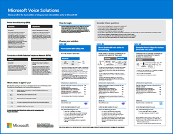

# Microsoft Teams IT 아키텍처 및 음성 솔루션 포스터

## Microsoft 365의 일부로의 Teams

Teams는 데이터 거버넌스, 보안 및 규정 준수 기능을 포함한 Microsoft 365 생산성 서비스의 논리 아키텍처의 중심입니다. 

이 일러스트레이션 시리즈는 엔터프라이즈 설계자를 위해 Teams로 시장을 선도하는 생산성 서비스의 논리 아키텍처를 보여줍니다.

   [PDF](https://github.com/MicrosoftDocs/OfficeDocs-Enterprise/raw/live/Enterprise/downloads/msft-m365-teams-logical-architecture.pdf) | [Visio](https://github.com/MicrosoftDocs/OfficeDocs-Enterprise/raw/live/Enterprise/downloads/msft-m365-teams-logical-architecture.vsdx)

## Microsoft 365의 그룹

IT 설계자가 Microsoft 365의 그룹에 대해 알아야 하는 점입니다. 이러한 일러스트레이션은 다양한 그룹의 종류, 그룹을 만들고 관리하는 방법, 몇 가지 관리 권장 사항에 대해 자세한 설명을 제공합니다.

    [PDF](https://github.com/MicrosoftDocs/OfficeDocs-Enterprise/raw/live/Enterprise/downloads/msft-m365-groups.pdf) | [Visio](https://github.com/MicrosoftDocs/OfficeDocs-Enterprise/raw/live/Enterprise/downloads/msft-m365-groups.vsdx)

## Microsoft 음성 솔루션

Microsoft는 Microsoft 클라우드에서 팀을 처음 경험할 때 몇 가지 옵션을 지원합니다. 이 포스터는 조직의 사용자에게 적합한 Microsoft 음성 솔루션 (클라우드의 전화 시스템 또는 Enterprise Voice 온프레미스)을 결정하고 조직이 공중 전환 전화 네트워크(PSTN)에 연결하는 방법을 결정하는 데 도움이됩니다.

  
[PDF](https://download.microsoft.com/download/4/3/5/435cd4e9-ca56-4fd1-acb6-d1fda7952320/microsoft-voice-solutions.pdf) | [Visio](https://download.microsoft.com/download/7/5/c/75c13012-e20c-48bd-a6dd-ea49d1a3420d/microsoft-voice-solutions.vsdx)

자세한 내용은이 포스터에 대한 문서인 [Microsoft 음성 솔루션](cloud-voice-landing-page.md)을 참조하세요.
  
## 참고 항목

[Microsoft 클라우드 IT 아키텍처 리소스](/office365/enterprise/microsoft-cloud-it-architecture-resources)

[Microsoft Teams 다운로드하기](https://www.microsoft.com/microsoft-365/microsoft-teams/download-app#desktopAppDownloadregion)
