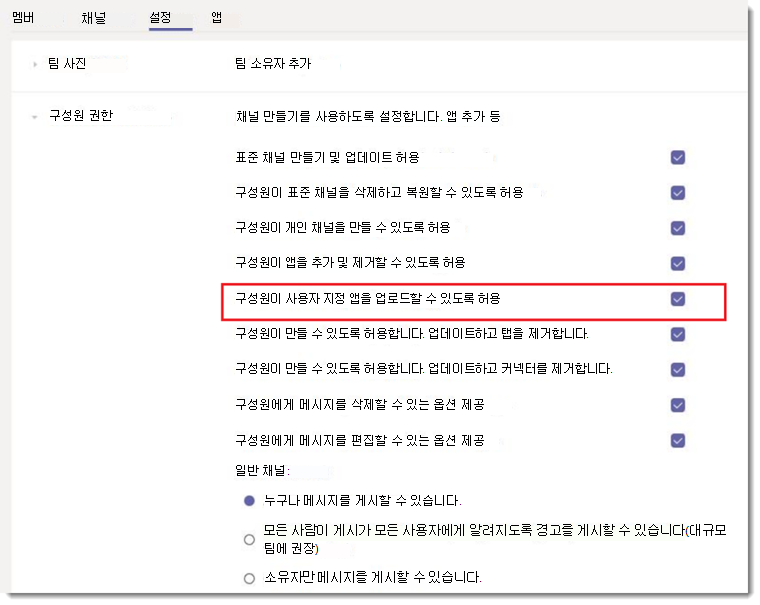
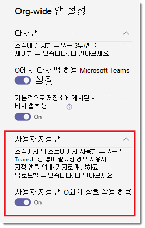

# Microsoft 팀에서 사용자 지정 앱 정책 및 설정 관리

> [!NOTE]
> 앱 Studio를 사용 하려면 [c #/.net 및 App studio에서 Microsoft 팀 플랫폼 시작](https://docs.microsoft.com/microsoftteams/platform/get-started/get-started-dotnet-app-studio) 을 참조 하세요. 마지막 단계는 아직 작동 하지 않기 때문에 [microsoft 팀에 앱 패키지를 업로드](https://docs.microsoft.com/microsoftteams/platform/concepts/apps/apps-upload)하려면 zip을 다운로드 하 여 기존 방법으로 설치 해야 합니다.

관리자는 사용자 지정 앱 정책 및 설정을 사용 하 여 조직에서 Microsoft 팀에 사용자 지정 앱을 업로드할 수 있는 사용자를 제어할 수 있습니다. 관리자는 사용자 지정 앱을 업로드할 수 있는 사용자를 결정 하 고, 관리자와 팀 소유자는 조직의 특정 팀이 사용자 지정 앱을 추가할 수 있도록 허용할지 여부를 결정할 수 있습니다.  사용자 지정 앱 정책을 편집한 후 변경 내용을 적용 하는 데 몇 시간이 걸릴 수 있습니다. 이러한 정책을 관리하려면 전역 관리자 또는 Teams 서비스 관리자여야 합니다.

## 사용자 지정 앱 개요

사용자는 앱 패키지 (.zip 파일)를 팀 또는 개인 컨텍스트에 직접 업로드 하 여 팀에 사용자 지정 앱을 추가할 수 있습니다. 이것은 팀 앱 스토어를 통해 앱을 추가 하는 방법과는 다릅니다. 앱 패키지를 업로드 하 여 사용자 지정 앱을 추가 하면 (테스트용 로드 라고도 함), 개발 하는 동안 앱을 테스트 하 여 광범위 하 게 배포할 준비가 될 수 있습니다. 또한 앱을 내부용 으로만 빌드 하 고 팀 앱 저장소의 팀 앱 카탈로그에 제출 하지 않고 공유할 수 있습니다.

## 사용자 지정 앱 정책 및 설정

세 가지 구성 요소는 사용자가 팀에 사용자 지정 앱을 업로드할 수 있는지 여부를 결정 하 고 사용자 지정 앱을 팀에 추가할 수 있는 사용자 지정 앱을 제공 하 고 다음에 추가할 수 있는 팀을 세부적으로 제어 합니다.

- [사용자 지정 앱 정책](#user-custom-app-policy)
- [팀 사용자 지정 앱 설정](#team-custom-app-setting)
- [조직 전체 사용자 지정 앱 설정](#org-wide-custom-app-setting)

이러한 설정은 타사 앱을 차단 하는 기능에 영향을 주지 않습니다.  

### 사용자 지정 앱 정책

[앱 설정 정책의](teams-app-setup-policies.md)일부로 관리자는 사용자가 사용자 지정 앱을 팀에 업로드할 수 있는지 여부를 제어 하기 위해 정책 설정을 사용 하 여 **사용자 지정 앱을 업로드**합니다.
 
이 설정이 꺼져 있는 경우:

- 사용자는 조직의 팀 또는 개인 컨텍스트에서 사용자 지정 앱을 업로드할 수 없습니다.
- 사용자는 조직 전체 사용자 지정 앱 설정에 따라 사용자 지정 앱과 상호 작용할 수 있습니다.

이 설정이 설정 된 경우:

- 사용자는 조직 전체 사용자 지정 앱 설정에 따라 팀 구성원에 게 사용자 지정 앱을 업로드 하 고 해당 소유자에 게 팀을 허용할 수 있습니다.
- 사용자는 개인 컨텍스트에 사용자 지정 앱을 업로드할 수 있습니다. 
- 사용자는 조직 전체 사용자 지정 앱 설정에 따라 사용자 지정 앱과 상호 작용할 수 있습니다.

전역 앱 설정 정책의 설정을 편집 하 여 원하는 앱을 포함할 수 있습니다. 조직의 여러 사용자 그룹에 대해 팀을 사용자 지정 하려는 경우 하나 이상의 사용자 지정 앱 설정 정책 만들기 및 할당을 선택 합니다.

#### 사용자 지정 앱 정책 설정

1. Microsoft 팀 관리 센터의 왼쪽 탐색 창에서 **팀 앱**  >  **설정 정책**으로 이동 합니다.
2. **추가**를 클릭 합니다.
3. **사용자 지정 앱 업로드**를 켜거나 끕니다.
4. 정책에 대해 원하는 다른 설정을 선택 합니다.
5. **저장**을 클릭합니다.

### 팀 사용자 지정 앱 설정

관리자와 팀 소유자는 팀이 사용자 지정 앱을 추가할 수 있도록 허용할 것인지 여부를 제어할 수 있습니다. 이 설정에서는 구성원이 사용자 지정 앱을 **업로드할 수 있도록 허용**합니다. 사용자의 사용자 지정 앱 정책으로 특정 팀에 사용자 지정 앱을 추가할 수 있는 사용자를 결정 합니다.
 
이 설정이 꺼져 있는 경우:

- 사용자 지정 앱 정책에서 허용 하는 경우 팀 소유자가 사용자 지정 앱을 추가할 수 있습니다.
- 팀 소유자가 아닌 팀 구성원은 팀에 사용자 지정 앱을 추가할 수 없습니다.

이 설정이 설정 된 경우:

- 사용자 지정 앱 정책에서 허용 하는 경우 팀 소유자가 사용자 지정 앱을 추가할 수 있습니다.
- 팀 소유자가 아닌 팀 구성원은 사용자 지정 앱 정책에서 허용 하는 경우 사용자 지정 앱을 추가할 수 있습니다.

#### 팀 사용자 지정 앱 설정 구성

1. 팀에서 팀으로 이동 하 고 **추가 옵션 ̇ ̇ ̇**  >  **팀 관리**를 클릭 합니다.
2. **설정을**클릭 한 다음 **구성원 권한을**확장 합니다.
3. **구성원에 게 사용자 지정 앱 업로드 허용** 확인란을 선택 하거나 선택을 취소 합니다.

    

### 조직 전체 사용자 지정 앱 설정

[앱 관리](manage-apps.md) 페이지의 조직 내 모든 사용자 지정 앱에서 조직 전체의 **상호 작용 허용** 을 설정 하 고 사용자 지정 앱을 업로드 하거나 상호 작용할 수 있는지 여부를 결정 합니다. 이 설정은 사용자 및 팀 사용자 지정 앱 정책 및 설정 보다 우선 합니다. 이는 보안 이벤트 중 마스터 on/off 스위치 역할을 하는 것입니다.

#### 조직 전체에 걸친 사용자 지정 앱 설정 구성

1. Microsoft 팀 관리 센터의 왼쪽 탐색 창에서 **팀 앱**으로  >  **앱 관리**로 이동 합니다.
2. **조직 전체 앱 설정을**클릭 합니다.
3. **사용자 지정 앱**에서 **사용자 지정 앱과 상호 작용 허용**또는 해제를 설정 합니다.

    

## 사용자 지정 앱 정책 및 설정이 함께 작동 하는 방식

이 표에는 사용자 지정 앱 정책 및 설정, 이들이 함께 작동 하는 방식, 조직에서 사용자 지정 앱을 팀에 업로드할 수 있는 사람을 제어 하는 데 적용 되는 효과의 조합이 요약 되어 있습니다.

예를 들어 팀 소유자만 특정 팀에 사용자 지정 앱을 업로드할 수 있도록 하려는 경우를 가정해 보세요. 다음을 설정할 수 있습니다.
- Microsoft 팀 관리 센터에서 **사용자 지정 앱과 상호 작용 허용** 을 설정 합니다.
- 구성원에 게 액세스를 제한 하려는 모든 팀에 대해 **사용자 지정 앱을 업로드 하도록 허용을** 해제 합니다.
- **사용자 지정 앱 업로드** 설정이 설정 된 Microsoft 팀 관리 센터에서 사용자 지정 앱 설치 정책을 만들고 할당 한 다음 팀 소유자에 게 할당 합니다.

|조직 전체 사용자 지정 앱 설정 |팀 사용자 지정 앱 설정 |사용자 지정 앱 정책 |조절점  |
|---------|---------|---------|---------|
| 끄십시오    | 끄십시오    | 끄십시오     |조직에 대해 모든 사용자 지정 앱과의 조작이 차단 되었습니다. 팀 서비스 관리자나 전역 관리자를 제외한 다른 사람이 사용자 지정 앱을 업로드할 수 없습니다. PowerShell을 사용 하 여 사용자 지정 앱을 제거할 수 있습니다.   |
| 끄십시오     | 끄십시오     | 등        |조직에 대해 모든 사용자 지정 앱과의 조작이 차단 되었습니다. 팀 서비스 관리자나 전역 관리자를 제외한 다른 사람이 사용자 지정 앱을 업로드할 수 없습니다. PowerShell을 사용 하 여 사용자 지정 앱을 제거할 수 있습니다.         |
| 끄십시오    | 등        | 끄십시오        |조직에 대해 모든 사용자 지정 앱과의 조작이 차단 되었습니다. 팀 서비스 관리자나 전역 관리자를 제외한 다른 사람이 사용자 지정 앱을 업로드할 수 없습니다. Windows PowerShell을 사용 하 여 사용자 지정 앱을 삭제할 수 있습니다.         |
| 끄십시오    | 등      | 등       |조직에 대해 모든 사용자 지정 앱과의 조작이 차단 되었습니다. 팀 서비스 관리자나 전역 관리자를 제외한 다른 사람이 사용자 지정 앱을 업로드할 수 없습니다. PowerShell을 사용 하 여 사용자 지정 앱을 제거할 수 있습니다.         |
| 등    | 끄십시오       | 끄십시오         |  사용자가 사용자 지정 앱을 업로드할 수 없습니다.      |
| 등     | 끄십시오       | 등         | 사용자가 팀 소유자 인 경우 팀에 사용자 지정 앱을 업로드할 수 있습니다. 사용자가 팀 소유자가 아닌 경우 팀에 사용자 지정 앱을 업로드할 수 없습니다. 사용자는 개인 컨텍스트에서 사용자 지정 앱을 업로드할 수 있습니다.     |
| 등     | 등     | 끄십시오         | 사용자가 사용자 지정 앱을 업로드할 수 없습니다.       |
| 등    | 등        | 등        | 사용자가 팀 소유자 인지 여부에 관계 없이 팀에 사용자 지정 앱을 업로드할 수 있습니다. 사용자는 개인 컨텍스트에서 사용자 지정 앱을 업로드할 수 있습니다.       |

 ## 관련 항목
 
- [Team에서 앱의 관리 설정](admin-settings.md)
