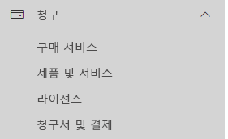
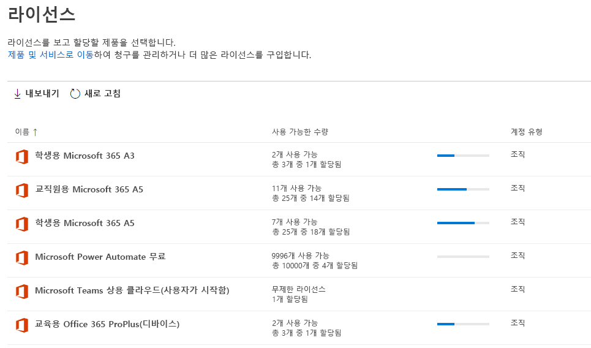
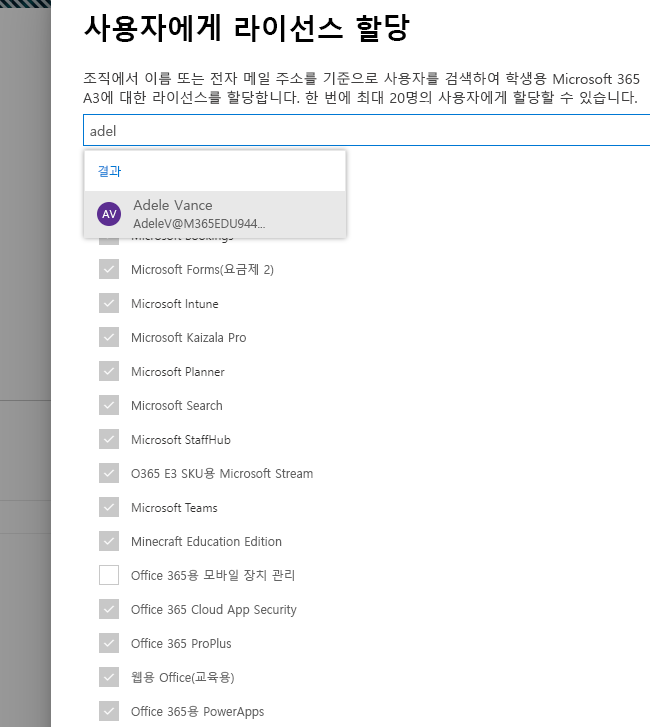
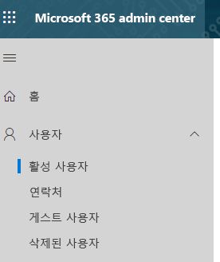
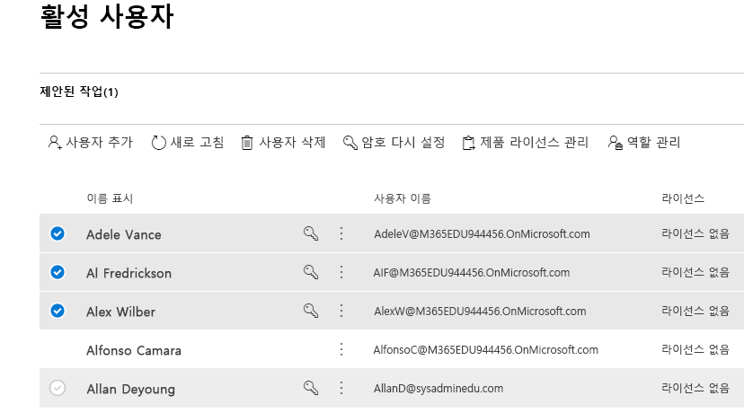
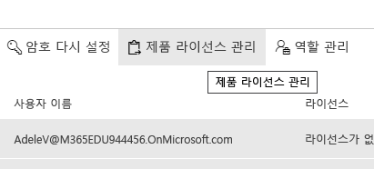
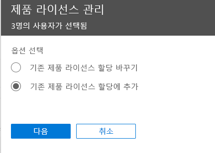
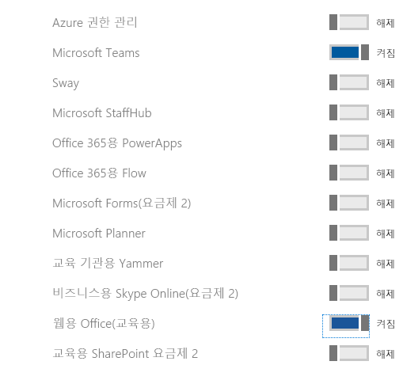

# 교육에 대한 Microsoft 팀 라이선스 할당

Microsoft Teams는 대화, 콘텐츠 및 앱을 한 위치에서 함께 가녀오는 디지털 허브입니다. Office 365에서 개발되었기 때문에 학교에서 친숙한 Office 앱 및 서비스와의 통합을 통해 혜택을 누릴 수 있습니다. 교육 기관은 공동 작업 교실을 만들고 전문 학습 커뮤니티에 연결하고 교직원과 커뮤니케이션하고 모든 작업을 Microsoft Teams를 사용하여 교육용 Office 365 단일 환경에서 단일 환경에서 수행할 수 있습니다.

시작하려면 IT 관리자가 Microsoft 365 관리 센터를 사용하여 [학교에 대한 Microsoft Teams를 사용할 수 있도록 설정해야 합니다](/microsoft-365/education/intune-edu-trial/enable-microsoft-teams).
작업이 완료되면 사용자 계정에 라이선스를 할당하여 교직원, 직원 및 학생이 Microsoft Teams와 같은 Office 365 서비스에 액세스할 수 있도록 해야 합니다.

사용자 계정을 사용자 계정에 개별적으로 할당 하거나 그룹 구성원을 통해 자동으로 할당할 수 있습니다. 이 문서에서는 Microsoft 365 관리 센터를 통해 개인 또는 소수의 사용자 계정에 Office 365 라이선스를 할당하는 방법을 안내합니다. 그룹 구성원을 통해 자동으로 라이선스를 할당 하려면 다음의 지원 문서 중 하나를 참조하세요.

- [Office 365 PowerShell](/office365/enterprise/powershell/assign-licenses-to-user-accounts-with-office-365-powershell)
- [Active Directory에서 그룹 기반 라이선싱](/azure/active-directory/users-groups-roles/licensing-groups-assign)

**라이선스** 페이지 또는 **활성 사용자** 페이지에서 사용자에게 라이선스를 할당할 수 있습니다. 제품 라이선스를 특정 사용자에게 할당할지 아니면 사용자 라이선스를 특정 제품에 할당할지 여부에 따라 사용하는 방법이 다릅니다.

> [!NOTE]
> 새로운 Microsoft 365 관리 센터를 사용하지 않는 경우 홈페이지 상단에 있는 **새 관리 센터 시도** 토글을 선택하여 켤 수 있습니다.

## 라이선스 페이지에서 사용자에게 라이선스 할당

> [!NOTE]
> 전역 관리자, 청구 관리자, 라이선스 관리자 또는 사용자 관리 관리자 권한을 갖고 있어야 합니다. 자세한 내용은 [Office 365 관리자 역할 정보](/microsoft-365/admin/add-users/about-admin-roles)를 참조하세요.

**라이선스** 페이지를 사용하여 라이선스를 할당하는 경우 특정 제품에 대한 라이선스를 최대 20명의 사용자에게 할당합니다. **라이선스** 페이지에서 구독이 있는 모든 제품의 목록, 각 제품에 대한 총 라이선스 수, 할당된 라이선스 수, 사용 가능한 개수 등이 함께 표시됩니다.

1. 관리 센터에서 **청구** > [라이선스](https://go.microsoft.com/fwlink/p/?linkid=842264) 페이지로 이동합니다.

   
2. 라이선스를 할당하려는 제품을 선택합니다. Microsoft 팀은 학생 SKU용 무료 Office 365 A1의 일부입니다.

   
3. **라이선스 할당** 을 선택합니다.

   
4. **사용자에 게 라이선스 할당** 창에서 이름을 입력하기 시작합니다. 이 경우 이름 목록이 생성됩니다. 검색 결과에서 찾으려는 이름을 선택하여 목록에 추가합니다. 한 번에 최대 20명의 사용자를 추가할 수 있습니다.

   
5. **앱 및 서비스를 설정 또는 해제** 를 선택하여 Microsoft Teams와 같은 특정 항목에 대한 액세스 권한을 할당하거나 제거합니다. **Microsoft Teams** 및 **웹용 Office(교육)** 가 선택되어 있는지 확인합니다.
6. 작업을 마치면 **할당** 을 선택한 다음 **닫기** 를 선택합니다.

사용자가 액세스할 수 있는 앱 및 서비스를 변경하려면

1. 사용자가 포함된 행을 선택합니다.
1. 오른쪽 창에서 액세스 권한을 부여 또는 제거할 앱과 서비스를 선택하거나 선택 취소합니다.
1. 작업을 마치면 **저장** 을 선택한 다음 **닫기** 를 선택합니다.

## 활성 사용자 페이지에서 개별 혹은 여러 사용자에게 라이선스 할당

1. 관리 센터에서 **사용자**  >  [활성 사용자](https://go.microsoft.com/fwlink/p/?linkid=834822) 페이지로 이동합니다..

   
2. 라이선스를 할당하려는 사용자의 이름 옆의 원을 선택합니다.

   
3. 맨 위에 있는 **제품 라이선스 관리** 를 선택합니다.

   
4. **제품 라이선스 관리** 창에서 **기존 제품 라이선스 할당에 추가** > **다음** 을 선택합니다.

   
5. **기존 제품에 추가** 창에서 선택한 사용자에게 제공하려는 라이선스의 **설정** 위치로 토글합니다. **Microsoft Teams** 및 **웹용 Office(교육)** 가 선택되어 있는지 확인합니다.

   

   기본적으로 이들 라이선스와 연결된 모든 서비스가 사용자에게 자동으로 할당됩니다. 사용자가 이용할 수 있는 서비스를 제한할 수 있습니다. 사용자에게 제공하지 않으려는 서비스의 **해제** 위치로 토글을 전환합니다.
6. 창의 아래쪽에서 추가 > 닫기를 선택합니다.