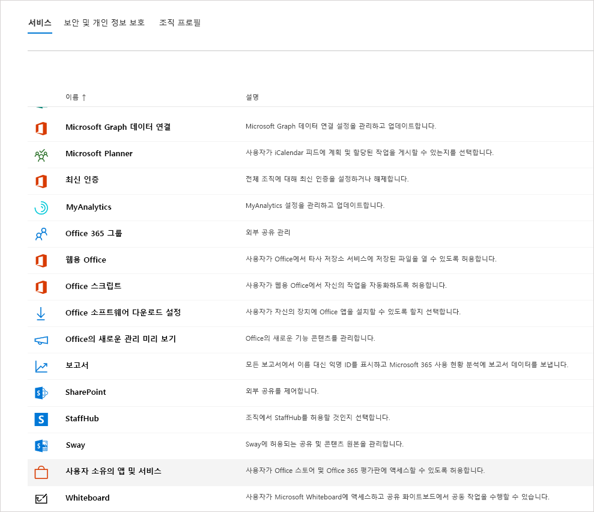
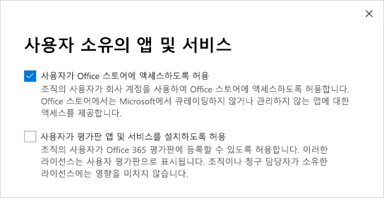
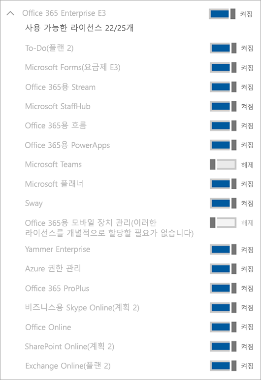

Microsoft Teams의 예비 라이선스 관리Manage the Microsoft Teams Exploratory license
=======================================================

Microsoft Teams 예비 환경을 통해 조직에서 AAD (Azure Active Directory)를 사용하고 Teams 라이선스가 없는 사용자는 Teams의 예비 환경을 시작할 수 있습니다.The Microsoft Teams Exploratory experience lets users in your organization who have Azure Active Directory (AAD) and are not licensed for Teams initiate an exploratory experience of Teams. 관리자는 조직의 사용자에 대해 이 기능을 설정 하거나 해제할 수 있습니다.Admins can switch this feature on or off for users in their organization. 이전의 [Microsoft 상용 클라우드 평가판](iw-trial-teams.md)은 이제 Teams 예비 환경으로 대체되었습니다.The earlier [Microsoft Commercial Cloud Trial](iw-trial-teams.md) is now replaced by The Teams Exploratory experience.

## Teams의 예비 환경에는 무엇이 있나요?What's in the Teams Exploratory experience?

관리자가 Teams 예비 환경의 일부로서 보게 될 서비스 계획은 다음과 같습니다.The service plans that an admin will see as part of the Teams Exploratory experience are:
 - Exchange Online(플랜 1)Exchange Online (Plan 1)
 - Office 365용 흐름Flow for Office 365
 - MyAnalytics의 인사이트Insights by MyAnalytics
 - Microsoft Forms(플랜 E1)Microsoft Forms (Plan E1)
 - Microsoft PlannerMicrosoft Planner
 - Microsoft SearchMicrosoft Search
 - Microsoft StaffHubMicrosoft StaffHub
 - O365 E1 SKU용 Microsoft StreamMicrosoft Stream for O365 E1 SKU
 - Microsoft TeamsMicrosoft Teams
 - Office 365용 모바일 장치 관리Mobile Device Management for Office 365
 - Office 365용 Office 모바일 앱Office Mobile Apps for Office 365 
 - Office OnlineOffice Online
 - Office 365용 PowerAppsPowerApps for Office 365
 - SharePoint Online(플랜 1)SharePoint Online (Plan 1)
 - SwaySway
 - To-Do(플랜 1)To-Do (Plan 1)
 - 화이트보드(플랜 1)Whiteboard (Plan 1)
 - Yammer EnterpriseYammer Enterprise

## 사용 자격이 있는 사용자Who's eligible?

사용자에게 관리되는 AAD 도메인 전자 메일 주소가 있고 현재 Teams 라이선스가 할당되지 않은 경우 이 환경을 사용할 수 있습니다.As long as the user has a managed AAD domain email address and currently does not have/haven't been assigned a Teams license, they are eligible for this experience. 예를 들어 사용자에게 Microsoft 365 앱(Teams가 포함되지 않음)이 있는 경우 Teams 예비 환경을 사용할 수 있습니다.For example, if a user has Microsoft 365 Apps for business (which doesn't include Teams), they're eligible for the Teams Exploratory experience.

(Microsoft 365 관리 센터에서) 사용자는 앱과 평가판을 사용할 수 있게 등록하도록 설정을 해야 합니다.Users must be enabled to sign up for apps and trials (in the Microsoft 365 admin center). 자세한 내용은 이 문서 뒷부분의 [Teams 예비 환경 관리](#manage-the-teams-exploratory-experience)를 참조하십시오.For more information, see [Manage the Teams Exploratory experience](#manage-the-teams-exploratory-experience), later in this article. 

## 사용 자격이 없는 사용자Who isn't eligible

사용자가 Syndication 파트너 고객이거나 GCC, GCC High, DoD 또는 EDU 고객인 경우 사용자의 조직은 이 서비스를 사용할 수 없습니다.Your organization isn't eligible for this offer if you're a Syndication Partner Customer or a GCC, GCC High, DoD, or EDU customer.

## Teams 예비 환경에 등록하는 방법How users sign up for the Teams Exploratory experience

적격 사용자는 Teams에 로그인하여 Teams 예비 환경에 등록할 수 있습니다([teams.microsoft.com](https://teams.microsoft.com)).Eligible users can sign up for the Teams Exploratory experience by signing in to Teams ([teams.microsoft.com](https://teams.microsoft.com)). 적격 사용자에게는 자동으로 라이선스가 할당 되고 조직 내 사용자가 Teams 예비 환경을 처음 시작할 때 테넌트 관리자가 전자 메일 알림을 받게 됩니다.They will be assigned this license automatically and the tenant admin will receive an email notification the first time someone in your org starts the Teams Exploratory experience.

## Teams 예비 환경 관리Manage the Teams Exploratory experience

Teams 예비 환경은 개별 최종 사용자가 시작하고 최종 사용자 직원을 대신해 이 서비스를 시작할 수 없습니다.The Teams Exploratory experience is meant to be initiated by individual end users, and you may not initiate this offer on behalf of end-user employees.

Teams 예비 환경은 Exchange Online 라이선스와 함께 제공되지만 관리자가 할당할 때까지 사용자에게 할당되지 않습니다.The Teams Exploratory experience comes with an Exchange Online license but it won't be assigned to the user until the admin assigns it. 사용자에게 아직 Exchange 라이선스가 없으며 관리자가 아직 Exchange Online 라이선스를 할당하지 않은 경우, 사용자는 Teams에서 모임을 예약할 수 없으며 Teams의 다른 기능이 표시되지 않을 수도 있습니다.If the user doesn't have an Exchange license already and the admin has yet to assign the Exchange Online license, the user won't be able to schedule meetings in Teams and may be missing other Teams functionality.

관리자는 **평가판 앱 및 서비스** 스위치를 사용하여 조직 내에서 최종 사용자가 Teams 예비 환경을 실행할 수 있는 기능을 해제할 수 있습니다.Admins can disable the ability for end users to run the Teams Exploratory experience within their organization by using the **Trial apps and services** switch.

### 사용자가 평가판 앱 및 서비스를 설치하지 못하도록 방지Prevent users from installing trial apps and services

사용자가 평가판 앱 및 서비스를 설치하는 기능을 해제하여 사용자가 Teams 예비 환경을 실행하지 못하도록 할 수 있습니다.You can turn off a user's ability to install trial apps and services, would prevent the user from running the Teams Exploratory experience. 관리자 권한이 있어야 합니다.You must have admin privileges. 관리자 역할에 대한 자세한 내용은 [Teams를 관리하기 위한 Microsoft Teams 관리자 역할의 활용](teams-exploratory.md)을 참조하세요.To learn more about admin roles, see [Use Microsoft Teams administrator roles to manage Teams](teams-exploratory.md)

1. [Microsoft 365 관리 센터](https://portal.office.com/adminportal/home)에서 **설정** > **설정**으로 이동하여 **서비스**를 선택한 다음 **사용자 소유 앱 및 서비스**를 선택합니다.From the [Microsoft 365 admin center](https://portal.office.com/adminportal/home), go to **Settings** > **Settings**, select **Services**, and then select **User owned apps and services**.

    

2. **사용자가 평가판 앱 및 서비스를 설치하도록 허용** 확인란을 해제합니다.Clear the **Let users install trial apps and services** check box.

    

    > [!NOTE]
    > 조직에서 Teams 예비 환경을 사용할 수 없는 경우 **사용자가 평가판 앱 및 서비스를 설치하도록 허용** 옵션이 표시되지 않습니다.If your organization is ineligible for the Teams Exploratory experience, you won't see the **Let users install trial apps and services** option.

### Teams를 포함하는 라이선스가 있는 사용자의 상태 관리Manage availability for a user with a license that includes Teams

Teams를 포함하는 라이선스가 할당된 사용자는 Teams 예비 환경을 사용할 수 없습니다.A user who is assigned a license that includes Teams isn't eligible for the Teams Exploratory experience. Teams 서비스 플랜을 사용할 수 있도록 설정한 경우 사용자는 로그인을 하고 Teams를 사용할 수 있습니다.When the Teams service plan is turned on, the user can sign in and use Teams. 서비스 플랜을 사용하지 않도록 설정한 경우 사용자가 로그인할 수 없으며 Teams 예비 환경을 사용할 수 없습니다.If the service plan is disabled, the user can't sign in and the Teams Exploratory experience isn't available. 관리자 권한이 있어야 합니다.You must have admin privileges. 

Teams로의 액세스를 해제하려면:To turn off access to Teams:

1. [Microsoft 365 관리 센터에서](https://portal.office.com/adminportal/home)에서 **사용자** > **활성 사용자**를 선택합니다.In the [Microsoft 365 admin center](https://portal.office.com/adminportal/home), select **Users** > **Active users**.

2. 사용자 이름 옆에 있는 상자를 선택합니다.Select the box next to the name of the user.

3. 우측의 **제품 라이선스** 행에서 **편집**을 선택합니다.On the right, in the **Product licenses** row, choose **Edit**.

4. **제품 라이선스** 창에서 토글 스위치를 **해제**로 전환합니다.In the **Product licenses** pane, switch the toggle to **Off**.

    

### Teams 예비 환경을 이미 사용 중인 사용자의 Teams 상태 관리Manage Teams availability for users who are already using the Teams Exploratory experience

사용자가 Teams 예비 환경을 실행하고 있는 경우 해당 라이선스 혹은 서비스 플랜을 제거하여이 기능을 해제할 수 있습니다.If a user is running the Teams Exploratory experience, you can turn it off by removing the license or service plan. 관리자 권한이 있어야 합니다.You must have admin privileges. 

Teams 예비 환경 라이선스를 해제하려면 다음을 수행합니다.To turn off the the Teams Exploratory experience license:

1. Microsoft 365 관리 센터에서 **사용자** > **활성 사용자**를 선택합니다.In the Microsoft 365 admin center, select **Users** > **Active users**.

2. 사용자 이름 옆에 있는 상자를 선택합니다.Select the box next to the name of the user.

3. 우측의 **제품 라이선스** 행에서 **편집**을 선택합니다.On the right, in the **Product licenses** row, choose **Edit**.

4. **제품 라이선스** 창에서 예비 라이선스 토글 스위치를 **해제**로 전환합니다.In the **Product licenses** pane, switch the toggle for this exploratory license to **Off**.
   
    >[!Note]
    >조직에서 첫 번째 사용자가 Teams 예비 환경을 실행한 후 Teams 예비 토글 스위치가 표시됩니다.The Teams Exploratory toggle switch will appear after the first user in the organization launches the Teams Exploratory experience.

### Teams 예비 라이선스가 있는 사용자의 Teams 관리Manage Teams for users who have the Teams Exploratory license

정규 유료 라이선스가 있는 사용자를 관리하는 것과 같은 방식으로 Teams 예비 라이선스가 있는 사용자를 관리할 수 있습니다.You can manage users who have the Teams Exploratory license just like you manage users who have a regular paid license. 자세한 내용은 [조직에서 Teams 설정 관리](enable-features-office-365.md)를 참조하세요.For more information, see [Manage Teams settings for your organization](enable-features-office-365.md).

### Teams 예비 라이선스에서 사용자 업그레이드Upgrade users from the Teams Exploratory license

Teams 예비 라이선스에서 사용자를 업그레이드하려면(관리자 권한이 필요) 다음을 수행합니다.To upgrade users from the Teams Exploratory license (you must have admin privileges), do the following:

1. Teams를 포함하는 구독을 구입합니다.Purchase a subscription that includes Teams.

2. 사용자의 Teams 예비 구독을 제거합니다.Remove the Teams Exploratory subscription from the user.

3. 새로 구매한 라이선스를 할당합니다.Assign the newly purchased license.

자세한 내용은 [Microsoft Teams 서비스 설명](https://docs.microsoft.com/office365/servicedescriptions/teams-service-description)을 참조하세요.For more information, see [Microsoft Teams service description](https://docs.microsoft.com/office365/servicedescriptions/teams-service-description).

> [!NOTE]
> Teams 예비 라이선스가 종료되고 사용자가 Teams을 포함하는 구독으로 즉시 업그레이드 되지 않는 경우 사용자의 데이터는 제거되지 않습니다.If the Teams Exploratory license ends and a user isn't immediately upgraded to a subscription that includes Teams, the user data is not removed. 사용자는 여전히 Azure Active Directory에 존재하고 Teams 내의 모든 데이터는 계속 유지됩니다.The user still exists in Azure Active Directory and all data within Teams still remains. Teams의 기능을 다시 사용할 수 있도록 사용자에게 새 라이선스가 할당되면 모든 콘텐츠가 계속 존재하게 됩니다.Once a new license is assigned to the user to enable Teams functionality again, all content will still exist. 

## 레거시 Microsoft Teams 상용 클라우드 평가판 라이선스는 어떻게 되나요?What happens to legacy Microsoft Teams Commercial Cloud Trial licenses?

2020년 2월부로 적격 사용자는 최신 Microsoft Teams 예비 환경을 사용하기 시작할 수 있습니다.As of February, 2020, eligible users can begin using the latest Microsoft Teams Exploratory experience. 모든 레거시 Teams 상용 클라우드 평가판 라이선스는 평가판이 만료되기 전에 자동으로 신규 서비스로 변환됩니다.All legacy Teams Commercial Cloud Trial licenses will be automatically converted to the new offer before their trial expires.

### Teams 예비 라이선스 제거Remove a Teams Exploratory license

- PowerShell을 통해 이 라이선스를 제거하려면 [Office 365 PowerShell을 사용하여 사용자 계정에서 라이선스 제거](https://docs.microsoft.com/office365/enterprise/powershell/remove-licenses-from-user-accounts-with-office-365-powershell)를 참조하세요.If you would like to remove this license by using PowerShell, see: [Remove licenses from user accounts with Office 365 PowerShell](https://docs.microsoft.com/office365/enterprise/powershell/remove-licenses-from-user-accounts-with-office-365-powershell)

- 관리 포털을 통해 이 라이선스를 제거하려면 [비즈니스용 Office 365의 사용자 라이선스 제거](https://docs.microsoft.com/office365/admin/subscriptions-and-billing/remove-licenses-from-users?view=o365-worldwide)를 참조하세요. If you would like to remove this license through the admin portal, see: [Remove licenses from users in Office 365 for business](https://docs.microsoft.com/office365/admin/subscriptions-and-billing/remove-licenses-from-users?view=o365-worldwide)

## Teams 예비 환경은 얼마나 오래 지속되나요?How long does the Teams Exploratory experience last?

Microsoft Teams의 예비 환경은 다음 엔터프라이즈 **계약 기념일** 또는 2021년 1월 이후에 **갱신**될 때까지 추가 비용 없이 사용할 수 있습니다.The Microsoft Teams Exploratory experience is available at no additional cost until your next **agreement anniversary** or **renewal** on or after January 2021. 이 경우 Microsoft 예비 환경 라이선스의 최종 사용자는 Teams가 포함된 유료 라이선스로 전환해야 합니다.At that time, end users on a Microsoft Exploratory experience license will need to move to a paid license that includes Teams. 그 이후에 시작된 모든 Microsoft 예비 환경 라이선스는 다음 **기념일** 또는 **갱신** 주기까지 추가 비용 없이 계속 사용할 수 있습니다.Any Microsoft Exploratory experience licenses initiated after that will remain available at no additional cost until your next **anniversary** or **renewal** cycle. 

### 최종 사용자가 기념일 또는 갱신 날짜 직전에 Microsoft Teams 예비 환경을 시작하는 경우 어떻게 되나요?What happens if an end user initiates the Microsoft Teams Exploratory experience just before my anniversary or renewal date?

**계약 기념일** 또는 **갱신** 후 90일 이내에 시작된 Microsoft Teams 예비 환경 라이선스는 다음 기념일 또는 갱신 주기까지 유료 라이선스로 전환할 필요가 없습니다.Microsoft Teams Exploratory experience licenses initiated within 90 days of your **agreement anniversary** or **renewal** will not be required to move to a paid license until the subsequent anniversary or renewal cycle. 

### 계약서에 주기 혹은 연간 갱신 날짜가 없는 경우 어떻게 하나요(예: 월 단위 계약)What if my agreement doesn’t have an anniversary or yearly renewal date (for example, month-to-month agreements)?

주기 또는 연간 갱신 날짜가 없는 계약서의 경우, 첫 번째 최종 사용자가 Microsoft Teams Exploratory 환경 라이선스를 정품 인증한 다음의 년도가 기념일 또는 갱신 날짜로 간주됩니다.For agreements without an anniversary or yearly renewal date, the subsequent year after the first end user activates the Microsoft Teams Exploratory experience licenses will be treated as the anniversary or renewal date. 위에 간략히 설명한 정책에 따라 Microsoft Teams Exploratory 라이선스를 사용하는 사용자는 각 해 해당일까지 유료 라이선스로 전환해야 합니다.Users on the Microsoft Teams Exploratory license must be converted to a paid license by that date each year, according to the policies outlined above.

예를 들어, 첫 번째 최종 사용자가 Microsoft Teams Exploratory 라이선스를 2020년 6월 19일에 정품 인증을 하면, 해당 사용자와 고객 테넌트에 있는 다른 모든 적격 사용자는 2021년 6월 19일까지 유료 라이선스로 전환해야 합니다.For example, if the first end user activates Microsoft Teams Exploratory on June 19, 2020, then they and all other eligible users in the customer tenant must convert to a paid license with Teams by June 19, 2021. 

