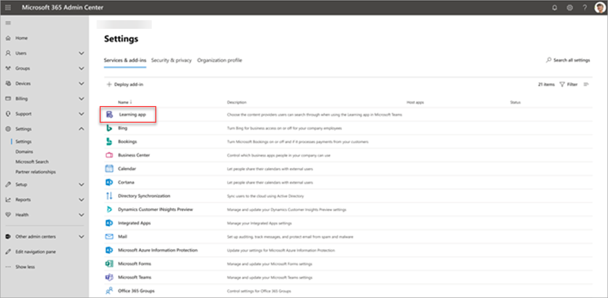
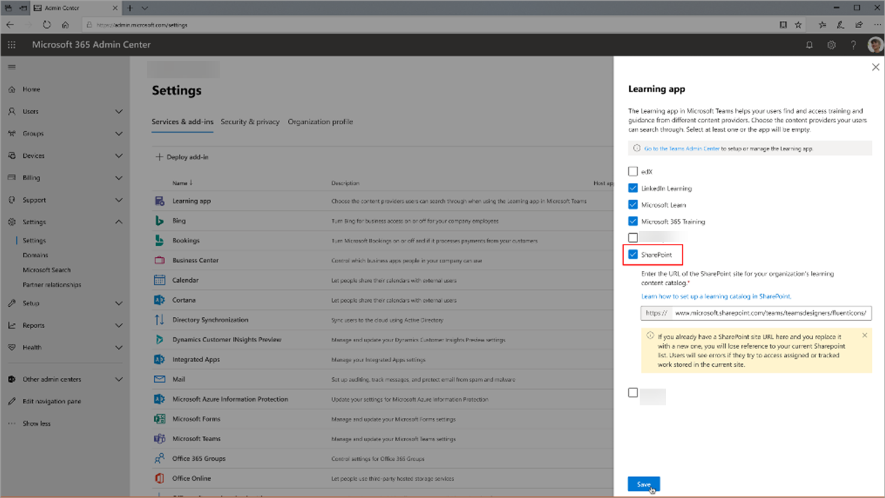

# Teams Learning 앱에 대한 사용 권한 설치, 관리 및 할당(비공개 미리 보기)

*이 문서에는 비공개 미리 보기 상태인 Teams Learning 앱에 대한 예비 콘텐츠가 포함되어 있습니다.*

Microsoft Teams 학습 앱(비공개 미리 보기)을 통해 조직의 팀과 개인이 하루 중 자연스러운 학습을 할 수 있습니다. 이 앱은 직원이 조직 전체의 콘텐츠 라이브러리에서 공유, 할당 및 학습할 수 있는 Teams의 중앙 허브를 만듭니다. 관리자는 사용 권한을 설정하고 앱에 대한 학습 콘텐츠 원본을 허용합니다. 학습 콘텐츠에는 LinkedIn Learning, Microsoft Learn, Microsoft 365 교육, SharePoint Online에 저장된 조직의 자체 콘텐츠 및 앱에서 지원하는 타사 공급자가 포함됩니다.

Teams Learning 앱(비공개 미리 보기)을 설정하려면 다음을 포함해야 합니다.

-   Teams 관리 센터 관리자
-   Microsoft 365 관리 센터 관리자(즉, 전역 관리자)

## Teams 관리 센터에서 Teams 학습 앱(비공개 미리 보기) 관리

Teams 관리자는 앱 스토어에서 Teams 학습 앱(비공개 미리 보기)을 설치하고 Teams 관리 센터를 통해 앱 설정, 관리 및 사용 권한 정책을 적용합니다.

### Teams 학습 앱 관리(비공개 미리 보기)

앱에 대한 설정을 관리하려면 다음 단계를 수행합니다.

1. Microsoft Teams 관리 센터의 왼쪽 탐색 모음에서 Teams 앱 **관리**  >  **앱으로 이동하세요.**

   

2. 앱 관리 **페이지의** 검색 상자에 Teams *학습* 앱(비공개 미리 보기)을 검색하는 학습을 입력합니다.

   

3. 학습 **페이지에서:**
   1. 상태 **아래에서** **앱 켜기** 허용을 선택합니다.
   2. 설정 **탭의** 앱  설정 섹션에서 Microsoft 365 관리 센터로 이동하여 학습 콘텐츠 원본을 구성합니다.

   

4. 앱 **설정을 관리한**  후 사용 권한 및 설정 정책으로 이동하여 개인 미리 보기에 대한 조직의 참여의 일부로 앱에 액세스할 수 있는 직원에게 권한을 부여합니다.

> [!NOTE]
>  조직이 Teams TAP100 프로그램의 일부로 링 4.0에 있는 경우 링 3.0의 승인된 사용자가 Teams 학습 앱(비공개 미리 보기)에 액세스할 수 있도록 다음을 해야 할 수 있습니다.

비공개 미리 보기의 일부로 Teams 학습 앱(비공개 미리 보기)은 링 3.0에서 릴리스됩니다. 조직이 링 4.0에 있는 경우 앱 스토어에 앱이 표시되지 않습니다. 앱을 테스트하려면 사용자 지정 앱 사용 권한 정책을 만들고, 모든 앱을 허용하도록 **설정하고,** 링 3.0 승인된 사용자에게 할당해야 합니다.

   

## Microsoft 365 관리 센터에서 학습 콘텐츠 원본 구성

Microsoft 365 관리 센터의 관리자는 Teams 학습 앱(비공개 미리 보기)과 관련된 설정을 관리할 수 있으며 학습 콘텐츠 원본을 구성할 수 있습니다.

관리자는 앱에서 사용할 수 있는 학습 콘텐츠 원본(예: LinkedIn Learning 또는 SharePoint)을 선택합니다. 그런 다음 관리자는 콘텐츠를 검색 및 검색에 사용할 수 있으며 앱을 사용하는 직원이 검색할 수 있도록 해당 원본을 구성합니다.

### 앱에 대한 학습 콘텐츠 원본에 대한 설정 구성

이러한 단계는 Microsoft 365 관리자가 수행해야 합니다.

1.  Microsoft 365 관리 센터의 왼쪽 탐색 모음에서 설정  >  **설정으로 이동합니다.**

2.  설정 **페이지의** 서비스 & **추가 기능** 탭에서 학습 앱을 **선택합니다.**

   

3.  학습 앱 **패널에서** 조직에 대해 구성하려는 학습 콘텐츠 원본을 선택한 다음 저장을 **선택합니다.**

   

존재하는 모든 학습 원본 중 일부는 기본적으로 사용하도록 설정됩니다. 여기에는 다음이 포함됩니다.

- LinkedIn Learning(무료 콘텐츠)
- Microsoft Learn
- Microsoft 365 교육

> [!NOTE]
> 조직에 LinkedIn Learning 표준 또는 Pro 구독이 있는 경우 조직의 직원에 대한 콘텐츠 리포지토리가 잠금 해제됩니다. 권한이 있는 직원만 전체 콘텐츠 리포지토리를 사용할 수 있습니다.

다른 원본을 사용하도록 설정하거나 수동으로 구성해야 할 수 있습니다. Microsoft가 아닌 학습 원본은 조직과 타사 간에 별도로 사용이 허가됩니다. 사용자 및 사용자를 위해 학습에 등록한지 확인해야 합니다.

학습 콘텐츠 원본을 사용 또는 사용하지 않도록 설정하려면 원본 옆에 있는 확인란을 선택합니다. 원본을 사용하도록 설정하면 확인 표시가 표시됩니다.

## SharePoint를 학습 콘텐츠 원본으로 구성(출시 예정)

Microsoft 365 관리 센터에서 Teams Learning 앱(비공개 미리 보기)에 대한 학습 콘텐츠 원본으로 SharePoint를 구성합니다.

### 개요

관리자는 학습 서비스가 구조화된 SharePoint 목록 형태로 빈 중앙 집중식 학습 콘텐츠 리포지토리를 만들 수 있는 사이트 URL을 제공합니다. 이 목록은 조직에서 학습 콘텐츠를 포함하는 회사 간 SharePoint 폴더에 대한 링크를 저장하는 데 사용할 수 있습니다. 관리자는 폴더에 대한 URL 목록을 수집하고 큐링할 책임이 있습니다. 이러한 폴더에는 Teams 학습 앱(비공개 미리 보기)에서 사용할 수 있는 콘텐츠만 포함되어야 합니다.

### 사용 권한

폴더 URL은 조직의 모든 SharePoint 사이트에서 수집할 수 있습니다. 이러한 폴더 내의 모든 콘텐츠는 검색할 수 있지만 개별 직원에게 사용 권한이 있는 콘텐츠만 사용할 수 있습니다.
 
### 학습 서비스

Learning Service는 제공된 폴더 URL을 사용하여 해당 폴더에 저장된 모든 콘텐츠에서 메타데이터를 얻습니다. 직원은 중앙 집중식 리포지토리에 폴더 URL을 제공한 후 24시간 이내에 앱 내에서 회사의 콘텐츠를 검색하고 사용할 수 있습니다. 리포지토리의 콘텐츠 삭제는 현재 지원되지 않습니다. 의도치 않은 콘텐츠는 Microsoft 365 관리 센터에서 새 SharePoint 사이트 URL을 제공해야만 제거할 수 있습니다.

### SharePoint를 원본으로 구성

이러한 단계는 Microsoft 365 관리자가 수행합니다.

1.  Microsoft 365 관리 센터의 왼쪽 탐색 모음에서 설정으로 **이동합니다.**
 
2.  설정 **페이지의** 서비스 & **추가 기능** 탭에서 학습 앱을 **선택합니다.**

   

3.  학습 앱 **패널에서** 앱이 중앙 집중식 리포지토리를 만들 SharePoint 사이트에 사이트 URL을 제공합니다.

   

4.  SharePoint 목록은 제공된 조직의 SharePoint 사이트 내에서 자동으로 만들어집니다. SharePoint 사이트의 왼쪽 탐색에서 앱 콘텐츠 리포지토리 **학습을 선택합니다.** 

   

 
5. 학습 앱 **콘텐츠 리포지토리** 페이지에서 학습 콘텐츠 폴더에 대한 URL로 SharePoint 목록을 채우습니다.

   1.   새로 **보기를** 선택하여 새 항목 **패널을** 볼 수 있습니다. 

   
 
   2.   새 항목 **패널의** **제목** 필드에서 원하는 디렉터리 이름을 추가합니다. 폴더 **URL 필드에서** 학습 콘텐츠 폴더에 URL을 추가합니다. 저장을 **선택합니다.**

   

   3. 학습 앱 콘텐츠 리포지토리 페이지가 새 학습 콘텐츠로 업데이트됩니다.

   

 

