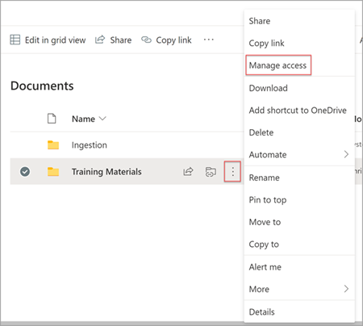
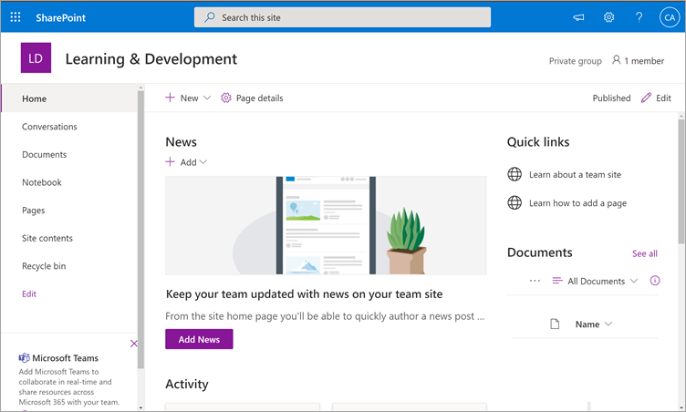
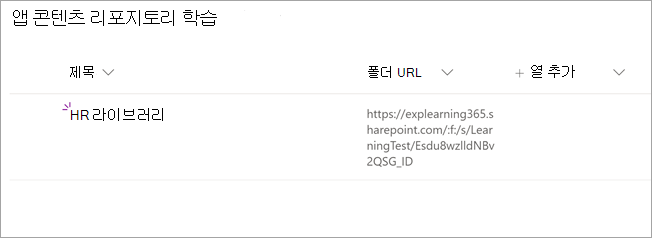
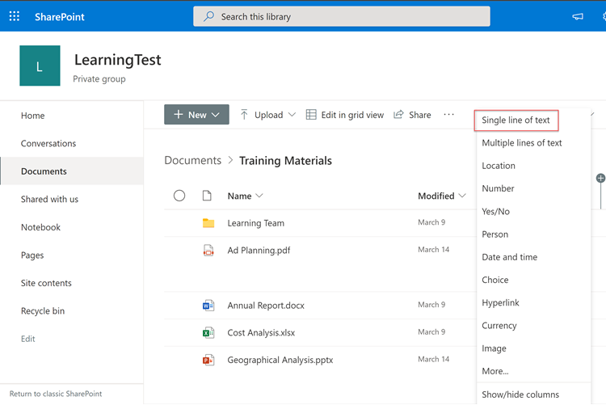

# Microsoft Viva Learning에 대한 사용 권한 설치, 관리 및 할당(비공개 미리 보기)

*이 문서에는 비공개 미리 보기에 있는 Microsoft Viva Learning의 예비 콘텐츠가 포함되어 있습니다.*

Microsoft Viva Learning(비공개 미리 보기)은 조직의 팀 및 개인이 하루 중 자연스러운 학습을 할 수 있도록 합니다. 앱은 직원들이 조직 전체의 콘텐츠 라이브러리에서 공유, 할당 및 학습할 수 있는 Teams에 중앙 허브를 만듭니다.

관리자는 권한을 설정하고 Viva Learning(비공개 미리 보기)에 대한 학습 콘텐츠 원본을 허용합니다. 학습 콘텐츠에는 LinkedIn Learning, Microsoft Learn, Microsoft 365 교육, SharePoint Online에 저장된 조직의 자체 콘텐츠 및 Viva Learning에서 지원하는 타사 공급자(비공개 미리 보기)가 포함됩니다.

## 관리자 역할

Viva Learning(비공개 미리 보기)을 설정하려면 다음과 같은 권한이 필요합니다.

- Microsoft Teams 관리자
- Microsoft 365 전역 관리자 또는 SharePoint 관리자
- 기술 관리자 - 조직의 모든 사용자에게 할당할 수 있는 Microsoft 365 관리 센터의 새 역할입니다. 이 역할은 Microsoft 365 관리 센터를 통해 조직의 학습 콘텐츠 원본을 관리합니다. 

> [!TIP]
> 기술 관리자는 적당히 기술해야 합니다. 기존 SharePoint 관리자 자격 증명이 있는 것이 바람직하며, 조직의 교육, 학습, 교육 또는 직원 경험에 정교한 사람이 필요합니다.
 
## Teams 관리 센터에서 Viva Learning 관리(비공개 미리 보기)

Teams 관리자는 앱 스토어에서 Viva Learning(비공개 미리 보기)을 설치한 다음 Teams 관리 센터를 통해 설정, 관리 및 사용 권한 정책을 적용합니다.

### Viva Learning에 대한 설정 관리(비공개 미리 보기)

이러한 작업을 수행하려면 Teams 관리 센터의 관리자가 되어야 합니다.

Viva Learning에 대한 설정을 관리하려면 다음 단계를 수행합니다.

1. Teams 관리 센터의 왼쪽 탐색에서 **Teams apps**  >  **관리 앱으로 이동하세요.**

   

2. 앱 **관리** 페이지에서 검색 상자에 Teams  Learning 앱(비공개 미리 보기)을 검색하는 학습을 입력합니다.

   

3. 학습 **페이지에서:**
   1. **상태에서** 앱을 **켜기** 허용을 선택합니다.
   2. 설정 **탭의** 앱  설정 섹션에서 Microsoft 365 관리 센터로 이동하여 학습 콘텐츠 원본을 구성합니다.

   

4. 앱 **설정 관리** 후  권한 및 설정 정책으로 이동하여 조직의 비공개 미리 보기 참여의 일부로 앱에 액세스할 수 있는 직원에게 권한을 부여합니다.

> [!NOTE]
>  조직이 Teams TAP100 프로그램의 일부로 링 4.0에 있는 경우 링 3.0에서 승인된 사용자가 Viva Learning(비공개 미리 보기)에 액세스하도록 설정하려면 다음을 해야 할 수 있습니다.

비공개 미리 보기의 일부로 Viva Learning(비공개 미리 보기)은 Ring 3.0에서 릴리스됩니다. 조직이 Ring 4.0에 있는 경우 앱 스토어에 앱이 표시되지 않습니다. 앱을 테스트하려면 사용자 지정 앱 사용 권한 정책을 만들고, 모든 앱 허용으로 **설정하고,** 링 3.0 승인된 사용자에게 할당해야 합니다.

   

## Microsoft 365 관리 센터에서 학습 콘텐츠 원본 구성

Microsoft 365 관리 센터의 관리자는 조직에서 선택한 개인에게 기술 관리자 역할을 할당하여 Viva Learning(비공개 미리 보기)과 관련된 설정을 관리할 수 있으며 학습 콘텐츠 원본을 구성할 수 있습니다.

관리자는 Viva Learning(비공개 미리 보기)의 사용자가 사용할 수 있는 추가 학습 콘텐츠 원본(예: SharePoint 또는 지원되는 타사 콘텐츠 공급자 원본)을 선택합니다. 그런 다음 관리자는 해당 원본을 구성하여 콘텐츠를 검색 및 검색에 사용할 수 있으며 Viva Learning(비공개 미리 보기)을 사용하는 직원이 검색할 수 있도록 합니다.

> [!NOTE]
>  사용자는 브라우저 또는 포함된 뷰어에서 비 Microsoft 및 LinkedIn Learning Pro 학습에 로그인합니다. 이 구성된 학습은 Viva Learning(비공개 미리 보기) 용어가 아닌 조직과 타사 간에 별도의 라이선스, 개인 정보 및 서비스 약관의 적용을 하게 됩니다. 이러한 유형의 학습을 선택하기 전에 조직 및 사용자에 대한 계약이 있는지 확인해야 합니다.

### 기술 관리자 역할 할당 [선택 사항]

이러한 작업을 수행하려면 Microsoft 365 전역 관리자가 되어야 합니다.

Viva Learning에 대한 기술 관리자를 할당하려면 다음 단계를 수행합니다.

1.  Microsoft 365 관리 센터의 왼쪽 탐색에서 **역할 으로 이동하세요.**

2.  역할 **페이지에서** **Azure AD** 탭에서 기술 **관리자를 선택합니다.**
 
3.  기술 관리자 **페이지에서** 할당된  관리자 섹션에서 **추가를** 선택한 다음 역할에 대해 선택한 사람을 추가합니다.

### Viva Learning용 학습 콘텐츠 원본에 대한 설정 구성(비공개 미리 보기)

이러한 작업을 수행하려면 Microsoft 365 전역 관리자 또는 지식 관리자가 되어야 합니다.

Viva Learning에서 콘텐츠 원본 학습에 대한 설정을 구성하려면 다음 단계를 수행합니다.

1.  Microsoft 365 관리 센터의 왼쪽 탐색에서 설정  >  **Org 설정으로 이동합니다.**

2.  Org **설정** 페이지에서 **서비스** 탭에서 학습 **앱(미리 보기)을 선택합니다.**

     

3.  학습 **앱(미리 보기)** 패널에서 조직에 대해 구성할 학습 콘텐츠 원본을 선택한 다음 저장을 **선택합니다.**

     

존재하는 모든 학습 원본 중 일부는 기본적으로 사용하도록 설정됩니다. 여기에는 다음이 포함됩니다.

- LinkedIn Learning(무료 콘텐츠)
- Microsoft Learn
- Microsoft 365 교육

> [!NOTE]
> 조직에 LinkedIn Learning 표준 또는 Pro 구독이 있는 경우 조직의 직원에 대한 콘텐츠 리포지토리가 잠금 해제됩니다. 권한이 있는 직원만 전체 콘텐츠 리포지토리를 사용할 수 있습니다.  다른 원본을 사용하도록 설정하거나 수동으로 구성해야 할 수 있습니다. Microsoft가 아닌 학습 원본은 조직과 타사 간에 별도로 라이선스가 부여됩니다. 사용자 및 사용자에 대한 학습에 등록한지 확인해야 합니다.

학습 콘텐츠 원본을 사용하도록 설정하거나 사용하지 않도록 설정하려면 원본 옆에 있는 확인란을 선택합니다. 원본을 사용하도록 설정하면 확인 표시가 표시됩니다.

## SharePoint를 학습 콘텐츠 원본으로 구성

Viva Learning(비공개 미리 보기)에서 조직의 자체 콘텐츠를 사용할 수 있도록 SharePoint를 학습 콘텐츠 원본으로 구성할 수 있습니다.

### 개요

기술 관리자(또는 전역 관리자)는 학습 서비스가 구조화된 SharePoint 목록의 형태로 빈 중앙 집중식 위치인 학습 앱 콘텐츠 리포지토리를 만들 수 있는 사이트 URL을 제공합니다. 이 목록은 조직에서 학습 콘텐츠를 포함하는 회사 간 SharePoint 폴더에 대한 링크를 저장하는 데 사용할 수 있습니다. 관리자는 폴더에 대한 URL 목록을 수집하고 큐레이터할 책임이 있습니다. 이러한 폴더에는 Viva Learning(비공개 미리 보기)에서 사용할 수 있는 콘텐츠만 포함되어야 합니다.

Viva Learning(비공개 미리 보기)은 다음 문서 형식을 지원합니다.

- Word, PowerPoint, Excel, PDF
- 오디오(.m4a)
- 비디오(.mov, .mp4, .avi)

자세한 내용은 [SharePoint Online 설명서 를 참조하세요.](https://docs.microsoft.com/sharepoint/introductionlink) 

### 사용 권한

문서 라이브러리 폴더 URL은 조직의 SharePoint 사이트에서 수집할 수 있습니다. Viva Learning(비공개 미리 보기)은 모든 기존 콘텐츠 권한을 따르고 있습니다. 따라서 사용자가 액세스할 수 있는 권한이 있는 콘텐츠만 Viva Learning(비공개 미리 보기) 내에서 검색 가능하고 비자블입니다. 이러한 폴더 내의 모든 콘텐츠는 검색할 수 있지만 개별 직원이 사용 권한이 있는 콘텐츠만 사용할 수 있습니다.

조직의 리포지토리에서 콘텐츠 삭제는 현재 지원되지 않습니다.

의도하지 않은 표면 콘텐츠를 제거하려면 다음 단계를 수행합니다.

1.  문서 라이브러리의 액세스를 제한하려면  작업 표시 옵션을 선택한 다음, 액세스 **관리 를 선택합니다.**
     
     

2.  문서 라이브러리 내에서 원본 문서를 삭제합니다.

자세한 내용은 SharePoint 최신 환경의 공유 및 사용 권한을 [참조하세요.](https://docs.microsoft.com/sharepoint/modern-experience-sharing-permissions) 

### 학습 서비스

Learning Service는 제공된 폴더 URL을 사용하여 해당 폴더에 저장된 모든 콘텐츠에서 메타데이터를 얻습니다. 중앙 집중식 리포지토리에 폴더 URL을 제공한 후 24시간 이내에 직원들은 Viva Learning(비공개 미리 보기) 내에서 조직의 콘텐츠를 검색하고 사용할 수 있습니다. 업데이트된 메타데이터 및 사용 권한을 포함하여 콘텐츠에 대한 모든 변경 내용은 24시간 이내에 Learning Service에도 적용됩니다.

### SharePoint를 원본으로 구성

이러한 작업을 수행하려면 Microsoft 365 전역 관리자, SharePoint 관리자 또는 기술 관리자가 되어야 합니다.

Viva Learning(비공개 미리 보기)에서 SharePoint를 학습 콘텐츠 원본으로 구성하기 위해 다음 단계를 수행합니다.

1.  Microsoft 365 관리 센터의 왼쪽 탐색에서 설정  >  **Org 설정으로 이동합니다.**
 
2.  Org **설정** 페이지에서 **서비스** 탭에서 학습 **앱(미리 보기)을 선택합니다.**

     

3.  학습 **앱(미리 보기)** 패널의 **SharePoint에서** Viva Learning이 중앙 집중식 리포지토리를 만들 수 있는 SharePoint 사이트에 사이트 URL을 제공합니다.

     

4.  SharePoint 목록은 제공된 SharePoint 사이트 내에서 자동으로 만들어집니다.

     

     SharePoint 사이트의 왼쪽 탐색에서 **사이트 콘텐츠** 학습 앱 콘텐츠 리포지토리  >  **를 선택합니다.** 

      

5. 학습 앱 콘텐츠 리포지토리 **페이지에서** SharePoint 목록을 학습 콘텐츠 폴더에 URL로 채우습니다.

   1. 새로 **고를** 선택하여 새 항목 **패널을** 볼 수 있습니다. 

       
 
   2. 새 항목 **패널의** **제목** 필드에서 원하는 디렉터리 이름을 추가합니다. 폴더 **URL 필드에서** 학습 콘텐츠 폴더에 URL을 추가합니다. **저장** 을 선택합니다.

       

   3. 학습 **앱 콘텐츠 리포지토리 페이지는** 새 학습 콘텐츠로 업데이트됩니다.

       

> [!NOTE]
> 학습 앱 콘텐츠 리포지토리에 대한 광범위한 액세스를 허용하기 위해 사용자가 액세스를 요청하고 궁극적으로 목록을 채우는 데 도움이 되는 Viva Learning(비공개 미리 보기) 인터페이스에서 목록에 대한 링크를 곧 사용할 수 있습니다. 사이트 소유자 및 전역 관리자는 목록에 대한 액세스 권한을 부여해야 합니다. 액세스는 목록에만 해당하며 목록이 저장되는 사이트에는 적용되지 않습니다.

### 폴더 URL 문서 라이브러리 큐레이터

기본 메타데이터(예: 수정된 날짜, 문서 이름, 콘텐츠 유형 및 조직 이름)는 Microsoft Graph API에서 Viva Learning(비공개 미리 보기)으로 자동으로 끌어오게 됩니다.
 
콘텐츠의 전체 검색 및 검색 관련성을 개선하기 위해 설명 열을 **추가하는 것이** 좋습니다.

문서 라이브러리 페이지에 **설명** 열을 추가하는 경우 다음 단계를 수행합니다.

1.  문서 **페이지에서** 열 **추가를 선택합니다.**

2. 작업 표시 **옵션을** 선택한 다음 한 줄의 **텍스트 를 선택합니다.**

     

3. 열 만들기 **패널의** **이름** 필드에 열에 대한 설명 이름을 추가합니다. **저장** 을 선택합니다.

     
 
4. 문서 **페이지의** 설명 열에서  각 항목에 대한 사용자 지정 설명을 추가합니다. 설명이 제공되지 않습니다. Viva Learning(비공개 미리 보기)은 콘텐츠를 자신의 SharePoint 라이브러리에서 제공한 것으로 강조 표시하는 기본 메시지를 제공합니다. 

     
 
