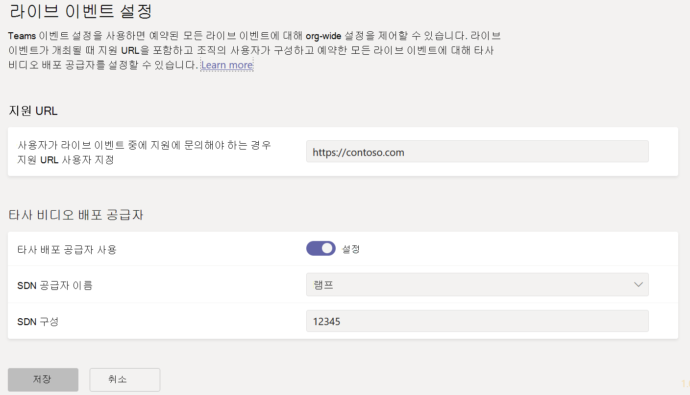
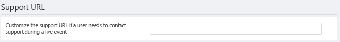
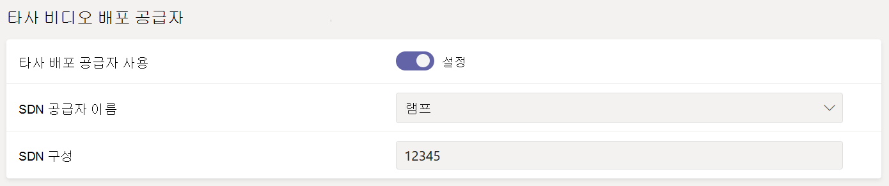

# <a name="configure-live-event-settings-in-microsoft-teams"></a>Microsoft Teams에서 라이브 이벤트 설정 구성

Teams 라이브 이벤트 설정을 사용하여 조직에서 개최되는 라이브 이벤트에 대한 설정을 구성합니다. 지원 URL을 설정하고 타사 비디오 배포 공급자를 구성할 수 있습니다. 이러한 설정은 조직에서 만든 모든 라이브 이벤트에 적용됩니다.

Microsoft Teams 관리 센터에서 이러한 설정을 쉽게 관리할 수 있습니다. 왼쪽 탐색 영역에서 **모임** > **라이브 이벤트 설정** 으로 이동합니다.



## <a name="set-up-event-support-url"></a>이벤트 지원 URL 설정

이 URL은 라이브 이벤트 참석자에게 표시됩니다. 참석자가 라이브 이벤트 중에 지원에 연락할 수 있는 방법을 제공하려면 조직의 지원 URL을 추가합니다.

### <a name="using-the-microsoft-teams-admin-center"></a>Microsoft Teams 관리 센터 사용

1. 왼쪽 탐색 영역에서 **모임** > **라이브 이벤트 설정** 으로 이동합니다.
2. **지원 URL** 에서 조직의 지원 URL을 입력합니다.

    

### <a name="using-windows-powershell"></a>Windows PowerShell 사용

다음을 실행합니다.

```PowerShell
Set-CsTeamsMeetingBroadcastConfiguration -SupportURL “{your URL}”
```
자세한 내용은 [Set-CsTeamsMeetingBroadcastConfiguration을 참조하세요](/powershell/module/skype/set-csteamsmeetingbroadcastconfiguration?view=skype-ps&preserve-view=true).
## <a name="configure-a-third-party-video-distribution-provider"></a>타사 비디오 배포 공급자 구성 

Microsoft 비디오 배달 파트너를 통해 SDN(소프트웨어 정의 네트워크) 솔루션 또는 eCDN(엔터프라이즈 콘텐츠 배달 네트워크) 솔루션을 구매하고 설정한 경우 Teams에서 라이브 이벤트에 대한 공급자를 구성합니다. 

### <a name="using-the-microsoft-teams-admin-center"></a>Microsoft Teams 관리 센터 사용

1. 왼쪽 탐색 영역에서 **모임** > **라이브 이벤트 설정** 으로 이동합니다.
2. **타사 비디오 배포 공급자** 에서 다음을 완료합니다. 

    

    - **타사 배포 공급자** 타사 비디오 배포 공급자를 사용하도록 설정하려면 이 설정을 켭니다.
    - **SDN 공급자 이름** 사용 중인 공급자를 선택합니다.
    - **SDN 구성** SDN 구성 세부 정보를 입력합니다.
        
### <a name="using-windows-powershell"></a>Windows PowerShell 사용
공급자 연락처에서 라이선스 ID 또는 API 토큰 및 API 템플릿을 가져오고 사용 중인 공급자에 따라 다음 중 하나를 실행합니다.

**Microsoft eCDN**
```PowerShell
Set-CsTeamsMeetingBroadcastConfiguration -AllowSdnProviderForBroadcastMeeting $True -SdnProviderName microsoft
```
**하이브** 
```PowerShell
Set-CsTeamsMeetingBroadcastConfiguration -AllowSdnProviderForBroadcastMeeting $True -SdnProviderName hive -SdnLicenseId {license ID GUID provided by Hive} -SdnApiTemplateUrl “{API template URL provided by Hive}”
```
**Kollective** 
```PowerShell
Set-CsTeamsMeetingBroadcastConfiguration -AllowSdnProviderForBroadcastMeeting $True -SdnProviderName kollective -SdnApiTemplateUrl "{API template URL provided by Kollective}" -SdnApiToken {API token GUID provided by Kollective}
```
**Riverbed** 
```PowerShell
Set-CsTeamsMeetingBroadcastConfiguration -AllowSdnProviderForBroadcastMeeting $True -SdnProviderName riverbed -SdnApiTemplateUrl "{API template URL provided by Riverbed}" -SdnApiToken {API token GUID provided by Riverbed}
```
**램프** 
```PowerShell
Set-CsTeamsMeetingBroadcastConfiguration -AllowSdnProviderForBroadcastMeeting $True -SdnProviderName ramp -SdnRuntimeConfiguration "{Configuration provided by RAMP}"
```

자세한 내용은 [Set-CsTeamsMeetingBroadcastConfiguration을 참조하세요](/powershell/module/skype/set-csteamsmeetingbroadcastconfiguration?view=skype-ps&preserve-view=true).

> [!NOTE]
> 외부 앱 또는 디바이스를 사용하여 라이브 이벤트를 만들려는 경우 [Microsoft Stream 사용하여 eCDN 공급자를 구성](/stream/network-caching)해야 합니다. 

>[!Note]
> The change from using Microsoft Stream to [OneDrive for Business and SharePoint for meeting recordings](../tmr-meeting-recording-change.md) will be a phased approach. At launch you'll be able to opt-in to this experience, in November you'll have to opt-out if you want to continue using Stream, and some time in early 2021 we'll require all customers to use OneDrive for Business and SharePoint for new meeting recordings.

>[!Note]
> 선택한 eCDN 솔루션은 선택한 타사 공급자의 서비스 약관 및 개인 정보 취급 방침의 적용을 받으며, 이 정책은 eCDN 공급자의 솔루션 사용을 제어합니다. eCDN 공급자 솔루션의 사용은 Microsoft 볼륨 라이선스 조건 또는 온라인 서비스 약관의 적용을 받지 않습니다. 타사 공급자의 약관에 동의하지 않는 경우 Microsoft Teams에서 eCDN 솔루션을 사용하도록 설정하지 마세요.

### <a name="related-topics"></a>관련 주제
- [Teams 라이브 이벤트란?](what-are-teams-live-events.md)
- [Teams 라이브 이벤트 계획](plan-for-teams-live-events.md)
- [Teams 라이브 이벤트 설정](set-up-for-teams-live-events.md)
