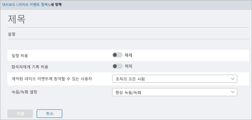

# Microsoft 팀에서 실시간 이벤트 설정

라이브 이벤트를 설정 하는 경우 몇 가지 단계를 거쳐야 합니다.

## 1 단계: 팀에서 실시간 이벤트에 대 한 네트워크 설정
팀에서 생성 된 라이브 이벤트를 위해서는 [팀을 위해 조직의 네트워크를 준비](https://docs.microsoft.com/microsoftteams/prepare-network)해야 합니다.  

## 2 단계: 라이선스 가져오기 및 할당
[라이브 이벤트를 만들고 예약할 수 있는 사용자](plan-for-teams-live-events.md#who-can-create-and-schedule-live-events) 와 [라이브 이벤트를 볼 수 있는 사람](plan-for-teams-live-events.md#who-can-watch-live-events)에 대 한 올바른 라이선스 할당이 있는지 확인 합니다.

## 3 단계: 라이브 이벤트 정책 설정
라이브 이벤트 정책은 조직의 누가 생성 하는 이벤트에서 사용할 수 있는 라이브 이벤트와 기능을 보유할 수 있는 사용자를 제어 하는 데 사용 됩니다. 기본 정책을 사용 하거나 하나 이상의 사용자 지정 라이브 이벤트 정책을 만들 수 있습니다. 사용자 지정 정책을 만든 후에는 조직의 사용자 또는 사용자 그룹에 할당 합니다.

> [!NOTE]
> 사용자 지정 정책을 만들고 할당 하지 않으면 조직의 사용자가 전역 정책을 받습니다. 기본적으로 전역 정책에서는 팀 사용자, 실시간 캡션과 자막 (기록)이 해제 되어 있고, 조직의 모든 사용자가 실시간 이벤트에 참가할 수 있으며, 기록 설정이 항상 record로 설정 됩니다. 

### 라이브 이벤트 정책 만들기 또는 편집

** 여 microsoft 팀 로고를 표시 하는 아이콘**

1. 왼쪽 탐색 창에서 **모임** > **라이브 이벤트 정책**으로 이동 합니다. 
2. 다음 중 하나를 수행 합니다.
- 기존 기본 정책을 편집 하려는 경우 **전역 (조직 전체 기본값)** 을 선택 합니다. 
- 새 사용자 지정 정책을 만들려면 **새 정책을**선택 합니다. 
- 사용자 지정 정책을 편집 하려면 정책을 선택한 다음 **편집**을 선택 합니다. 

    조직의 요구 사항에 맞게 변경할 수 있는 설정은 다음과 같습니다.

     

|설정  |설명  |
|---------|---------|
|**타이틀이**     |라이브 이벤트 정책 페이지에 나타나는 정책의 제목입니다. 64 자를 초과 하거나 특수 문자를 사용할 수 없습니다.          |
|**설명**    |이를 사용 하 여 정책에 대 한 간단한 설명을 추가 합니다.         |
|**일정 허용**     |이 기능을 켜면 조직의 사용자가 팀에서 라이브 이벤트를 만들고 예약할 수 있습니다. 사용자가 외부 앱 또는 장치에서 생성 된 라이브 이벤트를 예약 하도록 하려면 추가 단계가 필요 하다는 것을 알아야 합니다. 자세한 내용은 [사용자가 외부 앱 또는 장치를 사용 하 여 생성 된 이벤트를 예약할 수 있도록 설정을](#enable-users-to-schedule-events-that-were-produced-with-an-external-app-or-device)참조 하세요.     |
|**참석자의 내용에 대 한 기록을 허용 합니다.** |이 설정은 팀에서 생성 된 이벤트에만 적용할 수 있습니다. 이 기능을 켜면 실시간 이벤트 참석자가 이벤트 중에 라이브 캡션과 자막을 볼 수 있습니다.         |
|**예약 된 라이브 이벤트에 참가할 수 있는 사람**    |다음 중 하나를 선택 합니다.  **모든 사용자** 사용자는 조직 외부의 사용자를 포함 하 여 모든 사용자가 참석할 수 있는 라이브 이벤트를 만들 수 있습니다. 이 설정은 사용자가 라이브 이벤트를 예약할 때 팀에서 **공개** 사용 권한 형식을 사용 하도록 설정 합니다.  **조직의 모든 사용자** 사용자는 조직에 추가 된 [게스트 사용자](../add-guests.md) 를 포함 하 여 조직의 사용자가 참석할 수 있는 라이브 이벤트를 만들 수 있습니다. 사용자는 익명 사용자가 참석 하는 라이브 이벤트를 만들 수 없습니다. 이 설정을 사용 하면 사용자가 라이브 이벤트를 예약할 때 팀에서 **조직 차원의** 사용 권한 유형을 사용할 수 있습니다.  **특정 사용자 또는 그룹** 사용자는 조직의 특정 사용자 또는 그룹만 참석할 수 있는 라이브 이벤트를 만들 수 있습니다. 사용자는 조직의 모든 사용자 또는 익명 사용자가 참석 하는 라이브 이벤트를 만들 수 없습니다. 이 설정을 사용 하면 사용자가 라이브 이벤트를 예약할 때 팀에서 **사용자 및 그룹** 권한 유형을 사용할 수 있습니다.       |
|**녹음/녹화 설정**        | 이 설정은 팀에서 생성 된 이벤트에만 적용할 수 있습니다. 다음 중 하나를 선택 합니다.    **항상 녹화** 사용자가 만든 라이브 이벤트는 항상 기록 됩니다. 이벤트가 끝난 후 이벤트 팀 멤버가 녹음/녹화를 다운로드 하 고 참석자가 이벤트를 볼 수 있습니다.   **녹화 안 함** 사용자가 만든 라이브 이벤트는 기록 되지 않습니다.  **이끌이는 녹화할 수 있습니다** . 사용자는 라이브 이벤트의 기록 여부를 결정할 수 있습니다. 기록 된 경우 이벤트를 완료 한 후 이벤트 팀 구성원이 녹음/녹화를 다운로드 하 고 참석자가 이벤트를 볼 수 있습니다.      

Windows PowerShell을 사용 하 여이 작업을 수행할 수도 있습니다. 자세한 내용은 [PowerShell을 사용 하 여 팀에서 실시간 이벤트 정책 설정을](set-teams-live-events-policies-using-powershell.md)참조 하세요. 

### 사용자에 게 라이브 이벤트 정책 할당 

사용자 지정 라이브 이벤트 정책을 만든 경우에는 해당 정책을 활성화할 수 있도록 사용자에 게 할당 합니다. 

 Microsoft 팀 관리 센터 사용

1. 왼쪽 탐색 창에서 **사용자**로 이동한 다음 사용자를 선택 합니다.
2. **할당 된 정책**옆에 있는 **편집**을 선택 합니다. 
3. 할당 하려는 라이브 이벤트 정책을 선택한 다음 **저장**을 선택 합니다. 

다음과 같이 한 명 이상의 사용자에 게 라이브 이벤트 정책을 할당할 수도 있습니다.

 Microsoft 팀 관리 센터 사용

1. **모임** > **라이브 이벤트 정책**으로 이동 합니다.
2. 정책 이름 왼쪽에 있는을 클릭 하 여 정책을 선택 합니다.
3. **사용자 관리**를 선택 합니다.
4. **사용자 관리** 창에서 표시 이름 또는 사용자 이름을 사용 하 여 사용자를 검색 하 고 이름을 선택한 다음 **추가**를 선택 합니다. 추가 하려는 각 사용자에 대해이 단계를 반복 합니다.
5. 사용자 추가를 마쳤으면 **저장**을 선택 합니다.
 

### 사용자가 외부 앱 또는 장치를 사용 하 여 생성 된 이벤트를 예약할 수 있도록 설정

사용자가 외부 앱 또는 장치에서 생성 된 이벤트를 예약 하려면 다음 작업도 수행 해야 합니다.

1. 조직의 사용자에 대해 Microsoft Stream을 사용 하도록 설정 합니다. 스트림은 적격 Office 365 구독의 일부로 또는 독립 실행형 서비스로 사용할 수 있습니다. 스트림은 비즈니스 Essentials 또는 Business Premium 요금제에 포함 되어 있지 않습니다. 자세한 내용은 [스트림 라이선스 개요](https://docs.microsoft.com/stream/license-overview) 를 참조 하세요.

      사용자가 스트림에 액세스할 수 있도록 [Office 365에서 사용자에 게 라이선스를 할당](https://support.office.com/article/Assign-licenses-to-users-in-Office-365-for-business-997596B5-4173-4627-B915-36ABAC6786DC) 하는 방법에 대해 자세히 알아보세요. [이 문서](https://docs.microsoft.com/stream/disable-user-organization)에 정의 된 사용자에 대해 스트림이 차단 되지 않았는지 확인 합니다.

2. 사용자가 Stream에서 실시간 이벤트 만들기 권한이 있는지 확인 합니다. 기본적으로 관리자는 외부 앱 또는 장치를 사용 하 여 이벤트를 만들 수 있습니다. 스트림 관리자는 Stream에서 [실시간 이벤트 만들기에 대 한 추가 사용자를 사용할](https://docs.microsoft.com/stream/live-event-administration#enabling-and-restricting-users-to-creating) 수 있습니다.  

3. 실시간 이벤트 이끌이가 스트림 관리자가 설정한 회사 정책에 였음을 있는지 확인 합니다. 스트림 관리자가 [회사 지침 정책을 설정한](https://docs.microsoft.com/stream/company-policy-and-consent) 경우 콘텐츠를 저장 하기 전에 직원이이 정책을 수락 해야 하는 경우 팀에서 외부 앱 또는 장치를 사용 하 여 라이브 이벤트를 만들기 전에 사용자가 수행 해야 합니다. 조직에서 라이브 이벤트 기능을 롤아웃하기 전에 이러한 라이브 이벤트를 만들 사용자가 정책에 였음을 확인 해야 합니다. 

## 4 단계: 팀에서 라이브 이벤트에 대 한 비디오 배포 솔루션 설정
라이브 이벤트 비디오 재생에는 ABR (적응 비트 전송률 스트리밍)가 사용 되지만, 유니캐스트 스트림은 모든 뷰어가 인터넷에서 자체 비디오 스트림을 가져오는 것을 의미 합니다. 조직의 대규모 사용자에 게 전송 되는 라이브 이벤트 또는 비디오의 경우에는 사용자의 인터넷 대역폭이 상당히 많이 소모 될 수 있습니다. 라이브 이벤트에 대해이 인터넷 트래픽을 줄이기 위해 사용 하는 조직의 경우 라이브 이벤트 솔루션이 소프트웨어 정의 네트워크 (SDNs) 또는 엔터프라이즈 콘텐츠 배달 네트워크 (eCDNs)를 제공 하는 Microsoft의 신뢰할 수 있는 비디오 전달 파트너와 통합 되어 있습니다. 이러한 SDN/eCDN 플랫폼을 사용 하면 조직에서 최종 사용자에 게 표시 되는 환경을 희생 하지 않고 네트워크 대역폭을 최적화할 수 있습니다. 저희 파트너는 엔터프라이즈 네트워크에서 더욱 확장성이 뛰어나고 효율적인 영상 배포를 지원할 수 있습니다.

**팀 외부에서 솔루션 구입 및 설정** Microsoft의 신뢰할 수 있는 비디오 전달 파트너를 이용 하 여 비디오 전달의 크기를 조정 하는 전문가 도움을 받으세요. 팀에서 비디오 제공 공급자를 사용 하도록 설정 하기 전에 팀과 별도로 SDN/eCDN 솔루션을 구입 하 여 설정 해야 합니다.

다음 SDN/eCDN 솔루션은 미리 통합 되어 있으며 스트림과 함께 사용 하도록 설정할 수 있습니다.

- **하이브 스트리밍은** 실시간 및 주문형 엔터프라이즈 영상 배포를 위한 간단 하 고 강력한 솔루션을 제공 합니다. Hive는 추가 하드웨어 또는 대역폭이 필요 하지 않으며, 네트워크에 영향을 주지 않고 수천 개의 동시 비디오 뷰어를 사용 하는 안전한 방법을 제공 하는 소프트웨어 기반 솔루션입니다. SDN/eCDN 솔루션을 구입 하기 전에 네트워크에 대 한 영향을 이해 하는 고객의 경우 Hive 스트리밍은 Microsoft 고객을 위한 브라우저 기반 분석 솔루션을 제공 하기도 합니다. [자세한 정보](https://www.hivestreaming.com/partners/integration-partners/microsoft/)
 
- **Kollective** 는 콘텐츠를 제공 하기 위해 기존 네트워크 인프라를 활용 하는 클라우드 기반 스마트 피어 링 배포 플랫폼으로, 다양 한 양식 (라이브 스트리밍 비디오, 주문형 비디오, 소프트웨어 업데이트, 보안 패치 등)을 더욱 빠르게 수행할 수 있습니다. 안정적이 고 대역폭이 적습니다. 귀하의 보안 플랫폼은 전세계의 가장 저렴 한 금융 기관에서 신뢰 하 고 추가 하드웨어 없이도, 설치 및 유지 관리는 쉽습니다. [자세한 정보](https://kollective.com/microsoft-pilot/)
 
- **램프 OmniCache** 는 차세대 네트워크 배포를 제공 하 고, 이벤트 제작자가 네트워크 대역폭을 최적화 하 고 성공적인 라이브 이벤트 브로드캐스트 및 요청에 대 한 지원을 지원 합니다. 스트리밍. 팀에서 생성 된 라이브 이벤트에 대 한 램프 OmniCache에 대 한 지원은 곧 제공 될 예정입니다. [자세한 정보](http://www.ramp.com) 
 
> [!NOTE] 
> 선택 된 SDN 또는 eCDN 솔루션은 선택한 타사 **공급자의 서비스 약관 및 개인정보 보호 정책**에 적용 되며,이는 공급자의 솔루션 사용을 제어 합니다. 공급자의 솔루션 사용에는 Microsoft 볼륨 라이선스 약관 또는 온라인 서비스 약관이 적용 되지 않습니다. **타사 공급자의 약관**에 동의 하지 않는 경우 팀에서 솔루션을 사용 하도록 설정 하지 마세요. 

SDN 또는 eCDN 솔루션을 설정한 후에는 팀에서 라이브 이벤트에 대 한 공급자를 구성할 준비가 된 것입니다. 

## 다음 단계
[팀에서 실시간 이벤트 구성 설정](configure-teams-live-events.md)으로 이동 합니다.

### 관련 항목
- [팀 라이브 이벤트는 무엇 인가요?](what-are-teams-live-events.md)
- [팀의 라이브 이벤트 계획](plan-for-teams-live-events.md)
- [팀에서 라이브 이벤트 설정 구성](configure-teams-live-events.md)

