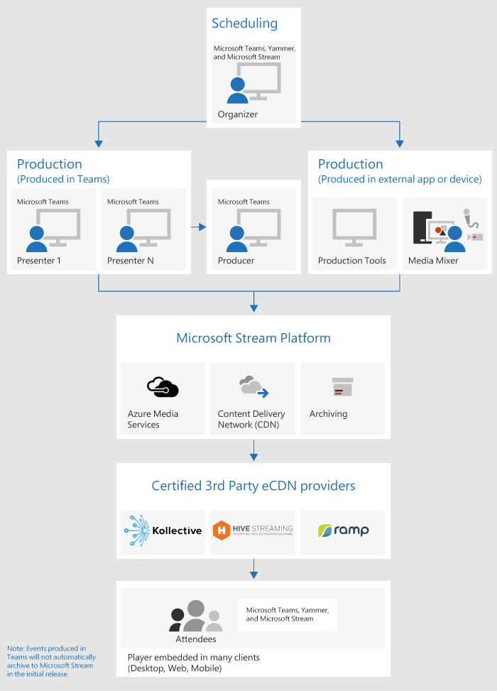

# Microsoft 팀 live 이벤트는 무엇 인가요?

## 개요

팀 live 이벤트를 통해 조직의 사용자는 대규모 온라인 청중에 게 비디오 및 모임 콘텐츠를 브로드캐스트할 수 있습니다. 

Microsoft 365 live 이벤트는 라이브 비디오 스트리밍을 새 수준으로 가져와 전체 계약 수명 주기 전체에서 라이브 이벤트 전후의 참석자와 연결을 장려 합니다. 대상 그룹, 팀 또는 커뮤니티에서 Microsoft Stream, 팀 또는 Yammer를 사용 하 여 라이브 이벤트를 만들 수 있습니다.  

팀은 채팅 기반 공동 작업, 통화, 모임, 라이브 이벤트를 제공 하므로 모임의 대상 그룹을 확장할 수 있습니다. 팀 live 이벤트는 사용자가 비디오 및 모임 콘텐츠를 대규모 온라인 청중에 게 브로드캐스트할 수 있도록 해 주는 팀 모임 확장입니다. 이는 이벤트의 호스트가 리드 하는 일대다 통신을 위한 것 이며, 주로 호스트가 공유 하는 콘텐츠를 보는 데 유용 합니다. 참석자는 Yammer, 팀 및/또는 스트림에서 라이브 또는 기록 된 이벤트를 감시할 수 있으며 중재 Q & A 또는 Yammer 대화를 사용 하 여 발표자와 상호 작용할 수 있습니다.

팀 live 이벤트는 향후 Skype 모임 브로드캐스트 버전으로 간주 되며 결국에는 Skype 모임 브로드캐스트에 제공 된 기능을 대체 합니다. 이 시점에서 Microsoft는 조직에서 비즈니스용 Skype를 사용 하는 사용자에 대 한 Skype 모임 브로드캐스트를 계속 지원 하 여 새로운 또는 향후 이벤트에 대 한 서비스가 중단 되지 않도록 합니다. 그러나 화면 공유 및 외부 하드웨어/소프트웨어 인코더에 대 한 지원을 포함 하 여 팀의 live 이벤트를 사용 하 여 새롭고 흥미로운 기능을 모두 활용할 것을 권장 합니다.

이제 시작 해 보겠습니다. 먼저 Microsoft 365 라이브 이벤트와 관련 된 상위 수준 구성 요소와 연결 되는 방법을 보여 주는 다음 다이어그램을 살펴봅니다. 

### 이벤트 그룹 역할
팀의 라이브 이벤트는 여러 역할 (이끌이, 생산자, 발표자, 참석자)에 게 성공적으로 브로드캐스트하고 이벤트에 참가할 수 있도록 합니다. 자세히 알아보려면 [이벤트 그룹 역할](https://support.office.com/article/get-started-with-microsoft-teams-live-events-d077fec2-a058-483e-9ab5-1494afda578a?ui=en-US&rs=en-US&ad=US#bkmk_roles)을 참조 하세요.

## 주요 구성 요소
위의 그림에서 팀의 라이브 이벤트와 함께 사용 되는 4 가지 주요 구성 요소를 확인할 수 있습니다.

> [!NOTE]
> 라이브 이벤트와 참석자 환경을 설정 하는 방법에 대 한 개요는이 짧은 [비디오](https://support.office.com/en-us/article/video-plan-and-schedule-a-live-event-f92363a0-6d98-46d2-bdd9-f2248075e502)를 확인 하세요.

### 일정
팀은 이끌이가 적절 한 참석자 권한으로 이벤트를 만들고, 이벤트 팀 구성원을 지정 하 고, 프로덕션 방법을 선택 하 고, 참석자를 초대할 수 있는 기능을 제공 합니다. Yammer 그룹 내에서 라이브 이벤트를 만든 경우 실시간 이벤트 참석자가 Yammer 대화를 사용 하 여 이벤트의 사람들과 상호 작용할 수 있습니다. 

### 프로덕션용
비디오 입력은 라이브 이벤트의 기반 이므로 단일 웹캠에서 멀티 카메라 프로페셔널 비디오 제작에 이르기까지 다양 하 게 사용할 수 있습니다. Microsoft 365의 라이브 이벤트는 프로덕션 시나리오의 스펙트럼을 지원 하며 웹캠 또는 외부 앱 또는 장치에서 생성 된 이벤트를 사용 하는 팀에서 생성 된 이벤트를 포함 합니다. 프로젝트 요구 사항 및 예산에 따라 이러한 옵션을 선택할 수 있습니다. 이벤트를 생성 하는 방법에는 두 가지가 있습니다.

- **팀**:이 프로덕션 방법을 사용 하면 사용자가 웹캠 또는 팀 대화방 시스템의 A/V 입력을 사용 하 여 팀에서 실시간 이벤트를 생성할 수 있습니다. 이 옵션은 PC에 연결 된 오디오 및 비디오 장치를 사용 하거나 원격 발표자가 이벤트에 참가 하도록 초대 하는 경우 가장 쉽고 빠르게 실행할 수 있는 옵션입니다. 이 옵션을 사용 하면 사용자가 웹캠을 쉽게 사용 하 고 화면을 이벤트에 입력으로 공유할 수 있습니다. 

    

- **외부 앱 또는 장치**: 외부 인코더는 사용자가 [스트림을](https://stream.microsoft.com)사용 하는 외부 하드웨어 또는 소프트웨어 기반 인코더에서 직접 라이브 이벤트를 생성할 수 있도록 합니다. 이 옵션은 mixers (실시간 메시징 프로토콜) 서비스에 대 한 스트리밍을 지 원하는 스튜디오 음질 장비 (예: 미디어)를 사용 하는 경우 가장 적합 합니다. 이 유형의 프로덕션은 일반적으로 executive 마을 halls 같은 대규모의 이벤트에 사용 되며 미디어 믹서의 단일 스트림이 청중에 게 브로드캐스트 됩니다. 

    

### 스트리밍 플랫폼
라이브 이벤트 스트리밍 플랫폼은 다음 부분으로 구성 됩니다.

- **Azure 미디어 서비스**: [azure media 서비스](https://docs.microsoft.com/azure/media-services/previous/) 는 현재 인기 있는 모바일 장치에서 더 큰 사용자를 대상으로 하는 브로드캐스트 품질 영상 스트리밍 서비스를 제공 합니다. 미디어 서비스는 접근성, 배포 및 확장성을 강화 하 고 콘텐츠를 보호 하는 동안 로컬 또는 전세계 대상 그룹에 콘텐츠를 쉽게 스트리밍할 수 있도록 합니다.
- **AZURE cdn (콘텐츠 배달 네트워크)**: 스트림이 실시간으로 이동 하면 [Azure Cdn (콘텐츠 배달 네트워크)](https://docs.microsoft.com/azure/cdn/)을 통해 제공 됩니다. Azure 미디어 서비스는 스트리밍 끝점에 대 한 통합 CDN을 제공 합니다. 이를 통해 스트림을 버퍼링 없이 전세계에 볼 수 있습니다.

### ECDN (Enterprise 콘텐츠 배달 네트워크)
ECDN의 목표는 인터넷에서 비디오 콘텐츠를 가져와 네트워크 성능에 영향을 주지 않고 기업 전체에 콘텐츠를 배포 하는 것입니다. 다음 인증 된 eCDN 파트너 중 하나를 사용 하 여 조직 내에 보관 되는 실시간 이벤트에 대 한 네트워크를 최적화할 수 있습니다.
- [벌](https://www.hivestreaming.com/partners/integration-partners/microsoft/)
- [Kollective](https://kollective.com/microsoft-pilot/)
- [경사](http://www.ramp.com)

### 참석자 환경 
참석자 환경은 라이브 이벤트의 가장 중요 한 측면이 며 참석자가 문제 없이 라이브 이벤트에 참여할 수 있도록 하는 것이 중요 합니다. 참석자 환경은 스트림 재생기 (팀에서 생성 된 이벤트)와 Azure Media Player (외부 앱 또는 장치에서 생성 된 이벤트의 경우)를 사용 하 고 데스크톱, 브라우저 및 모바일 (iOS, Android)에서 작동 합니다. Office 365는 두 공동 작업 허브로 Yammer와 팀을 제공 하 고, 실시간 참석자 환경이 이러한 공동 작업 도구에 통합 되어 있습니다. 

### 실시간 이벤트 사용 보고서 
테 넌 트 관리자는 Microsoft 팀 관리 센터에서 실시간 이벤트에 대 한 실제 시간 사용 분석을 볼 수 있습니다.  [실시간 이벤트 사용 보고서](../teams-analytics-and-reports/teams-live-event-usage-report.md) 에는 조직에 보유 된 라이브 이벤트의 활동 개요가 표시 됩니다.  관리자는 이벤트 상태, 시작 시간, 보기, 프로덕션 유형 등의 이벤트 사용 정보를 볼 수 있습니다.  

## 다음 단계
[팀 라이브 이벤트 계획](plan-for-teams-live-events.md)으로 이동 합니다.

### 관련 항목
- [Yammer, Microsoft 팀, Microsoft Stream의 Microsoft 365에서 발생 하는 라이브 이벤트](https://docs.microsoft.com/stream/live-event-m365)
- [Microsoft 팀의 실시간 이벤트 시작 하기](https://support.office.com/article/d077fec2-a058-483e-9ab5-1494afda578a)
- [Yammer의 라이브 이벤트](https://support.office.com/article/live-events-in-yammer-4ece0ee2-c268-4636-bf2a-16e454befe57)
- [Microsoft Stream의 라이브 이벤트](https://docs.microsoft.com/stream/live-event-overview)

 
