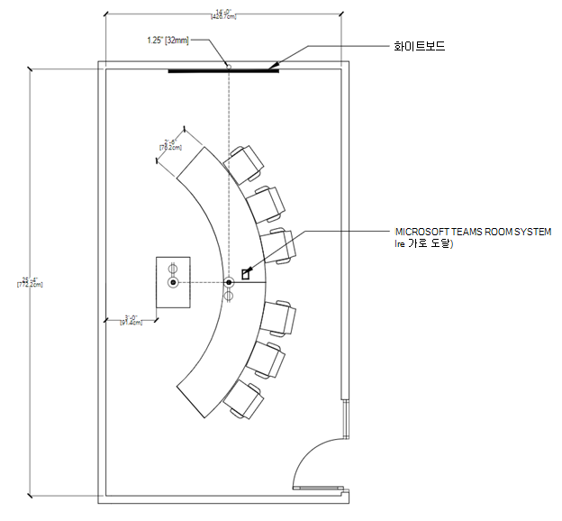

# 회의실에 대한 Teams

이 문서는 사용자가 솔루션 및 디바이스를 통해 모임 공간을 최적화하는 Microsoft Teams 룸 안내하기 위한 것입니다. 여기에는 디바이스 및 Teams 룸 사용, 레이아웃 및 사양에 대한 정보가 포함됩니다.

# [회의실 사용 및 레이아웃](#tab/uses)

## 개요

Microsoft Teams 룸 솔루션은 목적의 유연성을 제공하며, 기존 회의실이 하지 않는 공간 전체에서 유연성을 제공합니다. 예를 들어 Teams 룸 디바이스를 사용하여 사용자는 디지털 화이트보드와의 공동 작업을 강화할 수 있으며 지능형 사람 추적 카메라를 통해 모든 로컬 참가자가 방에 있는 위치와 상관없이 볼 수 있습니다. 모든 유형의 공간 및 모든 유형의 모임은 디바이스 또는 Teams 룸 솔루션으로 Teams 룸 수 있습니다.

### 프레젠테이션 중심 모임 

모임 및 발표 모임은 첫 번째 버킷으로, 이 모임은 일반적으로 더 공식적인 모임입니다. 시청각은 우선 순위로, 콘텐츠를 발표하는 데 초점을 맞추고 있습니다. 일반적으로 디바이스는 고정되어 있어 사용자가 테이블 중심 콘솔에서 디바이스와 상호 작용하는 동안 앉은 상태로 유지됩니다.

프레젠테이션 및 토론의 우선 순위를 지정하는 공간을 만나고 발표하는 것은 콘텐츠 공유 및 원격 공동 만들기에 맞게 레이아웃과 기술이 최적화되어야 합니다. 모든 사용자가 토론에 참여해야 합니다. 공유 콘텐츠를 보고 상호 작용할 수 있어야 합니다.

**공간 레이아웃 충족** **및 발표:** 테이블을 수정하고 방 전면 디스플레이에 위치해야 합니다. 작은 방에서는 테이블을 벽에 부착할 수 있지만 큰 공간에서는 카메라 고려 사항을 수용하기 위해 분리해야 합니다.

### 공동 만들기 중심 모임

모임 및 공동 만들기 모임은 일반적으로 공동 만들기, 인크링 및 화이트보드에 우선 순위가 있는 덜 공식적인 모임입니다. 개인 파일에 대한 액세스도 이 버킷의 초점입니다. 디바이스는 모바일이 될 수 있으며 사용자가 디바이스를 일어서고, 수집하고, 상호 작용할 수 있도록 격려할 수 있습니다.

올바른 공간은 사용자와 기술을 원활하게 교량화하고, 심지어 가장 많은 사용자에 대한 마찰을 제거합니다. Teams 디바이스는 어린 학생 또는 새 사용자가 잘 탐색할 수 있을 만큼 사용자 친화적으로 설계되어 있으며, 교육자 또는 관리자가 처음 사용에서 제어하고 사용자 지정할 수 있습니다.

**공간 레이아웃을 충족하고 공동으로 만들 수 있습니다.** 테이블 및 공동 만들기 장비는 유연한 위치를 사용할 수 있으며 테이블 또는 장비에서 작업하는 사용자 그룹을 수용해야 합니다.

### 프레젠테이션 및 공동 만들기 중심 모임

두 유형의 방은 모두 필요한 경우 두 가지 유형의 환경을 처리할 수 있습니다. 또한 각 사용에 대한 기술을 사용하여 두 방을 쉽게 수용하도록 설계할 수도 있습니다. 중요한 점은 개인 사무실에서 강의실까지 어떤 공간을 갖추고 있는가에 상관없이 이 공간을 사용하도록 설정해야 Teams 것입니다.

**조합 프레젠테이션 및 공동 만들기 공간 레이아웃:** 다른 모임 시나리오의 사용 사례 조합을 결합하여 프레젠테이션 중심 모임과 공동 만들기 작업을 동시에 동시에 달성할 수 있는 다목적 회의실을 구성할 수 있습니다.

## 모임 환경 최적화
훌륭한 모임 환경은 회의 공간에 가장 적합한 기술을 사용하여 아이디어 교환을 용이하게 하여 침입하지 않고도 쉽게 사용할 수 있는 결과입니다.

### 네이티브 Teams 룸 다른 디바이스와의 환경

Teams 룸 Teams 원터치 조인, 지능형 방식으로 모임에 물리적 화이트보드를 공유하는 콘텐츠 카메라, 개인 디바이스에서 회의실로 모임을 원활하게 전송하는 Teams 같은 고유한 회의실 내 기능을 제공하여 개인 장치에서 수행될 수 있는 기능을 넘어설 수 있습니다.

외부 서비스 또는 자체 디바이스 연결을 사용하는 네이티브 및 자체 구축 시스템이 기본 제공되지 않는 시스템으로, 네이티브 룸의 사용 편의성 또는 몰입도 높은 Teams 없습니다.

배포 과정에서 모임 공간에서 완전히 네이티브 사용자 환경으로의 경로에 구현된 중간 단계(예: 가져오기-사용자 디바이스 회의실을 신속하게 배포하는 등)가 Teams 수 있습니다.

### 사용 Teams 최상의 모임 환경을 만들 수 있습니다.

모든 개인 Teams 모든 Microsoft Teams 룸 모든 공간에 적절히 배포하여 모든 사용자에 대해 가능한 최상의 모임 환경을 용이하게 할 수 있습니다. 최상의 환경을 달성할 계획인 경우 기술 배포 및 최종 사용자 지침 및 교육 측면에서 모든 공간을 해결해야 합니다.

대규모 회사 전체 롤아웃을 계획할 때 일부 회의실에서 다른 시기에 기술이 추가되거나 특정 구성 요소가 다른 회의실보다 더 일찍 설치되는 경우(예: 특정 건물의 모든 방에 일정을 예약하기 위한 Teams 패널을 배포하는 등) 한층 더 많은 솔루션을 한 Teams 룸 한 방에 설치하는 것이 일반적입니다.

이 작업을 단계적으로 준비하여 모든 Teams 모임 환경을 최대화할 수 있습니다.

#### 좋은 환경 – 모임 공간에서만 개인 디바이스

이 요금제는 모든 비 AV 또는 공동 작업이 아닌 모임 공간을 해결하여 시작할 수 있습니다. 회의실에 아직 디바이스가 Teams 않은 경우에도 회의실에서 Teams 수 있습니다.

*오디오:* 전체 Teams 회의실에 대한 훌륭한 브리지는 개별 사용자에게 소규모 Teams 그룹에 대한 인증된 오디오 디바이스를 제공하거나 작은 디바이스가 잘리지 않는 더 큰 그룹에 대한 전체 Teams 룸 솔루션보다 먼저 회의실에 배포하여 기술 모임을 계획하는 것입니다.

*비디오:* 이러한 회의실을 사용하는 경우 개별 사용자는 자신의 디바이스를 가져와서 모임 콘텐츠에서 공유하고 Teams 식을 개별 카메라로 캡처할 수 있습니다. 그런 다음 사용자가 로컬 그룹의 단일 오디오 소스로 사용자를 지정하여 해당 개인 디바이스를 인증된 오디오 디바이스에 연결하여 모든 사용자(로컬 및 원격 모두)가 모임 오디오에 긍정적인 경험을 하게 할 수 있습니다.

*참여:* 개인 장치 및 주변 장치를 Teams 경우에도 회의실을 더 잘 사용할 수 있도록 설정하면 사용자가 사용자와 함께 할 수 있는 작업을 확장할 수 Teams. 사용자가 개인 사무실 및 개별 Teams 있는 경우 원격 참가자와의 Teams 대화를 용이하게 할 수 있습니다.

#### 더 나은 환경 – Teams 룸 및 개인 디바이스 없음

솔루션 Teams 룸 설치하거나 해당 공간에 적합한 Teams 룸 이미 배포된 회의실이 있는 경우 좋은 모임 환경을 경험할 수 있습니다.

*오디오:* 이러한 모임 공간에 대한 오디오는 Teams 룸 Microsoft 인증 오디오 디바이스에서 처리됩니다.

*비디오:* 이러한 공간의 비디오는 Microsoft 인증 Teams 룸 카메라에서 처리됩니다.

*참여:* 최종 사용자는 모임에 대한 전체 Teams 룸 활용할 수 있으며, 모든 사용자가 쉽게 모임에 참가하고 훌륭한 오디오 및 비디오를 사용할 수 있습니다.

#### 최상의 환경 – Teams 룸 디바이스와 함께 사용하는 솔루션

사용자가 조정에서 기술을 사용할 수 있도록 교육하면 가장 효율적이고 간소화된 결과가 나타날 수 있습니다. 가장 좋은 시나리오는 설치된 기술과 개인 디바이스의 조합입니다.

*오디오:* 대부분의 회의실 연결 및 오디오 비디오 Teams 룸 솔루션에서 처리되는 반면, 개별 사용자는 카메라를 사용하여 동일한 모임에 참가하고 오디오를 꺼서 완전히 몰입감을 경험할 수 있습니다.

*비디오:* 원격 사용자는 말하기 및 콘텐츠 공유를 넘어 모든 사용자가 모임에 참여하는 내용을 볼 수 있습니다. 원격 사용자는 개인 비디오를 켜서 모든 참가자에 집중할 수 있는 기능을 사용하여 방 어디에서나 보기를 얻을 수 있습니다.

*참여:* 채팅은 참여하고 참여하는 모든 참가자, 로컬 및 원격 참가자와 동적으로 유지될 수 있습니다. 원격 참가자가 Teams 룸 및 개별 카메라를 통해 비디오 공유를 통해 원격 참가자가 모든 사용자와의 참여를 느낄 수 있습니다.

모든 Teams 사용하여 로컬 회의실 사용자와 원격 사용자가 모임에 동등하게 참여할 수 있습니다.

## 기술 고려 사항

올바른 오디오 및 비디오 기술 선택은 사용자가 자신의 모임을 가장 잘 활용하는 데 Microsoft Teams 것입니다.

### 오디오

오디오 고려 사항은 원격 참가자와 객실 내 참가자를 명확하게 듣고 이해할 수 있도록 하는 데 중요합니다. 마이크 및 스피커 커버리지는 간격을 두지 않고 방의 모든 좌석을 포함해야 합니다.

*각 공간에 적합한 오디오 디바이스*

회의실에 오디오 문제가 없는지 확인하려면 공간에 대한 단일 오디오 원본이 필요합니다.

각 공간에 적합한 마이크와 스피커를 페어링하면 방해 없이 명확하게 들리기 위한 최상의 결과를 얻게 됩니다.

-   공유 공간에서 옵션은 확장되지만, 모임 참가자는 다른 사람이 분명하게 들려야 하는 동일한 원칙이 유지됩니다.

    -   올인원 오디오 디바이스는 제한된 수의 참가자가 오디오 디바이스에 비교적 가깝게 앉아  있는 작은 공간에 쉽게 배포할 수 있는 고품질 옵션입니다.

    -   더 **큰 공간에서** 마이크와 스피커가 분리되어 공간의 모든 참가자에서 최대 범위를 보장합니다. 중대형 회의실에 대한 많은 솔루션은 구성이 필요 없는 키트의 일부로 사용할 수 있으며, 마이크와 스피커의 물리적 설치만 가능합니다.

    -   가장 **크고** 가장 복잡한 공간에서 다양한 마이크와 스피커 유형을 함께 사용할 수 있는 솔루션을 사용할 수 있습니다. 예를 들어 강사와 청중의 음성을 큰 홀에서 캡처하는 동시에 모든 사용자에 전화를 걸 수 있습니다. 이러한 솔루션은 기술적으로 관련된 솔루션의 설계 및 배포에 대한 전문 지식을 들이는 Microsoft 파트너와 함께 배포할 때 가장 좋습니다.

### 비디오

비디오는 오디오와 동일하게 중요합니다. 얼굴 표정이나 제스처와 같은 물리적, 비언어적 의사소통을 캡처하는 것은 교실 또는 모임 콘텐츠만큼이나 중요합니다. 회의실에 적절한 크기의 디스플레이를 갖추어 모든 사람이 회의실 또는 원격에서 제대로 모임을 경험할 수 있도록 해야 합니다. 따라서 회의실에 원격으로 참가하는 모든 회의실 모임 참가자를 효과적으로 캡처하기 위해 FOV(카메라 적용 범위 및 시야)를 설정해야 합니다.

*각 공간에 적합한 카메라*

좋은 오디오만큼 중요한 고품질 비디오는 최신 공동 작업에서 Teams 필요합니다. 이제 모든 공간에서 고품질 카메라를 사용할 수 있는 카메라 기술이 크게 발전했습니다.

-   랩톱 및 태블릿과 같은 디바이스에 포함된 카메라는 모든 모임에서 모든 사람이 볼 수 있도록 해야 합니다. 더 풍부한 비디오 환경을 개인 공간에 가져오고자 하는  사용자를 위해 외부 카메라는 포함된 디바이스에서 한 단계 더 향상된 기능을 나타내며, 더 많은 수의 시나리오 및 구성에서 사용할 수 있으며 통화 참가자가 자신에 대한 최상의 품질 보기를 공유할 수 있도록 합니다. 이러한 디바이스는 모든 PC에서 찾을 수 있는 간단한 USB 연결로 쉽게 설치할 수 있습니다.

-   공유 공간에서 옵션 및 기능이 확장됩니다. **작은 방** 에는 사운드바와 같은 올인원 오디오 디바이스에 포함된 카메라가 포함될 수 있습니다. 이러한 카메라는 일반적으로 넓은 시야를 특징으로 하여 한 번의 샷으로 공간의 모든 참가자를 캡처할 수 있습니다. 이러한 카메라의 대부분에는 이미지의 지능형 프레이밍과 같은 기능도 있으므로 카메라는 공간 활용도를 추적하고 이해하기 위해 회의에 참석한 사람만 표시하고 의자를 비워 두지 않는 사람만 표시됩니다.

-   큰 **방에서** 카메라는 다양한 거리에 있는 다양한 위치에서 참가자를 캡처하는 데 필요한 기술을 제공합니다. 이러한 카메라는 시각적 선명도를 유지하면서 그룹을 캡처하거나 특정 개인에게 집중할 수 있습니다. 활성 발언자만 추적하고 기능을 사용할 수 있는 디바이스는 더 큰 공간에서 정기적으로 사용이 많기 때문에 많은 참가자가 자신의 생각을 발표할 때 모임 전체에 개별적으로 추천될 수 있습니다.

# [향상된 Microsoft Teams 방](#tab/emtr)

## 향상된 Microsoft Teams 방

이 섹션에서는 Microsoft가 표준 회의실을 고급 회의실로 Microsoft Teams 룸 새로운 전면 행 환경을 Teams 방법을 설명합니다. 이 문서는 방 디자인 및 기술 지침, 권장 제품 및 Microsoft 회사 시설 참조 사양에 사용할 수 있습니다.

## 회의실의 미래에 대한 Microsoft의 비전

작업의 미래는 클라우드를 통해 유동적이고 동적이며, 동적으로 작동됩니다. Microsoft는 언제 어디서나 사용자가 참석할 수 있는 모임 환경을 제공합니다. 이러한 모임은 하이브리드로, 원활하게 참가할 수 있습니다. Microsoft 디바이스를 통해 향상된 모임은 포괄적입니다. 모든 음성이 들리며 모든 사람이 명확하게 표현됩니다.

Microsoft는 모임이 몰입형이고 사용자에 따라 공간을 디자인하는 미래를 볼 수 있습니다. 동적 모임 보기를 통해 모든 사람이 콘텐츠와 서로 연결됩니다. 공식 프레젠테이션은 공동 작업 채팅과 페어링됩니다. 디지털 캔버스는 그룹 창의성을 발휘합니다. 모든 사람이 어디에 있든 얼굴을 마주 보며 연결할 수 있습니다.

모임의 미래에 대한 비전은 모임이 일회성 트랜잭션보다 훨씬 더 많은 것을 제공해야 한다는 간단한 믿음에 근거합니다. 모임은 회의실 또는 전 세계에 있는 모든 사람을 위해 디자인됩니다.

## 향상된 방은 Microsoft Teams 무엇입니까?

Microsoft의 하이브리드 작업장에서 차세대 방 표준은 원격 참가자와 객실 내 참가자 모두의 요구에 따라 정보를 제공합니다. 향상된 회의실은 Microsoft Teams 더 자연스럽고 몰입감 있는 연결을  강화하는 동시에 모임의 모든 사용자가 포함, 표현 및 생산성을 느낄 수 있도록 하는 고급 하이브리드 모임 환경을 제공하도록 설계된 회의실입니다. 이 방은 소프트웨어 및 하드웨어 기능 및 Teams 룸 구성 지침을 조합하여 실제적으로 수행된 원칙 집합을 따르고 있습니다.

향상된 Microsoft Teams 방에 대한 개념은 환경 원칙 집합에서 지원하는 두 가지 주요 목표를 중심으로 디자인됩니다.

**목표 1: 모임에 참석하는 모든 사람이 포함, 표현 및 생산성을 느끼고 있습니다.**

디자인 원칙:

-   원격 참가자는 방에서 진정한 존재감을 설정할 수 있습니다.

-   회의실 내 참가자는 모임에서 개별 ID를 유지할 수 있습니다.

-   모든 모임 참가자는 경계 없는 공동 작업에 참여할 수 있습니다.

**목표 2: 연결은 자연스럽고 몰입감이 있습니다.**

디자인 원칙:

-   환경은 사람 연결에 따라 확장되어 모든 사람이 같은 방에 있는 것 같은 느낌의 상호 작용을 사용할 수 있습니다.

향상된 방 환경은 환경을 정의하는 단일 기능과 함께 이러한 모든 구성 요소 및 아이디어입니다. 향상된 기능에서 발견된 개별 기능 및 Microsoft Teams 룸 자체적으로 배포할 수도 있습니다.

특정 기능 배포의 예:

-   지원되는 회의실 솔루션이 있는 모든 유형의 모임 공간에서 새 Microsoft Teams 전면 디스플레이 환경을 활용하세요.

-   모든 모임 공간에서 경험의 연속성을 유지하면서 방에서 더 Microsoft Teams 더 나은 인간 연결을 촉진하기 위해 기존의 회의실 환경을 사용하여 곡선 테이블 및 전면 레이아웃을 구현합니다.

## 이 룸 형식은 언제 배포해야 하나요?

향상된 Microsoft Teams 룸 조직 내에서 다른 모든 모임 공간을 대체하기 위한 것이 아니라 기존 모임 공간을 보완하는 역할을 하기 위한 Microsoft Teams. 원격 모임 참가자와의 대면 상호 작용이 가장 중요한 공간 및 위치에 조직 내에서 전략적으로 배포해야 합니다.

Microsoft Teams 룸 업데이트를 통해 제공된 사람 중심의 하이브리드 모임 환경을 계속 제공할 것입니다. 그러나 일부 향상된 환경을 최적화하는 데 중요한 역할을 하는 하드웨어 기술과 룸 구성 지침이 있습니다. 이러한 구성 요소의 조합은 고급 룸을 구성하는 Microsoft Teams 구성 요소입니다. 개선된 Microsoft Teams 룸 개선된 Microsoft Teams 평가할 때 다음을 고려합니다.

-   어떤 하드웨어 업그레이드 및/또는 투자를 해야 합니다.

-   대부분의 회의실은 방 크기와 회의실 용량 간의 밀밀한 관계를 통해 가치 있는 평방 영상을 최대화하도록 디자인됩니다. 향상된 Microsoft Teams 방은 제곱 푸티지의 최대화보다는 모임 환경의 우선 순위를 지정합니다. 모든 조직이 모든 모임 공간에 대해 이 방식으로 우선 순위를 지정할 수 있는 것은 아니며, 이로 인하여 회의실의 수를 줄일 수 있습니다.

### 이 공간 이해 

*포함과 하이브리드 유연성의 분산*

Microsoft의 유연한 작업 지침은 직원에게 작업할 위치와 때에 대한 선택과 유연성을 주는 우선 순위를 지정합니다. 이러한 근본적인 정책 변화로 모임 공간 및 기술의 발전을 다시 생각하게 됩니다.

우리의 연구에 따르면 전유병 중에 원격 모임이 많은 이점을 보였다는 것을 보여 주었다. 특히 공평성 및 포용감의 증가에 대해 많은 이점이 있습니다. 원격 및 대면 공동 작업이 동시에 진행되는 하이브리드 설정으로 돌아오는 경우를 생각하면서 회의실 디자인 및 기술을 통해 모든 참가자에 대한 수준 플레이 필드를 유지하면서 유연한 작업 정책을 더 잘 지원하는 모임 공간을 만들기 위해 고안했습니다.

### 이 공간은 어떤 데 사용하나요?

이 공간은 물리적 회의실에서 소규모 Teams 가장 몰입감 있는 모임 환경을 제공합니다.

일반적인 Microsoft Teams 회의실과 마찬가지로 모임 참가자는 콘텐츠를 발표하고 공동으로 만드는 동안 원격으로 및 로컬로 만나 원활하게 함께 작업할 수 있습니다.

### 이 공간은 어떻게 계획하나요?

룸 레이아웃은 원격 참가자 및 콘텐츠와의 가시성과 참여를 극대화하도록 디자인됩니다.

레이아웃은 모든 의자가 디스플레이를 향하고 있는 원격 참가자에게 직접 눈을 닿을 수 있도록 곡선 테이블을 특징으로 하여 참가자가 따라다니게 합니다.

### 오디오는 어떻게 작동하나요? 

오디오 솔루션 인증을 Microsoft Teams 룸 사람들이 명확하게 듣고 들 수 있습니다.

향후 Teams 룸 오디오라는 개념을 활용하는 오디오 시스템을 지원할 예정입니다. 공간 오디오를 통해 음성이 말하는 사람의 방향에서 발산됩니다. 예를 들어 모임 갤러리의 오른쪽에 있는 사람이 말하는 경우 해당 위치와 가장 가까운 스피커에서 오디오가 표시됩니다. 이러한 종류의 몰입형 오디오 환경은 모임이 대면 대화와 더 밀접하게 닮을 수 있습니다.

### 카메라는 어떻게 작동하나요?

울트라와이드 앵글 카메라는 공간의 모든 사람을 캡처하기 위해 디스플레이 아래에 있는 방 앞에 배치됩니다.

초광각 카메라는 모임 참가자를 지능적으로 추적하여 전체 회의실의 큰 이미지 내의 얼굴 대신 큰 보기에서 개별적으로 표현할 수 있습니다.

### 방 전면 표시가 어떻게 작동하나요? 

이 방은 전면 Microsoft Teams 룸 레이아웃에 최적화되어 있으며 특수한 단거리 고화질 프로젝터를 통해 표시되어 모임을 위해 특별히 설계된 몰입감 있는 Teams 있습니다. 

### 앞줄이란?

모임 전, 모임 중 및 후에 원격 참가자와의 연결을 강화하고 공동 작업을 지원하기 위해 Microsoft는 앞줄이라는 새 콘텐츠 레이아웃을 Microsoft Teams 룸 소개했습니다. 시각적으로 이 새 레이아웃은 비디오 갤러리를 화면 아래쪽으로 이동하며 얼굴의 크기를 생생하게 유지하기 위해 특정 비율로 고정됩니다. 이 레이아웃을 통해 룸 내 참가자는 같은 방에 있는 경우와 비슷한 수평 평면에서 원격 동료가 얼굴을 마주보는 것을 볼 수 있습니다.

모임 콘텐츠는 의제, 작업 및 노트와 같은 상황에 맞는 유동성 구성 요소로 둘러싸여 있으며, 실시간으로 업데이트하여 참가자가 참여하고 생산성을 유지하게 합니다. 또한 모임 채팅이 명확하게 표시되어 Teams 회의실에서 모임에 참가할 Teams 실시간으로 대화를 쉽게 보고 참여할 수 있습니다. 향상된 Microsoft Teams 회의실에서 이 콘텐츠는 모임 콘텐츠의 크기와 동시에 볼 수 있는 참가자 수를 최대화하기 위해 와이드 측면 비율 화면에 표시됩니다.

이 레이아웃은 단일 및 이중 디스플레이 구성 모두에서 지원됩니다. 앞줄 레이아웃은 향상된 방에서 특히 영향을 미치지만 전면 행은 가구 및 하드웨어 구성에 Teams 실행되는 모든 Windows 사용할 수 있습니다.

### 콘텐츠를 공동 만드는 방법

이러한 Microsoft Teams 룸 지능형 캡처 기능을 사용하여 기존 아날로그 화이트보드를 활용할 수 있습니다. 모든 참가자가 함께 그릴 수 있는 현대화된 환경의 경우 Microsoft Whiteboard 전면 디스플레이, PC, 휴대폰 또는 태블릿과 같은 도우미 디바이스를 사용하여 액세스할 수 Microsoft Surface Hub.

## 향상된 Microsoft Teams 방 디자인 지침

이 섹션은 처음부터 방을 구축하는 것을 다루기 위한 것입니다. 

### 방 레이아웃 

#### 방 크기

25ft x 14ft

#### 객실 용량 

이 향상된 Microsoft Teams 룸은 6~8명까지 최적화되어 있습니다. 

#### 객실 가구

이 방은 참가자가 한쪽에 앉은 곡선 테이블을 갖추고 있어, 객실 내 참가자가 서로의 가시성을 유지하며 원격 참가자와 대면할 수 있도록 합니다.

이 객실은 높이가 30cm 또는 76cm인 표준 회의실 테이블을 제공합니다.

#### 장비 탑재

하드웨어의 위치를 선택하는 것은 일반적으로 주어진 모임 공간 내에서 Teams 룸 인증 하드웨어를 선택해야 합니다.

Microsoft 시설 내의 향상된 회의실의 초기 배포를 위해 표에 통합된 Microsoft Teams 룸 통합된 카메라 및 사운드바 디바이스(공간 오디오에 대한 이산 왼쪽 및 오른쪽 채널 오디오)를 표시된 이미지 아래에 탑재하고, 방 전면 투영과 테이블 사이에 탑재하기로 결정했습니다. 개인 장치 및/또는 문서에 대한 테이블 사용을 지장하지 않고 참가자의 도달 범위 내에서 본체를 유지하는 것이 중요합니다. 디스플레이의 경우 짧은 던지기 고해상도 프로젝터가 사용됩니다.

대부분의 참가자는 개인 디바이스를 통해 모임에 참가하여 이러한 유형의 회의실 내에서 Teams 선택하게 됩니다. 그러나 회의실 내 로컬 비디오 프레젠테이션은 모임 통화에 참가할 수 없는 사용자도 쉽게 액세스할 수 있는 방식으로 테이블에서 제공해야 합니다.

#### 터치 콘솔 배치

Microsoft Teams 룸 터치 콘솔은 개인 디바이스 또는 문서에 대한 테이블 사용을 차단하지 않고 모임 참가자가 쉽게 도달할 수 있는 테이블 가운데에 탑재해야 합니다.

#### 로컬 비디오 프레젠테이션

많은 참가자가 개인 디바이스를 통해 Teams 모임에 참가하여 이러한 유형의 회의실 내에서 콘텐츠를 공유하기로 선택할 수 Teams, 회의실 내 로컬 비디오 프레젠테이션도 쉽게 액세스할 수 있는 방식으로 테이블에서 제공해야 합니다.

## 인프라 

### 인프라 파워

최소한 테이블(최종 사용자의 경우)과 장비 탑재 위치에서 전원 연결을 제공해야 합니다. 공간에서 공동 만들기 디바이스를 사용하는 경우 해당 위치에서도 전기 전원 연결이 필요할 수 있습니다.

### 인프라 데이터

네트워킹 연결은 테이블(최종 사용자의 경우)과 장비 탑재 위치(솔루션의 주 네트워크)Teams 룸 제공해야 합니다. 공간에서 공동 만들기 디바이스를 사용하는 경우 네트워크 연결도 필요하여 해당 솔루션의 주 네트워크에 Teams 룸 합니다.

### 음향 벽 처리

이 유형의 방에 있는 적어도 두 개의 벽은 모임 중에 에코 및 주변 소음 문제를 방지하기 위해 음향으로 처리해야 합니다.

### 창 처리

이 유형의 방에 있는 창의 빛은 조명에 부정적인 영향을 주며 카메라 이미지와 전면 디스플레이 모두에 눈부심과 그림자를 도입할 수 있습니다. 창이 있는 모든 공간에는 모임 중에 외부 조명을 차단할 수 있는 창 처리도 제공해야 합니다.

### 바닥 처리

이 유형의 방의 바닥은 모임 중에 에코 및 주변 소음 문제를 방지하기 위해 카펫을 받거나 음향으로 처리해야 합니다.

### 조명 

회의실 참가자가 씻지 못하거나 어두운 공간에 앉아 있지 않은 경우 공간을 밝히기 위해 오버헤드 조명을 제공해야 합니다. 눈부심을 방지하기 위해 방 전면 디스플레이, 디바이스 공동 만들기 또는 기타 반사 표면에 대한 직접 조명을 최소화하는 노력이 필요합니다.

## 기술 지침 

### Microsoft Teams 룸 솔루션

사용자에 대한 향상된 Microsoft Teams Microsoft Microsoft Teams 룸 사용이 Windows.

### 카메라

#### 카메라 옵션

이 유형의 방에는 공간의 너비 및 깊이에 대해 적절하게 등급이 정해진 지능형 초광각 전면 카메라를 사용해야 합니다.

#### 카메라 배치

카메라는 회의실 앞쪽 투영 아래에 배치해야 하지만 가능한 한 눈 수준에서 모든 회의실 참가자를 캡처하기 위해 테이블 위쪽에 배치해야 합니다.

### 마이크

#### 마이크 옵션

방 전면 마이크 배열 및 탁상 및 오버헤드 마이크는 이러한 유형의 공간에 대해 작동하게 됩니다.

#### 마이크 배치

마이크 배열을 배치하여 디바이스의 인증된 범위 내의 모든 회의실 참가자에 대한 적용 범위를 제공해야 합니다.

### 발표자

#### 스피커 옵션

이러한 유형의 공간에 대해 방 전면 스피커 배열 및 오버헤드 스피커가 작동합니다.

참고: 공간 오디오를 아직 사용할 수 없는 경우 특정 오디오 디바이스가 필요할 수 있습니다.

#### 발표자 배치

사용되는 디바이스 또는 디바이스의 인증된 범위 내의 모든 회의실 참가자에 대한 적용 범위를 제공하려면 발표자가 배치해야 합니다.

### 방 전면 디스플레이

#### 표시 유형

이 유형의 공간은 최대 가시성과 선명도를 보장하기 위해 공간의 너비와 깊이에 적합한 초고해상도 가로 세로 비율, 고해상도 전면 디스플레이를 사용해야 합니다.

예제 표시 유형은 다음과 같습니다.

-   레이저 프로젝터

-   LED 비디오 벽

-   특수 LCD 또는 OLED 플랫 패널 디스플레이

#### 표시 함수

향상된 Microsoft Teams 룸 다른 모든 Microsoft Teams 룸 솔루션과 같이 적절한 작업을 위해 다음 기능을 수용할 수 있는 디스플레이를 사용해야 합니다.

-   HDMI 동기화를 기반으로 절전 모드 해제 및 절전 모드 해제

    -   프로젝터의 경우 사용자 개입 없이 자동 웜업 및 쿨다운 기간을 지원해야 합니다.

-   디스플레이는 디자인에 필요한 적절한 EDID 및 Microsoft Teams 룸 지원해야 합니다.

#### 디스플레이 배치

향상된 회의실에는 테이블 바로 맞은편에 있는 모든 회의실 모임 참가자 앞에 디스플레이가 배치됩니다.

디스플레이의 가로 중심선은 표와 동일한 가운데 선에 가운데에 있어야 합니다.

디스플레이의 세로 중심선은 테이블에 앉은 일반적인 회의실 모임 참가자의 눈선에서 +/- 15도 오프셋을 넘지 않습니다.

#### 표시 개수

향상된 회의실에서 디스플레이는 단일 와이드 화면 비율 표시 또는 회의실 내 모임 참가자가 볼 때 단일 디스플레이가 되는 효과를 얻을 수 있는 혼합된 디스플레이 조합이 필요합니다.

### 공동 만들기 옵션

#### Microsoft Whiteboard

모든 Teams 룸 Microsoft Whiteboard, 터치스크린 전면 디스플레이Microsoft Surface Hub PC, 휴대폰 또는 태블릿과 같은 도우미 디바이스를 통해 대화형 공동 작업 디바이스를 활용할 수 있습니다.

#### 기존 화이트보드 

모든 Teams 룸 Windows 지능형 캡처 기능 및 보조 콘텐츠 카메라를 사용하여 Teams 모임에서 기존 화이트보드를 활용할 수 있습니다.

## 이 공간에 권장되는 제품

### Microsoft Teams 콘솔 및 계산

-   Windows 기반 Microsoft Teams 룸 솔루션입니다.

그림과 같이:

[Lenovo Compute 디바이스와 페어링된 터치 콘솔용 Logitech TAP입니다.](https://www.microsoft.com/en-us/microsoft-teams/across-devices/devices/product/logitech-tap-room-systems-with-thinksmart-edition-tiny/523)

기타 옵션:

-   [Lenovo ThinkSmart Core + 컨트롤러](https://www.microsoft.com/en-us/microsoft-teams/across-devices/devices/product/lenovo-thinksmart-core-controller/948)

-   [Crestron Flex 사용자 지정 가능한 회의 시스템](https://www.microsoft.com/en-us/microsoft-teams/across-devices/devices/product/crestron-flex-customizable-conference-system/849)

-   [Crestron Flex 사용자 지정 가능 회의 시스템 고급](https://www.microsoft.com/en-us/microsoft-teams/across-devices/devices/product/crestron-flex-customizable-conference-system/849)

-   [Poly G10-T](https://www.microsoft.com/en-us/microsoft-teams/across-devices/devices/product/poly-g10-t/564)

### 카메라

-   지능형 프레이밍이 있는 울트라와이드 카메라입니다.

그림과 같이:

[Jabra Panacast 50](https://www.microsoft.com/en-us/microsoft-teams/across-devices/devices/product/jabra-panacast-50-series/922)

기타 옵션:

-   [Jabra PanaCast](https://www.microsoft.com/en-us/microsoft-teams/across-devices/devices/product/jabra-panacast/353)

-   [Yealink UVC30](https://www.microsoft.com/en-us/microsoft-teams/across-devices/devices/product/yealink-uvc30-room/409)

-   [Yealink UVC40](https://www.microsoft.com/en-us/microsoft-teams/across-devices/devices/product/yealink-uvc40/648)

-   [Bose Videobar VB1](https://www.microsoft.com/en-us/microsoft-teams/across-devices/devices/product/bose-videobar-vb1/809)

-   [Poly Studio](https://www.microsoft.com/en-us/microsoft-teams/across-devices/devices/product/poly-studio/206)

-   Poly Studio E70

### 마이크

-   모든 회의실 모임 참가자를 명확하게 캡처하는 인증된 마이크 솔루션입니다.

그림과 같이:

[Jabra Panacast 50](https://www.microsoft.com/en-us/microsoft-teams/across-devices/devices/product/jabra-panacast-50-series/922)

기타 옵션:

-   [Yealink UVC40](https://www.microsoft.com/en-us/microsoft-teams/across-devices/devices/product/yealink-uvc40/648)

-   [Bose Videobar VB1](https://www.microsoft.com/en-us/microsoft-teams/across-devices/devices/product/bose-videobar-vb1/809)

-   [Poly Studio](https://www.microsoft.com/en-us/microsoft-teams/across-devices/devices/product/poly-studio/206)

-   [Lenovo ThinkSmart Bar](https://www.microsoft.com/en-us/microsoft-teams/across-devices/devices/product/lenovo-thinksmart-bar/949)

-   [Lenovo ThinkSmart Bar XL](https://www.microsoft.com/en-us/microsoft-teams/across-devices/devices/product/lenovo-thinksmart-bar/949)

-   [Parle 천장 마이크가 있는 Biamp Devio 회의실 허브](https://www.microsoft.com/en-us/microsoft-teams/across-devices/devices/product/biamp-devio-conference-room-hubs/920)

-   [Parle 테이블 마이크가 있는 Biamp Devio 회의실 허브](https://www.microsoft.com/en-us/microsoft-teams/across-devices/devices/product/biamp-devio-conference-room-hubs/920)

-   [Shure MXA710-4FT 벽 탑재 오디오 시스템](https://www.microsoft.com/en-us/microsoft-teams/across-devices/devices/product/shure-mxa710-audio-systems/967)

-   [Nureva HDL300 오디오 회의 시스템](https://www.microsoft.com/en-us/microsoft-teams/across-devices/devices/product/nureva-hdl300-audio-conferencing-system/739)

-   [QSC 회의실 오디오: 천장 내 스피커](https://www.microsoft.com/en-us/microsoft-teams/across-devices/devices/product/qsc-meeting-room-audio-in-ceiling-speakers/700)

-   [QSC 방향 오디오 - 천장 오디오](https://www.microsoft.com/en-us/microsoft-teams/across-devices/devices/product/qsc-directional-audio/704)

-   [QSC 회의실 오디오: 펜던트 스피커](https://www.microsoft.com/en-us/microsoft-teams/across-devices/devices/product/qsc-meeting-room-audio-pendant-speakers/711)

-   [Parlé 천장 마이크가 있는 Biamp 오디오](https://www.microsoft.com/en-us/microsoft-teams/across-devices/devices/product/biamp-complete-room-audio-with-parle-ceiling-mic/613)

-   [Parlé tabletop 마이크가 있는 Biamp 오디오](https://www.microsoft.com/en-us/microsoft-teams/across-devices/devices/product/biamp-complete-room-audio-with-parle-ceiling-mic/613)

-   [Bose DS4 천장 오디오 솔루션](https://www.microsoft.com/en-us/microsoft-teams/across-devices/devices/product/bose-ds4-ceiling-audio-solution/694)

-   [Bose ES1 천장 오디오 솔루션](https://www.microsoft.com/en-us/microsoft-teams/across-devices/devices/product/bose-es1-ceiling-audio-solution/506)

-   [Shure Microflex Advance MXA910 + IntelliMix P300](https://www.microsoft.com/en-us/microsoft-teams/across-devices/devices/product/shure-microflex-advance-mxa910-intellimix-p300/429)

-   [Biamp Tesira DSP & 젠하이저 TeamConnect 천장 2](https://www.microsoft.com/en-us/microsoft-teams/across-devices/devices/product/biamp-tesira-dsp-sennheiser-teamconnect-ceiling-2/359)

### 발표자

-   모든 회의실 모임 참가자에게 명확하고 명백한 오디오를 제공하는 인증된 스피커 솔루션입니다.

그림과 같이:

[Jabra Panacast 50](https://www.microsoft.com/en-us/microsoft-teams/across-devices/devices/product/jabra-panacast-50-series/922)

기타 옵션:

-   [Yealink UVC40](https://www.microsoft.com/en-us/microsoft-teams/across-devices/devices/product/yealink-uvc40/648)

-   [Bose Videobar VB1](https://www.microsoft.com/en-us/microsoft-teams/across-devices/devices/product/bose-videobar-vb1/809)

-   [Poly Studio](https://www.microsoft.com/en-us/microsoft-teams/across-devices/devices/product/poly-studio/206)

-   [Lenovo ThinkSmart Bar](https://www.microsoft.com/en-us/microsoft-teams/across-devices/devices/product/lenovo-thinksmart-bar/949)

-   [Lenovo ThinkSmart Bar XL](https://www.microsoft.com/en-us/microsoft-teams/across-devices/devices/product/lenovo-thinksmart-bar/949)

-   [Parle 천장 마이크가 있는 Biamp Devio 회의실 허브](https://www.microsoft.com/en-us/microsoft-teams/across-devices/devices/product/biamp-devio-conference-room-hubs/920)

-   [Parle 테이블 마이크가 있는 Biamp Devio 회의실 허브](https://www.microsoft.com/en-us/microsoft-teams/across-devices/devices/product/biamp-devio-conference-room-hubs/920)

-   [Shure MXA710-4FT 벽 탑재 오디오 시스템](https://www.microsoft.com/en-us/microsoft-teams/across-devices/devices/product/shure-mxa710-audio-systems/967)

-   [Nureva HDL300 오디오 회의 시스템](https://www.microsoft.com/en-us/microsoft-teams/across-devices/devices/product/nureva-hdl300-audio-conferencing-system/739)

-   [QSC 회의실 오디오: 천장 내 스피커](https://www.microsoft.com/en-us/microsoft-teams/across-devices/devices/product/qsc-meeting-room-audio-in-ceiling-speakers/700)

-   [QSC 방향 오디오 - 천장 오디오](https://www.microsoft.com/en-us/microsoft-teams/across-devices/devices/product/qsc-directional-audio/704)

-   [QSC 회의실 오디오: 펜던트 스피커](https://www.microsoft.com/en-us/microsoft-teams/across-devices/devices/product/qsc-meeting-room-audio-pendant-speakers/711)

-   [Parlé 천장 마이크가 있는 Biamp 오디오](https://www.microsoft.com/en-us/microsoft-teams/across-devices/devices/product/biamp-complete-room-audio-with-parle-ceiling-mic/613)

-   [Parlé tabletop 마이크가 있는 Biamp 오디오](https://www.microsoft.com/en-us/microsoft-teams/across-devices/devices/product/biamp-complete-room-audio-with-parle-ceiling-mic/613)

-   [Bose DS4 천장 오디오 솔루션](https://www.microsoft.com/en-us/microsoft-teams/across-devices/devices/product/bose-ds4-ceiling-audio-solution/694)

-   [Bose ES1 천장 오디오 솔루션](https://www.microsoft.com/en-us/microsoft-teams/across-devices/devices/product/bose-es1-ceiling-audio-solution/506)

-   [Shure Microflex Advance MXA910 + IntelliMix P300](https://www.microsoft.com/en-us/microsoft-teams/across-devices/devices/product/shure-microflex-advance-mxa910-intellimix-p300/429)

-   [Biamp Tesira DSP & 젠하이저 TeamConnect 천장 2](https://www.microsoft.com/en-us/microsoft-teams/across-devices/devices/product/biamp-tesira-dsp-sennheiser-teamconnect-ceiling-2/359)

### 디스플레이

- 절전 모드로 자동 절전 모드 해제 및 절전 모드 해제 기능이 있는 짧은 투사 또는 초단기 투사, 고해상도 및 고광도 레이저 프로젝터. 주변 광을 거부하는 속성이 있는 낮은 게인 프로젝터 화면은 밝은 방에서 최상의 화질을 제공합니다.

그림과 같이: 

- [ELPLX01S Ultra Short Throw 렌즈가 있는 Epson EB-PU1007 프로젝터](https://epson.com/For-Work/Projectors/Large-Venue/EB-PU1007B-WUXGA-3LCD-Laser-Projector-with-4K-Enhancement/p/V11HA34820)
- [Da-Lite UTB 컨투어 화면 | HD Progressive 0.6 화면 | Cinemascope 138" 대각선](https://www.legrandav.com/products/da-lite/screens/fixed_frame_screens/utb_contour)

기타 옵션:

이상적인 시나리오의 경우 다른 디스플레이 옵션(대체 프로젝터, LED 벽 및 평면 패널 디스플레이)을 사용하여 이미지를 확장하고, 4k 이미지 및 21:9 세로 비율을 지원하는 테이블을 만들 수 있습니다.

### 공동 만들기 옵션

-   콘텐츠 카메라 OR가 있는 아날로그 화이트보드

-   호환되는 대화형 터치 디스플레이입니다.

그림과 같이:

[Logitech Scribe](https://www.microsoft.com/en-us/microsoft-teams/across-devices/devices/product/logitech-scribe/966)

기타 옵션:

콘텐츠 카메라:

-   [Yealink UVC30 콘텐츠 카메라](https://www.microsoft.com/en-us/microsoft-teams/across-devices/devices/product/yealink-uvc30-content-camera/647)

-   [Huddly Canvas](https://www.microsoft.com/en-us/microsoft-teams/across-devices/devices/product/huddly-canvas/568)

-   [Logitech BRIO 콘텐츠 카메라 키트](https://www.microsoft.com/en-us/microsoft-teams/across-devices/devices/product/logitech-brio-content-camera-kit/349)

대화형 터치 디바이스:

[Microsoft Surface Hub 2S](https://www.microsoft.com/en-us/microsoft-teams/across-devices/devices/product/microsoft-surface-hub-2s/822?)
