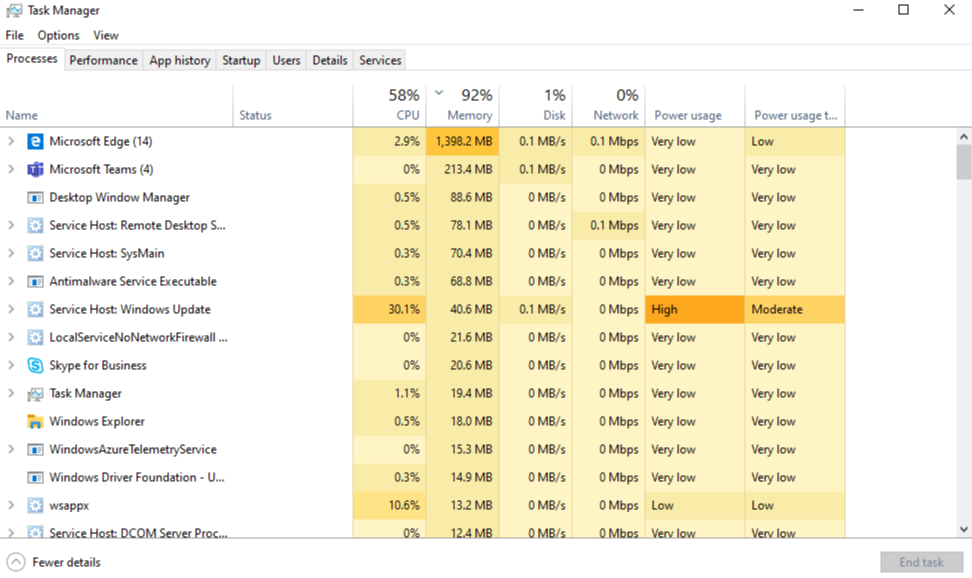

# Microsoft Teams에서 메모리를 사용하는 방법

일부 Microsoft 팀 사용자는 팀에서 메모리를 사용 하는 방법에 대 한 질문이 있습니다. 이 문서에서는 팀에서 메모리를 사용 하는 방법과 팀 데스크톱 응용 프로그램 (앱)과 팀 웹 앱이 동일한 컴퓨터의 다른 앱과 작업을 최적화 하는 데 메모리가 충분 하지 않은 이유를 설명 합니다. 팀은 최신 웹 기술을 사용 하도록 설계 되었습니다. 이를 위해 팀 데스크톱 클라이언트는 Chromium를 사용 하 여 렌더링 하는 전자로 개발 되었습니다. 이는 Edge 및 Chrome을 비롯 하 여 오늘날 가장 인기 있는 브라우저의 렌더링 엔진의 수와 동일 합니다.

## 팀의 작동 방식

전자를 사용 하는 팀은 더 빠른 개발을 위해 다양 한 운영 체제 (Windows, Mac 및 Linux)에서 팀 버전 간의 패리티가 유지 됩니다. 이 패리티는 전자와 Chromium 모든 버전에서 유사한 코드 베이스를 유지 하기 때문에 가능 합니다. 이 아키텍처의 또 다른 장점은 팀 web app과 데스크톱 버전 사이에 비슷한 메모리 사용 프로필을 제공 하는 것입니다. 웹 앱과 데스크톱 버전 모두 브라우저에서 사용 하는 것과 비슷한 방식으로 메모리를 사용 합니다. 전자 메일에 대 한 자세한 내용은 [해당 웹 사이트](https://electronjs.org/)에서 확인할 수 있습니다.

자세한 내용은 [Chrome 메모리의](https://chromium.googlesource.com/chromium/src.git/+/master/docs/memory/key_concepts.md) [메모리 사용](https://www.chromium.org/developers/memory-usage-backgrounder) 및 키 개념 Chromium을 참조 하세요.

다음 이미지는 Windows 용 팀 데스크톱 앱 및 팀 웹 앱 (이 예제에서는 Google Chrome에서 실행 됨)의 병렬 메모리 사용을 보여 줍니다.

## 팀의 메모리 사용

시스템 메모리가 제공 되는 경우 팀의 *예상* 동작을 이해 하 고 실제로 문제가 있는 시스템 메모리 문제의 증상을 파악 하는 것이 중요 합니다.

### 팀의 메모리 사용량 예상

팀 데스크톱 앱 또는 팀 웹 앱을 실행 하 고 있는지 여부 Chromium는 사용 가능한 시스템 메모리의 양을 감지 하 고 해당 메모리를 충분히 활용 하 여 렌더링 환경을 최적화 합니다. 다른 앱 또는 서비스에 시스템 메모리가 필요한 경우 Chromium는 해당 프로세스에 메모리를 제공 합니다. 현재 실행 중인 모든 작업에 영향을 주지 않고 팀 성과를 최적화 하기 위해 팀 메모리 사용량을 지속적으로 Chromium 조정 합니다.

이런 방법으로, 비슷한 Chromium 작업은 사용 가능한 시스템 메모리의 양에 따라 다양 한 양의 메모리를 활용할 수 있습니다.

다음 그래프는 각각 서로 다른 메모리 용량을 사용 하는 4 개의 개별 시스템에서 메모리 사용량을 보여 줍니다. 각 시스템은 유사한 작업을 처리 합니다 (동일한 앱을 열고 실행 중).

컴퓨터에 메모리가 더 있으면 팀에서 해당 메모리를 사용 합니다. 메모리가 부족 한 시스템에서 팀은 덜 사용 합니다. 

### 시스템 메모리 문제 증상

컴퓨터에 다음 중 하나 이상의 증상이 표시 되는 경우 심각한 시스템 메모리 문제가 발생할 수 있습니다.

- 대용량 응용 프로그램을 여러 개 동시에 실행 하는 경우에는 고위 메모리를 사용 합니다.
- 시스템 성능이 느려지거나 응용 프로그램이 중단 됩니다.
- 모든 앱에서 90% 이상의 전체 시스템 메모리 사용량을 지속적으로 유지 합니다. 이 메모리 사용량을 통해 팀은 다른 앱과 작업 부하에 메모리를 다시 제공 해야 합니다. 90%의 지속적인 메모리 사용은 팀에 메모리가 시스템에 다시 제공 되지 않고 문제가 있음을 의미 합니다.

다음 이미지는 시스템 메모리 사용량이 비정상적으로 높을 때 작업 관리자의 보기의 예를 보여 줍니다.

