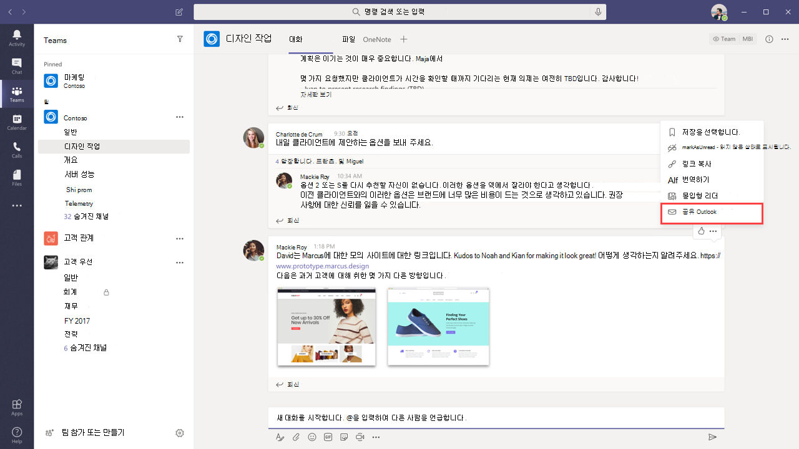

# Teams Outlook 통합

Microsoft Teams 조직의 사용자가 전자 메일에서 전자 메일과 채팅 또는 채널 대화 간에 정보를 Outlook 쉽게 공유할 수 있는 Teams 기능이 포함되어 있습니다. 이 문서에서는 이러한 기능 및 적용되는 관리자 컨트롤에 대한 개요를 제공합니다.

## 공유 Outlook

**공유를 Outlook** 사용자가 대화의 복사본을 Teams 전자 메일에 Outlook 공유할 Teams. 이 기능은 사용자가 직접 팀 외부 또는 조직 외부 사용자와 대화 또는 상태 업데이트를 공유해야 하는 경우 매우 편리한 기능입니다. 대화 맨 위로 이동하여 추가 Teams 옵션을 ̇ ̇ ̇ 선택한 다음 공유를 **선택하여** Outlook.****  자세한 내용은 공유를 참조[하여 Outlook Teams](https://support.office.com/article/share-to-outlook-from-teams-f9dabbe9-9e9b-4e35-99dd-2eeeb67c4f6d).

이 기능을 사용하려면 웹용 Outlook 설정해야 합니다. 웹용 Outlook 해제된 경우 사용자에 Outlook 공유 옵션이 Teams  표시되지 않습니다. 사서함을 켜고 끄는 방법에 대한 웹용 Outlook 사서함에 대한 웹용 Outlook [를 참조하세요](/exchange/recipients-in-exchange-online/manage-user-mailboxes/enable-or-disable-outlook-web-app).

## 실행 가능한 활동 전자 메일

사용자는 자동으로 실행 가능한 부재 중 작업 전자 메일을 수신하여 사용자들이 부재 중 대화를 추적하는 데 도움이 Teams. 누락된 활동 전자 메일은 부재 중 메시지 후에 전송된 메시지를 포함하여 대화의 최신 회신을 표시하고 사용자가 회신을 클릭하여 대화 내에서 직접 응답  할 수 Outlook. 자세한 내용은 계정에서 누락[된 활동 전자](https://support.office.com/article/reply-to-missed-activity-emails-from-outlook-bc0cf587-db26-4946-aac7-8eebd84f1381) 메일에 회신을 Outlook. 

> [!NOTE]
> 이 기능은 Mac용 또는 일부 Outlook 버전에서 지원되지 Outlook Windows. 자세한 내용은 그룹 및 그룹에서 실행 가능한 Outlook [Office 365 참조하세요](/outlook/actionable-messages/).

**SmtpActionableMessagesEnabled** 매개 변수와 함께 [Set-OrganizationConfig](/powershell/module/exchange/organization/set-organizationconfig) cmdlet을 사용하여 실행 가능한 전자 메일을 해제할 수 있습니다. 기본적으로 **SmtpActionableMessagesEnabled** 매개 변수는 true로 **설정됩니다**. 매개 변수를 **false로 설정하면** 실행 가능한 전자 메일 메시지를 Office 365. Teams 사용자의 경우 부재 중 작업 전자 메일에서  Outlook 응답 옵션을 사용할 수 없습니다. 대신 누락된 활동 전자 메일에는 사용자가 Teams 회신  할 수 있는 회신 옵션이 Teams.

그룹 및 그룹에서 Outlook [Office 365 참조합니다](/outlook/actionable-messages/).
