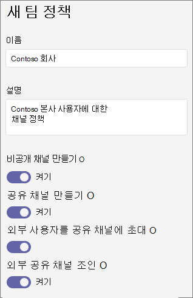

# <a name="manage-teams-policies-in-microsoft-teams"></a>Microsoft 팀에서 팀 정책 관리

관리자는 Microsoft 팀에서 팀 정책을 사용 하 여 팀과 채널에서 조직의 사용자가 수행할 수 있는 작업을 제어할 수 있습니다. 예를 들어 사용자가 검색 결과 및 팀 갤러리에서 비공개 팀을 검색 하도록 허용할지 여부와 사용자가 개인 채널을 만들 수 있도록 허용 하도록 설정할 수 있습니다.

Microsoft 팀 관리 센터에서 **팀** > **팀 정책** 으로 이동해 서 팀 정책을 관리할 수 있습니다. 전역 (조직 차원의 기본) 정책을 사용 하거나 사용자 지정 정책을 만들어 사용자에 게 할당할 수 있습니다. 사용자 지정 정책을 만들고 할당 하지 않으면 조직의 사용자가 자동으로 전역 정책을 받습니다.

전역 정책을 편집 하거나 사용자 지정 정책을 만들고 할당할 수 있습니다. 사용자가 사용자 지정 정책을 할당 한 경우 해당 정책이 사용자에 게 적용 됩니다. 사용자가 사용자 지정 정책을 할당 하지 않으면 전역 정책이 사용자에 게 적용 됩니다. 전역 정책을 편집 하거나 정책을 할당 한 후 변경 내용이 적용 되는 데 최대 24 시간이 걸릴 수 있습니다.

## <a name="create-a-custom-teams-policy"></a>사용자 지정 팀 정책 만들기

1. Microsoft 팀 관리 센터의 왼쪽 탐색 창에서 **팀** > **팀 정책**으로 이동 합니다.
2. **추가**를 클릭 합니다.
3. 정책의 이름 및 설명을 입력 합니다.

    
4. 원하는 설정을 선택 합니다.

- [**개인 팀**](https://docs.microsoft.com/MicrosoftTeams/teams-policies#discoverteams)검색:이 설정을 사용 하면 사용자가 검색 결과 및 팀 갤러리에서 비공개 팀을 검색할 수 있습니다.
- [**개인 채널 만들기**](https://docs.microsoft.com/MicrosoftTeams/teams-policies#createchannels):이 설정을 사용 하면 사용자가 개인 채널을 만들 수 있습니다.

5. **저장**을 클릭 합니다.

## <a name="edit-a-teams-policy"></a>팀 정책 편집

만든 전역 정책 또는 사용자 지정 정책을 편집할 수 있습니다.

1. Microsoft 팀 관리 센터의 왼쪽 탐색 창에서 **팀** > **팀 정책**으로 이동 합니다.
2. 정책 이름 왼쪽을 클릭 하 여 정책을 선택한 다음 **편집**을 클릭 합니다.
3. 원하는 설정을 켜거나 끈 다음 **저장**을 클릭 합니다.

## <a name="assign-a-custom-teams-policy-to-users"></a>사용자에 게 사용자 지정 팀 정책 할당

Microsoft 팀 관리 센터를 사용 하 여 한 명 이상의 사용자 또는 비즈니스용 Skype PowerShell 모듈에 사용자 지정 정책을 할당 하 여 보안 그룹 또는 메일 그룹과 같은 사용자 그룹에 사용자 지정 정책을 할당할 수 있습니다.

### <a name="assign-a-custom-teams-policy-to-a-user"></a>사용자에 게 사용자 지정 팀 정책 할당

1. Microsoft 팀 관리 센터의 왼쪽 탐색 창에서 **사용자**로 이동한 다음 사용자를 클릭 합니다.
2. **정책을**클릭 한 다음 **할당 된 정책**옆에 있는 **편집**을 클릭 합니다.
3. **팀 정책**에서 할당 하려는 정책을 선택한 다음 **저장**을 클릭 합니다.

사용자 지정 팀 정책을 한 번에 여러 사용자에 게 할당 하려면 [팀 사용자 설정을 일괄적으로 편집](edit-user-settings-in-bulk.md)을 참조 하세요.

또는 다음을 수행할 수도 있습니다.

1. Microsoft 팀 관리 센터의 왼쪽 탐색 창에서 **팀** > **팀 정책**으로 이동 합니다.
2. 정책 이름 왼쪽에 있는을 클릭 하 여 정책을 선택 합니다.
3. **사용자 관리**를 선택 합니다.
4. **사용자 관리** 창에서 표시 이름 또는 사용자 이름을 사용 하 여 사용자를 검색 하 고 이름을 선택한 다음 **추가**를 선택 합니다. 추가 하려는 각 사용자에 대해이 단계를 반복 합니다.
5. 사용자 추가를 마쳤으면 **저장**을 클릭 합니다.

### <a name="assign-a-custom-teams-policy-to-users-in-a-group"></a>그룹의 사용자에 게 사용자 지정 팀 정책 할당

이미 식별 한 여러 사용자에 게 사용자 지정 팀 정책을 할당 하려고 할 수 있습니다. 예를 들어 보안 그룹의 모든 사용자에 게 정책을 할당 하려고 할 수 있습니다. 그래프 모듈의 Azure Active Directory PowerShell 및 비즈니스용 Skype PowerShell 모듈에 연결 하 여이 작업을 수행할 수 있습니다. PowerShell을 사용 하 여 팀을 관리 하는 방법에 대 한 자세한 내용은 [팀 Powershell 개요](teams-powershell-overview.md)를 참조 하세요.

이 예제에서는 마케팅 팀 정책 이라는 팀 정책을 Contoso 마케팅 그룹의 모든 사용자에 게 할당 합니다.  

> [!NOTE]
> 먼저 [단일 Windows powershell 창에서 모든 Office 365 서비스에 연결](https://docs.microsoft.com/office365/enterprise/powershell/connect-to-all-office-365-services-in-a-single-windows-powershell-window)의 단계를 따라 Graph 모듈 및 비즈니스용 Skype powershell 모듈에 대 한 Azure Active Directory powershell에 연결 해야 합니다.

특정 그룹의 GroupObjectId를 가져옵니다.
```
$group = Get-AzureADGroup -SearchString "Contoso Marketing"
```
지정 된 그룹의 구성원을 가져옵니다.
```
$members = Get-AzureADGroupMember -ObjectId $group.ObjectId -All $true | Where-Object {$_.ObjectType -eq "User"}
```
특정 팀 정책에 그룹의 모든 사용자를 할당 합니다. 이 예제에서는 마케팅 팀 정책입니다.
```
$members | ForEach-Object { Grant-CsTeamsChannelsPolicy -PolicyName "Marketing Teams Policy" -Identity $_.EmailAddress}
``` 
그룹의 구성원 수에 따라이 명령을 실행 하는 데 몇 분 정도 걸릴 수 있습니다.

## <a name="related-topics"></a>관련 항목

- [팀에서 비공개 팀의 검색 관리](manage-discovery-of-private-teams.md)
