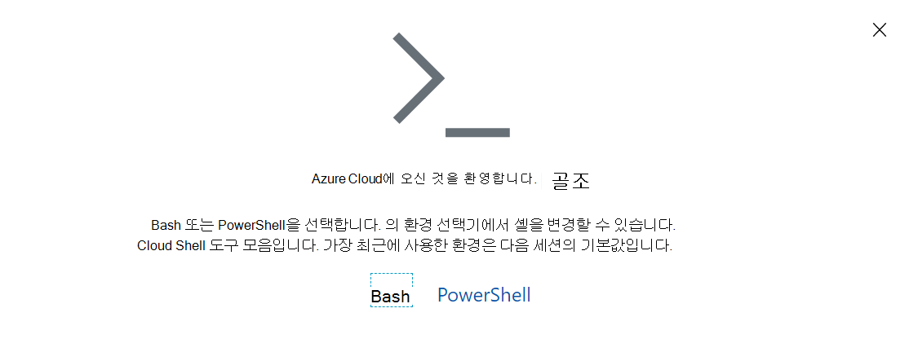

# <a name="manage-teams-with-microsoft-teams-powershell"></a>Microsoft Teams PowerShell을 사용하여 Teams 관리

이 문서에서는 Microsoft Teams PowerShell을 사용하여 Teams 및 비즈니스용 Skype 관리하는 방법을 보여줍니다.

[Microsoft Teams cmdlet 참조](/powershell/teams/?view=teams-ps) 및 [비즈니스용 Skype cmdlet 참조](/powershell/skype/intro?view=skype-ps)와 함께 이 지침을 사용합니다.

Teams 관리 센터에서 Teams를 관리하려면 [Azure Cloud Shell 사용하여 Teams 관리를](#manage-teams-with-azure-cloud-shell) 참조하세요.

## <a name="create-and-manage-teams-using-powershell"></a>PowerShell을 사용하여 팀 만들기 및 관리

팀을 만들고 관리하기 위한 cmdlet은 [Microsoft Teams PowerShell 모듈](https://www.powershellgallery.com/packages/MicrosoftTeams/)에 있습니다.

팀은 Office 365 그룹에서 지원되므로 팀을 만들 때 그룹을 만듭니다. 핵심 팀 및 해당 설정(, ``get-team``, ), 팀 사용자 관리(``new-team``, ) 및 팀의 채널 관리용 ``remove-teamuser````add-teamuser``cmdlet(``new-teamchannel``, ``remove-teamchannel``)에서 작동하기 위해 제공되는 cmdlet 집합이 ``set-team``있습니다. 이러한 cmdlet은 모두 최종 사용자로 실행할 수 있지만 사용자가 소유하거나 구성원인 팀에서만 작동합니다. 글로벌 관리 또는 Teams 관리자인 경우 조직의 모든 팀에서 작업할 수 있습니다.

```powershell
New-Team -DisplayName "Contoso Marketing" -Description "Collaboration space for Contoso's Marketing department"
```

> [!NOTE]
> Microsoft Teams PowerShell 모듈 cmdlet에 사용되는 **GroupId** 는 Exchange PowerShell 모듈에서 반환된 ``Get-UnifiedGroup`` **ID** 속성과 동일합니다.

## <a name="manage-teams-with-azure-cloud-shell"></a>Azure Cloud Shell 사용하여 Teams 관리

Cloud Shell 리소스를 관리할 수 있는 대화형 인증된 브라우저 액세스 가능 셸입니다. Cloud Shell 대한 자세한 내용은 [Azure Cloud Shell](/azure/cloud-shell/overview) 참조하세요.

Azure Cloud Shell 액세스하고 PowerShell을 사용하여 Teams를 관리하려면 Teams 관리 센터에 로그인합니다.

1. 오른쪽 위 모서리에서 Cloud Shell 아이콘을 선택합니다.

    

1. 메시지가 표시되면 **PowerShell** 을 선택합니다.

    

1. 다음 명령을 실행하여 Teams PowerShell 세션을 시작합니다.

    ```powershell
    Connect-MicrosoftTeams
    ```

이러한 단계를 완료하면 Teams PowerShell 명령을 실행할 준비가 된 것입니다.

> [!IMPORTANT]
> Cs* cmdlet을 사용하려면 먼저 명령을 사용하여 ``Connect-MicrosoftTeams -UseDeviceAuthentication`` Teams에 연결해야 합니다.

## <a name="manage-policies-via-powershell"></a>PowerShell을 통해 정책 관리

> [!NOTE]
> - 비즈니스용 Skype Online 커넥터는 Teams PowerShell에 통합됩니다. Teams에 적용되는 비즈니스용 Skype Online cmdlet은 기본적으로 Teams PowerShell 모듈에서 사용할 수 있습니다. 설치 단계는 [Teams PowerShell 설치](teams-powershell-install.md) 문서에서 사용할 수 있습니다.
> - Teams에 연결하면 PowerShell 세션에서 cmdlet을 사용할 수 있습니다. 자세한 내용은 [Office 365 PowerShell을 사용하여 비즈니스용 Skype Online 관리를](/office365/enterprise/powershell/manage-skype-for-business-online-with-office-365-powershell) 참조하세요.

[비즈니스용 Skype cmdlet 모듈](/powershell/module/teams)에서 정책을 관리하기 위한 cmdlet을 찾습니다.

정책은 개별 사용자에게 세분적으로 적용할 수 있는 설정 그룹입니다. 각 정책 유형에는 정책 자체를 만들고, 보고, 삭제하고, 업데이트한 다음, 해당 정책을 사용자에게 할당하기 위한 고유한 cmdlet 집합이 있습니다. 일반적인 구조는 다음과 같습니다.

- **GET** 명령(예 ``Get-CsTeamsMeetingPolicy``: ): Microsoft에서 만든 정책과 만든 사용자 지정 정책을 포함하여 조직에서 할당할 수 있는 정책 문서를 반환합니다.
  - 조직에서 만든 사용자 지정 정책만 찾으려면 다음을 사용합니다 ``-Filter "tag:*"``.

- **새** 명령(예 ``New-CsTeamsMeetingPolicy``: ): 조직의 사용자에게 할당할 조직에 대한 새 정책을 만듭니다. 모든 정책이 사용자 지정 정책 만들기를 지원하는 것은 아닙니다. 조직에서 사용하는 정책에 지원되는 설정 조합이 있는지 확인하는 경우가 많습니다.

- **SET** 명령(예 ``Set-CsTeamsMeetingPolicy``: ): 지정된 정책의 특정 값을 설정합니다. 일부 정책에는 SET 명령을 사용할 수 없거나 정책에서 사용자 지정할 수 없는 매개 변수가 포함되어 있습니다. PowerShell 설명은 사용자 지정할 수 없는 매개 변수를 알려줍니다.
  - 사용자 지정 정책이 할당되지 않은 조직의 사용자에게 기본적으로 할당되는 정책을 편집하려면 다음을 실행 ``Set-Cs<PolicyName> -Identity Global``합니다.

- **REMOVE** 명령(예 ``Remove-CsTeamsMeetingPolicy``: ): 테넌트에서 만든 사용자 지정 정책을 삭제합니다. 조직에서 하나 이상의 사용자에게 할당된 사용자 지정 정책을 삭제하면 해당 사용자는 전역 정책으로 대체됩니다.
  - 조직에서 전역 정책을 실제로 제거할 수는 없지만 조직의 전역 정책을 Microsoft에서 제공하는 기본 설정으로 다시 설정하려면 실행 ``Remove-Cs<PolicyName> -Identity Global``합니다.

- **GRANT** 명령(예 ``Grant-CsTeamsMeetingPolicy``: ): 특정 사용자에게 정책을 할당합니다.
  - 사용자 지정 정책 할당을 제거하고 사용자가 조직의 기본 정책으로 대체되도록 하려면 다음을 실행 ``Grant-Cs<PolicyName> -Identity <User Identity> -PolicyName $null``합니다.

> [!TIP]
> 모든 정책에서 사용자 지정 정책을 만들 수 있는 것은 아니며, 일부 정책에는 사용자 지정할 수 없는 설정이 있습니다(설정을 볼 수 있지만 그 동안 ``set-`` 에는 ``new-``사용자 지정 값을 설정할 수 없음). 각 cmdlet에 대한 설명서에서는 고객이 매개 변수를 사용할 수 있는지 여부를 설명합니다.

일반적인 매개 변수:

- **ID**: Id ``Get-````Remove-````Set-````New-``**매개 변수** 는 항상 특정 정책 인스턴스를 참조합니다. 의 경우 ``Grant``**Identity** 매개 변수는 정책이 적용되는 특정 사용자 개체를 나타냅니다.

## <a name="manage-configurations-via-powershell"></a>PowerShell을 통해 구성 관리

비즈니스용 Skype cmdlet 모듈에서 구성을 관리하기 위한 [cmdlet](/powershell/module/skype)을 찾습니다.

구성은 사용자 수준에서 지정할 수 없는 서비스에서 유지 관리되는 설정의 버킷입니다. 설정은 항상 전체 조직에서 적용됩니다. 글로벌 구성은 조직에서 유일하게 효과적인 구성입니다. 각 구성 유형에는 두 개의 기본 cmdlet이 함께 제공됩니다.

- ``Get-Cs<ConfigurationName>`` (예: ``Get-CsTeamsClientConfiguration``):

- SET 명령(예 ``Set-CsTeamsClientConfiguration``: ): 해당 형식의 구성에서 속성을 설정합니다. 수정할 매개 변수를 지정합니다.
    > [!NOTE]
    > -**Identity Global** 을 지정하거나 실행하는 두 가지 방법 중 하나로 수정하는 구성을 참조할 수 있습니다 ``Get-Cs<ConfigurationName>`` | ``Set-Cs<ConfigurationName>``.

## <a name="what-can-each-admin-role-do"></a>각 관리자 역할은 무엇을 할 수 있나요?

[Microsoft Teams 관리자 역할을 사용하여 Teams를 관리하여](using-admin-roles.md) 각 PowerShell cmdlet을 실행할 수 있는 관리자 역할을 이해합니다.

## <a name="related-topics"></a>관련 주제

[Teams PowerShell 설치](teams-powershell-install.md)

[Teams PowerShell 릴리스 정보](teams-powershell-release-notes.md)

[Teams cmdlet 참조](/powershell/teams/?view=teams-ps)

[비즈니스용 Skype cmdlet 참조](/powershell/skype/intro?view=skype-ps)

[Teams 관리자 역할을 사용하여 Teams를 관리](using-admin-roles.md)
