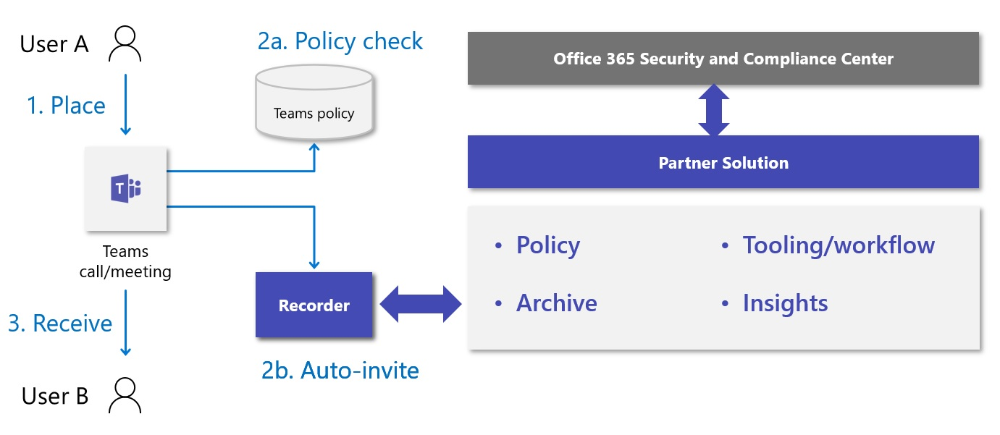

# <a name="introduction-to-teams-policy-based-recording-for-callings--meetings"></a><span data-ttu-id="35331-103">모임에서 전화를 걸 수 있는 Teams 정책 기반 & 소개</span><span class="sxs-lookup"><span data-stu-id="35331-103">Introduction to Teams policy-based recording for callings & meetings</span></span>

<span data-ttu-id="35331-104">정책 기반 기록을 사용하면 통화 및 온라인 모임을 관련 회사 또는 규정 정책에 따라 후속 처리 및 보존을 위해 자동으로 기록되고 캡처될 때 관리 정책을 사용하여 통화 및 모임에 대해 Microsoft Teams를 채택할 수 있습니다.</span><span class="sxs-lookup"><span data-stu-id="35331-104">Policy-based recording enables organizations that adopt Microsoft Teams for calling and meetings to stipulate, using an administrative policy, when calls and online meetings should be automatically recorded and captured for subsequent processing and retention as required by relevant corporate or regulatory policy.</span></span>

<span data-ttu-id="35331-105">Teams는 Teams 통신을 구성, 관리, 기록, 저장 및 분석하기 위한 종단 간 솔루션을 제공하는 데 필요한 플랫폼 기능, 사용자 환경 및 관리 인터페이스를 포함하여 타사 녹음 솔루션의 통합을 지원하도록 향상되었습니다.</span><span class="sxs-lookup"><span data-stu-id="35331-105">Teams has been enhanced to support integration of third-party recording solutions, including the platform functionality, user experiences, and administrative interfaces needed to provide an end-to-end solution for configuring, managing, recording, storing, and analyzing Teams communications.</span></span> <span data-ttu-id="35331-106">향상된 기능으로는 통신 플랫폼 API 및 기록을 위한 이벤트가 포함됩니다. 이 기능은 다음과 같습니다.</span><span class="sxs-lookup"><span data-stu-id="35331-106">Enhancements include communications platform APIs and events for recording, which provides:</span></span>

- <span data-ttu-id="35331-107">오디오, 비디오, 화면 공유 및 채팅에 지원되는 모든 엔드포인트와 장치 전반에 걸쳐 원활하고 고품질의 미디어 캡처를 제공합니다.</span><span class="sxs-lookup"><span data-stu-id="35331-107">Seamless, high-quality media capture across devices and all   supported endpoints for audio, video, screen share, and chat.</span></span>

- <span data-ttu-id="35331-108">Teams 사용자와 지원되는 통화 엔드포인트(Teams, Teams Mobile, 비즈니스용 Skype, PSTN) 간의 상호 작용 캡처 지원</span><span class="sxs-lookup"><span data-stu-id="35331-108">Support for interaction capture between Teams users and supported   calling endpoints (Teams, Teams Mobile, Skype for Business, PSTN)</span></span>

- <span data-ttu-id="35331-109">기존 Teams 관리 통화 및 모임 도구 및 정책과의 통합을 포함하여 규정 준수 기록을 위한 새로운 관리 정책</span><span class="sxs-lookup"><span data-stu-id="35331-109">New administrative policies for compliance recording, including   integration with existing Teams administrative calling and   meeting tools and policies</span></span>

<span data-ttu-id="35331-110">Microsoft 365 A3/A5/E3/E5/Business Premium 및 Office 365 A3/A5/E3/E5 사용자에서 규정 준수 기록을 사용하도록 설정될 수 있습니다.</span><span class="sxs-lookup"><span data-stu-id="35331-110">Compliance Recording can be enabled on Microsoft 365 A3/A5/E3/E5/Business Premium and Office 365 A3/A5/E3/E5 users.</span></span> 

<span data-ttu-id="35331-111">준수 기록 솔루션 통합 기능도 준수 기록 및 Microsoft Teams 세션의 Ignite 2019에서 [<span class="underline">검토했습니다.</span>](https://myignite.microsoft.com/archives/IG19-VCE40)</span><span class="sxs-lookup"><span data-stu-id="35331-111">The compliance recording solution integration capabilities were also reviewed at Ignite 2019 in the [<span class="underline">Compliance Recording and Microsoft Teams session</span>](https://myignite.microsoft.com/archives/IG19-VCE40).</span></span>

## <a name="teams-interaction-recording-overview"></a><span data-ttu-id="35331-112">Teams 상호 작용 기록 개요</span><span class="sxs-lookup"><span data-stu-id="35331-112">Teams interaction recording overview</span></span>

<span data-ttu-id="35331-113">상호 작용 기록 사용 사례는 이미지와 같이 편의성, 기능, 조직 및 법적인 가로채기 등 기록 기능의 네 가지 주요 범주로 효과적으로 구분할 수 있습니다.</span><span class="sxs-lookup"><span data-stu-id="35331-113">Interaction recording use cases can effectively be separated into four primary categories of recording functionality – Convenience, Functional, Organizational, and Lawful Intercept, as shown in the image:</span></span>

<span data-ttu-id="35331-114"></span><span class="sxs-lookup"><span data-stu-id="35331-114"></span></span>

<span data-ttu-id="35331-115">각 범주에는 기록이 시작되는 방법, 기록되는 항목, 기록이 저장되는 위치, 알림을 누가, 액세스를 제어하는 사용자 및 보존 처리 방법에 대한 다양한 요구 사항이 수반됩니다.</span><span class="sxs-lookup"><span data-stu-id="35331-115">Each of the categories entails different requirements for how recordings are initiated, what is recorded, where recordings are stored, who is notified, who controls access, and how retention is handled.</span></span>

| <span data-ttu-id="35331-116">유형</span><span class="sxs-lookup"><span data-stu-id="35331-116">Type</span></span>                   | <span data-ttu-id="35331-117">편의성(일반 팀 녹화)</span><span class="sxs-lookup"><span data-stu-id="35331-117">Convenience (Regular Teams Recording)</span></span> | <span data-ttu-id="35331-118">Org - 규제(규정 준수 기록)</span><span class="sxs-lookup"><span data-stu-id="35331-118">Org - Regulated (Compliance Recording)</span></span> |
| ---------------------- | ------------------ | --------------- |
| <span data-ttu-id="35331-119">초기자</span><span class="sxs-lookup"><span data-stu-id="35331-119">Initiator</span></span>              | <span data-ttu-id="35331-120">사용자</span><span class="sxs-lookup"><span data-stu-id="35331-120">User</span></span>               | <span data-ttu-id="35331-121">관리자(시스템)</span><span class="sxs-lookup"><span data-stu-id="35331-121">Admin (system)</span></span>  |
| <span data-ttu-id="35331-122">대상</span><span class="sxs-lookup"><span data-stu-id="35331-122">Target</span></span>                 | <span data-ttu-id="35331-123">통화당/모임</span><span class="sxs-lookup"><span data-stu-id="35331-123">Per-call / meeting</span></span> | <span data-ttu-id="35331-124">사용자당</span><span class="sxs-lookup"><span data-stu-id="35331-124">Per-user</span></span>        |
| <span data-ttu-id="35331-125">저장소 소유자</span><span class="sxs-lookup"><span data-stu-id="35331-125">Storage owner</span></span>          | <span data-ttu-id="35331-126">사용자</span><span class="sxs-lookup"><span data-stu-id="35331-126">User</span></span>               | <span data-ttu-id="35331-127">규정 준수</span><span class="sxs-lookup"><span data-stu-id="35331-127">Compliance</span></span>      |
| <span data-ttu-id="35331-128">알림이 필요하세요?</span><span class="sxs-lookup"><span data-stu-id="35331-128">Notification required?</span></span> | <span data-ttu-id="35331-129">예</span><span class="sxs-lookup"><span data-stu-id="35331-129">Yes</span></span>                | <span data-ttu-id="35331-130">예</span><span class="sxs-lookup"><span data-stu-id="35331-130">Yes</span></span>             |
| <span data-ttu-id="35331-131">액세스 소유자</span><span class="sxs-lookup"><span data-stu-id="35331-131">Access Owner</span></span>           | <span data-ttu-id="35331-132">사용자</span><span class="sxs-lookup"><span data-stu-id="35331-132">User</span></span>               | <span data-ttu-id="35331-133">규정 준수</span><span class="sxs-lookup"><span data-stu-id="35331-133">Compliance</span></span>      |
| <span data-ttu-id="35331-134">보존 정책이 있나요?</span><span class="sxs-lookup"><span data-stu-id="35331-134">Retention Policy?</span></span>      | <span data-ttu-id="35331-135">선택</span><span class="sxs-lookup"><span data-stu-id="35331-135">Optional</span></span>           | <span data-ttu-id="35331-136">예</span><span class="sxs-lookup"><span data-stu-id="35331-136">Yes</span></span>             |

<span data-ttu-id="35331-137">Teams는 모임 및 [<span class="underline"></span>](https://docs.microsoft.com/microsoftteams/cloud-recording) 라이브 이벤트를 위한 편리하고 기능적인 기록을 위한 다양한 기능을 제공합니다.</span><span class="sxs-lookup"><span data-stu-id="35331-137">Teams provides various capabilities for [<span class="underline">convenient</span>](https://docs.microsoft.com/microsoftteams/cloud-recording) and functional recording for meetings and live events.</span></span> <span data-ttu-id="35331-138">조직 기록은 조직에서 관리 정책을 통해 통화 및 온라인 모임을 관련 회사 또는 규정 정책에 필요한 후속 처리 및 보존을 위해 자동으로 기록되고 캡처될 때 관리 정책을 통해 Teams를 채택할 수 있도록 하는 것입니다.</span><span class="sxs-lookup"><span data-stu-id="35331-138">Organizational recording means enabling organizations adopting Teams for calling and meetings to stipulate, by way of an administrative policy, when calls and online meetings should be automatically recorded and captured for subsequent processing and retention as required by relevant corporate or regulatory policy.</span></span> <span data-ttu-id="35331-139">이 정책의 사용자는 Teams와의 디지털 상호 작용이 기록되고 있지만 기록을 사용하지 않도록 설정할 수 있으며 상호 작용이 완료되면 기록에 액세스할 수 없습니다.</span><span class="sxs-lookup"><span data-stu-id="35331-139">Users under this policy will be aware that their digital interactions with Teams are being recorded but will not be able to disable the recording and will not have access to the recording once the interaction is complete.</span></span> <span data-ttu-id="35331-140">기록은 eDiscovery, 법적 보존 및 기타 회사 보존 사용에 대한 규정 준수 및 법률 담당자가 사용할 수 있는 조직 보관의 일부가 됩니다.</span><span class="sxs-lookup"><span data-stu-id="35331-140">The recording becomes part of the organizational archive available to compliance and legal personnel for eDiscovery, legal hold, and other corporate retention uses.</span></span>

## <a name="example-user-needs"></a><span data-ttu-id="35331-141">예제 사용자 요구</span><span class="sxs-lookup"><span data-stu-id="35331-141">Example user needs</span></span>

<table>
<thead>
<tr class="header">
<th><span data-ttu-id="35331-142"><strong>Persona</strong></span><span class="sxs-lookup"><span data-stu-id="35331-142"><strong>Persona</strong></span></span></th>
<th><span data-ttu-id="35331-143"><strong>요구</strong></span><span class="sxs-lookup"><span data-stu-id="35331-143"><strong>Needs</strong></span></span></th>
</tr>
</thead>
<tbody>
<tr class="odd">
<td><span data-ttu-id="35331-144">기록된 사용자</span><span class="sxs-lookup"><span data-stu-id="35331-144">Recorded users</span></span></td>
<td><ul>
<li><p><span data-ttu-id="35331-145">녹음/녹화가 진행 중일 때 알림을 습니다.</span><span class="sxs-lookup"><span data-stu-id="35331-145">Be notified when recording is in progress.</span></span></p></li>
<li><p><span data-ttu-id="35331-146">정책 및/또는 레코더 오류로 인해 호출 동작이 변경되는 경우 알려야 합니다.</span><span class="sxs-lookup"><span data-stu-id="35331-146">Be informed when policy and/or recorder error is causing changes in calling behavior.</span></span></p></li>
</ul></td>
</tr>
<tr class="even">
<td><span data-ttu-id="35331-147">통신 관리자</span><span class="sxs-lookup"><span data-stu-id="35331-147">Communications admin</span></span></td>
<td><ul>
<li><p><span data-ttu-id="35331-148">Teams 사용자/엔드포인트에 기록 정책을 적용/적용하는 이유와 방법을 이해합니다.</span><span class="sxs-lookup"><span data-stu-id="35331-148">Understand why and how to apply / enforce recording policies to Teams users / endpoints.</span></span></p></li>
<li><p><span data-ttu-id="35331-149">조직에 대한 Teams 기록 정책을 구성하고 유지 관리합니다.</span><span class="sxs-lookup"><span data-stu-id="35331-149">Configure and maintain Teams recording policies for the organization.</span></span></p></li>
<li><p><span data-ttu-id="35331-150">Teams 통화 및 모임에서 기록 관련 문제를 모니터링하고 해결합니다.</span><span class="sxs-lookup"><span data-stu-id="35331-150">Monitor and troubleshoot recording-related issues with Teams calls and meetings.</span></span></p></li>
<li><p><span data-ttu-id="35331-151">사용, 품질 및 안정성에 대한 운영 분석을 통해 내부 규정 준수 담당자를 지원합니다.</span><span class="sxs-lookup"><span data-stu-id="35331-151">Support internal compliance officer with operational analytics on usage, quality, and reliability.</span></span></p></li>
</ul></td>
</tr>
<tr class="odd">
<td><span data-ttu-id="35331-152">규정 준수 책임자</span><span class="sxs-lookup"><span data-stu-id="35331-152">Compliance officer</span></span></td>
<td><ul>
<li><p><span data-ttu-id="35331-153">적절한 지역 경계에서 규정 준수 의무를 충족하는 데 필요한 방식으로 모든 Teams 통신을 수집합니다.</span><span class="sxs-lookup"><span data-stu-id="35331-153">Collect all Teams communications in the manner required to meet compliance obligations in appropriate regional boundaries.</span></span></p></li>
<li><p><span data-ttu-id="35331-154">통신 관련 메타데이터 또는 상호 작용 콘텐츠를 기반으로 상호 작용을 검색합니다.</span><span class="sxs-lookup"><span data-stu-id="35331-154">Search for interactions based on communication-related metadata or interaction content.</span></span> <span data-ttu-id="35331-155">일반적인 예는 다음과 같습니다.</span><span class="sxs-lookup"><span data-stu-id="35331-155">Common examples include:</span></span></p>
<ul>
<li><p><span data-ttu-id="35331-156"><strong>메타데이터</strong> - 참가자, 시간, 방향, 전화 걸기 번호, 원본 번호, 사용자 지정 비즈니스 데이터</span><span class="sxs-lookup"><span data-stu-id="35331-156"><strong>Metadata</strong> - Participants, time, direction, dialed number, origin number, Custom business data</span></span></p></li>
<li><p><span data-ttu-id="35331-157"><strong>콘텐츠</strong> - 전사, 감정, 멘션, 관련 상호 작용</span><span class="sxs-lookup"><span data-stu-id="35331-157"><strong>Content</strong> – Transcription, sentiment, phonetics, related interactions</span></span></p></li>
</ul></li>
<li><p><span data-ttu-id="35331-158">수집되는 상호 작용을 모니터링하는 기능을 포함하여 수집된 통신을 분석하고 상호 작용합니다.</span><span class="sxs-lookup"><span data-stu-id="35331-158">Analyze and interact with collected communications, including the ability to monitor interactions as they are being collected.</span></span></p></li>
<li><p><span data-ttu-id="35331-159">수집된 통신의 보안을 보장하고 모든 단계에서 변조를 방지합니다.</span><span class="sxs-lookup"><span data-stu-id="35331-159">Ensure security of collected communications and prevent tampering at all stages.</span></span></p></li>
</ul></td>
</tr>
</tbody>
</table>

## <a name="solution-architecture-overview"></a><span data-ttu-id="35331-160">솔루션 아키텍처 개요</span><span class="sxs-lookup"><span data-stu-id="35331-160">Solution architecture overview</span></span>

<span data-ttu-id="35331-161">규정 준수 기록 솔루션은 다음 다이어그램과 같이 Teams와 통합됩니다.</span><span class="sxs-lookup"><span data-stu-id="35331-161">Compliance recording solutions are integrated with Teams as shown in the following diagram:</span></span>

<span data-ttu-id="35331-162"></span><span class="sxs-lookup"><span data-stu-id="35331-162"></span></span>

## <a name="recorder"></a><span data-ttu-id="35331-163">레코더</span><span class="sxs-lookup"><span data-stu-id="35331-163">Recorder</span></span>

<span data-ttu-id="35331-164">규정 준수 기록 솔루션의 핵심 구성 요소는 레코더입니다.</span><span class="sxs-lookup"><span data-stu-id="35331-164">The core component of the compliance recording solution is the recorder.</span></span>
<span data-ttu-id="35331-165">레코더는 [<span class="underline">Microsoft의</span>](https://docs.microsoft.com/graph/cloud-communications-concept-overview) 통신 플랫폼을 활용하고 Microsoft Graph에 애플리케이션으로 등록하는 확장성 있는 Azure 기반 서비스(봇)로 구축됩니다.</span><span class="sxs-lookup"><span data-stu-id="35331-165">Recorders are built as scalable Azure-based services (bots) that [<span class="underline">leverage Microsoft’s communications platform</span>](https://docs.microsoft.com/graph/cloud-communications-concept-overview) and register as applications with Microsoft Graph.</span></span> <span data-ttu-id="35331-166">레코더는 Teams 호출 및 모임 통신 플랫폼 [<span class="underline">API와</span>](https://docs.microsoft.com/graph/api/resources/communications-api-overview?view=graph-rest-1.0) 직접 상호 작용하고 미디어를 위해 엔드포인트를 제공합니다.</span><span class="sxs-lookup"><span data-stu-id="35331-166">The recorder provides the direct interaction with the Teams calls and meetings [<span class="underline">communications platform APIs</span>](https://docs.microsoft.com/graph/api/resources/communications-api-overview?view=graph-rest-1.0) and provides the endpoint for media ingestion.</span></span>

<span data-ttu-id="35331-167">[<span class="underline">봇을</span>](https://github.com/microsoftgraph/microsoft-graph-comms-samples/tree/a3943bafd73ce0df780c0e1ac3428e3de13a101f/Samples/BetaSamples/LocalMediaSamples/ComplianceRecordingBot) 구성하고, 앱 인스턴스를 만들고, 규정 준수 정책을 할당하는 방법을 보여주는 샘플 규정 준수 레코더 애플리케이션을 사용할 수 있습니다.</span><span class="sxs-lookup"><span data-stu-id="35331-167">A [<span class="underline">sample compliance recorder application is available</span>](https://github.com/microsoftgraph/microsoft-graph-comms-samples/tree/a3943bafd73ce0df780c0e1ac3428e3de13a101f/Samples/BetaSamples/LocalMediaSamples/ComplianceRecordingBot) that shows how to configure the bot, create the app instance and assign the compliance policies.</span></span> <span data-ttu-id="35331-168">또한 샘플에는 들어오는 호출 라우팅 [<span class="underline">처리,</span>](https://github.com/microsoftgraph/microsoft-graph-comms-samples/blob/a3943bafd73ce0df780c0e1ac3428e3de13a101f/Samples/BetaSamples/LocalMediaSamples/ComplianceRecordingBot/FrontEnd/Bot/CallHandler.cs#L135-L138)기록 [<span class="underline"></span>](https://github.com/microsoftgraph/microsoft-graph-comms-samples/blob/a3943bafd73ce0df780c0e1ac3428e3de13a101f/Samples/BetaSamples/LocalMediaSamples/ComplianceRecordingBot/FrontEnd/Http/Controllers/PlatformCallController.cs#L199-L244) 상태 변경 및 기록되는 사용자 제거와 같은 특정 상호 작용을 기록하기 위한 API 사용에 대한 예제도 [<span class="underline">있습니다.</span>](https://github.com/microsoftgraph/microsoft-graph-comms-samples/blob/a3943bafd73ce0df780c0e1ac3428e3de13a101f/Samples/BetaSamples/LocalMediaSamples/ComplianceRecordingBot/FrontEnd/Bot/CallHandler.cs#L121-L126)</span><span class="sxs-lookup"><span data-stu-id="35331-168">The sample also has examples on API usage for recording specific interactions such as handling [<span class="underline">incoming call</span>](https://github.com/microsoftgraph/microsoft-graph-comms-samples/blob/a3943bafd73ce0df780c0e1ac3428e3de13a101f/Samples/BetaSamples/LocalMediaSamples/ComplianceRecordingBot/FrontEnd/Http/Controllers/PlatformCallController.cs#L199-L244) routing, [<span class="underline">changing recording states</span>](https://github.com/microsoftgraph/microsoft-graph-comms-samples/blob/a3943bafd73ce0df780c0e1ac3428e3de13a101f/Samples/BetaSamples/LocalMediaSamples/ComplianceRecordingBot/FrontEnd/Bot/CallHandler.cs#L135-L138), and [<span class="underline">removing the user who is being recorded</span>](https://github.com/microsoftgraph/microsoft-graph-comms-samples/blob/a3943bafd73ce0df780c0e1ac3428e3de13a101f/Samples/BetaSamples/LocalMediaSamples/ComplianceRecordingBot/FrontEnd/Bot/CallHandler.cs#L121-L126).</span></span>
<span data-ttu-id="35331-169">특정 API에 대한 그래프 설명서는 [<span class="underline">updateRecordingStatus</span>](https://docs.microsoft.com/graph/api/call-updaterecordingstatus?view=graph-rest-1.0&tabs=http) 및 [<span class="underline">incomingContext에</span>](https://docs.microsoft.com/graph/api/resources/incomingcontext?view=graph-rest-1.0)대한 여기에서 찾을 수 있습니다.</span><span class="sxs-lookup"><span data-stu-id="35331-169">Graph documentation on the specific APIs can be found here for [<span class="underline">updateRecordingStatus</span>](https://docs.microsoft.com/graph/api/call-updaterecordingstatus?view=graph-rest-1.0&tabs=http) and [<span class="underline">incomingContext</span>](https://docs.microsoft.com/graph/api/resources/incomingcontext?view=graph-rest-1.0).</span></span>

<span data-ttu-id="35331-170">레코더 서비스의 정확한 구현은 파트너에 따라 다르지만 Teams에서 레코더로의 대기 시간을 줄이기 위해 배포의 고가용성 및 지리적 분포를 달성하기 위해 여러 레코더를 지원하도록 설계되어야 합니다.</span><span class="sxs-lookup"><span data-stu-id="35331-170">The exact implementation of the recorder service will vary by partner but must be designed to support multiple recorders in order to achieve high availability and geographical distribution of deployment to reduce latency from Teams to the recorder.</span></span> <span data-ttu-id="35331-171">또한 레코더 자체는 탄력성 및 중복성에 유의하여 설계될 것으로 예상됩니다.</span><span class="sxs-lookup"><span data-stu-id="35331-171">In addition, it is expected that Recorders themselves be designed with resiliency and redundancy in mind.</span></span>

<span data-ttu-id="35331-172">파트너는 인증을 위한 솔루션을 제출하기 전에 Microsoft Graph 통신 API 및 SDK의 최소 필수 릴리스 버전을 확인하여 규정 준수 기록 통합의 모든 요구 사항이 지원되도록 해야 합니다.</span><span class="sxs-lookup"><span data-stu-id="35331-172">Partners must confirm the minimum required release version of the Microsoft Graph communications APIs and SDKs with Microsoft before submitting their solution for certification to ensure that all requirements of compliance recording integration are supported.</span></span>

<span data-ttu-id="35331-173">규정 준수 기록 시나리오에 대한 기본 요구 사항은 두 가지입니다.</span><span class="sxs-lookup"><span data-stu-id="35331-173">Two specific requirements that are fundamental for compliance recording scenario are:</span></span>

- <span data-ttu-id="35331-174">Azure에 레코더 봇을 배포해야 합니다.</span><span class="sxs-lookup"><span data-stu-id="35331-174">Recorder bot must be deployed in Azure</span></span>

- <span data-ttu-id="35331-175">Azure의 Windows VM에서 레코더 봇을 실행해야 합니다.</span><span class="sxs-lookup"><span data-stu-id="35331-175">Recorder bot must run on a Windows VM in Azure</span></span>

<span data-ttu-id="35331-176">Azure 및 Windows VM 요구 사항은 Teams 봇 구성 요소에만 적용됩니다. 즉, 파트너가 규정 준수 기록에 대한 관련 성능 및 기능 요구 사항을 충족할 수 있는 경우 파트너가 선택한 나머지 플랫폼을 구현할 수 있습니다.</span><span class="sxs-lookup"><span data-stu-id="35331-176">The Azure and Windows VM requirements only apply to the Teams Bot component, which means that a partner may implement the rest of the platform of their choice provided they can meet the relevant performance and functional requirements for compliance recording.</span></span>

## <a name="compliance-recording-policy-assignment-and-provisioning"></a><span data-ttu-id="35331-177">규정 준수 기록 정책 할당 및 프로비전</span><span class="sxs-lookup"><span data-stu-id="35331-177">Compliance recording policy assignment and provisioning</span></span>

<span data-ttu-id="35331-178">IT 관리자는 규정 준수 기록 정책을 만들고 할당하여 기록할 사용자와 각 사용자에 사용할 레코더를 결정할 수 있습니다.</span><span class="sxs-lookup"><span data-stu-id="35331-178">IT Administrators can determine which users are to be recorded and which recorder will be used for each user, by creating and assigning compliance recording policies.</span></span> <span data-ttu-id="35331-179">통신 상호 작용이 수행될 때 이러한 정책의 구성에 따라 기록기에서 대화에 참여할 수 있습니다.</span><span class="sxs-lookup"><span data-stu-id="35331-179">Recorders are automatically invited to participate in conversations based on the configuration of these policies when a communication interaction takes place.</span></span> <span data-ttu-id="35331-180">규정 준수 기록 정책은 [<span class="underline">Microsoft PowerShell을</span>](https://docs.microsoft.com/microsoftteams/teams-powershell-overview) 사용하여 관리되고 각 조직의 테넌트, 사용자당 및 보안 그룹 수준에서 적용할 수 있습니다.</span><span class="sxs-lookup"><span data-stu-id="35331-180">Compliance recording policies are managed using [<span class="underline">Microsoft PowerShell</span>](https://docs.microsoft.com/microsoftteams/teams-powershell-overview) and can be applied at the tenant, per-user, and security group level for each organization.</span></span> <span data-ttu-id="35331-181">모임 정책, 통화 정책 및 [<span class="underline"></span>](https://docs.microsoft.com/microsoftteams/meeting-policies-in-teams)그룹 정책에 대한 Microsoft Docs에 대한 자세한 [<span class="underline">정보를 찾을 수 있습니다.</span>](https://docs.microsoft.com/microsoftteams/assign-policies#assign-a-policy-to-a-group) [<span class="underline"></span>](https://docs.microsoft.com/microsoftteams/teams-calling-policy)</span><span class="sxs-lookup"><span data-stu-id="35331-181">You can find more information on Microsoft Docs for [<span class="underline">Meeting policies</span>](https://docs.microsoft.com/microsoftteams/meeting-policies-in-teams), [<span class="underline">calling policies</span>](https://docs.microsoft.com/microsoftteams/teams-calling-policy) and  [<span class="underline">group policies</span>](https://docs.microsoft.com/microsoftteams/assign-policies#assign-a-policy-to-a-group).</span></span>

1. <span data-ttu-id="35331-182">테넌트에 애플리케이션 인스턴스를 만들 수 있습니다.</span><span class="sxs-lookup"><span data-stu-id="35331-182">Create an application instance in your tenant.</span></span>

   ```powershell
   PS C:\> New-CsOnlineApplicationInstance -UserPrincipalName cr.instance@contoso.onmicrosoft.com -DisplayName ComplianceRecordingBotInstance -ApplicationId fcc88ff5-a42d-49cf-b3d8-f2e1f609d511

   RunspaceId        : 4c13efa6-77bc-42db-b5bf-bdd62cdfc5df
   ObjectId          : 5069aae5-c451-4983-9e57-9455ced220b7
   TenantId          : 5b943d7c-5e14-474b-8237-5022eb8e0dc9
   UserPrincipalName : cr.instance@contoso.onmicrosoft.com
   ApplicationId     : fcc88ff5-a42d-49cf-b3d8-f2e1f609d511
   DisplayName       : ComplianceRecordingBotInstance
   PhoneNumber       :
   ```

   ```powershell
   PS C:\> Sync-CsOnlineApplicationInstance -ObjectId 5069aae5-c451-4983-9e57-9455ced220b7
   ```

2. <span data-ttu-id="35331-183">규정 준수 기록 정책을 작성합니다.</span><span class="sxs-lookup"><span data-stu-id="35331-183">Create a Compliance Recording policy.</span></span>

   ```powershell
   PS C:\> New-CsTeamsComplianceRecordingPolicy -Identity TestComplianceRecordingPolicy -Enabled $true -Description "Test policy created by tenant admin"

   Identity                        : Global
   ComplianceRecordingApplications : {}
   Enabled                         : True
   WarnUserOnRemoval               : True
   Description                     : Test policy created by tenant admin
   ```

   ```powershell
   PS C:\> Set-CsTeamsComplianceRecordingPolicy -Identity TestComplianceRecordingPolicy `
   -ComplianceRecordingApplications @(New-CsTeamsComplianceRecordingApplication -Id 5069aae5-c451-4983-9e57-9455ced220b7 -Parent TestComplianceRecordingPolicy)
   ```

   [<span data-ttu-id="35331-184"><span class="underline">Set-CsTeamsComplianceRecordingPolicy</span></span><span class="sxs-lookup"><span data-stu-id="35331-184"><span class="underline">Set-CsTeamsComplianceRecordingPolicy</span></span></span>](https://docs.microsoft.com/powershell/module/skype/set-csteamscompliancerecordingpolicy?view=skype-ps)

3. <span data-ttu-id="35331-185">사용자에게 규정 준수 기록 정책을 할당합니다.</span><span class="sxs-lookup"><span data-stu-id="35331-185">Assign the Compliance Recording policy to a user.</span></span>

   ```powershell
   PS C:\> Grant-CsTeamsComplianceRecordingPolicy -Identity testuser@contoso.onmicrosoft.com -PolicyName TestComplianceRecordingPolicy
   ```

   [<span data-ttu-id="35331-186"><span class="underline">Grant-CsTeamsComplianceRecordingPolicy</span></span><span class="sxs-lookup"><span data-stu-id="35331-186"><span class="underline">Grant-CsTeamsComplianceRecordingPolicy</span></span></span>](https://docs.microsoft.com/powershell/module/skype/grant-csteamscompliancerecordingpolicy?view=skype-ps)

   ```powershell
   PS C:\> Get-CsOnlineUser testuser@contoso.onmicrosoft.com | select SipAddress, TenantId, TeamsComplianceRecordingPolicy | fl

   UserPrincipalName              : testuser@contoso.onmicrosoft.com
   TenantId                       : 5b943d7c-5e14-474b-8237-5022eb8e0dc9
   TeamsComplianceRecordingPolicy : TestComplianceRecordingPolicy
   ```

## <a name="user-experiences"></a><span data-ttu-id="35331-187">사용자 환경</span><span class="sxs-lookup"><span data-stu-id="35331-187">User experiences</span></span>

<span data-ttu-id="35331-188">알림에 대한 지원은 Teams 클라이언트 환경을 사용하여 활성화됩니다.</span><span class="sxs-lookup"><span data-stu-id="35331-188">Support for notifications is enabled using the Teams client experiences.</span></span> <span data-ttu-id="35331-189">환경은 시각적 또는 오디오일 수 있습니다.</span><span class="sxs-lookup"><span data-stu-id="35331-189">The experiences can be either visual or audio.</span></span>

<span data-ttu-id="35331-190">**Teams 클라이언트 - 시각적 알림**</span><span class="sxs-lookup"><span data-stu-id="35331-190">**Teams clients - visual notice**</span></span>
- <span data-ttu-id="35331-191">데스크톱/웹</span><span class="sxs-lookup"><span data-stu-id="35331-191">Desktop/web</span></span>
- <span data-ttu-id="35331-192">모바일(iOS/Android)</span><span class="sxs-lookup"><span data-stu-id="35331-192">Mobile (iOS/Android)</span></span>
- <span data-ttu-id="35331-193">Teams 휴대폰</span><span class="sxs-lookup"><span data-stu-id="35331-193">Teams phones</span></span>
- <span data-ttu-id="35331-194">Teams 회의실</span><span class="sxs-lookup"><span data-stu-id="35331-194">Teams rooms</span></span>

<span data-ttu-id="35331-195">**기타 엔드포인트 - 오디오 알림**</span><span class="sxs-lookup"><span data-stu-id="35331-195">**Other endpoints - audio notice**</span></span>
- <span data-ttu-id="35331-196">SIP 휴대폰</span><span class="sxs-lookup"><span data-stu-id="35331-196">SIP phones</span></span>
- <span data-ttu-id="35331-197">비즈니스용 Skype</span><span class="sxs-lookup"><span data-stu-id="35331-197">Skype for Business</span></span>
- <span data-ttu-id="35331-198">오디오 회의</span><span class="sxs-lookup"><span data-stu-id="35331-198">Audio conferencing</span></span>
- <span data-ttu-id="35331-199">PSTN 호출자</span><span class="sxs-lookup"><span data-stu-id="35331-199">PSTN callers</span></span>

## <a name="compliance-recording-for-teams-certification-programs"></a><span data-ttu-id="35331-200">Teams 인증 프로그램에 대한 규정 준수 기록</span><span class="sxs-lookup"><span data-stu-id="35331-200">Compliance recording for Teams certification programs</span></span>

<span data-ttu-id="35331-201">Microsoft는 파트너가 CCaaS 솔루션을 개발하고 Teams와 통합할 수 있는 공개적으로 사용 가능한 API를 게시하는 것 외에도 Microsoft Teams 인증 프로그램에 대한 규정 준수 기록을 개발하여 각 참여 파트너 솔루션이 Microsoft 솔루션에서 기대하는 품질, 호환성 및 안정성을 제공하도록 테스트 및 확인되었습니다.</span><span class="sxs-lookup"><span data-stu-id="35331-201">In addition to publishing publicly available APIs allowing partners to develop and integrate CCaaS solutions with Teams, we have developed the compliance recording for Microsoft Teams certification program to provide customers with the assurance that each participating partner’s solution has been tested and verified to provide the quality, compatibility and reliability they expect from Microsoft solutions.</span></span>  

<span data-ttu-id="35331-202">다음 파트너는 Microsoft Teams에 대한 솔루션을 인증했습니다.</span><span class="sxs-lookup"><span data-stu-id="35331-202">The following partners have certified their solution for Microsoft Teams.</span></span>

|<span data-ttu-id="35331-203">파트너</span><span class="sxs-lookup"><span data-stu-id="35331-203">Partner</span></span>|<span data-ttu-id="35331-204">솔루션 웹 사이트</span><span class="sxs-lookup"><span data-stu-id="35331-204">Solution website</span></span> |
|:--|:--|
|<span data-ttu-id="35331-205">ASC 기술</span><span class="sxs-lookup"><span data-stu-id="35331-205">ASC Technologies</span></span> |[https://www.asctechnologies.com/english/ASC_Recording_Insights_Compliance_Recording_for_Microsoft_Teams.html](https://www.asctechnologies.com/english/ASC_Recording_Insights_Compliance_Recording_for_Microsoft_Teams.html) |
|<span data-ttu-id="35331-206">AudioCodes</span><span class="sxs-lookup"><span data-stu-id="35331-206">AudioCodes</span></span> |[https://www.audiocodes.com/solutions-products/voiceai/meetings-and-recording/smarttap-360](https://www.audiocodes.com/solutions-products/voiceai/meetings-and-recording/smarttap-360) |
|<span data-ttu-id="35331-207">더버</span><span class="sxs-lookup"><span data-stu-id="35331-207">Dubber</span></span> |[https://www.dubber.net/call-recording/](https://www.dubber.net/call-recording/) |
|<span data-ttu-id="35331-208">NICE</span><span class="sxs-lookup"><span data-stu-id="35331-208">NICE</span></span> |[https://www.niceactimize.com/compliance/ms-teams-recording.html](https://www.niceactimize.com/compliance/ms-teams-recording.html) |


<span data-ttu-id="35331-209">다음 파트너는 Microsoft Teams에 대한 솔루션을 인증하는 과정에 있습니다.</span><span class="sxs-lookup"><span data-stu-id="35331-209">The following partners are in the process of certifying their solution for Microsoft Teams.</span></span>

|<span data-ttu-id="35331-210">파트너</span><span class="sxs-lookup"><span data-stu-id="35331-210">Partner</span></span>|<span data-ttu-id="35331-211">솔루션 웹 사이트</span><span class="sxs-lookup"><span data-stu-id="35331-211">Solution website</span></span> |
|:--|:--|
|<span data-ttu-id="35331-212">CallCabinet</span><span class="sxs-lookup"><span data-stu-id="35331-212">CallCabinet</span></span> |[https://www.callcabinet.com/compliance-microsoft-teams-call-recording](https://www.callcabinet.com/compliance-microsoft-teams-call-recording ) |
|<span data-ttu-id="35331-213">Landis Technologies</span><span class="sxs-lookup"><span data-stu-id="35331-213">Landis Technologies</span></span> |[https://landistechnologies.com/](https://landistechnologies.com/) |
|<span data-ttu-id="35331-214">Luware</span><span class="sxs-lookup"><span data-stu-id="35331-214">Luware</span></span> |[https://luware.com/en/solution/microsoft-teams-recording/](https://luware.com/en/solution/microsoft-teams-recording/) |
|<span data-ttu-id="35331-215">Numonix</span><span class="sxs-lookup"><span data-stu-id="35331-215">Numonix</span></span> |[https://numonix.cloud](https://numonix.cloud)    |
|<span data-ttu-id="35331-216">Oak Innovation</span><span class="sxs-lookup"><span data-stu-id="35331-216">Oak Innovation</span></span> |[https://www.oakinnovate.com/call-recording](https://www.oakinnovate.com/call-recording) |
|<span data-ttu-id="35331-217">빨간색 상자</span><span class="sxs-lookup"><span data-stu-id="35331-217">Red Box</span></span> |[https://www.redboxvoice.com/compliance-recording-for-microsoft-teams](https://www.redboxvoice.com/compliance-recording-for-microsoft-teams)  |
|<span data-ttu-id="35331-218">Verint</span><span class="sxs-lookup"><span data-stu-id="35331-218">Verint</span></span> |[https://www.verba.com/solutions/microsoft-teams-recording](https://www.verba.com/solutions/microsoft-teams-recording) |

<span data-ttu-id="35331-219">이 목록은 더 많은 파트너가 참가하고 인증 기준을 충족할 때 업데이트됩니다.</span><span class="sxs-lookup"><span data-stu-id="35331-219">This list will be updated as more partners join and meet the certification criteria.</span></span>

## <a name="next-steps"></a><span data-ttu-id="35331-220">다음 단계</span><span class="sxs-lookup"><span data-stu-id="35331-220">Next steps</span></span>

<span data-ttu-id="35331-221">인증 프로그램에 참여하기를 원하는 공급업체인 경우 다음을 메일로 <a href= "mailto:Teamscategorypartner@microsoft.com">Teamscategorypartner@microsoft.com.</a></span><span class="sxs-lookup"><span data-stu-id="35331-221">If you are a vendor seeking to join the certification program, please mail  <a href= "mailto:Teamscategorypartner@microsoft.com">Teamscategorypartner@microsoft.com</a>.</span></span>
