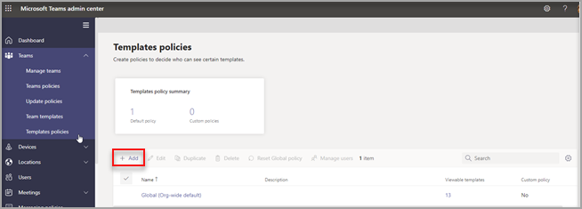
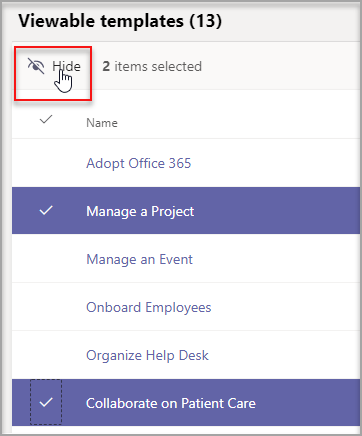
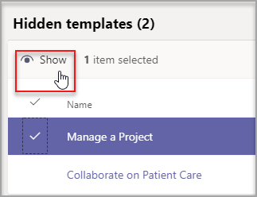

# 관리 센터에서 Teams 템플릿 관리Manage Teams templates in the admin center

관리 센터에서 템플릿 정책을 만들어 최종 사용자가 볼 수 있는 Teams 템플릿을 관리합니다.Manage the Teams templates that your end users see by creating templates policies in the admin center. 각 템플릿 정책 내에서 표시되거나 숨겨진 템플릿을 지정할 수 있습니다.Within each template policy, you can designate which templates are shown or hidden.
사용자가 지정된 Teams 템플릿의 하위 집합만 볼 수 있도록 다른 템플릿 정책에 다른 사용자를 할당합니다.Assign different users to different template policies so that your users view only the subset of Teams templates specified.

템플릿 정책을 관리하는 방법을 알아보는 이 짧은 비디오를 시청합니다.Watch this short video to learn how to manage template policies.

> [!VIDEO https://www.microsoft.com/videoplayer/embed/RWyXL9]

## 템플릿 정책 만들기 및 사용 가능한 템플릿 할당Create template policies and assign available templates

1. Teams 관리 센터에 로그인합니다.Sign in to the Teams admin center.

2. Teams   >  **템플릿 정책을 확장합니다.**Expand **Teams** > **Templates policies**.

3. **추가** 를 선택합니다.Select **Add**.

    

1. 템플릿 **정책 설정 섹션에서** 다음 필드를 완료합니다.In the **Templates Policies Settings** section, complete the following fields:

    - 템플릿 정책 이름Templates Policy name

    - 템플릿 정책 간략한 설명Templates Policy short description

2. 보기 가능한 **템플릿** 테이블에서 숨길 템플릿을 선택하고 숨기기 **를 선택합니다.**In the **Viewable Templates** table, select the templates you want to hide and select **Hide**.

    

    숨겨진 템플릿 테이블에서 숨기기 위해 선택한 **템플릿을 볼 수** 있습니다.You can see the templates you've selected to hide in the **Hidden Templates** table.

1. 특정 템플릿을 숨기지하려면 숨겨진 템플릿 테이블로 **스크롤합니다.**To unhide certain templates, scroll to the **Hidden templates** table.

1. 서식 파일을 선택하여 희미하게 표시를 선택한 다음 **표시를 선택합니다.**Select the templates to unhide, and then select **Show**.

   

   선택한 템플릿이 Viewable 템플릿 **테이블에** 표시됩니다.The selected templates will appear in your **Viewable templates** table.
3. 저장을 **선택합니다.**Select **Save**.

   새 템플릿 정책이 템플릿 정책 목록에 **표시됩니다.**Your new template policy is displayed in the **Templates Policies** list.

## 템플릿 정책에 사용자 할당Assign users to the template policies

정책에 할당된 사용자는 해당 정책 내에서 볼 수 있는 템플릿만 볼 수 있습니다.Users assigned to a policy will only be able to view the viewable templates within that policy.

1. 템플릿 **정책에서** 정책을 선택한 다음 사용자 **관리를 선택합니다.**From **Templates Policies**, select a policy, and then select **Manage users**.

2. 이 정책에 할당할 사용자를 입력합니다.Type the users to assign to this policy.

   

3. 적용 **을 선택합니다.**Select **Apply**.

> [!Note]
> 최종 사용자에게 새 정책이 적용될 경우 최대 24시간이 걸릴 수 있습니다.It might take up to 24 hours for your new policy to take effect for end users.

## 템플릿 정책의 크기 제한Size limits for Template policies

정책당 최대 100개 템플릿을 숨길 수 있습니다.You can hide a max of 100 templates per policy. 주어진 **정책에** 이미 100개 템플릿이 숨겨져 있는 경우 숨기기 단추를 사용하지 않도록 설정됩니다.The **Hide** button is disabled if the given policy already has 100 templates hidden.

## 자주 묻는 질문Frequently asked questions

**Q: 팀 템플릿 정책에 사용자를 일괄 할당할 수 있나요?****Q: Can I batch assign users to team templates policies?**
  
A: 예, PowerShell에서 템플릿 정책에 대한 일괄 처리 할당을 지원합니다.A: Yes, we support batch assignment for template policy in PowerShell. 이 작업의 정책 유형은 TeamsTemplatePermissionPolicy입니다.The policy type for this action is TeamsTemplatePermissionPolicy. [더 알아보세요Learn more](https://docs.microsoft.com/powershell/module/teams/new-csbatchpolicyassignmentoperation)

**Q: 그룹은 팀 템플릿 정책에 할당할 수 있나요?****Q: Can Groups be assigned to team templates policies?**

A: 현재 아니요.A: Currently no. 이 기능은 향후 사용할 수 있습니다.This functionality will be available in the future.

**Q: 새 템플릿이 만들어진 경우 템플릿이 내 정책에 포함되어 있나요?****Q: If a new template is created, will the template be included in my policies?**

A: 새 템플릿은 기본적으로 표시됩니다.A: Any new templates will be visible by default. 템플릿 정책 섹션의 관리 센터에서 템플릿을 숨길 수 있습니다.You can choose to hide the template in the admin center in the Templates Policies section.

**Q: 템플릿이 삭제되면 어떻게 하나요?****Q: What happens if a template is deleted?**

A: 삭제된 템플릿은 더 이상 템플릿 정책에 존재하지 않습니다.A: Any deleted templates will no longer be present in any templates policies.

**Q: Teams 관리 센터의 템플릿 정책에 여러 사용자를 할당할 수 있나요?****Q: Can I assign multiple users to a template policy in the Teams Admin Center?**

A: 예.A: Yes.

1. 관리 센터에서 사용자 으로 **이동합니다.**In the Admin center, go to **Users**.
1. 사용자 목록 테이블에서 특정 템플릿 정책에 할당할 사용자를 선택합니다.In the Users list table, select the users you want to assign to a certain templates policy.
1. 설정 편집을 선택하고 템플릿 정책 필드를 변경합니다.Select Edit settings, and change the Templates policies field.
1. 적용을 선택합니다.Select apply.
   Microsoft Teams에서 사용자에게 정책 할당에 대해 [자세히 알아보기 - Microsoft Teams \| Microsoft Docs](https://docs.microsoft.com/microsoftteams/assign-policies#assign-a-policy-to-a-batch-of-users).Learn more [Assign policies to your users in Microsoft Teams - Microsoft Teams \| Microsoft Docs](https://docs.microsoft.com/microsoftteams/assign-policies#assign-a-policy-to-a-batch-of-users).

**Q: 특정 정책에 할당된 모든 사용자를 어떻게 볼 수 있나요?****Q: How do I view all users assigned to a specific policy?**

A: 관리 센터에서:A: In the Admin center:

1. 사용자 **섹션으로** 이동하세요.Go to the **Users** section.
2. 사용자 목록 테이블에서 필터를 선택하고 팀 템플릿 정책에 대한 필터를 선택합니다.Select the filter in the Users list table and filter for the teams template policy.
3. 적용 **을 선택합니다.**Select **Apply**.

**Q: PowerShell을 통해 템플릿 정책을 관리할 수 있나요?****Q: Can I manage templates policies via PowerShell?**

A: 아니요, PowerShell에서 템플릿 관리는 지원되지 않습니다.A: No, managing templates in PowerShell isn't supported.

**Q: 템플릿 정책이 EDU에 적용 가능한가요?****Q: Are templates policies applicable to EDU?**

A: 아니요, EDU에 대한 템플릿 정책은 지원되지 않습니다.A: No, template policies for EDU isn't supported.

## 관련 항목Related topics

- [관리 센터에서 팀 템플릿 시작Get started with team templates in the admin center](https://docs.microsoft.com/MicrosoftTeams/get-started-with-teams-templates-in-the-admin-console)

- [사용자 지정 팀 템플릿 만들기Create a custom team template](https://docs.microsoft.com/MicrosoftTeams/create-a-team-template)

- [기존 팀에서 템플릿 만들기Create a template from an existing team](https://docs.microsoft.com/MicrosoftTeams/create-template-from-existing-team)

- [기존 팀 템플릿에서 팀 템플릿 만들기Create a team template from an existing team template](https://docs.microsoft.com/MicrosoftTeams/create-template-from-existing-template)

- [Microsoft Teams의 사용자에게 정책 할당 - Microsoft Teams \| Microsoft DocsAssign policies to your users in Microsoft Teams - Microsoft Teams \| Microsoft Docs](https://docs.microsoft.com/microsoftteams/assign-policies)

- [일괄 처리는 정책에 사용자를 할당합니다.Batch assign users to a policy](https://docs.microsoft.com/powershell/module/teams/new-csbatchpolicyassignmentoperation)
